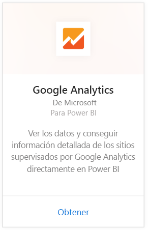
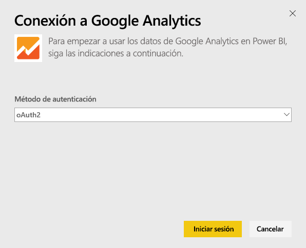
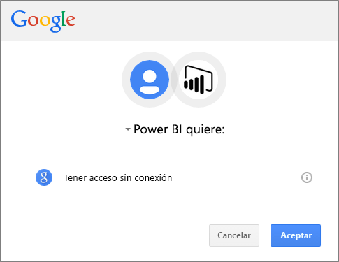
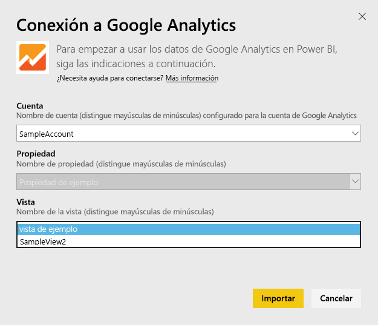
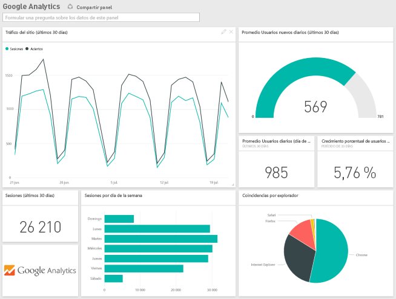
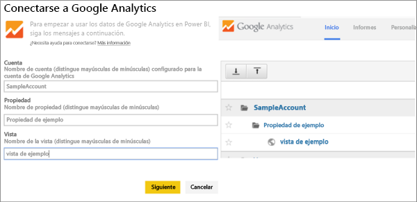

# Conexión a Google Analytics con Power BI
Para conectarse a Google Analytics a través de Power BI, empiece por conectarse a su cuenta de Google Analytics. Obtendrá un panel de Power BI y un conjunto de informes de Power BI que proporcionan información sobre el tráfico de su sitio y las dimensiones del usuario. Puede interactuar con el panel y los informes, pero no puede guardar los cambios. Los datos se actualizarán automáticamente una vez al día.

Conéctese a [Google Analytics](https://app.powerbi.com/getdata/services/google-analytics) para Power BI. Obtenga más información sobre la [integración de Google Analytics](https://powerbi.microsoft.com/integrations/google-analytics) con Power BI.

Puede crear paneles e informes personalizados iniciando desde el [conector de Google Analytics](service-google-analytics-connector.md) en Power BI Desktop. Solo tiene que conectarse con su cuenta de Google Analytics y crear sus informes personalizados, que puede publicar en el servicio Power BI.

## Cómo conectarse
[!INCLUDE [powerbi-service-apps-get-more-apps](./includes/powerbi-service-apps-get-more-apps.md)]

3. Seleccione **Google Analytics** \> **Obtener**.
   
   
4. Cuando se le solicite, escriba sus credenciales de Google Analytics. Seleccione **oAuth 2** como el mecanismo de autenticación y haga clic en **Iniciar sesión**. Siga el flujo de autenticación de Google, que puede incluir la autenticación en dos fases si está configurada.
   
   
5. Haga clic en **Aceptar** para permitir que Power BI acceda a sus datos de Google Analytics.
   
   
6. Power BI se conecta a una vista concreta de Google Analytics. Seleccione el nombre de la cuenta, el nombre de la propiedad y el nombre de la vista a la que le gustaría conectarse. Esta información puede encontrarse en su cuenta de Google Analytics, en la parte superior izquierda o en la pestaña **Inicio** . A continuación encontrará más información. 
   
   
5. Haga clic en **Conectar** para comenzar el proceso de importación. 

## Visualización del panel y los informes de Google Analytics
[!INCLUDE [powerbi-service-apps-open-app](./includes/powerbi-service-apps-open-app.md)]

   

[!INCLUDE [powerbi-service-apps-open-app](./includes/powerbi-service-apps-what-now.md)]

## Requisitos del sistema
Para conectarse desde Power BI, es preciso tener una cuenta de [Google Analytics](https://www.google.com/analytics/). Para otras cuentas de Google que no tengan una cuenta de Google Analytics conectada se mostrará un error de autenticación.

## Solución de problemas
**Credenciales** Si tiene varias cuentas de Google, use una ventana de explorador de incógnito o de navegación privada durante la conexión para asegurarse de que se usa la cuenta correcta.

Si recibe un error que indica que las credenciales no son válidas, pero pudo iniciar sesión en Google, confirme que tiene una cuenta de [Google Analytics](https://www.google.com/analytics/).

**Parámetros** Para los parámetros se requieren nombres únicos. Si ve un error que indica que el valor seleccionado está duplicado, seleccione otro valor o cambie los nombres en Google Analytics para que sean únicos. Estamos trabajando activamente para mejorar esta situación.

>[!NOTE]
>Los parámetros distinguen entre mayúsculas y minúsculas. Escríbalos exactamente como aparecen en su cuenta de Google Analytics.

¿Sigue teniendo problemas? Abra una incidencia de soporte técnico para ponerse en contacto con el equipo de Power BI:

* Mientras está en la aplicación de Power BI, seleccione el signo de interrogación \> **Ponerse en contacto con soporte técnico.**
* Desde el sitio de soporte técnico de Power BI (desde donde está leyendo este artículo), seleccione **Ponerse en contacto con soporte técnico** en el lado derecho de la página.

## Pasos siguientes
* [¿Qué son las aplicaciones en Power BI?](service-create-distribute-apps.md)
* [Obtener datos en Power BI](service-get-data.md)
* ¿Tiene más preguntas? [Pruebe a preguntar a la comunidad de Power BI](http://community.powerbi.com/)

