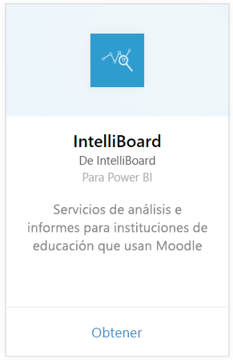
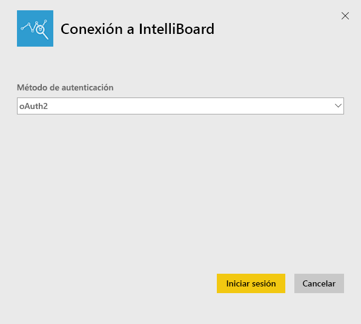
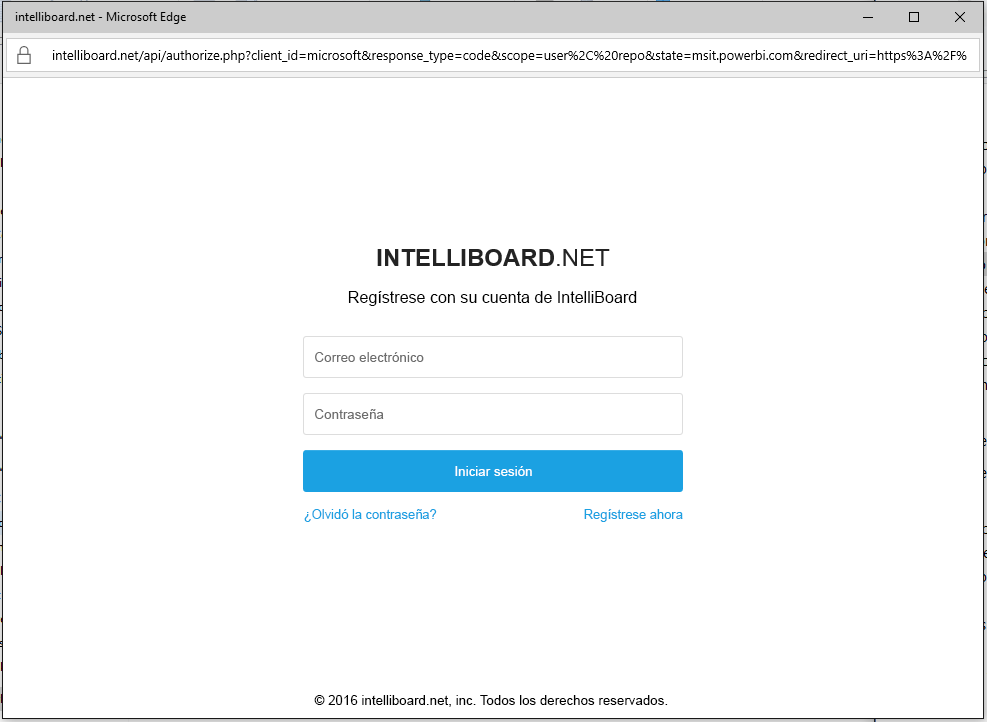
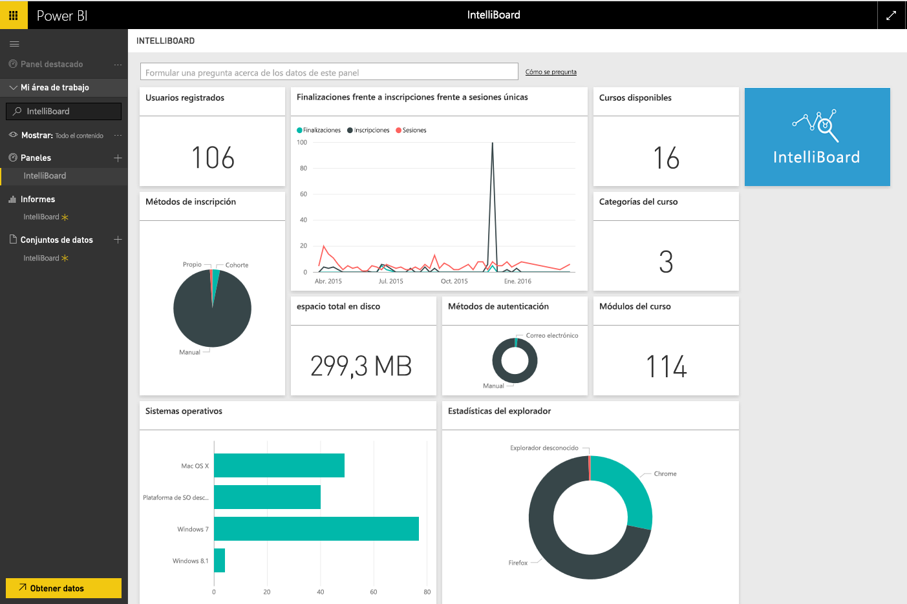

# Conexión a IntelliBoard con Power BI
IntelliBoard ofrece acceso simplificado a los datos del sistema de administración de aprendizaje Moodle mediante Reporting Services. El paquete de contenido de IntelliBoard para Power BI ofrece análisis adicional, incluidas las métricas de sus cursos, los usuarios registrados, el rendimiento general y la actividad LMS.

Conéctese al [paquete de contenido de IntelliBoard](https://app.powerbi.com/getdata/services/intelliboard) para Power BI.

## Cómo conectarse
1. Seleccione **Obtener datos** en la parte inferior del panel de navegación izquierdo.  
   
    
2. En el cuadro **Servicios** , seleccione **Obtener**.  
   
    
3. Seleccione **IntelliBoard** y, a continuación, **Conectar**.  
   
    
4. Seleccione **OAuth 2** y, a continuación, **Iniciar sesión**. Cuando se le solicite, proporcione las credenciales de IntelliBoard.
   
    
   
    
5. Una vez conectado, se cargarán automáticamente un panel, un informe y un conjunto de datos. Una vez completado, los mosaicos se actualizarán con los datos de su cuenta de IntelliBoard.
   
    

**¿Qué más?**

* Pruebe a [hacer una pregunta en el cuadro de preguntas y respuestas](consumer/end-user-q-and-a.md), en la parte superior del panel.
* [Cambie los iconos](service-dashboard-edit-tile.md) en el panel.
* [Seleccione un icono](consumer/end-user-tiles.md) para abrir el informe subyacente.
* Aunque el conjunto de datos se programará para actualizarse diariamente, puede cambiar la programación de actualización o intentar actualizar a petición mediante **Actualizar ahora**

## Qué se incluye
El paquete de contenido incluye datos de las tablas siguientes:  

    - Activity (Actividad)  
    - Agents (Agentes)  
    - Auth (Autor)  
    - Países  
    - CoursesProgress (Progreso de cursos)  
    - Enrollments (Inscripciones)
    - Lang (Idioma)  
    - Platform (Plataforma)  
    - Totals (Totales)  
    - UsersProgress (Progreso de usuarios)    

## Requisitos del sistema
Se requiere una cuenta de IntelliBoard con permisos para las tablas anteriores para crear una instancia de este paquete de contenido.

## Pasos siguientes
[¿Qué es Power BI?](power-bi-overview.md)

[Conceptos básicos para los diseñadores en el servicio Power BI](service-basic-concepts.md)

