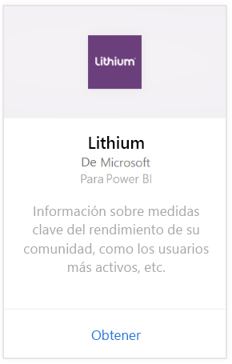
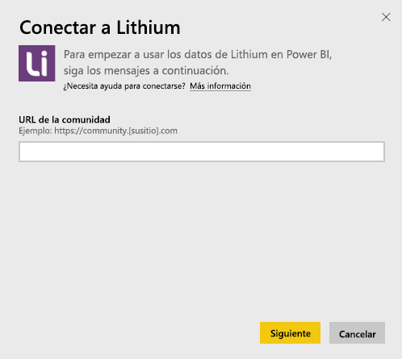
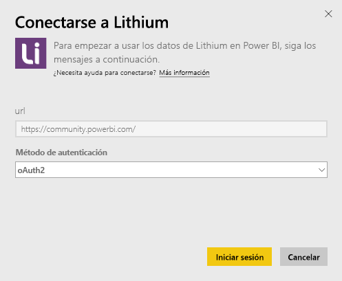
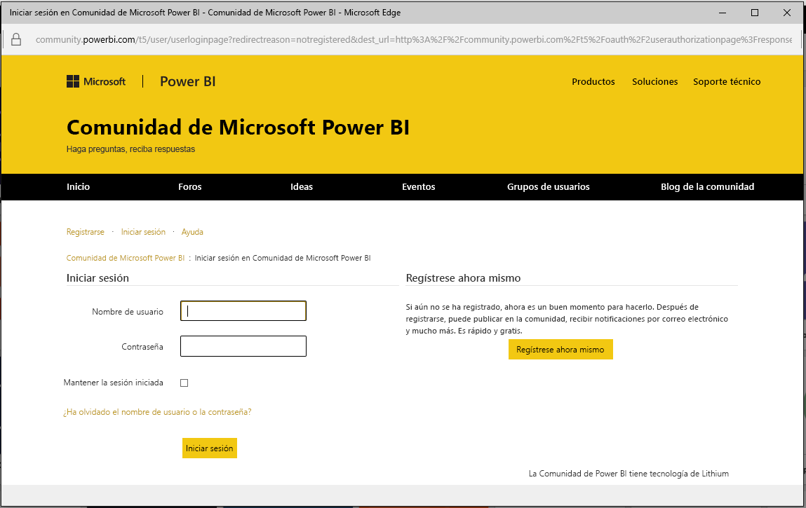
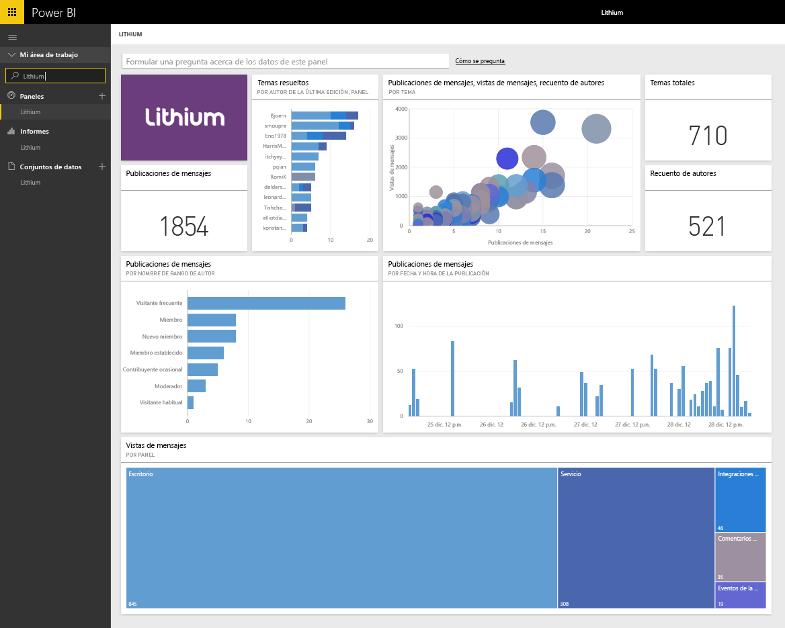

# Conexión a Lithium con Power BI

Lithium entabla relaciones de confianza entre las mejores marcas del mundo y sus clientes, para ayudar a las personas a obtener respuestas y a compartir sus experiencias. Al conectar el paquete de contenido de Lithium a Power BI, puede medir las métricas clave sobre la comunidad en línea para contribuir a aumentar las ventas, reducir los costes de servicio y mejorar la lealtad. 

[!INCLUDE [include-short-name](./includes/service-deprecate-content-packs.md)]

Conéctese al [paquete de contenido de Lithium](https://app.powerbi.com/getdata/services/lithium) para Power BI.

>[!NOTE]
>El paquete de contenido de Power BI usa la API de Lithium. Un exceso de llamadas a la API puede causar cargos adicionales de Lithium (consulte al administrador de Lithium).

## Cómo conectarse
1. Seleccione **Obtener datos** en la parte inferior del panel de navegación izquierdo.
   
    
2. En el cuadro **Servicios** , seleccione **Obtener**.
   
    
3. Seleccione **Lithium** \> **Obtener**.
   
   
4. Proporcione la dirección URL de la comunidad de Lithium. Tendrá el formato *https://community.yoursite.com* .
   
   
5. Cuando se le solicite, escriba sus credenciales de Lithium. Seleccione **oAuth 2** como el mecanismo de autenticación, haga clic en **Iniciar sesión** y siga el flujo de autenticación de Lithium.
   
   
   
   
6. Una vez completado el flujo de inicio de sesión, se iniciará el proceso de importación. Cuando haya finalizado, aparecerá un nuevo panel, informes y modelo en el panel de navegación. Seleccione el panel para ver los datos importados.
   
    

**¿Qué más?**

* Pruebe a [hacer una pregunta en el cuadro de preguntas y respuestas](consumer/end-user-q-and-a.md), en la parte superior del panel.
* [Cambie los iconos](service-dashboard-edit-tile.md) en el panel.
* [Seleccione un icono](consumer/end-user-tiles.md) para abrir el informe subyacente.
* Aunque el conjunto de datos se programará para actualizarse diariamente, puede cambiar la programación de actualización o intentar actualizar a petición mediante **Actualizar ahora**

## Requisitos del sistema
El paquete de contenido de Lithium requiere Lithium Community v15.9 o superior. Consulte al administrador de Lithium para confirmarlo.

## Pasos siguientes
[¿Qué es Power BI?](fundamentals/power-bi-overview.md)

[Conceptos básicos para los diseñadores en el servicio Power BI](service-basic-concepts.md)

