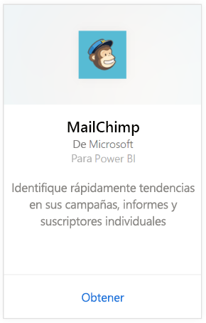
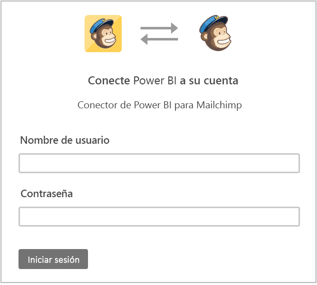
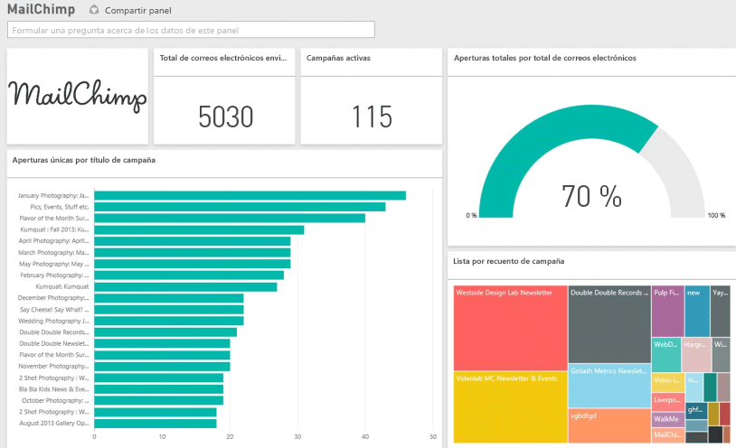

# Conexión a MailChimp con Power BI
El paquete de contenido de Power BI extrae datos de la cuenta de MailChimp y genera un panel, un conjunto de informes y un conjunto de datos que permiten explorar los datos. Extraiga análisis para crear [paneles de MailChimp](https://powerbi.microsoft.com/integrations/mailchimp) e identifique rápidamente tendencias dentro de sus campañas, informes y suscriptores individuales. Los datos están configurados para actualizarse diariamente, lo que garantiza que los datos que está supervisando estén actualizados.

Conéctese al [paquete de contenido de MailChimp](https://app.powerbi.com/getdata/services/mailchimp) para Power BI.

## Cómo conectarse
1. Seleccione **Obtener datos** en la parte inferior del panel de navegación izquierdo.
   
    
2. En el cuadro **Servicios** , seleccione **Obtener**.
   
   
3. Seleccione **MailChimp** \> **Obtener**.
   
   
4. En Método de autenticación, seleccione **oAuth2** \> **Iniciar sesión**.
   
    Cuando se le solicite, escriba sus credenciales de MailChimp y siga el proceso de autenticación.
   
    La primera vez que se conecte, se le solicitará que permita a Power BI acceso de solo lectura a la cuenta. Seleccione **Permitir** para comenzar el proceso de importación, que puede tardar unos minutos según el volumen de datos en su cuenta.
   
    
5. Una vez que Power BI importe los datos, verá un nuevo panel, el informe y el conjunto de datos en el panel de navegación izquierdo. Este es el panel predeterminado que creó Power BI para mostrar los datos. Puede modificar este panel para que muestre los datos de la forma que desee.
   
   

**¿Qué más?**

* Pruebe a [hacer una pregunta en el cuadro de preguntas y respuestas](consumer/end-user-q-and-a.md), en la parte superior del panel.
* [Cambie los iconos](service-dashboard-edit-tile.md) en el panel.
* [Seleccione un icono](consumer/end-user-tiles.md) para abrir el informe subyacente.
* Aunque el conjunto de datos se programará para actualizarse diariamente, puede cambiar la programación de actualización o intentar actualizar a petición mediante **Actualizar ahora**

## Pasos siguientes
[¿Qué es Power BI?](power-bi-overview.md)

[Power BI: Conceptos básicos](consumer/end-user-basic-concepts.md)

