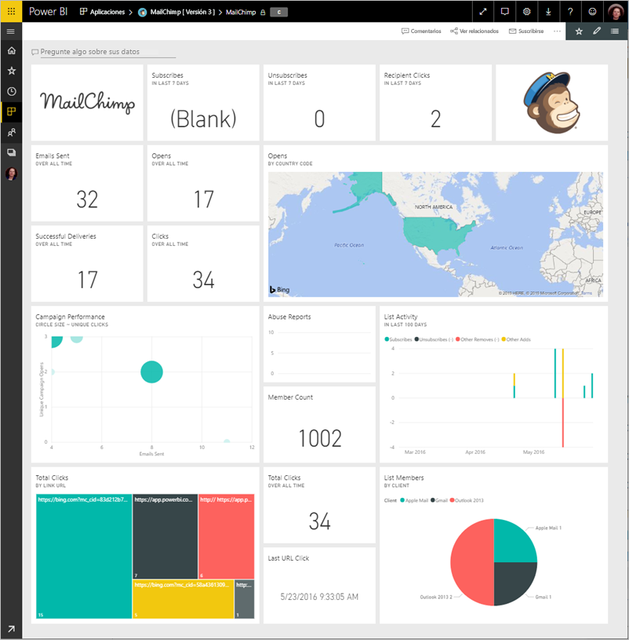
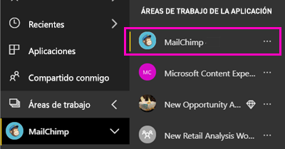
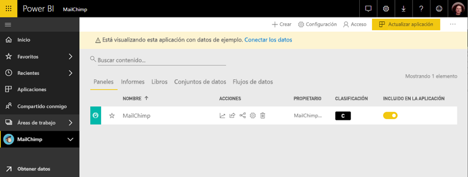

# Conexión a MailChimp con Power BI
Este artículo le guiará a través de extraer los datos de su cuenta de MailChimp con una aplicación de la plantilla de Power BI. La aplicación de la plantilla genera un área de trabajo con un panel, un conjunto de informes y un conjunto de datos le permiten explorar los datos de MailChimp. Extraiga análisis para crear [paneles de MailChimp](https://powerbi.microsoft.com/integrations/mailchimp) e identifique rápidamente tendencias dentro de sus campañas, informes y suscriptores individuales. Los datos se actualizan diariamente, asegúrese de que los datos que se está supervisando se al día.

Después de instalar la aplicación de la plantilla, puede cambiar los paneles e informes. A continuación, puede distribuirla como una aplicación a los compañeros de su organización.

Conectarse a la [MailChimp plantilla aplicación](https://app.powerbi.com/getdata/services/mailchimp) para Power BI.

## Cómo conectarse

[!INCLUDE [powerbi-service-apps-get-more-apps](./includes/powerbi-service-apps-get-more-apps.md)]

3. Seleccione **MailChimp** \> **obtenerla ahora**.
4. En **instalar esta aplicación de Power BI?** seleccione **instalar**.
4. En el **aplicaciones** panel, seleccione el **MailChimp** icono.

    

6. En **empezar a trabajar con la nueva aplicación**, seleccione **conectar datos**.

    

1. En Método de autenticación, seleccione **oAuth2** \> **Iniciar sesión**.
   
    Cuando se le solicite, escriba sus credenciales de MailChimp y siga el proceso de autenticación.
   
    La primera vez que se conecte, Power BI le solicitará que permita acceso de solo lectura a la cuenta. Seleccione **Permitir** para comenzar el proceso de importación. Puede tardar unos minutos, según el volumen de datos de su cuenta.
   
    

5. Una vez que Power BI importe los datos, se abre el panel de MailChimp.
   
    

## Modificar y distribuir la aplicación

Ha instalado la aplicación de la plantilla de MailChimp. Esto significa también que ha creado el área de trabajo de aplicación de MailChimp. En el área de trabajo, puede cambiar los informes y el panel y distribuirla como un *aplicación* a compañeros de su organización. 

1. Para ver todo el contenido de la nueva área de trabajo de MailChimp, en la barra de navegación izquierdo, seleccione **las áreas de trabajo** > **MailChimp**. 

    

    Esta vista es la lista de contenido del área de trabajo. En la esquina superior derecha, verá **actualizar aplicación**. Cuando esté listo para distribuir la aplicación a sus compañeros, es donde podrá empezar.

    

2. Seleccione **informes** y **conjuntos de datos** para ver los demás elementos en el área de trabajo. 

    Obtenga información sobre [distribuir aplicaciones](service-create-distribute-apps.md) a sus compañeros.

## Pasos siguientes

* [Crear las nuevas áreas de trabajo en Power BI](service-create-the-new-workspaces.md)
* [Instalar y usar aplicaciones en Power BI](consumer/end-user-apps.md)
* [Conectarse a los servicios con los paquetes de contenido de Power BI](service-connect-to-services.md)
* ¿Tiene alguna pregunta? [Pruebe a preguntar a la comunidad de Power BI](http://community.powerbi.com/)

