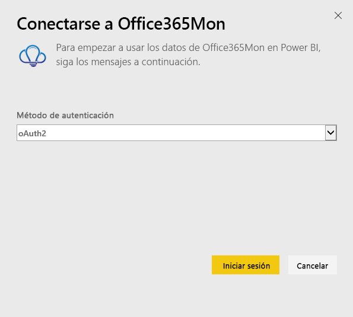
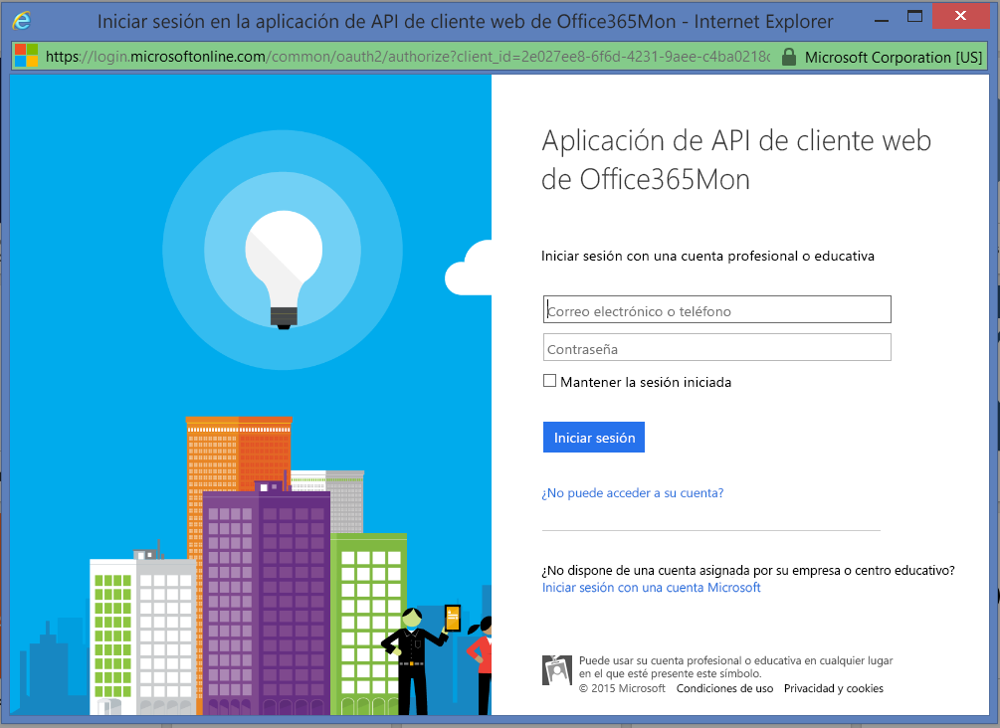
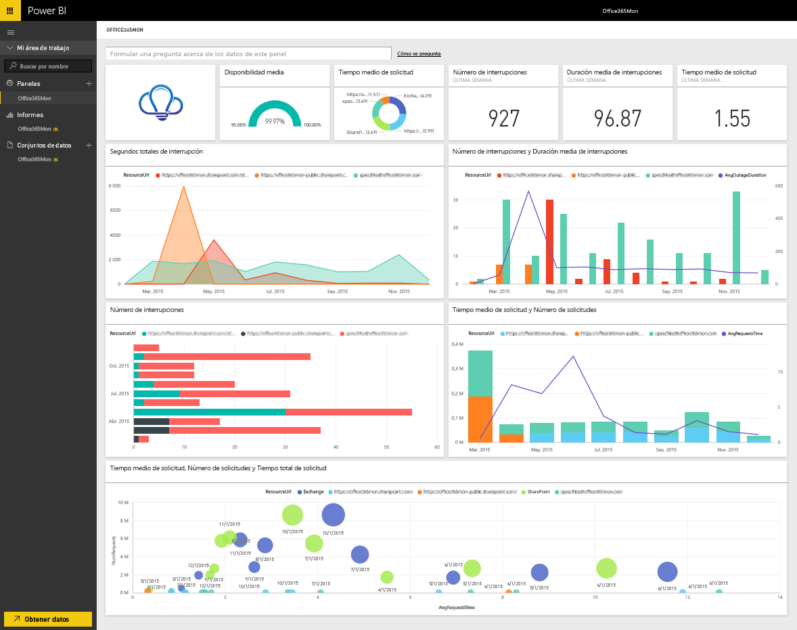

# Conexión a Office365Mon con Power BI
Analizar los datos de rendimiento de estado e interrupciones de Office 365 es fácil con Power BI y el paquete de contenido de Office365Mon. Power BI recupera los datos (incluidos los de sondeo de estado e interrupciones) y, a continuación, crea un panel integrado e informes basados en esos datos.

Conéctese al [paquete de contenido de Office365Mon](https://app.powerbi.com/groups/me/getdata/services/office365mon) para Power BI

>[!NOTE]
>Se necesita una cuenta de administrador de Office365Mon para conectarse al paquete de contenido de Power BI y cargarlo.

## Cómo conectarse
1. Seleccione **Obtener datos** en la parte inferior del panel de navegación izquierdo.
   
   
2. En el cuadro **Servicios** , seleccione **Obtener**.
   
    
3. Seleccione **Office365Mon** \> **Obtener**.
   
   
4. En Método de autenticación, seleccione **oAuth2** \> **Iniciar sesión**.
   
   Cuando se le solicite, escriba sus credenciales de administrador de Office365Mon y siga el proceso de autenticación.
   
   
   
   
5. Una vez que Power BI importe los datos, verá un nuevo panel, el informe y el conjunto de datos en el panel de navegación izquierdo. Los nuevos elementos están marcados con un asterisco amarillo \*. Seleccione la entrada de Office365Mon.
   
   

**¿Qué más?**

* Pruebe a [hacer una pregunta en el cuadro de preguntas y respuestas](power-bi-q-and-a.md), en la parte superior del panel.
* [Cambie los iconos](service-dashboard-edit-tile.md) en el panel.
* [Seleccione un icono](service-dashboard-tiles.md) para abrir el informe subyacente.
* Aunque el conjunto de datos se programará para actualizarse diariamente, puede cambiar la programación de actualización o actualizarlo a petición mediante **Actualizar ahora**.

## Solución de problemas
Si recibe el mensaje **"Error de inicio de sesión"** después de usar las credenciales de la suscripción a Office365Mon para iniciar sesión, la cuenta que está usando no tiene permisos para recuperar los datos de Office365Mon de su cuenta. Compruebe que se trata de una cuenta de administrador y vuelva a intentarlo.

## Pasos siguientes
[Introducción a Power BI](service-get-started.md)

[Obtener datos para Power BI](service-get-data.md)

