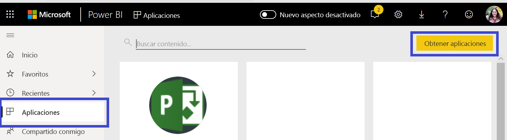
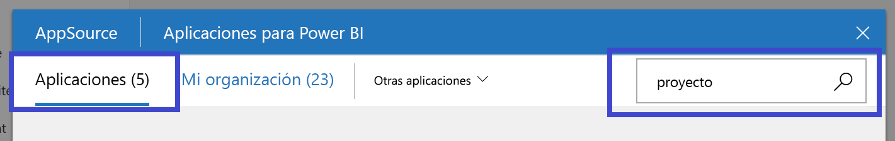
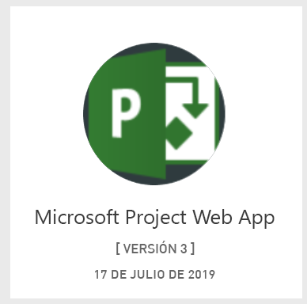
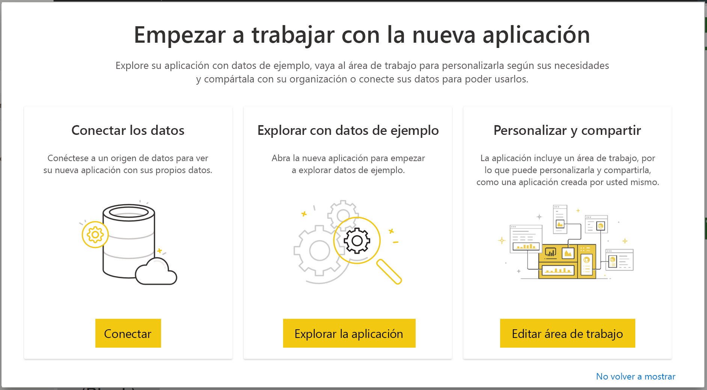
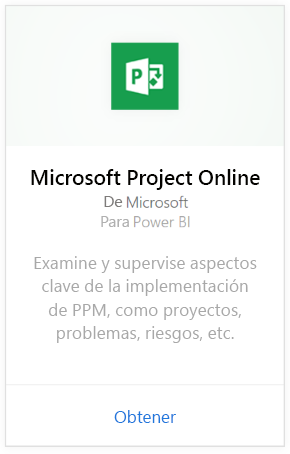
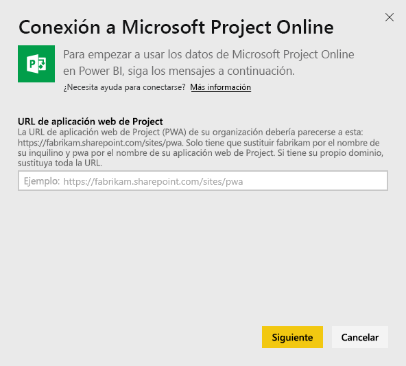
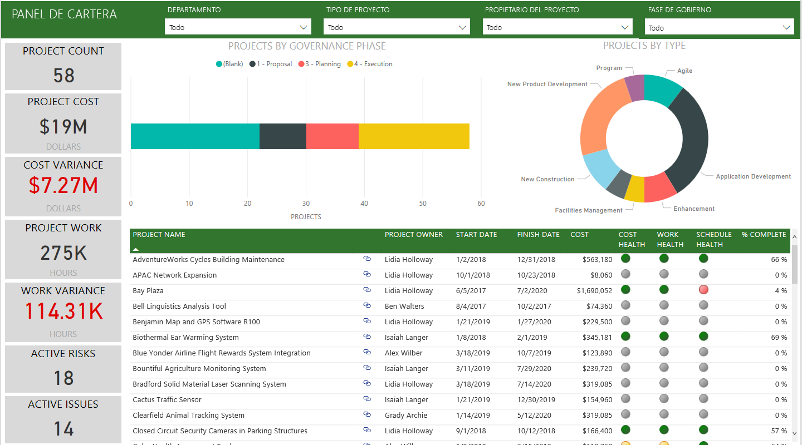
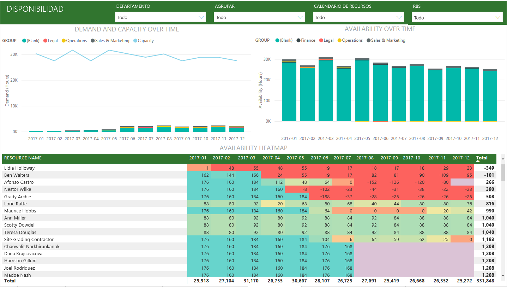
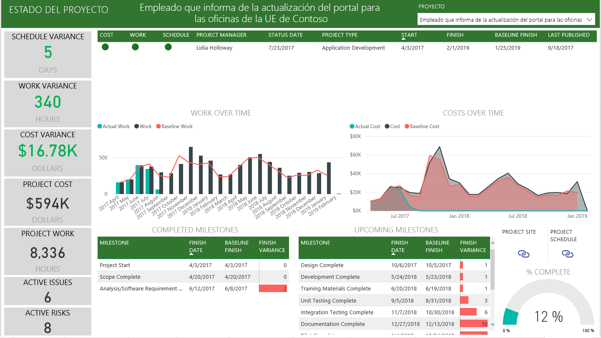

# Conexión a Project Web App con Power BI
Microsoft Project Web App es una solución flexible en línea para la administración de cartera de proyectos (PPM) y el trabajo diario. Project Web App permite a las organizaciones dar el primer paso, priorizar las inversiones de la cartera de proyectos y ofrecer el valor empresarial previsto. La aplicación de plantilla Project Web App para Power BI permite desbloquear información de Project Web App para facilitar la administración de proyectos, carteras y recursos.

Conéctese a la [aplicación de plantilla de Project Web App](https://appsource.microsoft.com/product/power-bi/pbi_msprojectonline.pbi-microsoftprojectwebapp) para Power BI.

## Cómo conectarse

1. Seleccione **Aplicaciones** en el panel de navegación > seleccione **Obtener aplicaciones** en la esquina superior derecha.

    

2. En el cuadro **Servicios** , seleccione **Obtener**.
   
   
3. En AppSource, seleccione la pestaña **Aplicaciones** y busque o seleccione **Microsoft Project Web App**.
   
4. Recibirá un mensaje que dice: **¿Quiere instalar esta aplicación de Power BI?** ; seleccione **Instalar**. 

   
5. En el panel **Aplicaciones**, seleccione el icono **Microsoft Project Web App**. 
   
   
6. En **Empezar a trabajar con la nueva aplicación**, seleccione **Conectar datos**.
   
   
7. En el cuadro de texto **Dirección URL de Project Web App**, escriba la dirección URL de Project Web App (PWA) a la que quiera conectarse.  Tenga en cuenta que puede diferir del ejemplo si tiene un dominio personalizado. En el cuadro de texto **Idioma del sitio de Project Web App**, escriba el número correspondiente a su idioma del sitio de Project Web App. Escriba "1" para inglés, "2" para francés, "3" para alemán, "4" para portugués (Brasil), "5" para portugués (Portugal) y "6" para español. 
   
   
8. En Método de autenticación, seleccione **oAuth2** \> **Iniciar sesión**. Cuando se le solicite, escriba las credenciales de Project Web App y siga el proceso de autenticación.

    > [!NOTE]
    > Debe tener los permisos de Visor de carteras, Administrador de carteras o Administrador para la instancia de Project Web App a la que se va a conectar.

9. Verá una notificación que indica que se están cargando los datos. Dependiendo del tamaño de la cuenta, puede tardar cierto tiempo. Después de que Power BI importe los datos, verá el contenido de la nueva área de trabajo. Es posible que tenga que actualizar el conjunto de datos para obtener las actualizaciones más recientes. 

    Una vez que Power BI importe los datos, verá el informe con 13 páginas y el conjunto de datos en el panel de navegación. 

10. Cuando los informes estén listos, continúe y empiece a explorar los datos de Project Web App. La aplicación de plantilla incluye 13 informes muy completos y detallados con información general sobre carteras (6 páginas de informe), información general sobre recursos (5 páginas de informe) y el estado del proyecto (2 páginas de informe). 

    
   
    
   
    

**¿Qué más?**

* Aunque el conjunto de datos se programará para actualizarse diariamente, puede cambiar la programación de actualización o intentar actualizar a petición mediante **Actualizar ahora**.

**Expansión de la aplicación de plantilla**

Descargue el [archivo PBIT de GitHub](https://github.com/OfficeDev/Project-Power-BI-Content-Packs) para seguir personalizando y actualizando el paquete de contenido.

## Pasos siguientes
[Introducción a Power BI](service-get-started.md)

[Obtener datos en Power BI](service-get-data.md)

