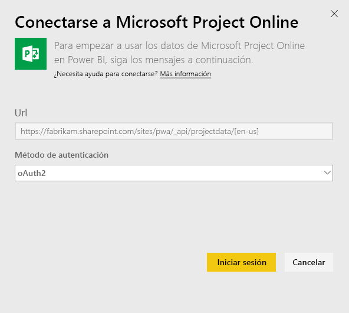
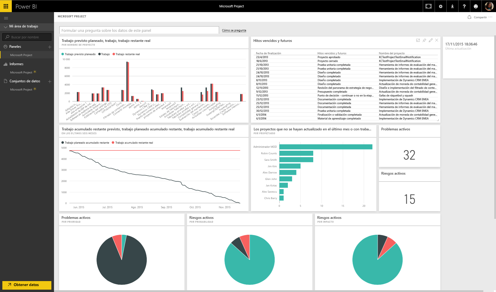

# Conexión a Project Online con Power BI
Microsoft Project Online es una solución flexible en línea para la administración de la cartera de proyectos (PPM) y el trabajo diario. Project Online ofrece a las organizaciones una introducción, así como priorizar las inversiones de la cartera de proyectos y ofrecer el valor empresarial previsto. El paquete de contenido de Project Online para Power BI le permite desbloquear información de Project Online para facilitar la administración de proyectos, carteras y recursos.

Conéctese al [paquete de contenido de Project Online](https://app.powerbi.com/getdata/services/project-online) para Power BI.

## Cómo conectarse
1. Seleccione **Obtener datos** en la parte inferior del panel de navegación izquierdo.
   
    
2. En el cuadro **Servicios** , seleccione **Obtener**.
   
   
3. Seleccione **Microsoft Project Online** \> **Obtener**.
   
   
4. En el cuadro de texto **Dirección URL de Project Web App** , escriba la dirección URL de Project Web App (PWA) a la que desea conectarse y seleccione **Siguiente**. Tenga en cuenta que puede diferir del ejemplo si tiene un dominio personalizado. En el cuadro de texto **Idioma del sitio de Project Web App**, escriba el número correspondiente a su idioma del sitio de Project Web App. Escriba "1" para inglés, "2" para francés, "3" para alemán, "4" para portugués (Brasil), "5" para portugués (Portugal) y "6" para español. 
   
    
5. En Método de autenticación, seleccione **oAuth2** \> **Iniciar sesión**. Cuando se le solicite, escriba sus credenciales de Project Online y siga el proceso de autenticación.
   
    
    
Tenga en cuenta que debe tener los permisos de Visor de carteras, Administrador de carteras o Administrador para la instancia de Project Web App a la que se está conectando.

6. Verá una notificación que indica que se están cargando los datos. Dependiendo del tamaño de la cuenta, puede tardar cierto tiempo. Una vez que Power BI importe los datos, verá un nuevo panel, 13 informes y el conjunto de datos en el panel de navegación izquierdo. Este es el panel predeterminado que creó Power BI para mostrar los datos. Puede modificar este panel para que muestre los datos de la forma que desee.

   

7. Cuando los paneles e informes estén listos, continúe y empiece a explorar los datos de Project Online. El paquete de contenido incluye 13 informes muy completos y detallados con información general sobre carteras (6 informes), información general sobre recursos (5 informes) y el estado de los proyectos (2 informes). 

   
   
   
   
   

**¿Qué más?**

* Pruebe a [hacer una pregunta en el cuadro de preguntas y respuestas](power-bi-q-and-a.md), en la parte superior del panel.
* [Cambie los iconos](service-dashboard-edit-tile.md) en el panel.
* [Seleccione un icono](service-dashboard-tiles.md) para abrir el informe subyacente.
* Aunque el conjunto de datos se programará para actualizarse diariamente, puede cambiar la programación de actualización o actualizarlo a petición mediante **Actualizar ahora**.

**Expansión del paquete de contenido**

Descargue el [archivo PBIT de GitHub](https://github.com/OfficeDev/Project-Power-BI-Content-Packs) para seguir personalizando y actualizando el paquete de contenido.

## Pasos siguientes
[Introducción a Power BI](service-get-started.md)

[Obtener datos en Power BI](service-get-data.md)

