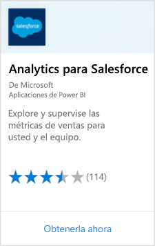
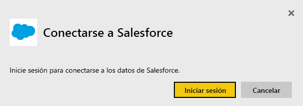
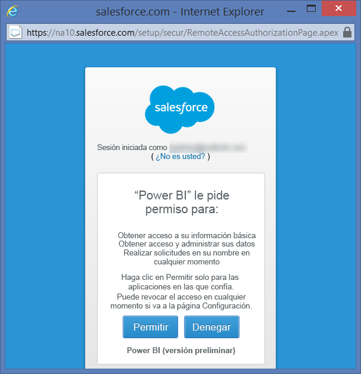
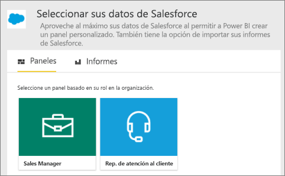
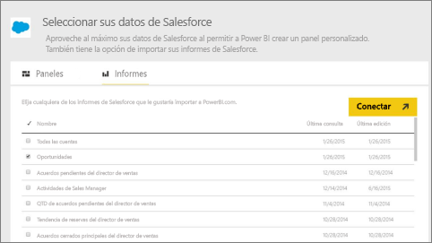
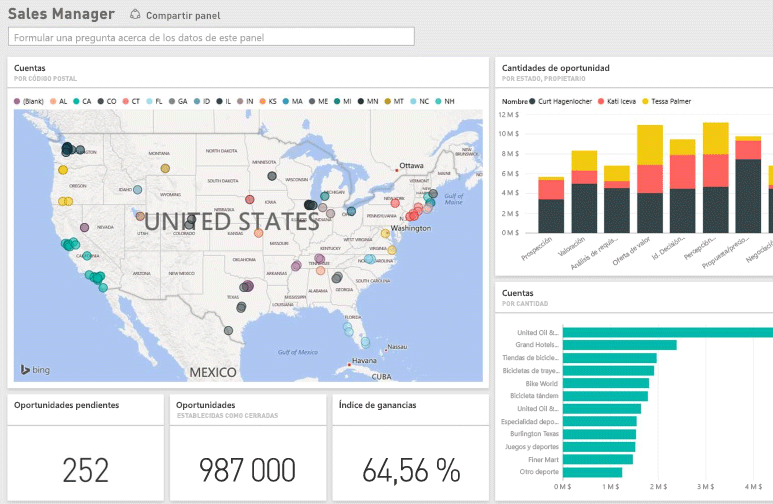

# Conexión a Salesforce con Power BI
Power BI le permite conectarse fácilmente a su cuenta de Salesforce.com. Con esta conexión, puede recuperar los datos de Salesforce y disponer de un panel e informes proporcionados automáticamente.

Más información sobre la [Integración de Salesforce](https://powerbi.microsoft.com/integrations/salesforce) con Power BI.

## Cómo conectarse
1. En Power BI, seleccione **Obtener datos** en la parte inferior del panel de navegación.
   
    
2. En el cuadro **Servicios** , seleccione **Obtener**.
   
    
3. Seleccione **Datos de análisis para Salesforce** y seleccione **Obtener**.  
   
   
4. Seleccione **Iniciar sesión** para iniciar el flujo de inicio de sesión.
   
    
5. Cuando se le solicite, escriba sus credenciales de Salesforce. Seleccione **Permitir** para que Power BI pueda tener acceso a la información básica y los datos de Salesforce.
   
   
6. Configure lo que quiere importar en Power BI mediante la opción de lista desplegable:
   
   * **Panel**
     
     Seleccione un panel predefinido basado en un rol (como, por ejemplo **Jefe de ventas**). Estos paneles recuperan un conjunto específico de datos estándar de Salesforce que no incluyen los campos personalizados.
     
     
   * **Informes**
     
     Seleccione uno o más informes personalizados de su cuenta de Salesforce. Estos informes coincidirán con sus vistas en Salesforce y pueden incluir datos de campos personalizados y objetos.
     
     
     
     Si no ve ningún informe, agréguelos o créelos en su cuenta de Salesforce y vuelva a intentarlo.

7. Seleccione **Conectar** para comenzar el proceso de importación. Durante la importación verá una notificación que muestra que la importación está en curso. Una vez finalizada la importación, en el panel de navegación verá un panel, un informe y un conjunto de datos para los datos de Salesforce.
   
   

Puede cambiar este panel para mostrar los datos de la forma que desee. Puede realizar preguntas con Preguntas y respuestas o [seleccionar un icono](consumer/end-user-tiles.md) para abrir el informe subyacente y [editar o eliminar los iconos del panel](service-dashboard-edit-tile.md).

**¿Qué más?**

* Pruebe a [hacer una pregunta en el cuadro de preguntas y respuestas](consumer/end-user-q-and-a.md), en la parte superior del panel.
* [Editar o eliminar un icono](service-dashboard-edit-tile.md) en el panel
* [Seleccione un icono](service-dashboard-tiles.md) para abrir el informe subyacente
* Aunque el conjunto de datos se programará para actualizarse diariamente, puede cambiar la programación de actualización o intentar actualizar bajo petición mediante **Actualizar ahora**.

## Consideraciones y requisitos del sistema

- Estar conectado con una cuenta de Salesforce de producción que tenga habilitado el acceso de API.

- Permiso concedido a la aplicación de Power BI durante el inicio de sesión

- La cuenta debe tener disponibles llamadas de API suficientes para extraer y actualizar los datos.

- La actualización requiere un token de autenticación válido. Asegúrese de tener importados cinco conjuntos de datos de Salesforce o menos, ya que Salesforce tiene un límite de cinco tokens de autenticación por aplicación.

- La API de informes de Salesforce tiene una restricción que admite hasta 2000 filas de datos.

## Solución de problemas

Si se producen errores, revise los requisitos anteriores. 

Actualmente no se admite el inicio de sesión en un dominio personalizado o de espacio aislado.

### Mensaje "Unable to connect to the remote server" (No se puede conectar al servidor remoto)

Si recibe un mensaje "No se puede conectar al servidor remoto" al intentar conectarse a su cuenta de Salesforce, eche un vistazo a esta solución en el foro siguiente: [Mensaje de error de inicio de sesión del conector de Salesforce: Unable to connect to the remote server](https://www.outsystems.com/forums/Forum_TopicView.aspx?TopicId=17674&TopicName=log-in-error-message-unable-to-connect-to-the-remote-server&) (Mensaje de error de inicio de sesión del conector de Salesforce: no se puede conectar al servidor remoto).

## Pasos siguientes
[¿Qué es Power BI?](fundamentals/power-bi-overview.md)

[Orígenes de datos del servicio Power BI](service-get-data.md)

