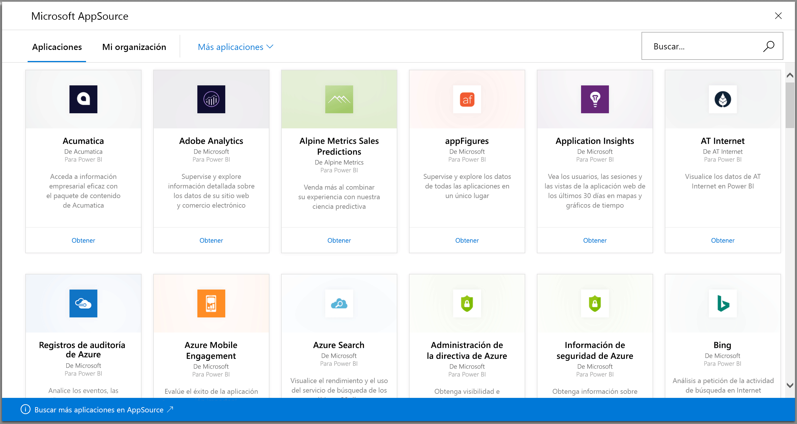
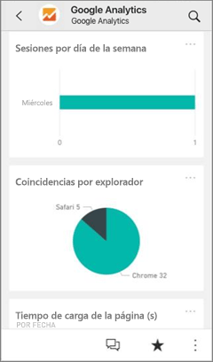
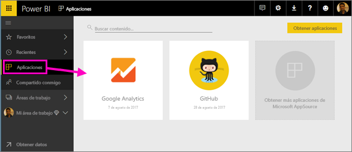
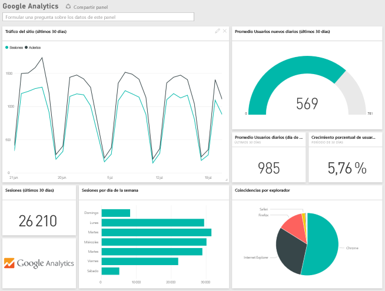
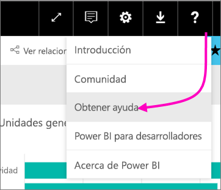

# Conexión a los servicios que usa con Power BI
Con Power BI, puede conectarse a los distintos servicios que usa en su empresa, como Salesforce, Microsoft Dynamics y Google Analytics. Power BI empieza usando sus credenciales para conectarse al servicio. Crea una *área de trabajo* de Power BI con un panel y un conjunto de informes de Power BI que muestran los datos automáticamente y proporcionan información visual sobre la empresa.

>[!IMPORTANT]
>Los paquetes de contenido de servicio se reemplazarán por [aplicaciones de plantilla](https://docs.microsoft.com/power-bi/service-template-apps-overview). Desde el 25 de septiembre de 2019, varios paquetes de contenido ya están en desuso. Cualquier paquete de contenido en desuso que haya instalado permanecerá en su cuenta, pero no se proporcionará documentación ni soporte técnico para dicho paquete; tampoco será posible instalarlo de nuevo.

Inicie sesión en Power BI para ver todos los [servicios a los que puede conectarse](https://app.powerbi.com/getdata/services). 

Después de instalar la aplicación, podrá ver el panel y los informes de la aplicación, y el área de trabajo del servicio Power BI ([https://app.powerbi.com](https://app.powerbi.com)). También pueden verse desde aplicaciones móviles de Power BI. En el área de trabajo, puede cambiar los paneles y los informes para adaptarlos a su organización, y luego distribuirlos a sus compañeros de trabajo como una *aplicación*. 

## Comenzar
[!INCLUDE [powerbi-service-apps-get-more-apps](./includes/powerbi-service-apps-get-more-apps.md)]

## Edición del panel y los informes
Una vez completada la importación, la nueva aplicación aparece en la página Aplicaciones.

1. En el panel de navegación, seleccione **Aplicaciones** y, después, seleccione la aplicación.
   
     
2. Para formular una pregunta, puede escribir en el cuadro de Preguntas o haga clic en un icono para abrir el informe subyacente. 
   
    
   
    Cambie el panel y el informe para adaptarlos a las necesidades de su organización. Después, [distribuya la aplicación a sus compañeros](service-create-distribute-apps.md).

## Qué se incluye
Después de conectarse a un servicio, verá una aplicación recién creada y un área de trabajo con un panel, informes y un conjunto de datos. Los datos del servicio se centra en un escenario concreto y no pueden incluir toda la información del servicio. Está programado que los datos se actualicen automáticamente una vez al día. Para controlar la programación, seleccione el conjunto de datos.

También puede [conectarse a los distintos servicios de Power BI Desktop](desktop-data-sources.md), como Google Analytics, y crear sus propios informes y paneles personalizados.  

Para más información sobre cómo conectarse a servicios específicos, vea las páginas de ayuda individuales.

## Solución de problemas
**Iconos vacíos**  
La primera vez que Power BI se conecte al servicio puede ver un conjunto vacío de iconos en el panel. Si el panel sigue vacío 2 horas después, es probable que se haya producido un error en la conexión. Si no ha visto ningún mensaje de error con información sobre cómo corregir el problema, registre una incidencia de soporte técnico.

* Seleccione el icono de signo de interrogación (**?**) de la esquina superior derecha > **Obtener ayuda**.
  
    

**Falta información**  
Tanto el panel como los iconos incluyen contenido del servicio para un escenario concreto. Si está buscando una métrica específica en la aplicación y no la encuentra, agregue una idea en la página [Soporte técnico de Power BI](https://support.powerbi.com/forums/265200-power-bi).

## Sugerir servicios
¿Utiliza un servicio que desea sugerir para una aplicación de Power BI? Vaya a la página de [soporte técnico de Power BI](https://support.powerbi.com/forums/265200-power-bi) y háganoslo saber.

Si está interesado en crear aplicaciones de plantilla para distribuirlas usted mismo, vea [Creación de una plantilla de aplicación en Power BI](service-template-apps-create.md). Los asociados de Power BI pueden crear aplicaciones de Power BI con poca o ninguna codificación e implementarlas en los clientes de Power BI. 

## Pasos siguientes
* [Distribuir aplicaciones a los compañeros](service-create-distribute-apps.md)
* [Crear las nuevas áreas de trabajo en Power BI](service-create-the-new-workspaces.md)
* ¿Tiene alguna pregunta? [Pruebe a preguntar a la comunidad de Power BI](https://community.powerbi.com/)

