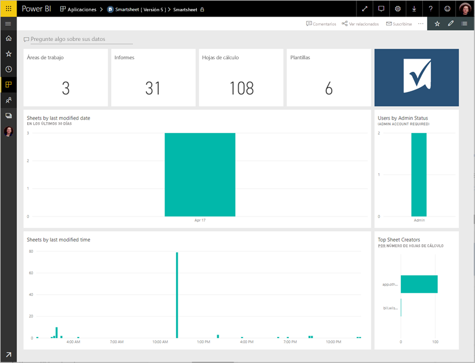
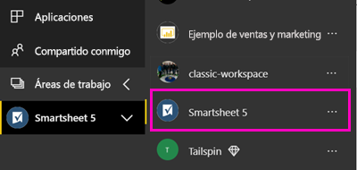
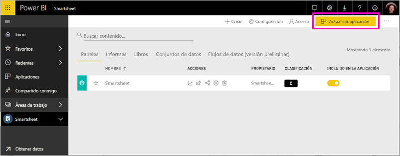

# Conexión a Smartsheet con Power BI
Este artículo le guiará a través de extraer los datos de su cuenta de Smartsheet con una aplicación de la plantilla de Power BI. Smartsheet ofrece una plataforma sencilla para la colaboración y el uso compartido de archivos. La aplicación de la plantilla de Smartsheet para Power BI proporciona un panel, informes y conjunto de datos que muestra información general de la cuenta de Smartsheet. También puede usar [Power BI Desktop](desktop-connect-to-data.md) para conectarse directamente a hojas individuales en su cuenta. 

Después de instalar la aplicación de la plantilla, puede cambiar los paneles e informes. A continuación, puede distribuirla como una aplicación a los compañeros de su organización.

Conectarse a la [Smartsheet plantilla aplicación](https://app.powerbi.com/groups/me/getdata/services/smartsheet) para Power BI.

>[!NOTE]
>Una cuenta de administrador de Smartsheet es preferida para conectarse y cargar la aplicación de la plantilla de Power BI, ya que tiene acceso adicional.

## Cómo conectarse

[!INCLUDE [powerbi-service-apps-get-more-apps](./includes/powerbi-service-apps-get-more-apps.md)]

3. Seleccione **Smartsheet** \> **obtenerla ahora**.
4. En **instalar esta aplicación de Power BI?** seleccione **instalar**.
4. En el **aplicaciones** panel, seleccione el **Smartsheet** icono.

    

6. En **empezar a trabajar con la nueva aplicación**, seleccione **conectar datos**.

    

4. En Método de autenticación, seleccione **oAuth2 \> Iniciar sesión**.
   
   Cuando se le solicite, escriba las credenciales de Smartsheet y siga el proceso de autenticación.
   
   
   
   

5. Una vez que Power BI importe los datos, se abre el panel de Smartsheet.
   
   

## Modificar y distribuir la aplicación

Ha instalado la aplicación de la plantilla de Smartsheet. Esto significa también que ha creado el área de trabajo de aplicación de Smartsheet. En el área de trabajo, puede cambiar los informes y el panel y distribuirla como un *aplicación* a compañeros de su organización. 

1. Para ver todo el contenido de la nueva área de trabajo de Smartsheet, en la barra de navegación izquierdo, seleccione **las áreas de trabajo** > **Smartsheet**. 

    

    Esta vista es la lista de contenido del área de trabajo. En la esquina superior derecha, verá **actualizar aplicación**. Cuando esté listo para distribuir la aplicación a sus compañeros, es donde podrá empezar. 

    

2. Seleccione **informes** y **conjuntos de datos** para ver los demás elementos en el área de trabajo.

    Obtenga información sobre [distribuir aplicaciones](service-create-distribute-apps.md) a sus compañeros.

## Qué se incluye
Tiene la Smartsheet plantilla aplicación de Power BI incluye información general de la cuenta Smartsheet, como el número de áreas de trabajo, informes y hojas que, cuando se modifican etcetera. Los usuarios administradores también ven cierta información en torno a los usuarios en su sistema, como los creadores de hojas más.  

Para conectarse directamente a hojas individuales de su cuenta, puede usar el conector de Smartsheet en [Power BI Desktop](desktop-connect-to-data.md).  

## Pasos siguientes

* [Crear las nuevas áreas de trabajo en Power BI](service-create-the-new-workspaces.md)
* [Instalar y usar aplicaciones en Power BI](consumer/end-user-apps.md)
* [Conectarse a aplicaciones de Power BI para servicios externos](service-connect-to-services.md)
* ¿Tiene alguna pregunta? [Pruebe a preguntar a la comunidad de Power BI](http://community.powerbi.com/)