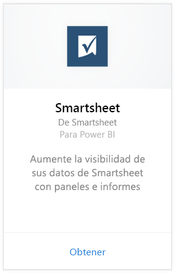
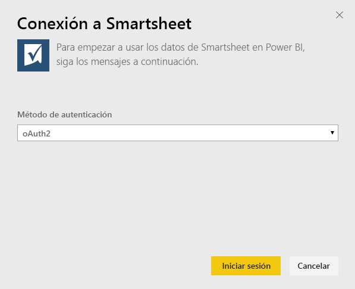
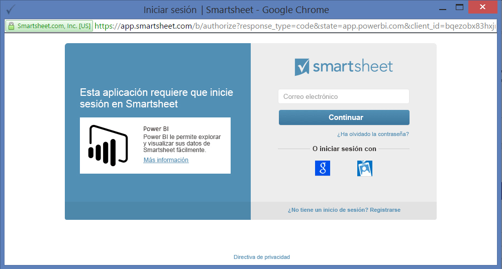
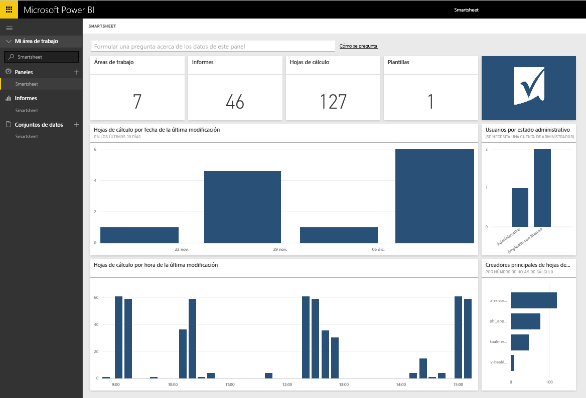

# Conexión a Smartsheet con Power BI
Smartsheet ofrece una plataforma sencilla para la colaboración y el uso compartido de archivos. El paquete de contenido de Smartsheet para Power BI proporciona un panel, informes y un conjunto de datos que presenta una visión general de la cuenta de Smartsheet. También puede usar [Power BI Desktop](desktop-connect-to-data.md) para conectarse directamente a hojas individuales en su cuenta. 

Conéctese al [paquete de contenido de Smartsheet](https://app.powerbi.com/groups/me/getdata/services/smartsheet) para Power BI.

>[!NOTE]
>Es preferible usar una cuenta de administrador de Smartsheet, en lugar de conectarse al paquete de contenido de Power BI y cargarlo, ya que tiene acceso adicional.

## Cómo conectarse
1. Seleccione **Obtener datos** en la parte inferior del panel de navegación izquierdo.
   
   
2. En el cuadro **Servicios** , seleccione **Obtener**.
   
    
3. Seleccione **Smartsheet \> Obtener**.
   
   
4. En Método de autenticación, seleccione **oAuth2 \> Iniciar sesión**.
   
   Cuando se le solicite, escriba las credenciales de Smartsheet y siga el proceso de autenticación.
   
   
   
   
5. Una vez que Power BI importe los datos, verá un nuevo panel, el informe y el conjunto de datos en el panel de navegación izquierdo. Los nuevos elementos se marcan con un asterisco amarillo \*; seleccione la entrada Smartsheet.
   
   

**¿Qué más?**

* Pruebe a [hacer una pregunta en el cuadro de preguntas y respuestas](power-bi-q-and-a.md), en la parte superior del panel.
* [Cambie los iconos](service-dashboard-edit-tile.md) en el panel.
* [Seleccione un icono](service-dashboard-tiles.md) para abrir el informe subyacente.
* Aunque el conjunto de datos se programará para actualizarse diariamente, puede cambiar la programación de actualización o actualizarlo a petición mediante **Actualizar ahora**.

## Qué se incluye
El paquete de contenido Smartsheet para Power BI incluye información general de la cuenta Smartsheet, como el número de áreas de trabajo, informes y hojas que tiene, cuando se modifican, etc. Los usuarios administradores también verán información sobre los usuarios en su sistema, como los creadores de hojas más destacados.  

Para conectarse directamente a hojas individuales de su cuenta, puede usar el conector de Smartsheet en [Power BI Desktop](desktop-connect-to-data.md).  

## Pasos siguientes:

[Introducción a Power BI](service-get-started.md)

[Obtener datos para Power BI](service-get-data.md)