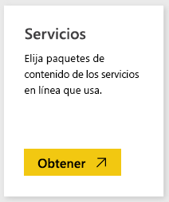
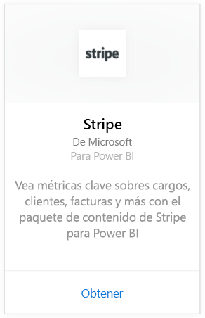
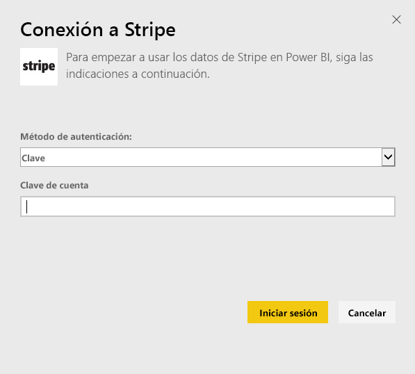
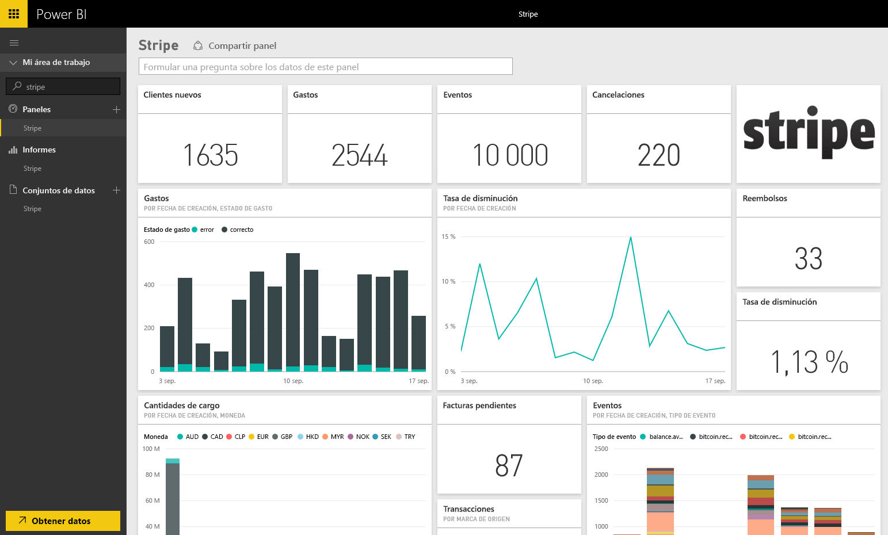

# Conexión a Stripe con Power BI
Vea y explore los datos de Stripe en Power BI con el paquete de contenido de Power BI. El paquete de contenido de Stripe para Power extrae datos sobre los clientes, gastos, eventos y facturas. Los datos incluyen los diez mil eventos más recientes y los últimos cinco mil cargos en los últimos 30 días. El contenido se actualizará automáticamente una vez al día con la programación que elija. 

Conéctese al [paquete de contenido de Stripe para Power BI](https://app.powerbi.com/getdata/services/stripe).

## Cómo conectarse
1. Seleccione Obtener datos en la parte inferior del panel de navegación izquierdo.  
   
    
2. En el cuadro **Servicios** , seleccione **Obtener**.  
   
      
3. Seleccione **Stripe** &gt; **Obtener**.  
   
      
4. Proporcione su [clave de API](https://dashboard.stripe.com/account/apikeys) de Stripe para conectarse.  
   
    
5. El proceso de importación se iniciará automáticamente. Cuando haya finalizado, aparecerá un nuevo panel, informes y modelo en el panel de navegación (se marca con un asterisco). Seleccione el panel para ver los datos importados.
   
    

**¿Qué más?**

* Pruebe a [hacer una pregunta en el cuadro de preguntas y respuestas](consumer/end-user-q-and-a.md), en la parte superior del panel.
* [Cambie los iconos](service-dashboard-edit-tile.md) en el panel.
* [Seleccione un icono](consumer/end-user-tiles.md) para abrir el informe subyacente.
* Aunque el conjunto de datos se programará para actualizarse diariamente, puede cambiar la programación de actualización o intentar actualizar a petición mediante **Actualizar ahora**

## Pasos siguientes
[¿Qué es Power BI?](power-bi-overview.md)

[Obtener datos para Power BI](service-get-data.md)

