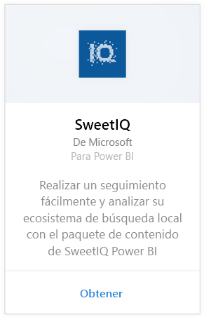
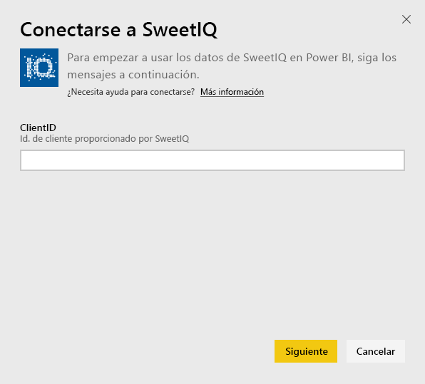
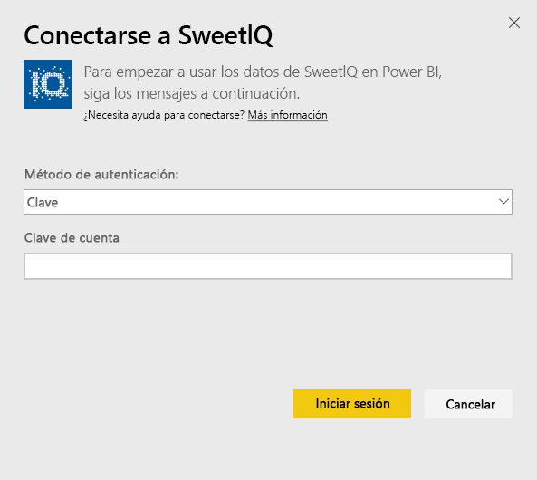

# Conexión a SweetIQ con Power BI
El paquete de contenido de Power BI extrae datos de la cuenta de SweetIQ y genera un conjunto de contenido listo para usar que permite explorar los datos fácilmente. Use el paquete de contenido de SweetIQ para analizar datos acerca de las ubicaciones, listados, clasificaciones y revisiones. Los datos están configurados para actualizarse diariamente, lo que garantiza que los datos que está supervisando estén actualizados.

Conéctese al [paquete de contenido de SweetIQ](https://app.powerbi.com/groups/me/getdata/services/sweetiq) para Power BI.

## Cómo conectarse
1. En el panel de navegación de la izquierda, haga clic en **Obtener datos.**
   
    
2. Seleccione **SweetIQ** y haga clic en **Conectar.**
   
    
3. Especifique el identificador de cliente de SweetIQ. Suele ser un valor alfanumérico. A continuación se muestra información sobre cómo buscar este valor.
   
    
4. Seleccione el tipo de autenticación **Clave** y especifique su clave de API de Sweet IQ. Suele ser un valor alfanumérico. A continuación se muestra información sobre cómo buscar este valor.
   
    
5. Power BI comenzará a cargar los datos, lo que puede tardar algún tiempo dependiendo del tamaño de los datos de su cuenta. Una vez completada la carga, verá un nuevo panel, el informe y el conjunto de datos en el panel de navegación izquierdo.
   
    

**¿Qué más?**

* Pruebe a [hacer una pregunta en el cuadro de preguntas y respuestas](power-bi-q-and-a.md), en la parte superior del panel.
* [Cambie los iconos](service-dashboard-edit-tile.md) en el panel.
* [Seleccione un icono](service-dashboard-tiles.md) para abrir el informe subyacente.
* Aunque el conjunto de datos se programará para actualizarse diariamente, puede cambiar la programación de actualización o actualizarlo a petición mediante **Actualizar ahora**.

## Búsqueda de parámetros
La clave de API y el identificador del cliente para este paquete de contenido no son los mismos que el nombre de usuario y la contraseña de SweetIQ.

Seleccione un identificador de cliente para uno de los clientes a las que tiene acceso su cuenta. Puede encontrar la lista de clientes en "Administración de clientes" en su cuenta de SweetIQ.

Hable con el administrador para obtener la clave de API y para tener acceso a los datos del cliente específico.

## Pasos siguientes
[Introducción a Power BI](service-get-started.md)

[Obtener datos para Power BI](service-get-data.md)

