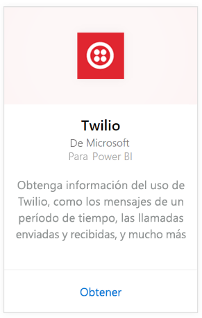
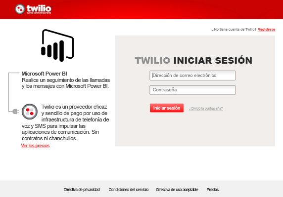
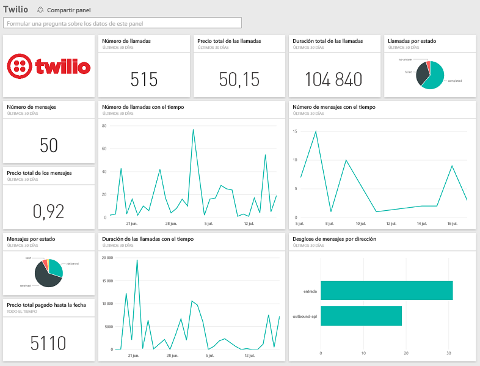

# Conexión a Twilio con Power BI
El paquete de contenido de Microsoft Twilio para Power BI permite extraer los datos en Power BI y crear un [panel de Twilio](https://powerbi.microsoft.com/integrations/twilio) preconfigurado y un informe que muestra información sobre los datos. También puede crear informes personalizados y paneles en el conjunto de datos creado por Power BI. Los datos se actualizarán una vez al día por lo que siempre está mirando los datos más recientes.

Conéctese al [paquete de contenido de Twilio](https://app.powerbi.com/getdata/services/twilio) para Power BI.

## Cómo conectarse
1. Seleccione **Obtener datos** en la parte inferior del panel de navegación izquierdo.
   
    
2. En el cuadro **Servicios** , seleccione **Obtener**.
   
    
3. Seleccione **Twilio** \> **Obtener**.
   
   
4. En **Método de autenticación**, seleccione **oAuth2** \> Iniciar sesión. Cuando se le solicite, proporcione sus credenciales de Twilio y autorice a la aplicación de Power BI el acceso a sus datos.
   
   
5. Empezará la importación de datos desde su cuenta de Twilio y tendrá el panel rellenado con el uso de llamadas y mensajes de los últimos 30 días. 
   
   

**¿Qué más?**

* Pruebe a [hacer una pregunta en el cuadro de preguntas y respuestas](consumer/end-user-q-and-a.md), en la parte superior del panel.
* [Cambie los iconos](service-dashboard-edit-tile.md) en el panel.
* [Seleccione un icono](consumer/end-user-tiles.md) para abrir el informe subyacente.
* Aunque el conjunto de datos se programará para actualizarse diariamente, puede cambiar la programación de actualización o intentar actualizar a petición mediante **Actualizar ahora**

## Qué se incluye
Detalles de todas las transacciones de llamadas y mensajes de los últimos 30 días. Puede hacer todo tipo de análisis y agregación en estos datos.

Conjunto de estadísticas ya agregadas que desee supervisar. Este conjunto incluye:

        All Time Calls Count  
        All Time Calls Duration  
        All Time Calls Price  
        All Time Messages Price  
        All Time Messages Count  
        All Time Count of Phone Numbers  
        All Time Price of Phone Numbers  
        All Time Twilio Client Calls Price  
        All Time Twilio Client Calls Duration  
        All Time Twilio Client Calls Count  
        All Time Total Price  
        All Time Inbound Calls Price  
        All Time Inbound Calls Duration  
        All Time Inbound Calls Count  
        All Time Outbound Calls Price  
        All Time Outbound Calls Duration  
        All Time Outbound Calls Count  
        This Month Calls Price  
        This Month Calls Duration  
        This Month Calls Count  
        This Month Messages Count  
        This Month Messages Price  
        This Month Count of Phone Numbers  
        This Month Price of Phone Numbers  
        This Month Twilio Client Calls Price  
        This Month Twilio Client Calls Duration  
        This Month Twilio Client Calls Count  
        This Month Total Price  
        This Month Inbound Calls Price  
        This Month Inbound Calls Duration  
        This Month Inbound Calls Count  
        This Month Outbound Calls Price  
        This Month Outbound Calls Duration  
        This Month Outbound Calls Count  
        This Month Inbound Messages Price  
        This Month Inbound Messages Count  
        This Month Outbound Messages Price  
        This Month Outbound Messages Count

## Solución de problemas
Si tiene una gran cantidad de datos en los últimos 30 días (cientos de miles de transacciones), podría haber un error en el paso de recuperación de datos. Somos conscientes del problema y estamos trabajando para resolverlo. Mientras tanto, si experimenta este problema, use el vínculo de soporte técnico de la parte superior de la página de Power BI informarnos y nos pondremos en contacto con usted para proseguir la investigación.

## Pasos siguientes
[Introducción a Power BI](service-get-started.md)

[Obtener datos en Power BI](service-get-data.md)

