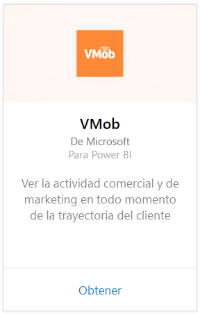
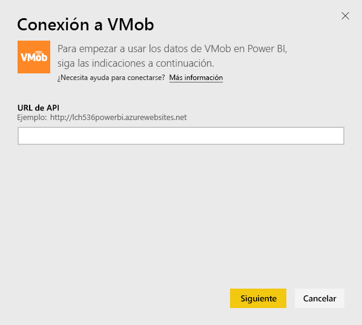
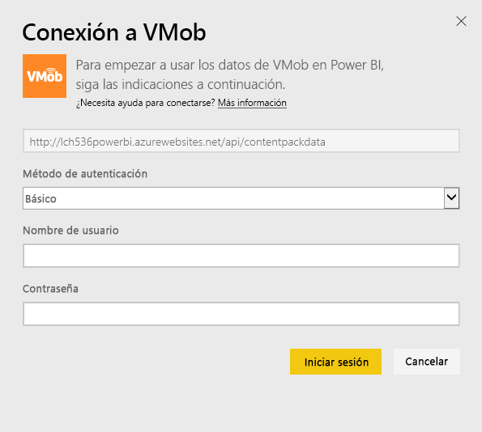
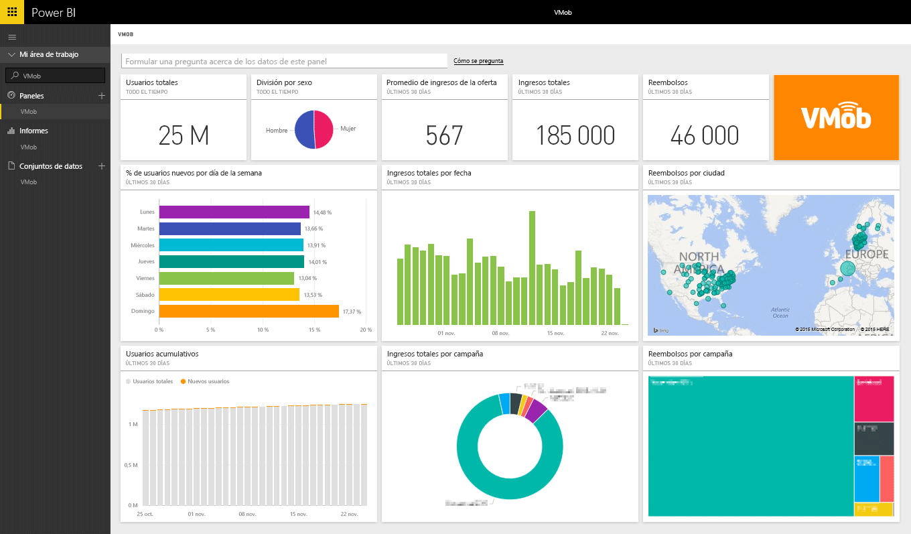

# Conexión a VMob con Power BI
Explorar y realizar un seguimiento de los datos de VMob es fácil con Power BI y el paquete de contenido de VMob. Power BI recuperará los siguientes datos: estadísticas del usuario de todo el tiempo y de los últimos 30 días, el KPI comercial de los últimos 30 días y el rendimiento de la campaña de los últimos 30 días.

[!INCLUDE [include-short-name](./includes/service-deprecate-content-packs.md)]

Conéctese al [paquete de contenido de VMob](https://app.powerbi.com/getdata/services/vmob) para Power BI.

## Cómo conectarse
1. Seleccione **Obtener datos** en la parte inferior del panel de navegación izquierdo.
   
    
2. En el cuadro **Servicios** , seleccione **Obtener**.
   
   
3. Seleccione **VMob** \> **Obtener**.
   
   
4. Cuando se le solicite, escriba la dirección URL de VMob y haga clic en el botón Siguiente. VMob proporciona esta dirección URL por separado.
   
    
5. Elija la opción **Básico** en la lista desplegable del método de autenticación, escriba su nombre de usuario y contraseña de VMob y haga clic en el botón **Iniciar sesión** .
   
    
6. El proceso de importación se iniciará automáticamente y Power BI recuperará los datos de VMob para crear un informe y un panel listos para usar.
   
   

**¿Qué más?**

* Pruebe a [hacer una pregunta en el cuadro de preguntas y respuestas](consumer/end-user-q-and-a.md), en la parte superior del panel.
* [Cambie los iconos](service-dashboard-edit-tile.md) en el panel.
* [Seleccione un icono](consumer/end-user-tiles.md) para abrir el informe subyacente.
* Aunque el conjunto de datos se programará para actualizarse diariamente, puede cambiar la programación de actualización o intentar actualizar a petición mediante **Actualizar ahora**

## Pasos siguientes
[Introducción a Power BI](service-get-started.md)

[Obtener datos en Power BI](service-get-data.md)

