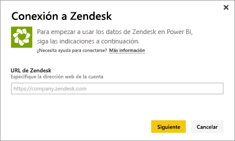
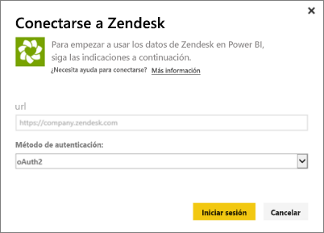
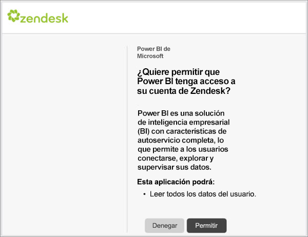
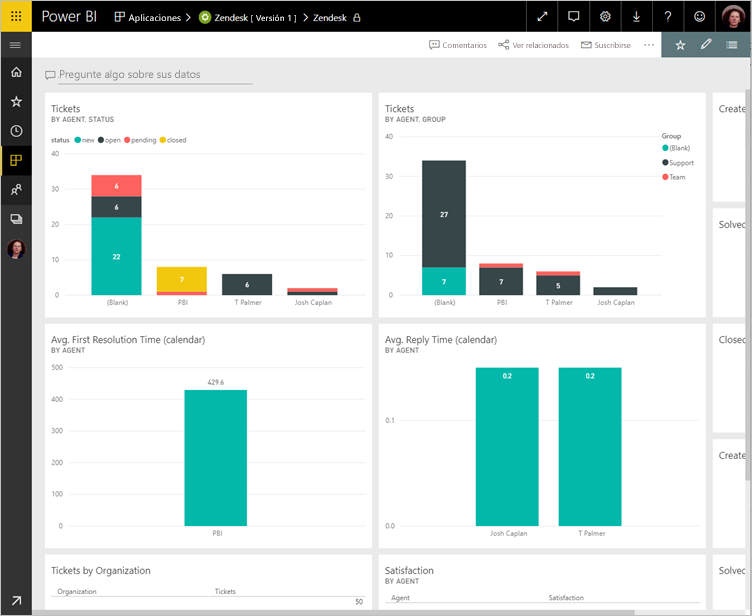
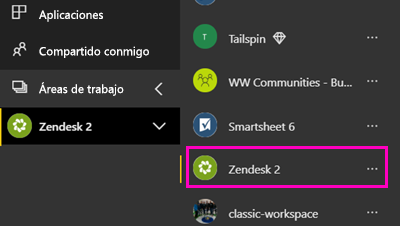
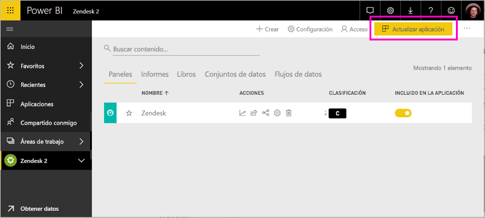

# Conexión a Zendesk con Power BI

Este artículo le guiará a través de extraer los datos de su cuenta de Zendesk con una aplicación de la plantilla de Power BI. La aplicación de Zendesk ofrece un panel de Power BI y un conjunto de informes de Power BI que proporcionan información acerca de los volúmenes de tickets y el rendimiento del agente. Los datos se actualizan automáticamente una vez al día. 

Después de instalar la aplicación de la plantilla, puede personalizar los paneles e informes para resaltar la información que más le interesan. A continuación, puede distribuirla como una aplicación a los compañeros de su organización.

Conéctese al [paquete de contenido de Zendesk](https://app.powerbi.com/getdata/services/zendesk) o lea más sobre la [integración de Zendesk ](https://powerbi.microsoft.com/integrations/zendesk)con Power BI.

Después de instalar la aplicación de la plantilla, puede cambiar los paneles e informes. A continuación, puede distribuirla como una aplicación a los compañeros de su organización.

>[!NOTE]
>Necesita una cuenta de administrador de Zendesk para conectarse. Consulte más detalles sobre los [requisitos](#system-requirements) a continuación.

## Cómo conectarse

[!INCLUDE [powerbi-service-apps-get-more-apps](./includes/powerbi-service-apps-get-more-apps.md)]

3. Seleccione **Zendesk** \> **obtenerla ahora**.
4. En **instalar esta aplicación de Power BI?** seleccione **instalar**.
4. En el **aplicaciones** panel, seleccione el **Zendesk** icono.

    

6. En **empezar a trabajar con la nueva aplicación**, seleccione **conectar datos**.

    

4. Proporcione la dirección URL asociada a su cuenta. La dirección URL tiene el formato **https://company.zendesk.com** . Consulte los detalles acerca de la [búsqueda de parámetros](#finding-parameters) más adelante.
   
   

5. Cuando se le solicite, escriba sus credenciales de Zendesk.  Seleccione **oAuth 2** como el mecanismo de autenticación y haga clic en **Iniciar sesión**. Siga el flujo de autenticación de Zendesk. (Si ya está registrado zendesk en el explorador, no se le pedirá las credenciales.)
   
   > [!NOTE]
   > Este paquete de contenido requiere que se conecte con una cuenta de administrador de Zendesk. 
   > 
   
   
6. Haga clic en **Permitir** para permitir que Power BI tenga acceso a los datos de Zendesk.
   
   
7. Haga clic en **Conectar** para comenzar el proceso de importación. 
8. Una vez que Power BI importe los datos, vea la lista de contenido de la aplicación Zendesk: un nuevo panel, informe y conjunto de datos.
9. Seleccione el panel para iniciar el proceso de exploración.

    
   
## Modificar y distribuir la aplicación

Ha instalado la aplicación de la plantilla de Zendesk. Esto significa también que ha creado el área de trabajo de la aplicación Zendesk. En el área de trabajo, puede cambiar los informes y el panel y distribuirla como un *aplicación* a compañeros de su organización. 

1. Para ver todo el contenido de la nueva área de trabajo de Zendesk, en la barra de navegación izquierdo, seleccione **las áreas de trabajo** > **Zendesk**. 

    

    Esta vista es la lista de contenido del área de trabajo. En la esquina superior derecha, verá **actualizar aplicación**. Cuando esté listo para distribuir la aplicación a sus compañeros, es donde podrá empezar. 

    

2. Seleccione **informes** y **conjuntos de datos** para ver los demás elementos en el área de trabajo.

    Obtenga información sobre [distribuir aplicaciones](service-create-distribute-apps.md) a sus compañeros.

## Requisitos del sistema
Se necesita una cuenta de administrador de Zendesk para acceder al paquete de contenido de Zendesk. Si es un agente o un usuario final y está interesado en ver los datos de Zendesk, agregue una sugerencia y revise el conector de Zendesk en la [Power BI Desktop](desktop-connect-to-data.md).

## Búsqueda de parámetros
La dirección URL de Zendesk coincidirá con la dirección URL que usa para iniciar sesión en su cuenta de Zendesk. Si no está seguro de su dirección URL de Zendesk, puede usar la [ayuda de inicio de sesión](https://www.zendesk.com/login/) de Zendesk.

## Solución de problemas
Si tiene problemas para conectarse, compruebe la dirección URL de Zendesk y confirme que está usando una cuenta de administrador de Zendesk.

## Pasos siguientes

* [Crear las nuevas áreas de trabajo en Power BI](service-create-the-new-workspaces.md)
* [Instalar y usar aplicaciones en Power BI](consumer/end-user-apps.md)
* [Conectarse a aplicaciones de Power BI para servicios externos](service-connect-to-services.md)
* ¿Tiene alguna pregunta? [Pruebe a preguntar a la comunidad de Power BI](http://community.powerbi.com/)

