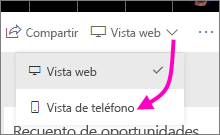
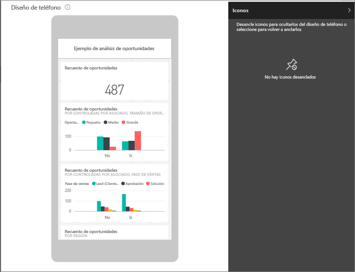
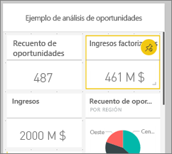
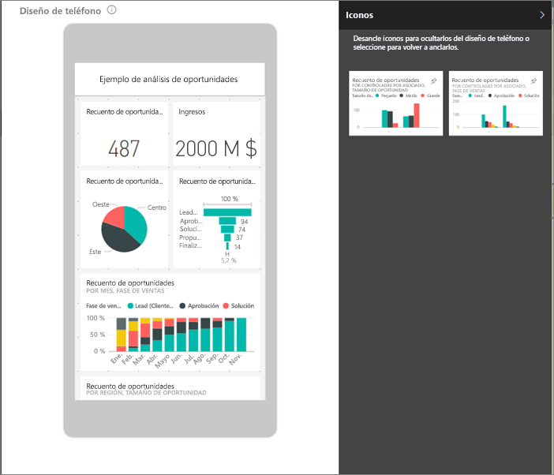
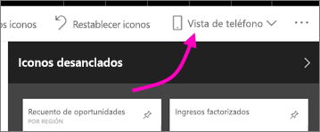

# Optimización de un panel para teléfonos móviles: Power BI 
Al ver los paneles en modo vertical en un teléfono, observará que los iconos del panel se colocan uno tras otro y tienen todos el mismo tamaño. En el servicio Power BI puede crear una vista personalizada de un panel, específicamente para el modo vertical de los teléfonos. Incluso si crea una vista para teléfono, al poner el teléfono en modo horizontal, verá el panel como se ha diseñado en el servicio.

¿Busca información sobre cómo ver los paneles en un dispositivo móvil? Pruebe entonces este inicio rápido [Exploración de paneles e informes en la aplicación móvil de Power BI](consumer/mobile/mobile-apps-quickstart-view-dashboard-report.md).

> [!NOTE]
> Al editar la vista de teléfono, cualquiera que vea el panel en un teléfono puede ver los cambios que realice en tiempo real. Por ejemplo, si desancla todos los iconos en la vista de teléfono del panel, el panel en el teléfono no tendrá de repente ningún icono. 
> 
> 

## Crear una vista de teléfono de un panel
1. En el servicio Power BI, abra un panel.
2. Seleccione la flecha situada junto a **Vista web** en la esquina superior derecha > seleccione **Vista de teléfono**.

    

    Si no es el propietario del panel, no verá esta opción.

    

    Se abre la vista de edición del panel de teléfono. Aquí puede desanclar, cambiar de tamaño y reorganizar los iconos para que se ajusten a la vista de teléfono. La versión web del panel no cambia.

1. Seleccione un icono para arrastrar, cambiar el tamaño o desanclar. Observe que los otros iconos se apartan mientras arrastra un icono.
   
    
   
    Los iconos desanclados van al panel de iconos desanclados, donde permanecen a menos que vuelva a agregarlos.
   
    
2. Si cambia de opinión, seleccione **Restablecer iconos** para volver a ponerlos en el tamaño y orden en el que se encontraban antes.
   
    
   
    Abrir simplemente la vista de edición de teléfono en el servicio Power BI cambia ligeramente el tamaño y la forma de los iconos en un teléfono. Para devolver el panel a su estado exacto antes de abrirlo en la vista de edición de teléfono, seleccione **Restablecer iconos**.
3. Cuando esté conforme con el diseño del panel de teléfono, seleccione la flecha junto a **Vista de teléfono** en la esquina superior derecha > seleccione **Vista web**.
   
    Power BI guarda automáticamente el diseño de teléfono.

## Pasos siguientes
* [Crear informes optimizados para las aplicaciones de teléfono de Power BI](desktop-create-phone-report.md)
* [Crear objetos visuales con capacidad de respuesta optimizados para cualquier tamaño](visuals/desktop-create-responsive-visuals.md)
* ¿Tiene más preguntas? [Pruebe a preguntar a la comunidad de Power BI](https://community.powerbi.com/)

