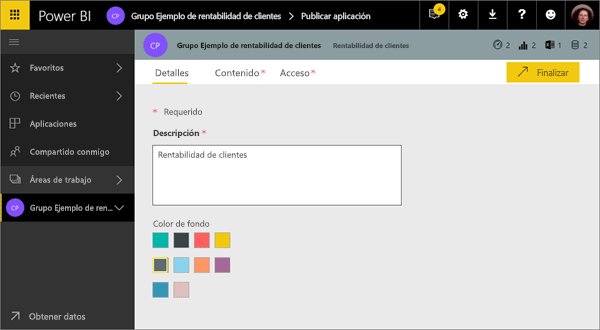
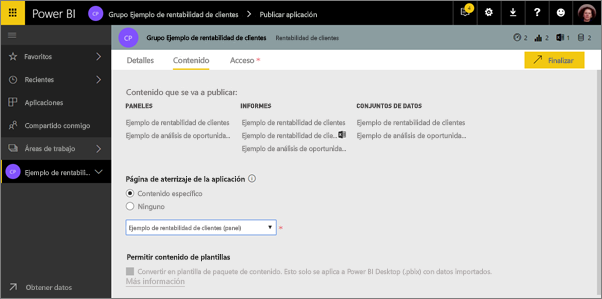
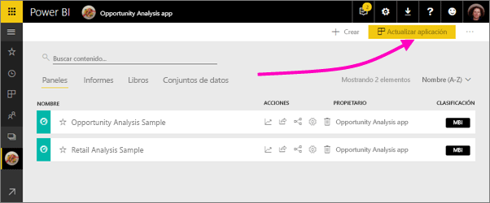
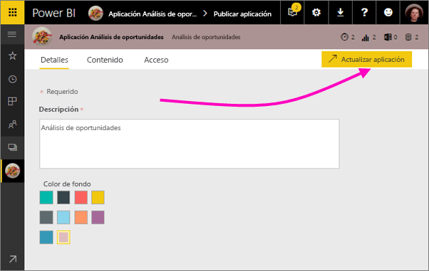

# Publicar aplicaciones con los paneles e informes de Power BI

En Power BI, puede publicar *aplicaciones* con colecciones de paneles e informes relacionados. Cree aplicaciones en *áreas de trabajo de la aplicación*, donde puede colaborar en contenido de Power BI con sus compañeros. Después, puede publicar las aplicaciones terminadas en grandes grupos de usuarios de su organización. Obtenga más información sobre la [creación de áreas de trabajo de la aplicación](service-create-workspaces.md).

Los usuarios empresariales suelen necesitar varios paneles e informes de Power BI para hacer funcionar sus negocios. Con las aplicaciones de Power BI, puede crear colecciones de paneles e informes y publicar estas aplicaciones para toda la organización o para grupos o usuarios específicos. Los creadores de informes o los administradores verán lo fácil que es administrar permisos sobre estas colecciones con las aplicaciones.

Los usuarios empresariales obtienen las aplicaciones de varias maneras diferentes. Si el administrador de Power BI le concede permiso, puede instalar las aplicaciones automáticamente en las cuentas de Power BI de sus compañeros de trabajo. En caso contrario, pueden instalar estas aplicaciones desde Microsoft AppSource, o bien puede enviarles un vínculo directo. Ellos pueden buscar y volver a su contenido fácilmente porque está todo en un lugar. No pueden modificar los contenidos de la aplicación, pero pueden interactuar con ella bien en el servicio de Power BI o en una de las aplicaciones móviles: pueden filtrar, resaltar y ordenar los datos por sí mismos. Obtienen las actualizaciones automáticamente y se puede controlar la frecuencia con la que se actualizan los datos. Obtenga información sobre la [experiencia de aplicación para usuarios empresariales](consumer/end-user-apps.md).

**¿Sabía qué?** Power BI está realizando una versión preliminar de una nueva experiencia de áreas de trabajo. Lea [Crear nuevas áreas de trabajo (versión preliminar)](service-create-the-new-workspaces.md) para ver cómo cambiarán las áreas de trabajo en el futuro. 

## Aplicaciones y paquetes de contenido organizativos
Las aplicaciones son la evolución de los paquetes de contenido organizativos. Los paquetes de contenido no están disponibles en la versión preliminar de las nuevas experiencias de áreas de trabajo. Después de que la nueva experiencia de área de trabajo esté disponible con carácter general, no podrá usar paquetes de contenido en áreas de trabajo recién creadas. Si todavía no lo ha hecho, empiece a migrar los paquetes de contenido a las aplicaciones.

## Vídeo: Aplicaciones y áreas de trabajo de aplicación
<iframe width="640" height="360" src="https://www.youtube.com/embed/Ey5pyrr7Lk8?showinfo=0" frameborder="0" allowfullscreen></iframe>

## Licencias para aplicaciones
Cada miembro de un área de trabajo de la aplicación necesita una licencia de Power BI Pro. Los usuarios de la aplicación tienen dos opciones.

* Opción 1: todos los usuarios empresariales necesitan licencias de **Power BI Pro** para ver la aplicación. 
* Opción 2: los usuarios de su organización con la versión gratuita pueden ver el contenido de la aplicación si la aplicación reside en una capacidad de Power BI Premium. Para más información, lea [What is Power BI Premium?](service-premium.md) (¿Qué es Power BI Premium?)

## Publicar su aplicación
Cuando los paneles e informes en el área de trabajo estén listos, elija cuáles quiere publicar y luego publíquelos como una aplicación. Puede enviar un vínculo directo a esa audiencia más amplia, o pueden encontrar la aplicación en la pestaña Aplicaciones, en **Descargar y explorar más aplicaciones de AppSource**. 

1. En la vista de lista del área de trabajo, decida qué paneles e informes quiere incluir en la aplicación.

     

     Si decide no publicar un informe, verá una advertencia junto a este y junto al panel relacionado. Todavía puede publicar la aplicación, pero al panel relacionado le faltarán los iconos de ese informe.

     

2. Seleccione el botón **Publicar aplicación** en la esquina superior derecha para iniciar el proceso de compartir todo el contenido de ese área de trabajo.
   
     

3. En **Detalles**, rellene la descripción para ayudar a otras personas a encontrar la aplicación. Puede establecer un color de fondo para personalizarla.
   
     

4. En **Contenido**, puede ver el contenido que se va a publicar como parte de la aplicación: todo el contenido que ha seleccionado en esa área de trabajo. También puede establecer la página de inicio de la aplicación: el panel o informe que otras personas verán en primer lugar cuando vayan a la aplicación. Puede elegir **Ninguno**. En ese caso, la página de inicio será una lista de todo el contenido de la aplicación. 
   
     

5. En **Acceso**, puede decidir quién tiene acceso a la aplicación: ya sea todas las personas de la organización, usuarios específicos o grupos de seguridad de Active Directory. Si tiene permisos, puede decidir instalar automáticamente la aplicación para los destinatarios. Puede habilitar esta opción en el [Portal de administración de Power BI](#how-to-enable-pushing-apps). Puede obtener más consideraciones para [insertar una aplicación](#how-to-enable-pushing-apps).

    

6. Cuando seleccione **Finalizar**, verá un mensaje que confirma que está listo para publicar. En el cuadro de diálogo de operación correcta, puede copiar la dirección URL, que es un vínculo directo a la aplicación, y enviársela a los usuarios con los que la ha compartido.
   
     

Obtenga información sobre la [experiencia de aplicación para usuarios empresariales](consumer/end-user-apps.md).

## Cambiar la aplicación publicada
Después de publicar la aplicación, puede que desee cambiarla o actualizarla. Es fácil actualizarla si es un administrador o miembro del área de trabajo de la aplicación o un colaborador de la nueva área de trabajo de la aplicación. 

1. Abra el área de trabajo de aplicación que corresponde a la aplicación. 
   
     
2. Abra el panel o el informe. Verá que puede realizar los cambios que desee.
   
     El área de trabajo de aplicación es el área de ensayo, por lo que los cambios no se envían en directo a la aplicación hasta que la vuelva a publicar. Esto le permite realizar cambios sin que ello afecte a las aplicaciones publicadas.  
 
3. Vuelva a la lista de contenidos del área de trabajo de la aplicación y seleccione **Actualizar aplicación**.
   
     

4. Actualice **Detalles**, **Contenido** y **Acceso**, si es necesario y, a continuación, seleccione **Actualizar aplicación**.
   
     

Las personas para las que ha publicado la aplicación ven automáticamente la versión actualizada de la aplicación. 

## Instalar aplicaciones para usuarios finales de forma automática
Las aplicaciones proporcionan datos que los usuarios finales necesitan para realizar su trabajo. Si un administrador le concede los permisos, puede instalar aplicaciones para los usuarios finales de forma automática, lo que facilita la distribución de las aplicaciones correctas a las personas o grupos adecuados. La aplicación aparecerá automáticamente en la lista de contenido Aplicaciones de los usuarios finales, en lugar de tener que buscarlas en Microsoft AppSource o seguir un vínculo de instalación. Esto facilita la distribución de contenido estándar de Power BI a los usuarios.

### Cómo instalar una aplicación para los usuarios finales automáticamente
Una vez que el administrador le haya asignado los permisos, tiene una nueva opción para **instalar la aplicación automáticamente**. Si activa la casilla y selecciona **Finalizar** (o **Actualizar aplicación**, para aplicaciones existentes), la aplicación se inserta en todos los usuarios o grupos definidos en la sección **Permisos** de la aplicación, en la pestaña **Acceso**.

### Cómo obtienen los usuarios las aplicaciones que se han insertado
Después de insertar una aplicación, se muestra automáticamente en la lista de aplicaciones. Puede ajustar las aplicaciones que un rol de usuario o de trabajo específico de la organización necesita tener a su alcance.

### Consideraciones para instalar automáticamente las aplicaciones
Estos son aspectos que debe tener en cuenta al publicar aplicaciones para los usuarios finales:

* La instalación de una aplicación de forma automática para los usuarios puede llevar tiempo. La mayoría de las aplicaciones se instalará inmediatamente, pero la inserción puede llevar tiempo.  Depende del número de elementos de la aplicación y del número de usuarios con acceso. Se recomienda publicar aplicaciones durante las horas sin actividad con bastante tiempo antes de que los usuarios las necesiten. Compruebe con varios usuarios antes de enviar una comunicación general sobre la disponibilidad de las aplicaciones.

* Actualice el explorador. Para poder ver la aplicación insertada en la lista de aplicaciones, es posible que el usuario necesite actualizar, o cerrar y volver a abrir, el explorador.

* Si el usuario no ve inmediatamente la aplicación en la lista de aplicaciones, debe actualizar o cerrar y volver a abrir el explorador.

* Intente no abrumar a los usuarios. Tenga cuidado de no insertar demasiadas aplicaciones para que los usuarios perciban que las aplicaciones preinstaladas son útiles. Es mejor controlar quién puede insertar aplicaciones para los usuarios finales a fin de coordinar la programación. Puede establecer un punto de contacto para obtener aplicaciones de la organización insertadas para los usuarios finales.

* A los usuarios invitados que no hayan aceptado una invitación no se les instalarán las aplicaciones automáticamente.  

## Cancelar la publicación de una aplicación
Cualquier miembro de un área de trabajo de la aplicación puede cancelar la publicación de la aplicación.

* En un área de trabajo de la aplicación, seleccione el botón de puntos suspensivos (**…**) en la esquina superior derecha > **Unpublish app** (Cancelar publicación de aplicación).
  
     

Esta acción desinstala la aplicación para todos los usuarios para los que se haya publicado, los cuales dejarán de tener acceso a ella. No se elimina el área de trabajo de la aplicación ni su contenido.

## Pasos siguientes
* [Crear área de trabajo de la aplicación](service-create-workspaces.md)
* [Instalar y usar aplicaciones en Power BI](consumer/end-user-apps.md)
* [Conectarse a los servicios con los paquetes de contenido de Power BI](service-connect-to-services.md)
* [Portal de administración de Power BI](https://docs.microsoft.com/power-bi/service-admin-portal)
* ¿Tiene alguna pregunta? [Pruebe a preguntar a la comunidad de Power BI](http://community.powerbi.com/)
