# Publicación de una aplicación en Power BI

En Power BI, puede crear contenido empaquetado oficial y luego distribuirlo a un público amplio como una *aplicación*. Las aplicaciones se crean en *áreas de trabajo*, donde puede colaborar en contenido de Power BI con compañeros de trabajo. Después, puede publicar las aplicaciones terminadas en grandes grupos de usuarios de su organización. 

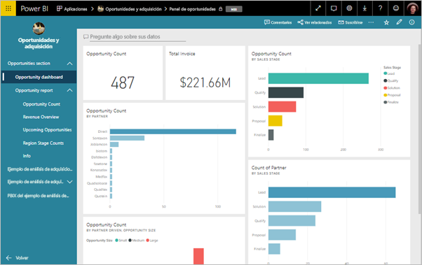

Los usuarios empresariales suelen necesitar varios paneles e informes de Power BI para hacer funcionar sus negocios. Con las aplicaciones de Power BI, puede crear colecciones de paneles e informes, y publicarlas para toda la organización o para grupos o usuarios específicos. Los creadores de informes o los administradores verán lo fácil que es administrar permisos sobre estas colecciones con las aplicaciones.

Los usuarios empresariales obtienen las aplicaciones de varias maneras diferentes:

- Pueden buscar e instalar la aplicación desde Microsoft AppSource.
- Les puede enviar un vínculo directo.
- Si el administrador de Power BI le concede permiso, puede instalarla automáticamente en las cuentas de Power BI de los compañeros de trabajo.

Puede crear la aplicación con su propia navegación integrada, para que los usuarios puedan desplazarse con facilidad por el contenido. No pueden modificar el contenido de la aplicación. Pueden interactuar con ella en el servicio Power BI o en una de las aplicaciones móviles: pueden filtrar, resaltar y ordenar los datos por sí mismos. Obtienen las actualizaciones automáticamente y se puede controlar la frecuencia con la que se actualizan los datos. También puede concederles permiso de compilación para conectarse a los conjuntos de datos subyacentes y crear copias de los informes en la aplicación. Obtenga más información sobre el [permiso de compilación](service-datasets-build-permissions.md).

## Licencias para aplicaciones
Para crear o actualizar una aplicación necesita una licencia de Power BI Pro. Los *consumidores* de la aplicación tienen dos opciones.

* **Opción 1** El área de trabajo de esta aplicación *no* está en una capacidad de Power BI Premium: todos los usuarios empresariales necesitan licencias de Power BI Pro para ver la aplicación. 
* **Opción 2** El área de trabajo de esta aplicación *está* en una capacidad de Power BI Premium: los usuarios empresariales de la organización sin licencias de Power BI Pro pueden ver el contenido de la aplicación. Pero no pueden copiar los informes ni crear informes basados en los conjuntos de datos subyacentes. Para más información, lea [What is Power BI Premium?](service-premium.md) (¿Qué es Power BI Premium?)

## Publicar su aplicación
Cuando los paneles e informes en el área de trabajo estén listos, elija cuáles quiere publicar y luego publíquelos como una aplicación. 

1. En la vista de lista del área de trabajo, decida qué paneles e informes quiere **incluir en la aplicación**.

     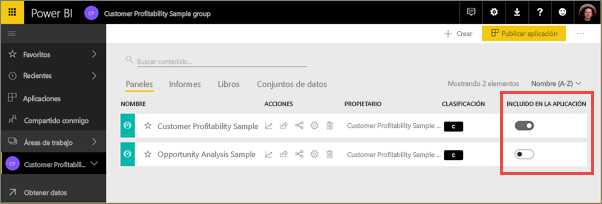

     Si decide no incluir un informe que tiene un panel relacionado, verá una advertencia junto al informe. Todavía puede publicar la aplicación, pero el panel relacionado no tendrá los iconos de ese informe.

     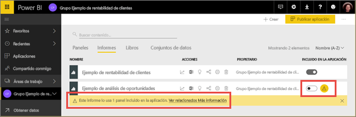

2. Seleccione el botón **Publicar aplicación** de la esquina superior derecha para iniciar el proceso de creación y publicación de una aplicación desde el área de trabajo.
   
     

3. En **Configuración**, rellene el nombre y la descripción para ayudar a los usuarios a encontrar la aplicación. Puede establecer un color de tema para personalizarla. También puede agregar un vínculo a un sitio de soporte técnico.
   
     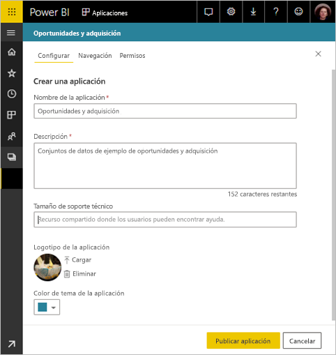

4. En **Navegación**, seleccione el contenido que se va a publicar como parte de la aplicación. Después, agregue navegación de la aplicación, para organizar el contenido en secciones. Vea [Diseño de la experiencia de navegación de la aplicación](#design-the-navigation-experience) en este artículo para obtener más información.
   
     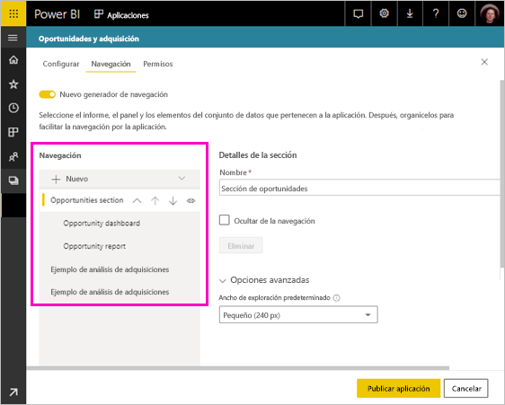

5. En **Permisos**, decida quién tiene acceso a la aplicación y qué puede hacer con ella. 
    - En [Áreas de trabajo clásicas](service-create-workspaces.md): todas las personas de la organización, usuarios específicos o grupos de seguridad de Azure Active Directory (AAD).
    - En las [áreas de trabajo de la nueva experiencia](service-create-the-new-workspaces.md): usuarios específicos, grupos de seguridad de AAD y listas de distribución, y grupos de Office 365. Todos los usuarios del área de trabajo reciben automáticamente acceso a la aplicación para el área de trabajo.
    - Puede permitir que los usuarios de la aplicación se conecten a los conjuntos de datos subyacentes de la aplicación si les asigna el permiso de compilación. Verán estos conjuntos de datos cuando busquen conjuntos de datos compartidos. Lea más sobre [cómo permitir que los usuarios se conecten a los conjuntos de datos de la aplicación](#allow-users-to-connect-to-datasets) en este artículo.
    - Los usuarios con el permiso de compilación también pueden tener permiso para copiar informes desde esta aplicación en otra área de trabajo. Lea más sobre [cómo permitir que los usuarios copien datos en la aplicación](#allow-users-to-copy-reports) en este artículo.
    
    >[!IMPORTANT]
    >Si la aplicación se basa en conjuntos de datos de otras áreas de trabajo, es responsabilidad suya asegurarse de que todos los usuarios de la aplicación tienen acceso a los conjuntos de datos subyacentes.
    >

6. Puede instalar la aplicación de forma automática para los destinatarios, si el administrador de Power BI ha habilitado esta opción automáticamente en el Portal de administración de Power BI. Obtenga más información sobre [la instalación automática de una aplicación](#automatically-install-apps-for-end-users) en este artículo.

     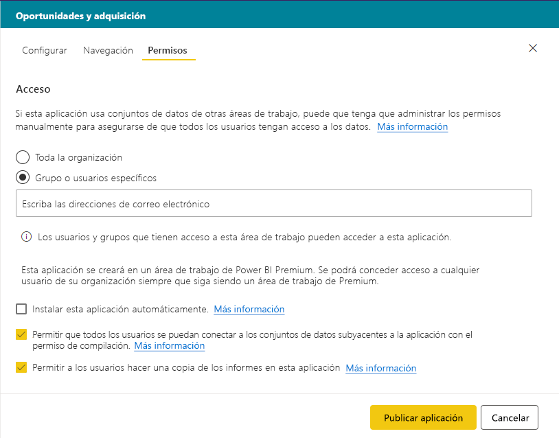

7. Al seleccionar **Publicar aplicación**, verá un mensaje en el que se confirma que está lista para publicarse. En el cuadro de diálogo **Compartir esta aplicación**, puede copiar la dirección URL que es un vínculo directo a esta aplicación.
   
     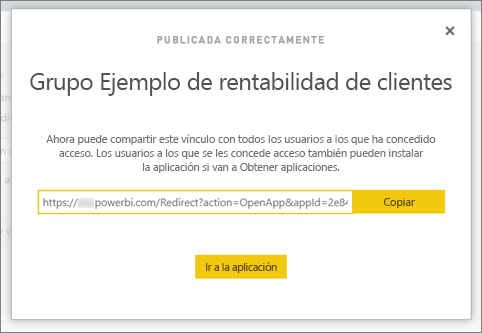

Puede enviar ese vínculo directo a los usuarios con los que la ha compartido, o bien pueden encontrar la aplicación en la pestaña Aplicaciones, en **Descargar y explorar más aplicaciones de AppSource**. Obtenga información sobre la [experiencia de aplicación para usuarios empresariales](consumer/end-user-apps.md).

## Cambiar la aplicación publicada
Después de publicar la aplicación, puede que desee cambiarla o actualizarla. Es fácil actualizarla si es un administrador o miembro de la nueva área de trabajo. 

1. Abra el área de trabajo que se corresponde a la aplicación. 
   
     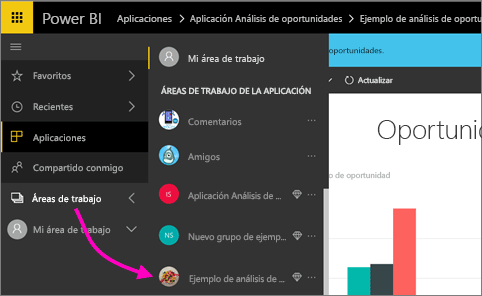

2. Realice los cambios que quiera en los paneles o informes.
 
     El área de trabajo es el área de ensayo, por lo que los cambios no se envían en directo a la aplicación hasta que la vuelva a publicar. Esto le permite realizar cambios sin que ello afecte a las aplicaciones publicadas.  
 
    > [!IMPORTANT]
    > Si quita un informe y actualiza la aplicación, incluso si vuelve a agregar el informe a la aplicación, los consumidores de la aplicación perderán todas las personalizaciones, como marcadores, comentarios, etc.  
 
3. Vuelva a la lista de contenidos del área de trabajo y seleccione **Actualizar aplicación** en la esquina superior derecha.
   
1. Si es necesario, actualice **Instalación**, **Navegación** y **Permisos**, y después seleccione **Actualizar aplicación**.
   
Las personas para las que ha publicado la aplicación ven automáticamente la versión actualizada de la aplicación. 

## Diseño de la experiencia de navegación
La opción **Nuevo generador de navegación** permite crear una navegación personalizada para la aplicación. La navegación personalizada hace que la búsqueda y el uso del contenido de la aplicación resulten más fáciles para los usuarios. En las aplicaciones existentes esta opción está desactivada y en las nuevas está activada de forma predeterminada.

Cuando la opción está desactivada, puede seleccionar que la **Página de aterrizaje de la aplicación** sea **Contenido específico** (por ejemplo, un panel o un informe), o bien seleccionar **Ninguno** para mostrar al usuario una lista de contenido básico.

Al activar **Nuevo generador de navegación**, puede diseñar una navegación personalizada. De forma predeterminada, todos los paneles, informes y libros de Excel que se incluyen en la aplicación se muestran como una lista plana. 

Puede personalizar aún más la navegación de aplicación si:
* Reordena los elementos mediante las flechas Arriba y Abajo. 
* Cambia el nombre de los elementos en **Detalles del informe**, **Detalles del panel** y **Detalles del libro**.
* Oculta elementos concretos en el panel de navegación.
* Usa la opción **Nueva** para agregar **secciones** para agrupar contenido relacionado.
* Usa la opción **Nuevo** para agregar un **vínculo** a un recurso externo en el panel de navegación de la izquierda. 

Cuando se agrega un **vínculo**, en **Detalles del vínculo** puede elegir dónde se abre el vínculo. De forma predeterminada los vínculos se abren en la **Pestaña actual**, pero puede seleccionar **Nueva pestaña** o **Área de contenido**. 

### Consideraciones sobre el uso de la nueva opción Generador de navegación
Estos son aspectos generales que deben tenerse en cuenta al usar el nuevo Generador de navegación:
* Las páginas del informe se muestran en el área de navegación de la aplicación como una sección expandible.
* Si desactiva el nuevo generador de navegación y después publica o actualiza la aplicación, se perderán las personalizaciones que haya realizado. Por ejemplo, se perderán las secciones, la ordenación, los vínculos y los nombres personalizados para los elementos de navegación.

Al agregar vínculos a la navegación de la aplicación y seleccionar la opción Área de contenido:
* Asegúrese de que el vínculo se puede insertar. Algunos servicios bloquean la inserción de su contenido en sitios de terceros como Power BI.
* No se admite la inserción de contenido del servicio Power BI, como informes o paneles en otras áreas de trabajo. 
* Inserte contenido de Power BI Report Server a través de su dirección URL de inserción de contenido nativa desde una implementación local. Siga los pasos descritos en [Creación de la dirección URL de Power BI Report Server](https://docs.microsoft.com/power-bi/report-server/quickstart-embed#create-the-power-bi-report-url) para obtener la dirección URL. Tenga en cuenta que se aplican las reglas de autenticación convencionales, de modo que para ver el contenido se necesita una conexión VPN al servidor local. 
* Se muestra una advertencia de seguridad en la parte superior del contenido insertado para indicar que no está en Power BI.

## Instalar aplicaciones para usuarios finales de forma automática
Si un administrador le concede permisos, puede instalar aplicaciones de forma automática, para *insertarlas* en los usuarios finales. Esta funcionalidad de inserción facilita la distribución de las aplicaciones correctas a los usuarios o grupos adecuados. La aplicación aparecerá de forma automática en la lista de contenido Aplicaciones de los usuarios finales. No tendrán que buscarla en Microsoft AppSource ni seguir un vínculo de instalación. Vea cómo los administradores habilitan [la inserción de aplicaciones en los usuarios finales](service-admin-portal.md#push-apps-to-end-users) en el artículo del portal de administración de Power BI.

### Procedimientos para insertar una aplicación de forma automática en los usuarios finales
Una vez que el administrador le haya asignado los permisos, tiene una nueva opción para **instalar la aplicación automáticamente**. Si activa la casilla y selecciona **Publicar aplicación** (o **Actualizar aplicación**), la aplicación se inserta en todos los usuarios o grupos definidos en la sección **Permisos** de la aplicación, en la pestaña **Acceso**.

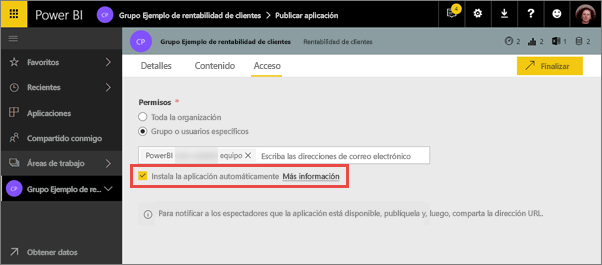

### Cómo obtienen los usuarios las aplicaciones que les inserta
Después de insertar una aplicación, se muestra de forma automática en la lista Aplicaciones. De esta forma, puede ajustar las aplicaciones que roles de usuario o de trabajo específicos de la organización necesitan tener a su alcance.

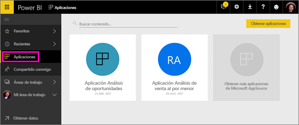

### Consideraciones para instalar automáticamente las aplicaciones
Estos son aspectos que debe tener en cuenta al publicar aplicaciones para los usuarios finales:

* La instalación de una aplicación de forma automática para los usuarios puede llevar tiempo. La mayoría de las aplicaciones se instalan inmediatamente para los usuarios, pero la inserción puede llevar tiempo.  Depende del número de elementos de la aplicación y del número de usuarios con acceso. Se recomienda publicar aplicaciones durante las horas sin actividad con bastante tiempo antes de que los usuarios las necesiten. Compruebe con varios usuarios antes de enviar una comunicación general sobre la disponibilidad de las aplicaciones.

* Actualice el explorador. Para poder ver la aplicación insertada en la lista de aplicaciones, es posible que el usuario necesite actualizar, o cerrar y volver a abrir, el explorador.

* Si los usuarios no ven inmediatamente la aplicación en la lista Aplicaciones, tendrán que actualizar o cerrar y volver a abrir el explorador.

* Intente no abrumar a los usuarios. Tenga cuidado de no insertar demasiadas aplicaciones para que los usuarios perciban que las aplicaciones preinstaladas les son útiles. Es mejor controlar quién puede insertar aplicaciones para los usuarios finales a fin de coordinar la programación. Establezca un punto de contacto para insertar las aplicaciones de la organización para los usuarios finales.

* A los usuarios invitados que no hayan aceptado una invitación no se les instalarán las aplicaciones de forma automática.  

## Permitir a los usuarios conectarse a conjuntos de datos

Al activar la opción para **permitir que los usuarios se conecten a los conjuntos de datos subyacentes de la aplicación**, asigna a los usuarios de la aplicación el *permiso de compilación* en esos conjuntos de datos. Con este permiso, pueden realizar varias acciones clave:

- [Usar los conjuntos de datos de la aplicación](service-datasets-across-workspaces.md) como base para sus informes.
- Buscar estos conjuntos de datos en Power BI Desktop y en la experiencia de obtención de datos en el servicio Power BI.
- Crear informes y paneles basados en estos conjuntos de datos.

Al desactivar esta opción, los usuarios nuevos que agregue a la aplicación ya no tendrán el permiso de compilación. Pero para los usuarios de la aplicación existentes, los permisos en los conjuntos de datos subyacentes no cambian. Puede eliminar de forma manual el permiso de compilación de los usuarios de la aplicación que ya no deban tenerlo. Obtenga más información sobre el [permiso de compilación](service-datasets-build-permissions.md).

## Permitir a los usuarios copiar informes

Al activar la opción **Permitir a los usuarios hacer una copia de los informes de esta aplicación**, los usuarios pueden guardar cualquiera de los informes de la aplicación en sus áreas de trabajo o en otra. Para hacer una copia, los usuarios necesitan una licencia Pro, incluso si el informe original se encuentra en un área de trabajo de una capacidad Premium. A continuación, los usuarios pueden personalizar los informes según sus necesidades específicas. Tendrá que seleccionar primero la opción **Permite que los usuarios se conecten a los conjuntos de datos subyacentes de la aplicación mediante el permiso de compilación**. Al seleccionar estas opciones, se habilita la nueva función de [copia de informes desde otras áreas de trabajo](service-datasets-copy-reports.md).

## Cancelar la publicación de una aplicación
Cualquier miembro de un área de trabajo puede cancelar la publicación de la aplicación.

>[!IMPORTANT]
>Cuando cancela la publicación de una aplicación, los usuarios de la aplicación pierden sus personalizaciones. Pierden todos los marcadores personales, comentarios o suscripciones asociados al contenido de la aplicación. Cancele la publicación de una aplicación solo si es necesario quitarla.
> 

* En un área de trabajo, seleccione el botón de puntos suspensivos (**…**) en la esquina superior derecha > **Cancelar publicación de la aplicación**.
  
     

Esta acción desinstala la aplicación para todos los usuarios para los que se haya publicado, los cuales dejarán de tener acceso a ella. No se elimina el área de trabajo ni su contenido.

## Visualización de la aplicación publicada

Cuando los consumidores de la aplicación la abran, verán el panel de navegación que ha creado, en lugar del panel de navegación izquierdo estándar de Power BI. La navegación de la aplicación enumera los informes y paneles en las secciones que haya definido. También se muestran las páginas individuales de cada informe, no solo el nombre del informe.

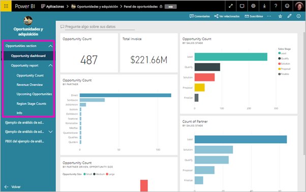

## Consideraciones y limitaciones
Aspectos que hay que tener en cuenta sobre la publicación de aplicaciones:

* Puede tener como máximo 100 usuarios o grupos en la lista de acceso de la aplicación. Sin embargo, puede conceder acceso a la aplicación a más de 100 usuarios. Para ello, use uno o varios grupos de usuarios que contengan todos los usuarios que se quieran.
* Para la nueva experiencia de área de trabajo, si el usuario agregado a la lista de acceso de la aplicación ya tiene acceso a dicha aplicación a través del área de trabajo, no se mostrará en la lista de acceso de esta.  

## Pasos siguientes
* [Crear un área de trabajo](service-create-workspaces.md)
* [Instalar y usar aplicaciones en Power BI](consumer/end-user-apps.md)
* [Conectarse a los servicios con los paquetes de contenido de Power BI](service-connect-to-services.md)
* [Portal de administración de Power BI](https://docs.microsoft.com/power-bi/service-admin-portal)
* ¿Tiene alguna pregunta? [Pruebe a preguntar a la comunidad de Power BI](http://community.powerbi.com/)
