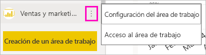
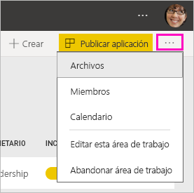
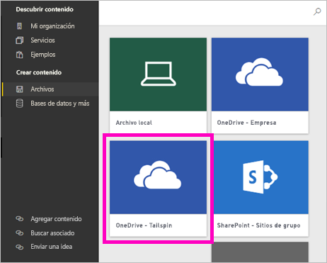
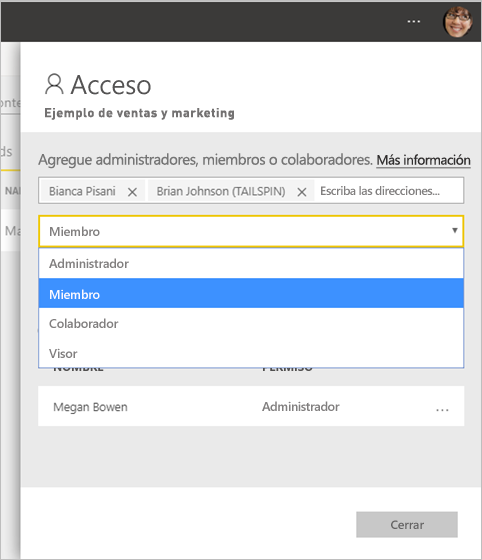

# Creación de las nuevas áreas de trabajo en Power BI

Power BI presenta una nueva experiencia de área de trabajo. Las áreas de trabajo siguen siendo el lugar donde se colabora con compañeros para crear colecciones de paneles, informes e informes paginados. Después, estas colecciones se pueden agrupar en *aplicaciones* y distribuirse por toda la organización o a grupos o usuarios específicos. 

Estas son las diferencias. En las nuevas áreas de trabajo puede hacer lo siguiente:

- Asignar roles de área de trabajo a grupos de usuarios: grupos de seguridad, listas de distribución, grupos de Office 365 y usuarios.
- Crear un área de trabajo en Power BI sin crear un grupo de Office 365.
- Usar roles de las áreas de trabajo más granulares para flexibilizar la administración de permisos en un área de trabajo.

> [!NOTE]
> Para aplicar seguridad de nivel de fila (RLS) para los usuarios de Power Bi Pro que exploran el contenido de un área de trabajo, siga usando las [áreas de trabajo clásicas](service-create-workspaces.md). Seleccione la opción **Los miembros solo pueden ver contenido de Power BI**. También puede publicar una aplicación de Power BI a los usuarios o distribuir contenido mediante el uso compartido. El futuro rol de visor permitirá este escenario en el futuro en las áreas de trabajo de la nueva experiencia.

Para más información, consulte el artículo sobre las [nuevas áreas de trabajo](service-new-workspaces.md).

## Creación de una de las nuevas áreas de trabajo

1. Comience por crear el área de trabajo. Seleccione **Áreas de trabajo** > **Crear un área de trabajo**.
   
     

2. Va a crear automáticamente un área de trabajo actualizada, a menos que opte por la opción **Revertir al área de trabajo clásica**.
   
     
     
     Si selecciona **Revertir al área de trabajo clásica**, creará un área de trabajo basada en un grupo de Office 365. Use esta opción si necesita la opción **Los miembros solo pueden ver contenido de Power BI** para aplicar seguridad de nivel de fila (RLS) a los miembros del área de trabajo.

2. Asigne un nombre al área de trabajo. Si el nombre no está disponible, puede editarlo para tener un nombre único.
   
     La aplicación del área de trabajo tendrá el mismo nombre e icono que el área de trabajo.
   
1. Estos son algunos elementos opcionales que puede establecer para el área de trabajo:

    Cargue una **imagen de área de trabajo**. Los archivos pueden tener el formato .png o .jpg. El tamaño del archivo debe ser inferior a 45 KB.
    
    [Agregue una **lista de contactos**](#workspace-contact-list). De forma predeterminada, los administradores del área de trabajo son los contactos. 
    
    [Especifique un valor para **Área de trabajo: OneDrive**](#workspace-onedrive); para ello, escriba solo el nombre de un grupo existente de Office 365, no la dirección URL. Ahora este área de trabajo puede usar la ubicación de almacenamiento de archivos de ese grupo de Office 365. 

    

    Para asignar al área de trabajo una **capacidad dedicada**, en la pestaña **Premium** seleccione **Capacidad dedicada**.
     
    

1. Seleccione **Guardar**.

    Power BI crea el área de trabajo y la abre. Esta aparece en la lista de áreas de trabajo de las que es miembro. 

## Lista de contactos del área de trabajo

La nueva lista de contactos del área de trabajo le permite especificar qué usuarios reciben una notificación sobre los problemas que se producen en el área de trabajo. De forma predeterminada, se notifica a cualquier usuario o grupo especificado como administrador del área de trabajo, pero puede personalizar la lista. Los usuarios o grupos que aparecen en la lista de contactos se mostrarán en la interfaz de usuario (IU) para ayudar a los usuarios a obtener ayuda relacionada con el área de trabajo.

1. Acceda a la nueva opción **Lista de contactos** de dos maneras:

    En el panel **Crear un área de trabajo** cuando la crea la primera vez.

    En el panel de navegación izquierdo, seleccione la flecha que aparece junto a **Áreas de trabajo**, seleccione los puntos suspensivos (...) junto al nombre del área de trabajo y haga clic en **Configuración del área de trabajo**. Se abre el panel **Configuración**.

    

2. En **Avanzadas** > **Lista de contactos**, acepte el valor predeterminado, **Administradores de áreas de trabajo** o agregue su propia lista de **Usuarios o grupos específicos**. 
3. Seleccione **Guardar**.

## Área de trabajo: OneDrive

La característica Área de trabajo: OneDrive permite configurar un grupo de Office 365 cuyo almacenamiento de archivos de la biblioteca de documentos de SharePoint esté disponible para los usuarios del área de trabajo. Primero se crea el grupo fuera de Power BI. 

Power BI no sincroniza los permisos de los usuarios o grupos que están configurados para tener acceso al área de trabajo con la pertenencia al grupo de Office 365. El procedimiento recomendado es proporcionar al grupo de Office 365, cuyo almacenamiento de archivos se define en esta configuración, el mismo [acceso al área de trabajo](#give-access-to-your-workspace). Luego, administre el acceso al área de trabajo mediante la pertenencia del grupo de Office 365. 

1. Acceda a la nueva opción **Grupo de trabajo: OneDrive** de dos maneras:

    En el panel **Crear un área de trabajo** cuando la crea la primera vez.

    En el panel de navegación izquierdo, seleccione la flecha que aparece junto a **Áreas de trabajo**, seleccione los puntos suspensivos (...) junto al nombre del área de trabajo y haga clic en **Configuración del área de trabajo**. Se abre el panel **Configuración**.

    

2. En **Avanzadas** > **Área de trabajo: OneDrive**, escriba el nombre del grupo de Office 365 que creó anteriormente. Power BI selecciona automáticamente OneDrive para el grupo.

    

3. Seleccione **Guardar**.

### Acceso a la ubicación de OneDrive del área de trabajo

Después de configurar la ubicación de OneDrive, puede acceder a ella desde algunos lugares diferentes del área de trabajo:

- Seleccione **Áreas de trabajo** > *nombre del área de trabajo* > los puntos suspensivos ( **...** ) menú > **Archivos**. 

    

- Seleccione el menú de puntos suspensivos ( **...** ) en la esquina superior derecha del área de trabajo > **Archivos**.

    
    
- En la experiencia **Obtener datos** > **Archivos**. La entrada **OneDrive para la Empresa** es su propia instancia de OneDrive para la Empresa. La segunda instancia de OneDrive es la que ha agregado.

    

## Adición de contenido al área de trabajo

Después de crear un área de trabajo de la nueva experiencia, es el momento de agregarle contenido. El contenido se agrega igual en las áreas de trabajo nuevas que en las clásicas. Use el botón Crear o utilice Obtener datos para agregar contenido al área de trabajo.

1. En la pantalla de **bienvenida** del área de trabajo nueva, puede agregar contenido. 

    

1. Por ejemplo, seleccione **Ejemplos** > **Ejemplo de rentabilidad del cliente**.

> [!NOTE]
> No se pueden agregar paquetes de contenido de la organización ni paquetes de contenido de terceros a las nuevas áreas de trabajo. Hay aplicaciones disponibles para muchos paquetes de contenido de terceros que haya usado anteriormente. Use áreas de trabajo clásicas si aún necesita utilizar paquetes de contenido. Los paquetes de contenido están en desuso, por lo que se recomienda usar las aplicaciones en su lugar.

Al ver el contenido en la lista de contenido de un área de trabajo, el nombre del área de trabajo se muestra como el propietario.

### Conexión a servicios de terceros en las nuevas áreas de trabajo

En la nueva experiencia de áreas de trabajo, estamos llevando a cabo un cambio para que esté centrada en las *aplicaciones*. Las aplicaciones para servicios de terceros facilitan a los usuarios la obtención de datos de los servicios que usan, como Microsoft Dynamics CRM, Salesforce o Google Analytics.

En la nueva experiencia de área de trabajo, no se pueden crear ni consumir paquetes de contenido de la organización. En su lugar, puede usar las aplicaciones proporcionadas para conectarse a servicios de terceros, o pida a los equipos internos que proporcionen aplicaciones para cualquier paquete de contenido que usen actualmente. 

## Concesión de acceso al área de trabajo

1. En la lista de contenido del área de trabajo, puesto que es administrador, verá una nueva acción, **Acceso**.

    

1. Seleccione **Acceso**.

1. Agregue grupos de seguridad, listas de distribución, grupos de Office 365 o usuarios a estas áreas de trabajo como miembros, colaboradores o administradores. Consulte [Roles en las nuevas áreas de trabajo](service-new-workspaces.md#roles-in-the-new-workspaces) para obtener una explicación de los distintos roles.

    

9. Seleccione **Agregar** > **Cerrar**.

## Distribución de una aplicación

Si quiere distribuir contenido oficial a un público amplio dentro de la organización, puede publicar una aplicación desde el área de trabajo.  Cuando el contenido esté listo, elija en qué paneles e informes quiere publicarlo y publíquelo como una *aplicación*. Puede crear una aplicación desde cada área de trabajo.

Lea sobre la [publicación de una aplicación desde las nuevas áreas de trabajo](service-create-distribute-apps.md).

## Pasos siguientes
* Lea sobre la [organización del trabajo en la nueva experiencia de área de trabajo en Power BI](service-new-workspaces.md).
* [Creación de áreas de trabajo clásicas](service-create-workspaces.md)
* [Publicación de una aplicación desde las nuevas áreas de trabajo de Power BI](service-create-distribute-apps.md)
* ¿Tiene alguna pregunta? [Pruebe a preguntar a la comunidad de Power BI](http://community.powerbi.com/)
