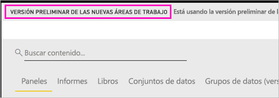
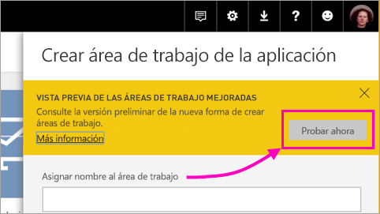
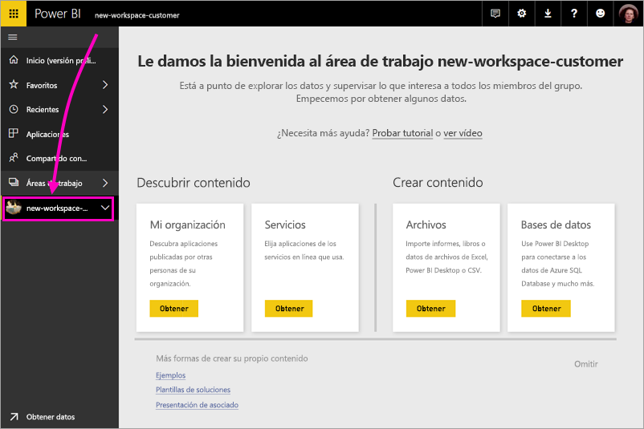
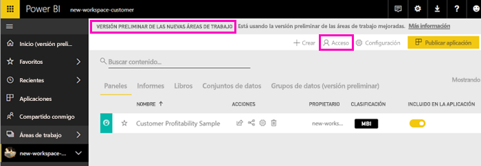
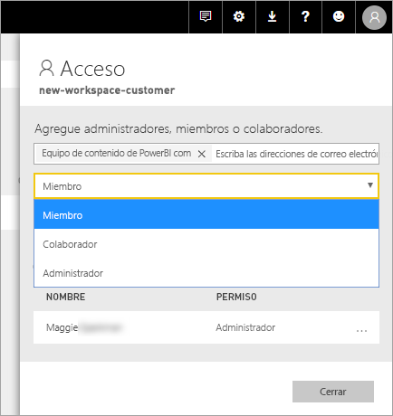
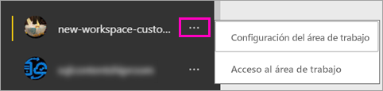

# Crear nuevas áreas de trabajo (versión preliminar) en Power BI

Power BI presentará una nueva experiencia de áreas de trabajo como versión preliminar. Las áreas de trabajo siguen siendo lugares donde colaborar con compañeros para crear colecciones de paneles e informes, que se pueden agrupar en *aplicaciones* y distribuir a toda la organización o a grupos o usuarios específicos. 

Ahora, con la versión preliminar de las nuevas áreas de trabajo puede:

- Asignar roles de área de trabajo a grupos de usuarios: grupos de seguridad, listas de distribución, grupos de Office 365 y usuarios.
- Crear un área de trabajo en Power BI sin crear un grupo de Office 365.
- Usar roles de las áreas de trabajo más granulares para flexibilizar la administración de permisos en un área de trabajo.
 
Cuando crea una de las nuevas áreas de trabajo, no crea un grupo de Office 365 subyacente, asociado. Toda la administración del área de trabajo se realiza en Power BI, no en Office 365. Aún podrá agregar un grupo de Office 365 al área de trabajo para seguir administrando el acceso de usuarios al contenido a través de grupos de Office 365. Pero también puede usar grupos de seguridad, listas de distribución y agregar usuarios directamente en Power BI, lo que le ofrece una manera flexible de administrar el acceso al área de trabajo. Como la administración del área de trabajo está ahora en Power BI, los administradores de Power BI deciden qué usuarios de una organización pueden crear áreas de trabajo. Consulte la [sección Configuración del área de trabajo del artículo Portal de administración de Power BI](service-admin-portal.md#workspace-settings) para más información. 

Agrega usuarios o grupos de usuarios a las nuevas áreas de trabajo como miembros, colaboradores o administradores. Todos los miembros de un grupo de usuarios obtienen el rol que haya definido. Si un usuario está en varios grupos de usuarios, obtiene el nivel de permiso mayor proporcionado por el rol.  Consulte [Roles en las nuevas áreas de trabajo](#roles-in-the-new-workspaces), más adelante en este artículo, para obtener una explicación de los distintos roles.

Todos los usuarios que agregue a un área de trabajo de la aplicación necesita una licencia de Power BI Pro. En el área de trabajo, los usuarios pueden colaborar en paneles e informes que planee publicar para un público más amplio, o incluso para toda la organización. Si quiere distribuir contenido a otros usuarios dentro de la organización, puede asignar licencias de Power BI Pro a los usuarios o colocar el área de trabajo en una capacidad de Power BI Premium.

Con las nuevas áreas de trabajo, se están rediseñando algunas características. Vea [Características del área de trabajo de la aplicación que funcionan de manera diferente](#app-workspace-features-that-work-differently) más adelante en este artículo para obtener una explicación de los cambios que puede esperar que se mantengan junto con la versión preliminar. Dado que esta es una característica de versión preliminar, hay algunas limitaciones que debe tener en cuenta. Vea [Problemas conocidos](#known-issues) más adelante en este artículo para obtener una explicación de las limitaciones actuales. 

## Implementar nuevas áreas de trabajo de la aplicación

Durante este período de versión preliminar, las áreas de trabajo antiguas y nuevas pueden coexistir en paralelo y puede crear cualquiera de ellas. Cuando finalice la versión preliminar de las nuevas áreas de trabajo y estén disponibles con carácter general, las áreas de trabajo antiguas pueden seguir existiendo durante un tiempo. No podrá crearlas y deberá preparar la migración de las áreas de trabajo a la nueva infraestructura de áreas de trabajo. No se preocupe, tendrá varios meses para completar la migración.

## Creación de una de las nuevas áreas de trabajo de la aplicación

1. Comience por crear el área de trabajo de la aplicación. Seleccione **Áreas de trabajo** > **Crear área de trabajo de la aplicación**.
   
     

2. En **Vista previa de las áreas de trabajo mejoradas**, seleccione **Probar ahora**.
   
     

2. Asigne un nombre al área de trabajo. Si el nombre no está disponible, puede editarlo para tener un identificador único.
   
     La aplicación tendrá el mismo nombre que el área de trabajo.
   
1. Si quiere, agregue una imagen. El tamaño del archivo debe ser inferior a 45 KB.
 
    

1. Seleccione **Guardar**.

    Aquí, en la pantalla de **bienvenida** del área de trabajo nueva, puede agregar datos. 

    

1. Por ejemplo, seleccione **Ejemplos** > **Ejemplo de rentabilidad del cliente**.

    Ahora, en la lista de contenido del área de trabajo, verá **Versión preliminar de las nuevas áreas de trabajo**. Dado que es un administrador, también verá una nueva acción, **Acceso**.

    

1. Seleccione **Acceso**.

1. Agregue grupos de seguridad, listas de distribución, grupos de Office 365 o usuarios a estas áreas de trabajo como miembros, colaboradores o administradores. Consulte [Roles en las nuevas áreas de trabajo](#roles-in-the-new-workspaces), más adelante en este artículo, para obtener una explicación de los distintos roles.

    

9. Seleccione **Agregar** > **Cerrar**.

1. Power BI crea el área de trabajo y la abre. Aparece en la lista de áreas de trabajo de las que es miembro. Dado que es un administrador, puede seleccionar los puntos suspensivos (...) para volver atrás y realizar cambios en la configuración del área de trabajo, agregar nuevos miembros o cambiar sus permisos.

     

## Agregar contenido al área de trabajo de la aplicación

Después de crear un área de trabajo de la aplicación con el estilo nuevo, es el momento de agregarle contenido. Agregar contenido es similar en las áreas de trabajo de estilo nuevo y antiguo, con una excepción. Mientras está en cualquier área de trabajo de la aplicación, puede cargar archivos o conectarse a archivos, como haría en Mi área de trabajo. En las áreas de trabajo nuevas, no se puede conectar a paquetes de contenido de la organización ni a paquetes de contenido de terceros, como Microsoft Dynamics CRM, Salesforce o Google Analytics. En las áreas de trabajo actuales puede conectarse a paquetes de contenido.

Al ver el contenido en una lista de contenido de un área de trabajo de la aplicación, el nombre del área de trabajo de la aplicación se muestra como el propietario.

### Conectarse a servicios de terceros en nuevas áreas de trabajo (versión preliminar)

En la nueva experiencia de áreas de trabajo, se está llevando a cabo un cambio para centrarse en las aplicaciones. Las aplicaciones para servicios de terceros facilitan a los usuarios la obtención de datos de los servicios que usan, como Microsoft Dynamics CRM, Salesforce o Google Analytics.
Las aplicaciones de la organización ofrecen a los usuarios los datos internos que necesitan. Tenemos previsto agregar capacidades a las aplicaciones de la organización para que los usuarios puedan personalizar el contenido que encuentran dentro de las aplicaciones. Con ello se eliminará la necesidad de paquetes de contenido. 

Con la versión preliminar de las nuevas áreas de trabajo, no se pueden crear ni usar paquetes de contenido de la organización. En su lugar, puede usar las aplicaciones proporcionadas para conectarse a servicios de terceros, o pida a los equipos internos que proporcionen aplicaciones para cualquier paquete de contenido que usen actualmente. 

## Roles en las nuevas áreas de trabajo

Los roles le permiten administrar quién puede hacer qué en un área de trabajo, para que los equipos puedan colaborar. Las nuevas áreas de trabajo le permiten asignar roles a usuarios y grupos de usuarios: grupos de seguridad, grupos de Office 365 y listas de distribución. 

Al asignar roles a un grupo de usuarios, cada uno de ellos tiene acceso al contenido. Si anida grupos de usuarios, todos los usuarios contenidos tienen permiso. Un usuario que se encuentra en varios grupos de usuarios con distintos roles obtiene el nivel de permiso mayor concedido a ellos. 

Las nuevas áreas de trabajo ofrecen tres roles: administradores, miembros y colaboradores.

**Los administradores pueden:**

- Actualizar y eliminar el área de trabajo. 
- Agregar o quitar usuarios, incluidos otros administradores.
- Hacer lo mismo que los miembros.

**Los miembros pueden:** 

- Agregar miembros u otros usuarios con permisos inferiores.
- Publicar y actualizar una aplicación.
- Compartir un elemento o compartir una aplicación.
- Permitir que otros usuarios vuelvan a compartir elementos.
- Hacer lo mismo que los colaboradores.

**Los colaboradores pueden:** 

- Crear, editar y eliminar contenido en el área de trabajo. 
- Publicar informes en el área de trabajo, eliminar contenido.
- No pueden proporcionar acceso al contenido a nuevos usuarios; no pueden compartir contenido nuevo, pero pueden compartir con alguien con quien el área de trabajo, el elemento o la aplicación ya está compartido. 
- No pueden modificar a los miembros del grupo.
 
Se están creando flujos de trabajo de solicitud de acceso en todo el servicio para que los usuarios que no tienen acceso puedan solicitarlo. Los flujos de trabajo de solicitud de acceso existen actualmente para los paneles, informes y aplicaciones.

## Distribución de una aplicación

Si el contenido está listo, elija en qué paneles e informes quiere publicarlo y publíquelo como una *aplicación*. Puede crear una aplicación desde cada área de trabajo. Los compañeros de trabajo pueden obtener la aplicación de varias maneras diferentes. Si el administrador de Power BI le concede permiso, puede instalarla automáticamente en las cuentas de Power BI de los compañeros de trabajo. De lo contrario, pueden buscar e instalar la aplicación desde Microsoft AppSource, o bien puede enviarles un vínculo directo. Obtienen las actualizaciones automáticamente y se puede controlar la frecuencia con la que se actualizan los datos. Vea [Publicar aplicaciones con los paneles e informes de Power BI](consumer/end-user-create-apps.md) para obtener más detalles.

## Convertir las áreas de trabajo de la aplicación antiguas en nuevas áreas de trabajo de la aplicación

Durante el período de versión preliminar, no se puede convertir automáticamente las áreas de trabajo de aplicación antiguas en nuevas. Pero puede crear un área de trabajo de la aplicación nueva y publicar contenido en la nueva ubicación. 

Cuando las nuevas áreas de trabajo estén disponibles con carácter general, puede decidir migrar automáticamente las antiguas. Tendrá que migrarlas en algún momento después de que estén disponibles con carácter general.

## Preguntas más frecuentes sobre las aplicaciones de Power BI

### ¿En qué se diferencian las áreas de trabajo de la aplicación nuevas y las áreas de trabajo actuales?
* Al crear áreas de trabajo de la aplicación no se crearán las entidades correspondientes en Office 365 como ocurre en las áreas de trabajo actuales. (Pero puede agregar un grupo de Office 365 al área de trabajo si le asigna un rol). 
* En las áreas de trabajo actuales solo puede agregar usuarios individuales a las listas de miembros y administradores. En las áreas de trabajo de la aplicación nuevas, puede agregar varios grupos de seguridad de AD, listas de distribución o grupos de Office 365 a estas listas para permitir que se facilite la administración de usuarios. 
- Puede crear un paquete de contenido de la organización desde un área de trabajo de la aplicación actual. No puede crear uno desde las áreas de trabajo de la aplicación nuevas.
- Puede usar un paquete de contenido de la organización desde un área de trabajo de la aplicación actual. No puede usar uno desde las áreas de trabajo de la aplicación nuevas.
- Durante la versión preliminar, algunas funcionalidades todavía no están habilitadas para las nuevas áreas de trabajo de la aplicación. Vea la sección siguiente, [Otras características planeadas de las nuevas áreas de trabajo de la aplicación](service-create-the-new-workspaces.md#other-planned-new-app-workspace-preview-features), para obtener más información.

## Características planeadas de versión preliminar de las nuevas áreas de trabajo de la aplicación

Todavía se están desarrollando algunas características de versión preliminar de las áreas de trabajo nuevas, pero aún no están disponibles hasta que se publique la versión preliminar:

- Ausencia del botón **Abandonar área de trabajo**.
- Aún no se admiten las métricas de uso.
- Cómo funciona Premium: puede asignar y crear áreas de trabajo en una capacidad Premium, pero para mover un área de trabajo entre las capacidades, vaya a configuración del área de trabajo.
- Aún no se admite la inserción de elementos web de SharePoint.
- Ausencia del botón **OneDrive** para grupos de Office 365 en Get Data > Files (Obtener datos > Archivos).

## Características del área de trabajo de la aplicación que funcionan de manera diferente

Algunas características funcionan de manera diferente en las áreas de trabajo de la aplicación actuales que en las áreas de trabajo de la aplicación nuevas. Estas diferencias son intencionadas, con base en los comentarios recibidos de los clientes, y permitirán un enfoque más flexible para la colaboración con las áreas de trabajo:

- Posibilidad de que los miembros puedan volver a compartir o no: se ha reemplazado por el rol de Colaborador
- Áreas de trabajo de solo lectura: en lugar de conceder a los usuarios acceso de solo lectura a un área de trabajo, asigne los usuarios a un rol inminente Visor, que permite un acceso similar al de solo lectura al contenido de un área de trabajo.

## Problemas conocidos

Se tiene conocimiento de los siguientes problemas y se están desarrollando sus correcciones:

- Es posible que los usuarios o grupos de usuarios con acceso gratuito que se agregan como destinatarios de las suscripciones a los correos electrónicos no reciban los correos electrónicos, aunque deberían. El problema se produce cuando el área de trabajo de la experiencia de las nuevas áreas de trabajo está en una capacidad Premium, pero el área de trabajo del usuario que crea la suscripción no se encuentra en una capacidad Premium. Si Mi área de trabajo está en una capacidad Premium, entonces los usuarios y grupos de usuarios con acceso gratuito recibirán los correos electrónicos.
- Después de mover un área de trabajo de una capacidad Premium a una capacidad compartida, en algunos casos, los usuarios y grupos de usuarios con acceso gratuito siguen recibiendo correos electrónicos, aunque no deberían. El problema se produce cuando Mi área de trabajo del usuario que crea la suscripción se encuentra en una capacidad Premium.

## Pasos siguientes

- [Crear las áreas de trabajo actuales](service-create-workspaces.md)
* [Instalar y usar aplicaciones en Power BI](consumer/end-user-apps.md)
* ¿Tiene alguna pregunta? [Pruebe a preguntar a la comunidad de Power BI](http://community.powerbi.com/)
