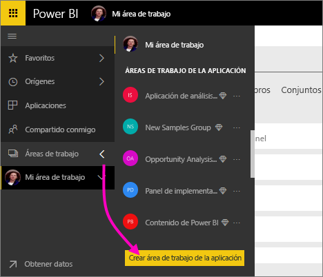
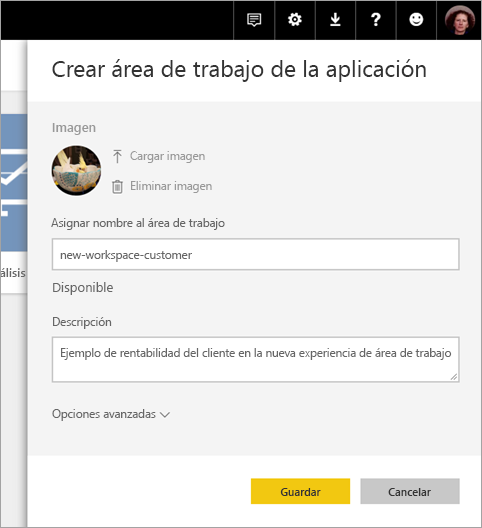
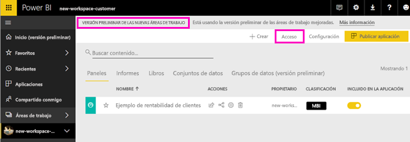
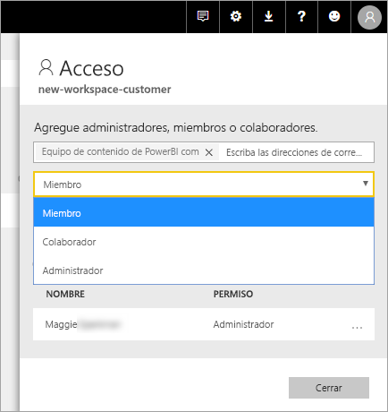
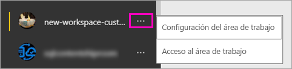

# Crear nuevas áreas de trabajo (versión preliminar) en Power BI

Power BI presentará una nueva experiencia de áreas de trabajo como versión preliminar. Las áreas de trabajo siguen siendo lugares donde colaborar con compañeros para crear colecciones de paneles e informes, que se pueden agrupar en *aplicaciones* y distribuir a toda la organización o a grupos o usuarios específicos. 

Ahora, con la versión preliminar de las nuevas áreas de trabajo puede hacer lo siguiente:

- Asignar roles de área de trabajo a grupos de usuarios: grupos de seguridad, listas de distribución, grupos de Office 365 y usuarios.
- Crear un área de trabajo en Power BI sin crear un grupo de Office 365.
- Usar roles de las áreas de trabajo más granulares para flexibilizar la administración de permisos en un área de trabajo.

Para más información, vea el artículo sobre las [nuevas áreas de trabajo (versión preliminar)](service-new-workspaces.md).

## Creación de una de las nuevas áreas de trabajo de la aplicación

1. Comience por crear el área de trabajo de la aplicación. Seleccione **Áreas de trabajo** > **Crear área de trabajo de la aplicación**.
   
     

2. En **Vista previa de las áreas de trabajo mejoradas**, seleccione **Probar ahora**.
   
     

2. Asigne un nombre al área de trabajo. Si el nombre no está disponible, puede editarlo para tener un identificador único.
   
     La aplicación tendrá el mismo nombre que el área de trabajo.
   
1. Si quiere, agregue una imagen. El tamaño del archivo debe ser inferior a 45 KB.
 
    

1. Seleccione **Guardar**.

    Aquí, en la pantalla de **bienvenida** del área de trabajo nueva, puede agregar datos. 

    

1. Por ejemplo, seleccione **Ejemplos** > **Ejemplo de rentabilidad del cliente**.

    Ahora, en la lista de contenido del área de trabajo, verá **Versión preliminar de las nuevas áreas de trabajo**. Dado que es un administrador, también verá una nueva acción, **Acceso**.

    

1. Seleccione **Acceso**.

1. Agregue grupos de seguridad, listas de distribución, grupos de Office 365 o usuarios a estas áreas de trabajo como miembros, colaboradores o administradores. Consulte [Roles en las nuevas áreas de trabajo](service-new-workspaces.md#roles-in-the-new-workspaces) para obtener una explicación de los distintos roles.

    

9. Seleccione **Agregar** > **Cerrar**.

1. Power BI crea el área de trabajo y la abre. Esta aparece en la lista de áreas de trabajo de las que es miembro. Dado que es un administrador, puede seleccionar los puntos suspensivos (...) para volver atrás y realizar cambios en la configuración del área de trabajo, agregar nuevos miembros o cambiar sus permisos.

     

## Agregar contenido al área de trabajo de la aplicación

Después de crear un área de trabajo de la aplicación con el estilo nuevo, es el momento de agregarle contenido. Agregar contenido es similar en las áreas de trabajo de estilo nuevo y antiguo, con una excepción. Mientras está en cualquier área de trabajo de la aplicación, puede cargar archivos o conectarse a archivos, como haría en Mi área de trabajo. En las áreas de trabajo nuevas, no se puede conectar a paquetes de contenido de la organización ni a paquetes de contenido de terceros, como Microsoft Dynamics CRM, Salesforce o Google Analytics. En las áreas de trabajo actuales, puede conectarse a paquetes de contenido.

Al ver el contenido en una lista de contenido de un área de trabajo de la aplicación, el nombre del área de trabajo de la aplicación se muestra como el propietario.

### Conectarse a servicios de terceros en nuevas áreas de trabajo (versión preliminar)

En la nueva experiencia de áreas de trabajo, estamos llevando a cabo un cambio para que esté centrada en las *aplicaciones*. Las aplicaciones para servicios de terceros facilitan a los usuarios la obtención de datos de los servicios que usan, como Microsoft Dynamics CRM, Salesforce o Google Analytics.
Las aplicaciones de la organización ofrecen a los usuarios los datos internos que necesitan. Tenemos previsto agregar capacidades a las aplicaciones de la organización para que los usuarios puedan personalizar el contenido que encuentran dentro de las aplicaciones. Gracias a esta capacidad, se acabará con la necesidad de disponer de paquetes de contenido. 

Con la versión preliminar de las nuevas áreas de trabajo, no se pueden crear ni usar paquetes de contenido de la organización. En su lugar, puede usar las aplicaciones proporcionadas para conectarse a servicios de terceros, o pida a los equipos internos que proporcionen aplicaciones para cualquier paquete de contenido que usen actualmente. 

## Distribución de una aplicación

Si el contenido está listo, elija en qué paneles e informes quiere publicarlo y publíquelo como una *aplicación*. Puede crear una aplicación desde cada área de trabajo. Los compañeros de trabajo pueden obtener la aplicación de varias maneras diferentes. Si el administrador de Power BI le concede permiso, puede instalarla automáticamente en las cuentas de Power BI de los compañeros de trabajo. De lo contrario, pueden buscar e instalar la aplicación desde Microsoft AppSource, o bien puede enviarles un vínculo directo. Obtienen las actualizaciones automáticamente y se puede controlar la frecuencia con la que se actualizan los datos. Vea [Publicar aplicaciones con los paneles e informes de Power BI](service-create-distribute-apps.md) para obtener más detalles.

## Convertir las áreas de trabajo de la aplicación antiguas en nuevas áreas de trabajo de la aplicación

Durante el período de versión preliminar, no se puede convertir automáticamente las áreas de trabajo de aplicación antiguas en nuevas. Pero puede crear un área de trabajo de la aplicación nueva y publicar contenido en la nueva ubicación. 

Cuando las nuevas áreas de trabajo estén disponibles con carácter general, puede decidir migrar automáticamente las antiguas. Tendrá que migrarlas en algún momento después de que estén disponibles con carácter general.

## Pasos siguientes
* Obtenga más información sobre cómo [organizar el trabajo en las nuevas áreas de trabajo (versión preliminar) en Power BI](service-new-workspaces.md)
* [Crear las áreas de trabajo actuales](service-create-workspaces.md)
* [Instalar y usar aplicaciones en Power BI](service-create-distribute-apps.md)
* ¿Tiene alguna pregunta? [Pruebe a preguntar a la comunidad de Power BI](http://community.powerbi.com/)
