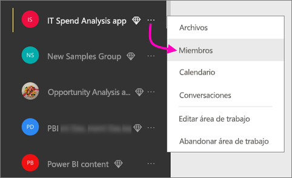
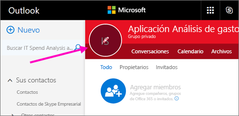
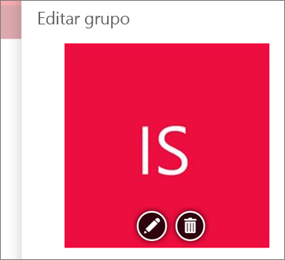
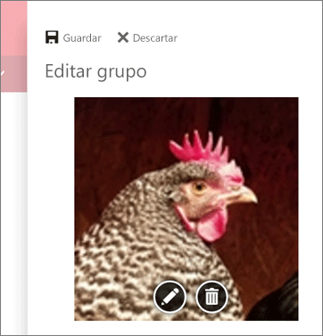
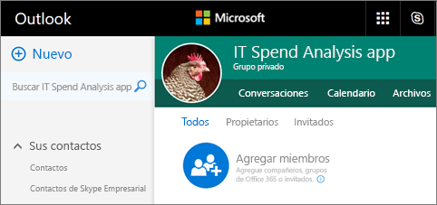

# Creación de áreas de trabajo clásicas en Power BI

En Power BI, puede crear *áreas de trabajo*, lugares donde colaborar con compañeros para crear y perfeccionar colecciones de paneles, informes e informes paginados. Después, puede agrupar la colección en *aplicaciones* que puede distribuir en toda la organización o a grupos o usuarios específicos. 

**¿Sabía qué?** Power BI ofrece una nueva experiencia de área de trabajo, que ahora es el valor predeterminado. Lea [Organización del trabajo en las nuevas áreas de trabajo en Power BI](service-new-workspaces.md) para obtener más información sobre las nuevas áreas de trabajo. 

Cuando crea un área de trabajo clásica, crea un grupo de Office 365 subyacente y asociado. Toda la administración del área de trabajo se realiza en Office 365. Puede agregar compañeros a estas áreas de trabajo como miembros o administradores. En el área de trabajo, es posible colaborar en paneles, informes y otros artículos que planee publicar para un público más amplio. Todos los usuarios que agregue a un área de trabajo de la aplicación necesita una licencia de Power BI Pro. 

## Vídeo: Aplicaciones y áreas de trabajo de aplicación
<iframe width="640" height="360" src="https://www.youtube.com/embed/Ey5pyrr7Lk8?showinfo=0" frameborder="0" allowfullscreen></iframe>

## Creación de un área de trabajo de la aplicación clásica basada en un grupo de Office 365

Cuando crea un área de trabajo de la aplicación, se crea en función de un grupo de Office 365.

[!INCLUDE [powerbi-service-create-app-workspace](./includes/powerbi-service-create-app-workspace.md)]

La primera vez que la cree puede que tenga que esperar una hora aproximadamente hasta que el área de trabajo se propague a Office 365. 

### Agregar una imagen a su área de trabajo de la aplicación de Office 365 (opcional)
De forma predeterminada, Power BI crea un pequeño círculo coloreado para la aplicación, con las iniciales de la aplicación. Pero tal vez desee personalizarlo con una imagen. Para agregar una imagen, necesita una licencia de Exchange Online.

1. Seleccione **Áreas de trabajo**, seleccione el botón de puntos suspensivos (...) junto al nombre del área de trabajo y, a continuación, seleccione **Miembros**. 
   
     
   
    La cuenta de Outlook de Office 365 del área de trabajo se abre en una nueva ventana del navegador.
2. Al situarse sobre el círculo coloreado en la parte superior izquierda, se convierte en un icono de lápiz. Selecciónela.
   
     
3. Vuelva a seleccionar el icono de lápiz y busque la imagen que desea utilizar.
   
     

     Las imágenes pueden ser archivos .png, .jpg o .bmp. Su tamaño de archivo puede ser grande, hasta 3 MB. 

4. Seleccione **Guardar**.
   
     
   
    La imagen reemplaza al círculo coloreado en la ventana de Outlook de Office 365. 
   
     
   
    En unos minutos, aparecerá también en la aplicación de Power BI.
   
     

## Agregar contenido al área de trabajo de la aplicación

Después de crear un área de trabajo de la aplicación, es el momento de agregarle contenido. Esto es igual que agregar contenido a Mi área de trabajo, excepto que las otras personas del área de trabajo pueden verlo y también trabajar con él. Una gran diferencia es que, cuando haya finalizado, podrá publicar el contenido como una aplicación. Al ver el contenido en una lista de contenido de un área de trabajo de la aplicación, el nombre del área de trabajo de la aplicación se muestra como el propietario.

### Conectarse a servicios de terceros en las áreas de trabajo de la aplicación

Las aplicaciones se proporcionan para todos los servicios de terceros compatibles con Power BI, lo que facilita la obtención de datos de los servicios que usa, como Microsoft Dynamics CRM, Salesforce o Google Analytics. Puede publicar aplicaciones de la organización para ofrecer a los usuarios los datos internos que necesitan.

En las áreas de trabajo actuales, también puede conectarse mediante paquetes de contenido de la organización y paquetes de contenido de terceros, como Microsoft Dynamics CRM, Salesforce o Google Analytics. Considere la posibilidad de migrar los paquetes de contenido de la organización a las aplicaciones.

## Distribución de una aplicación

Si quiere distribuir contenido oficial a un público amplio dentro de la organización, puede publicar una aplicación desde el área de trabajo.  Cuando el contenido esté listo, elija en qué paneles e informes quiere publicarlo y publíquelo como una *aplicación*. Puede crear una aplicación desde cada área de trabajo.

En la lista Aplicaciones del panel de navegación de la izquierda se muestran todas las aplicaciones que ha instalado. Los compañeros de trabajo pueden obtener la aplicación de varias maneras diferentes. 
- Pueden buscar e instalar la aplicación desde Microsoft AppSource.
- Les puede enviar un vínculo directo. 
- Si el administrador de Power BI le concede permiso, puede instalarla automáticamente en las cuentas de Power BI de los compañeros de trabajo. 

Los usuarios ven el contenido de la aplicación actualizado de forma automática después de publicar una actualización desde el área de trabajo. Puede controlar la frecuencia de actualización de los datos mediante la configuración de la programación de actualización en los conjuntos de datos que usa el contenido de la aplicación en el área de trabajo. Para más información, vea [Publicación de una aplicación desde las nuevas áreas de trabajo de Power BI](service-create-distribute-apps.md).

## Preguntas más frecuentes sobre las aplicaciones clásicas de Power BI

### ¿En qué se diferencian las aplicaciones de los paquetes de contenido organizativo?
Las aplicaciones son la evolución de los paquetes de contenido organizativos. Si ya tiene paquetes de contenido organizativos, estos seguirán funcionando en paralelo con las aplicaciones. Las aplicaciones y los paquetes de contenido tienen algunas diferencias importantes. 

* Después de que los usuarios empresariales instalan un paquete de contenido, este pierde su identidad agrupada: es solo una lista de paneles e informes que se combinan con otros paneles e informes. Por otro lado, las aplicaciones mantienen su agrupación e identidad incluso después de la instalación. Este agrupamiento facilita que los usuarios empresariales continúen yendo a ellas a lo largo del tiempo.
* Puede crear varios paquetes de contenido de cualquier área de trabajo, pero una aplicación tiene una relación de 1:1 con su área de trabajo. 
* Con el tiempo, tenemos previsto dejar de utilizar paquetes de contenido organizativos, por lo que recomendamos crear aplicaciones de ahora en adelante.  
* Con la versión preliminar de la experiencia de las nuevas áreas de trabajo, se están dando los primeros pasos para dejar en desuso los paquetes de contenido de la organización. No los puede usar ni crear en las áreas de trabajo de la versión preliminar.

Vea [¿En qué se diferencian las áreas de trabajo de la aplicación nuevas y las actuales?](service-new-workspaces.md#how-the-new-workspaces-are-different) para compararlas. 

## Pasos siguientes
* [Instalar y usar aplicaciones en Power BI](service-create-distribute-apps.md)
- [Crear nuevas áreas de trabajo (versión preliminar)](service-create-the-new-workspaces.md)
* ¿Tiene alguna pregunta? [Pruebe a preguntar a la comunidad de Power BI](http://community.powerbi.com/)
