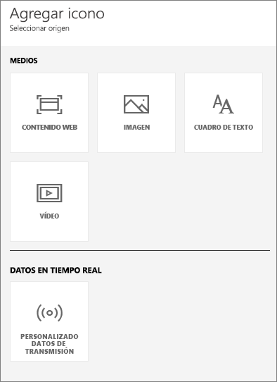
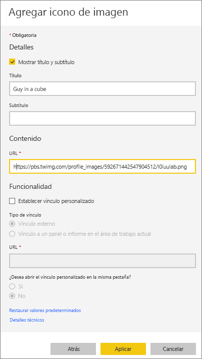
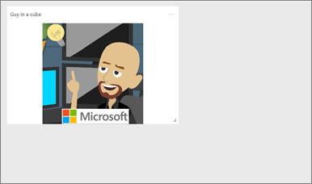
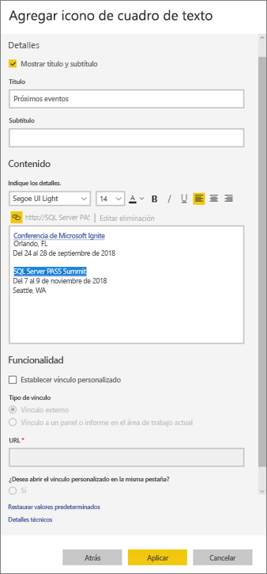
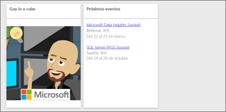
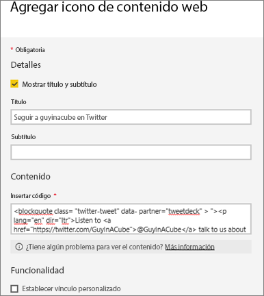
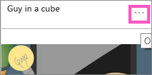

# <a name="add-images-videos-and-more-to-your-dashboard"></a>Adición de imágenes, vídeos y mucho más al panel

Al agregar un icono al panel, puede colocar una imagen, un cuadro de texto, un vídeo, datos de streaming o código web en el panel. 

Vea cómo Amanda agrega iconos a un panel.

   
<iframe width="560" height="315" src="https://www.youtube.com/embed/e2PD8m1Q0vU" frameborder="0" allowfullscreen></iframe>


## <a name="add-an-image-video-or-other-tile"></a>Adición de una imagen, un vídeo u otro icono
Puede agregar una imagen, un cuadro de texto, un vídeo, datos de transmisión o código web directamente al panel.

1. Seleccione **Agregar icono** en la barra de menús superior del panel. En función de las limitaciones de espacio, es posible que solo vea el signo más .
   
    
2. Seleccione el tipo de icono que desea agregar: 

    **[Contenido web](#add-web-content)**

    **[Imagen](#add-an-image)**

    **[Cuadro de texto](#add-a-text-box-or-dashboard-heading)**

    **[Vídeo](#add-a-video)**

    **[Datos de transmisión personalizados](#add-streaming-data)**
   
    

## <a name="add-an-image"></a>Agregar una imagen
Si quiere agregar el logotipo de su empresa u otra imagen al panel, guarde el archivo de imagen en línea y establezca un vínculo a él. Asegúrese de que no se necesitan credenciales de seguridad para acceder al archivo de imagen. Por ejemplo, ya que OneDrive y SharePoint requieren autenticación, las imágenes almacenadas allí no se pueden agregar a un panel de esta manera.  

1. En la ventana **Agregar icono**, seleccione **Imagen** > **Siguiente**.

2. En la ventana **Agregar icono de imagen**, agregue la información de la imagen:   
   
   a. Para mostrar un título sobre la imagen, seleccione **Mostrar el título y el subtítulo** y escriba un **título** y, si quiere, un **subtítulo**.

   b. Escriba la **URL** de la imagen.

   c. Para convertir el icono en un hipervínculo, seleccione **Establecer vínculo personalizado** y escriba la **URL**. 

      Cuando los compañeros hagan clic en la imagen o el título, se les dirigirá a esta URL.

   d. Seleccione **Aplicar**. 

      

3. En el panel, cambie el tamaño de la imagen y muévala según sea necesario.
     
     

## <a name="add-a-text-box-or-dashboard-heading"></a>Agregar un cuadro de texto o un encabezado de panel

Para agregar un encabezado de panel, escriba el encabezado en el cuadro de texto y aumente el tamaño de la fuente.

1. En la ventana **Agregar icono**, seleccione **Cuadro de texto** > **Siguiente**.

2. Dé formato al cuadro de texto:
   
   a. Para mostrar un título sobre el cuadro de texto, seleccione **Mostrar el título y el subtítulo** y escriba un **título** y, si quiere, un **subtítulo**.

   b. Especifique el **contenido** del cuadro de texto y aplíquele formato.  

   c. De manera opcional, establezca un vínculo personalizado para el título. Un vínculo personalizado puede ser un sitio externo o un panel o informe del área de trabajo. En cambio, en este ejemplo se han agregado hipervínculos en el texto del cuadro, por lo que debe dejar desactivada la opción **Establecer vínculo personalizado**.

   d. Seleccione **Aplicar**. 

     
   
3. En el panel, cambie el tamaño del cuadro de texto y muévalo según sea necesario.
   
   

## <a name="add-a-video"></a>Agregar un vídeo
Al agregar un icono de vídeo de YouTube o Vimeo al panel, el vídeo se reproduce en el panel.

1. En la ventana **Agregar icono**, seleccione **Vídeo** > **Siguiente**.
2. Agregue la información del vídeo en la ventana **Agregar icono de vídeo**:   
   
   a. Para mostrar un título y un subtítulo sobre el icono de vídeo, seleccione **Mostrar el título y el subtítulo** y escriba un **título** y, si quiere, un **subtítulo**. En este ejemplo, agregaremos un **subtítulo** y lo convertiremos en un hipervínculo a la lista de reproducción completa de YouTube.

   b. Escriba la **URL del vídeo**.

   c. Agregue un hipervínculo al **título** y al **subtítulo**, de modo que sus compañeros puedan ver la lista de reproducción completa en YouTube después de ver el vídeo insertado. Para ello, en **Funcionalidad**, seleccione **Establecer vínculo personalizado** y escriba la **URL** de la lista de reproducción.

   d. Seleccione **Aplicar**.  

   

3. En el panel, cambie el tamaño del vídeo y muévalo según sea necesario.
     
   
4. Seleccione el icono de vídeo para reproducir el vídeo.
5. Seleccione el subtítulo para visitar la lista de reproducción en YouTube.

## <a name="add-streaming-data"></a>Agregar datos de transmisión
Puede usar PubNub para agregar datos de streaming, como fuentes de Twitter o datos de sensores, a un icono en el panel. Power BI ha creado una integración para obtener los datos de PubNub. Aquí se explica cómo funciona.
   

<iframe width="560" height="315" src="https://www.youtube.com/embed/kOuINwgkEkQ" frameborder="0" allowfullscreen></iframe>

1. En la ventana **Agregar icono**, seleccione **Datos de transmisión personalizados** > **Siguiente**.
2. Seleccione **Agregar conjunto de datos de streaming**.
3. Cree un **Nuevo conjunto de datos de transmisión** con la API de Power BI o PubNub.
4. Rellene los campos correspondientes a **Nombre del conjunto de datos**, **Clave de suscripción** y **Nombre del canal**. Si se trata de una conexión segura, también tiene una clave de autorización. Puede usar los valores de ejemplo de PubNub para probarlo.
5. Seleccione **Siguiente**.
    Verá los campos que están disponibles en el conjunto de datos, con sus tipos de datos y formato JSON.
6. Seleccione **Conectar**.
    Ha creado un conjunto de datos de streaming.
7. Vuelva al panel y seleccione de nuevo **Agregar icono** > **Datos de transmisión personalizados** > **Siguiente**.
8. Seleccione el conjunto de datos de sensor que ha creado > **Siguiente**.
9. Seleccione el tipo de objeto visual que quiera. A menudo, un gráfico de líneas funciona bien con estos datos.
10. Seleccione el **eje**, la **leyenda** y los **valores**.
11. Decida el período de tiempo que quiera mostrar, ya sea en segundos, minutos u horas.
12. Seleccione **Siguiente**.
13. Si quiere, asígnele un **título** y un **subtítulo**.
14. Ánclelo al panel.


1. En la ventana **Agregar icono**, seleccione **Datos de transmisión personalizados** > **Siguiente**.

2. Seleccione **Agregar conjunto de datos de streaming**.

3. Cree un **Nuevo conjunto de datos de transmisión** con la API de Power BI o PubNub.

4. Rellene los campos correspondientes a **Nombre del conjunto de datos**, **Clave de suscripción** y **Nombre del canal**. Si se trata de una conexión segura, también tiene una clave de autorización. Puede usar los valores de ejemplo de PubNub para probarlo.

5. Seleccione **Siguiente**.

   Verá los campos que están disponibles en el conjunto de datos, con sus tipos de datos y formato JSON.

6. Seleccione **Conectar**.

   Ha creado un conjunto de datos de streaming.

7. Vuelva al panel y seleccione de nuevo **Agregar icono** > **Datos de transmisión personalizados** > **Siguiente**.

8. Seleccione el conjunto de datos de sensor que ha creado > **Siguiente**.

9. Seleccione el tipo de objeto visual que quiera. A menudo, un gráfico de líneas funciona bien con estos datos.

10. Seleccione el **eje**, la **leyenda** y los **valores**.

11. Decida el período de tiempo que quiera mostrar, ya sea en segundos, minutos u horas.

12. Seleccione **Siguiente**.

13. Si quiere, asígnele un **título** y un **subtítulo**.

14. Ánclelo al panel.

## <a name="add-web-content"></a>Agregar contenido web
Puede pegar o escribir cualquier contenido HTML, como un icono, en el informe o el panel. Escriba el código para insertar manualmente o cópielo y péguelo desde sitios como Twitter, YouTube, embed.ly, etc.

1. En la ventana **Agregar icono**, seleccione **Contenido web** > **Siguiente**.

2. Agregue información a la ventana **Agregar icono de contenido web**:
   
   a. Para mostrar un título sobre el icono, seleccione **Mostrar el título y el subtítulo** y escriba un **título** y, si quiere, un **subtítulo**.

   b. Escriba el código para insertar. En este ejemplo, vamos a copiar y pegar una fuente de Twitter.

   c. Seleccione **Aplicar**.

   
   

3. En el panel, cambie el tamaño del icono de contenido web y muévalo según sea necesario.
     
   

### <a name="tips-for-embedding-web-content"></a>Sugerencias para insertar contenido web
* Para iframes, use un origen seguro. Si escribe el código para insertar del iframe y obtiene un icono en blanco, compruebe que no esté usando *http* para el origen del iframe. Si lo está usando, cámbielo por *https*.
  
  ```html
  <iframe src="https://xyz.com">
  ```
* Edite la información de ancho y alto. El código para insertar inserta un vídeo y establece el reproductor de vídeo en 560 × 315 píxeles. Este tamaño no cambia al modificar el tamaño del icono.
  
  ```html
  <iframe width="560" height="315"
  src="https://www.youtube.com/embed/Cle_rKBpZ28" frameborder="0"
   allowfullscreen></iframe>
  ```
  
  Si quiere que el reproductor cambie de tamaño para ajustarse al tamaño del icono, establezca el ancho y el alto en el 100 %.
  
  ```html
  <iframe width="100%" height="100%"
  src="https://www.youtube.com/embed/Cle_rKBpZ28" frameborder="0"
   allowfullscreen></iframe>
  ```
* Este código inserta un tweet y conserva, como vínculos independientes en el panel, los vínculos del podcast de AFK, la página de Twitter de \@GuyInACube, Seguir, #analytics, responder, retwittear y me gusta.  Al seleccionar el icono, se abrirá el podcast en Twitter.
  
  ```html
  <blockquote class="twitter-tweet" data-partner="tweetdeck">
  <p lang="en" dir="ltr">Listen to
  <a href="https://twitter.com/GuyInACube">@GuyInACube</a> talk to
  us about making videos about Microsoft Business Intelligence
  platform
  <a href="https://t.co/TmRgalz7tv">https://t.co/TmRgalz7tv </a>
  <a href="https://twitter.com/hashtag/analytics?src=hash">
  #analytics</a></p>&mdash; AFTK Podcast (@aftkpodcast) <a
  href="https://twitter.com/aftkpodcast/status/693465456531771392">
  January 30, 2016</a></blockquote> <script async src="//platform.twitter.com/widgets.js" charset="utf-8"></script>
  ```

## <a name="edit-a-tile"></a>Editar un icono
Para realizar cambios en un icono existente:

1. Mueva el puntero sobre la esquina superior derecha del icono y seleccione **Más opciones** (...).
   
    
2. Seleccione **Editar detalles** para mostrar la ventana **Detalles del icono** y realizar cambios.
   
    

## <a name="considerations-and-troubleshooting"></a>Consideraciones y solución de problemas
* Para que le resulte más fácil mover el icono en el panel, agregue un título y, si quiere, un subtítulo.
* Si quiere insertar contenido de un sitio web, pero este no proporciona código para insertar que se pueda copiar y pegar, vaya a embed.ly para generar el código para insertar más fácilmente.

## <a name="next-steps"></a>Pasos siguientes
[Introducción a los iconos del panel para los diseñadores de Power BI](service-dashboard-tiles.md)

¿Tiene más preguntas? [Pruebe la comunidad de Power BI](https://community.powerbi.com/).

