# Creación de un panel de Power BI desde un informe
Ha leído [Introduction to dashboards in Power BI](service-dashboards.md) (Introducción a los paneles de Power BI) y ahora quiere crear los suyos propios. Existen diferentes formas de crear un panel. Por ejemplo, puede crear un panel a partir de un informe, desde cero, a partir de un conjunto de datos o mediante la duplicación de un panel existente.  

Para empezar, crearemos un panel rápido y sencillo que ancle visualizaciones a partir de un informe que ya se ha creado. 

Una vez completado este artículo, comprenderá bien:
- La relación entre los paneles y los informes
- Cómo abrir la vista de edición en el editor de informes
- Cómo anclar iconos 
- Cómo desplazarse entre un panel y un informe 
 
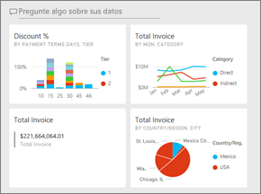

> [!NOTE] 
> Los paneles son una característica del servicio Power BI y no de Power BI Desktop. Aunque no puede crear paneles en las aplicaciones móviles de Power BI, puede [verlas y compartirlas](consumer/mobile/mobile-apps-view-dashboard.md) desde allí.
>
> 

## Vídeo: Creación de un panel con objetos visuales e imágenes anclados desde un informe
Vea cómo crea Amanda un nuevo panel anclando visualizaciones de un informe. A continuación, siga los pasos de la sección siguiente, [Importación de un conjunto de datos con un informe](#import-a-dataset-with-a-report), para intentarlo por sí mismo con el ejemplo de análisis de adquisiciones.
    

<iframe width="560" height="315" src="https://www.youtube.com/embed/lJKgWnvl6bQ" frameborder="0" allowfullscreen></iframe>

## Importación de un conjunto de datos con un informe
En este tutorial desglosado, vamos a importar uno de los conjuntos de datos de ejemplo de Power BI y usarlo para crear el nuevo panel. El ejemplo que usamos es un libro de Excel con dos hojas de PowerView. Cuando Power BI importa el libro, agrega un conjunto de datos y un informe al área de trabajo. El informe se crea automáticamente a partir de las hojas de PowerView.

1. Descargue el archivo de Excel del [ejemplo de análisis de adquisiciones](http://go.microsoft.com/fwlink/?LinkId=529784). Se recomienda guardarlo en OneDrive para la Empresa.
2. Abra el servicio Power BI en el explorador (app.powerbi.com).
3. En el panel de navegación izquierdo, seleccione **Mi área de trabajo** y, a continuación, **Obtener datos**.

    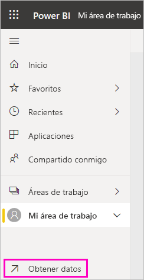
5. En **Archivos**, seleccione **Obtener**.

   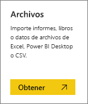
6. Navegue hasta la ubicación donde guardó el archivo de Excel del ejemplo de análisis de adquisiciones. Selecciónelo y elija **Conectar**.

   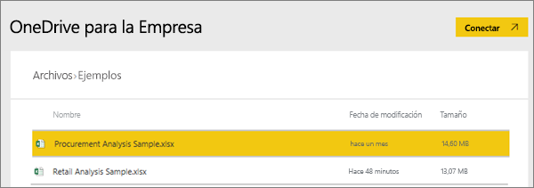
7. Para este ejercicio, seleccione **Importar**.

    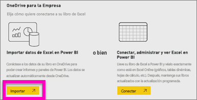
8. Cuando aparezca el mensaje de operación correcta, seleccione la **x** para descartarlo.

   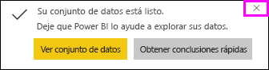

> [!TIP]
> ¿Sabía esto? Puede hacer más pequeña la barra de navegación izquierda: basta con seleccionar el icono con tres líneas de la parte superior . Esto le brinda más espacio para el propio informe.

### Abra el informe y ancle algunos iconos en un panel
1. En la misma área de trabajo, seleccione la pestaña **Informes** y, a continuación, seleccione **Ejemplo de análisis de adquisiciones** para abrir el informe.

    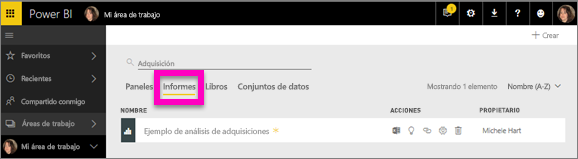 El informe se abre en la Vista de lectura. Fíjese en que tiene dos pestañas a la izquierda: **Análisis de descuento** e **Información general de gasto**. Cada pestaña representa una página del informe.

2. Seleccione **Más opciones (...)**  > **Editar informe** para abrir el informe en la Vista de edición.

    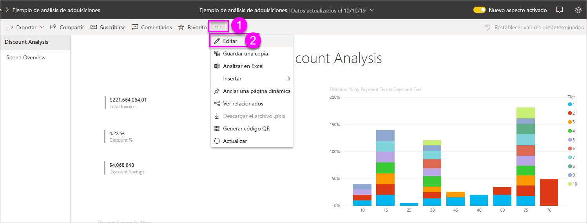
3. Mantenga el mouse sobre una visualización para mostrar las opciones disponibles. Para agregar una visualización a un panel, seleccione el icono de anclaje .

    
4. Puesto que estamos creando un nuevo panel, seleccione la opción de **Nuevo panel** y asígnele un nombre.

    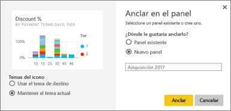
5. Al seleccionar **Anclar**, Power BI crea el nuevo panel en el área de trabajo actual. Cuando aparezca el mensaje **Anclado al panel**, seleccione **Ir al panel**. Si se le pide que guarde el informe, elija **Guardar**.

    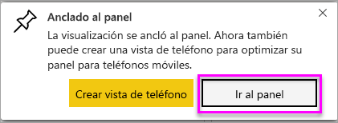

    Power BI abre el nuevo panel. Tiene un icono: la visualización que acaba de anclar.

   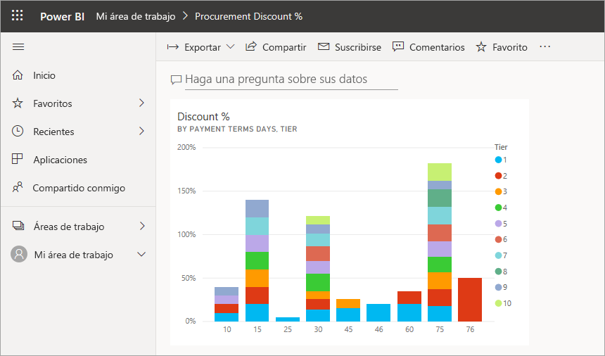
7. Seleccione el icono para volver al informe. Ancle algunos iconos más en el nuevo panel. Cuando se muestra la ventana **Anclar en el panel**, seleccione **Panel existente**.  

   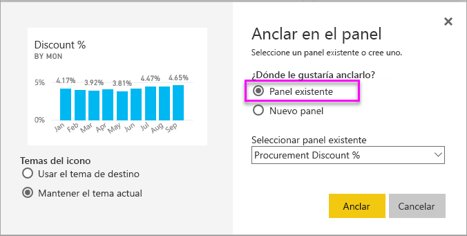

## Anclado de una página de informe completa al panel
En lugar de anclado un objeto visual a la vez, puede [anclar una página de informe completo como un *icono dinámico*](service-dashboard-pin-live-tile-from-report.md). Hagámoslo.

1. En el editor de informes, seleccione la pestaña **Spend Overview** (Información general del gasto) para abrir la segunda página del informe.

   

2. Queremos tener todos los objetos visuales del informe en el panel. En la esquina superior derecha de la barra de menús, seleccione **Página Anclar elemento activo**. En el panel, los iconos de la página activa se actualizan cada vez que se actualice la página.

   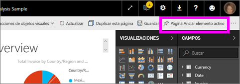

3. Cuando aparezca la ventana **Anclar en el panel**, seleccione **Panel existente**.

   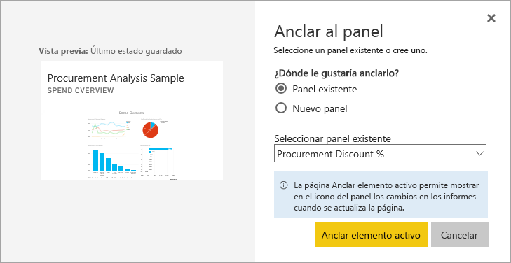

4. Cuando aparezca el mensaje de operación correcta, seleccione **Ir al panel**. Allí verá los iconos que ha anclado en el informe. En el ejemplo siguiente, hemos anclado dos iconos de la página uno del informe y un icono dinámico, que es la segunda página del informe.

   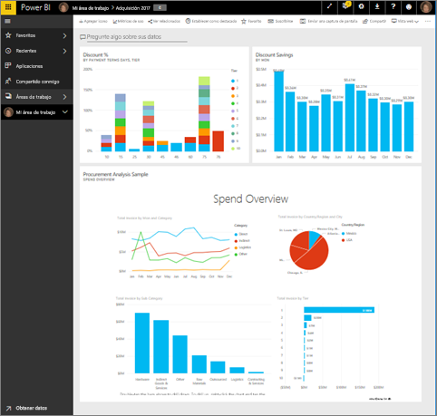

## Pasos siguientes
Enhorabuena por crear su primer panel. Ahora que tiene un panel, puede hacer mucho más con él. Siga uno de los siguientes artículos sugeridos o empiece a explorar por su cuenta: 

* [Mover un icono y cambiar su tamaño](service-dashboard-edit-tile.md)
* [Todo acerca de los iconos de paneles](service-dashboard-tiles.md)
* [Comparta el panel mediante la creación de una aplicación](service-create-workspaces.md)
* [Power BI: Conceptos básicos](service-basic-concepts.md)
* [Sugerencias para diseñar un panel de Power BI fantástico](service-dashboards-design-tips.md)

¿Tiene más preguntas? [Pruebe la comunidad de Power BI](http://community.powerbi.com/).
