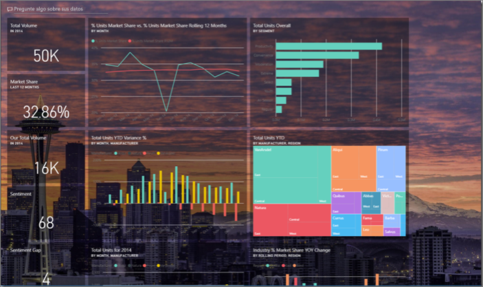
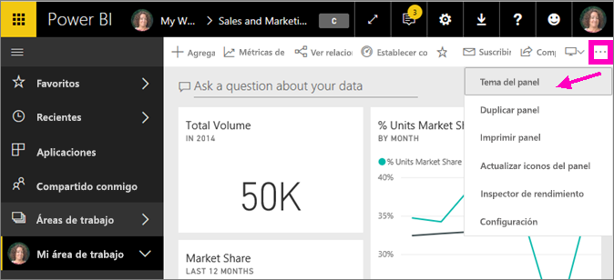
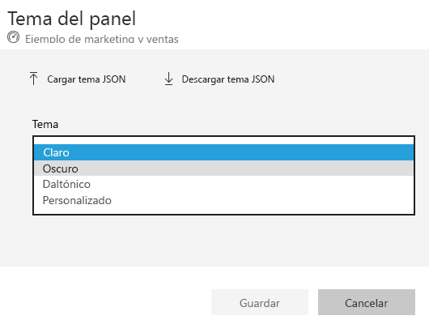
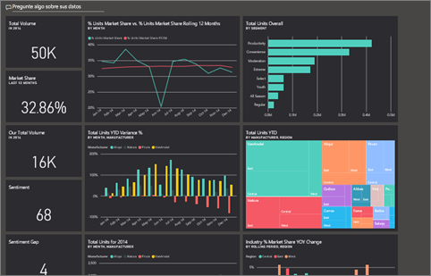
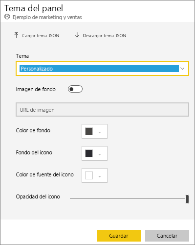
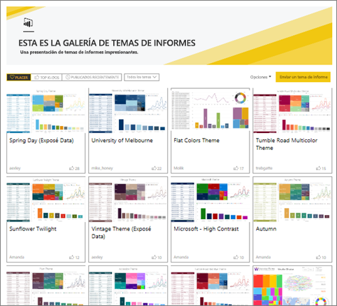
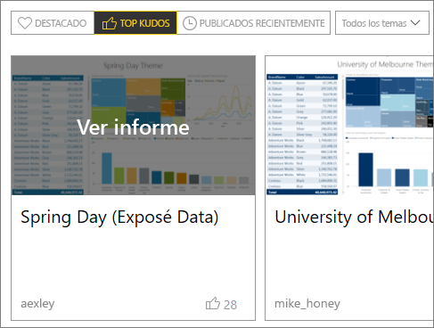
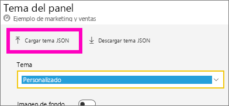
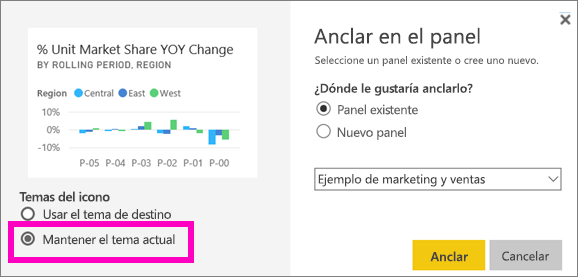
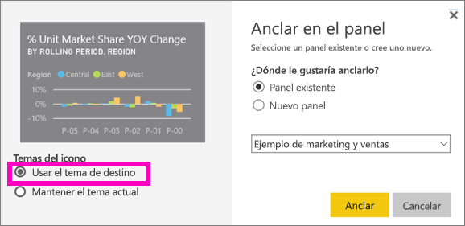

# Usar temas de panel en el servicio Power BI
Con los **temas de panel** se puede aplicar un tema de color a todo un panel, como por ejemplo, colores corporativos, colores de temporada o cualquier otro tema de color que quiera aplicar. Al aplicar un **tema de panel**, todos los objetos visuales del panel usan los colores del tema seleccionado (hay algunas excepciones que se describen más adelante en este artículo).

Si cambia los colores de los objetos visuales en el panel no afectará a los objetos visuales del informe. Además, al anclar iconos desde un informe que ya tiene un [tema de panel aplicado](desktop-report-themes.md), tendrá la opción de conservar el tema actual o usar el tema de panel.

## Requisitos previos
* Para continuar, abra el [panel de ejemplo de Ventas y Marketing](sample-datasets.md).

## Cómo funcionan los temas de panel
Para empezar, abra un panel que haya creado (o para el que tenga permiso de edición) y que quiera personalizar. Seleccione los puntos suspensivos (...) y elija **Tema del panel**. 

En el panel que aparece, seleccione uno de los temas prediseñados.  En el ejemplo de abajo, hemos seleccionado **Oscuro**.

## Crear un tema personalizado

El tema predeterminado para los paneles de Power BI es **Claro**. Si quiere personalizar los colores o crear su propio tema, seleccione **Personalizar** en la lista desplegable. 

Use las opciones personalizadas para crear su propio tema de panel. Si agrega una imagen de fondo, se recomienda que la imagen tenga una resolución mínima de 1920 x 1080. Para usar una imagen como fondo, cargue la imagen en un sitio web público, copie la dirección URL y péguela en el campo **Dirección URL de imagen**. 

### Uso de temas JSON
Otra manera de crear un tema personalizado consiste en cargar un archivo JSON que tenga la configuración para todos los colores que le gustaría usar para el panel. En Power BI Desktop, los creadores de informes usan archivos JSON para [crear temas para informes](desktop-report-themes.md). Se pueden cargar estos mismos archivos JSON para paneles o puede buscar y cargar archivos JSON en la [página de la Galería de temas](https://community.powerbi.com/t5/Themes-Gallery/bd-p/ThemesGallery) de la Comunidad de Power BI. 

Puede guardar su tema personalizado como un archivo JSON y, después, compartirlo con otros creadores de paneles. 

### Usar un tema de la Galería de temas

Al igual que las opciones integradas y personalizadas, cuando se carga el tema, los colores se aplican automáticamente a todos los iconos del panel. 

1. Mantenga el mouse sobre un tema y elija **Ver informe**.

    

2. Desplácese hacia abajo y busque el vínculo al archivo JSON.  Seleccione el icono de descarga y guarde el archivo.

    

3. De vuelta en el servicio Power BI, en la ventana del tema Panel personalizado, seleccione **Cargar tema JSON**.

    

4. Vaya a la ubicación donde guardó el archivo de tema JSON y seleccione **Abrir**.

5. En la página Tema del panel, seleccione **Guardar**. El nuevo tema se aplica a su panel.

    

## Consideraciones y limitaciones

* Si el informe usa un tema diferente del tema de panel, puede controlar si el objeto visual debe conservar el tema actual, o si debe usar el tema de panel para mantener una coherencia entre los objetos visuales de orígenes diferentes. Al anclar un icono a un panel, para mantener el tema del informe seleccione **Mantener el tema actual**. El objeto visual, en el panel, conservará el tema del informe, incluida la configuración de transparencia. 

    La única vez que verá las opciones **Temas del icono** será si crea el informe en Power BI Desktop, [agrega un tema del informe](desktop-report-themes.md) y luego publica el informe en el servicio Power BI. 

    

    Intente volver a anclar el icono y seleccione **Use dashboard theme** (Usar tema del panel).

    

* Los temas de panel no se pueden aplicar a páginas de informes activos, iconos de iframe, iconos de SSRS, iconos de libro o imágenes cuando están anclados.
* Los temas de panel pueden visualizarse en dispositivos móviles, pero un tema de panel solo se puede crear en el servicio Power BI. 
* Los temas de panel personalizados solo funcionan con iconos que se anclaron desde informes. 

