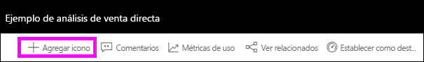
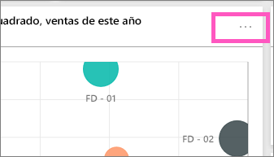
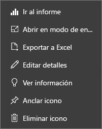

# Introducción a los iconos del panel para los diseñadores de Power BI

Un icono es una instantánea de sus datos, anclado en el panel. Un icono se puede crear desde un informe, un conjunto de datos, un panel, el cuadro de Preguntas y respuestas, Excel, informes de SQL Server Reporting Services (SSRS), etc.  Esta captura de pantalla muestra muchos iconos diferentes anclados a un panel.

Los paneles y los iconos de paneles son una característica del servicio Power BI y no de Power BI Desktop. No puede crear paneles en dispositivos móviles, pero puede [verlos y compartirlos](mobile-apps-view-dashboard.md) allí.

Además de anclarlos, puede crear iconos independientes directamente en el panel mediante [Agregar icono](service-dashboard-add-widget.md). Los iconos independientes incluyen: cuadros de texto, imágenes, vídeos, datos de transmisión y contenido web.

¿Necesita ayuda para comprender los bloques de creación que conforman Power BI?  Consulte [Power BI: conceptos básicos](service-basic-concepts.md).

> [!NOTE]
> Si la visualización original usada para crear el icono cambia, no se produce ningún cambio en el icono.  Por ejemplo, si ancló un gráfico de líneas desde un informe y luego cambió el gráfico de líneas a un gráfico de barras, el icono del panel seguirá mostrando un gráfico de líneas. Los datos se actualizan, pero no el tipo de visualización.
> 
> 

## Anclar un icono desde...
Existen muchas maneras diferentes de agregar (anclar) un icono al panel. Los iconos se pueden anclar desde:

* [Preguntas y respuestas de Power BI](service-dashboard-pin-tile-from-q-and-a.md)
* [Un informe](service-dashboard-pin-tile-from-report.md)
* [Otro panel](service-pin-tile-to-another-dashboard.md)
* [Un libro de Excel en OneDrive para la Empresa](service-dashboard-pin-tile-from-excel.md)
* [Power BI Publisher para Excel](publisher-for-excel.md)
* [Quick Insights (Información rápida)](service-insights.md)
* [Reporting Services](https://docs.microsoft.com/sql/reporting-services/pin-reporting-services-items-to-power-bi-dashboards)

Asimismo, los iconos independientes de imágenes, cuadros de texto, vídeos, datos de transmisión y contenido web se pueden crear directamente en el panel mediante [Agregar icono](service-dashboard-add-widget.md).

  

## Interactuar con los iconos en un panel
### Mover un icono y cambiar su tamaño
Capte un icono y [muévalo por el panel](service-dashboard-edit-tile.md). Mantenga el puntero sobre el controlador  y selecciónelo para cambiar el tamaño del icono.

### Mantener el puntero sobre un icono para cambiar la apariencia y comportamiento
1. Mantenga el puntero sobre el icono para que se muestren los puntos suspensivos.
   
    
2. Seleccione los puntos suspensivos (...) para abrir el menú de acciones del icono.
   
    
   
    Desde aquí, puede:
   
   * [Abrir el informe que se ha usado para crear este icono ](service-reports.md)   
   
   * [Abrir la hoja de cálculo que se ha usado para crear este icono ](service-reports.md)   
     
    * [Ver en modo de enfoque](service-focus-mode.md)   
     * [Exportar los datos usados en el icono](visuals/power-bi-visualization-export-data.md) 
     * [Edición del título y el subtítulo, incorporación de un hipervínculo](service-dashboard-edit-tile.md) 
     * [Ejecutar información ](service-insights.md) 
     * [Anclar el icono a otro panel](service-pin-tile-to-another-dashboard.md)
       
     * [Quitar el icono](service-dashboard-edit-tile.md)
     
3. Para cerrar el menú Acción, seleccione un área en blanco en el lienzo.

### Seleccionar (hacer clic en) un icono
Al seleccionar un icono, lo que sucede después depende de cómo lo ha creado. Además, si tiene un [vínculo personalizado](service-dashboard-edit-tile.md), al seleccionar el icono se le lleva a ese vínculo. En caso contrario, al seleccionar el icono se le dirige al informe, al libro de Excel Online, al informe local de Reporting Services o a la pregunta de Preguntas y respuestas que se ha usado para crear el icono.

> [!NOTE]
> La excepción son los iconos de vídeo creados directamente en el panel con **Agregar icono**. Al seleccionar un icono de vídeo (que se creó de este modo), el vídeo se reproduce directamente en el panel.   
> 
> 

## Consideraciones y solución de problemas

* Si el informe usado para crear la visualización no se guardó, al seleccionar el icono no se realizará ninguna acción.
* Si el icono se ha creado desde un libro de Excel Online, debe tener al menos permisos de lectura para ese libro. De lo contrario, al seleccionar el icono no se abrirá el libro en Excel Online.
* Imagine que crea un icono directamente en el panel mediante **Agregar icono** y establece un hipervínculo personalizado para él. Si es así, al seleccionar el título, el subtítulo o el icono, se abre esa URL. De lo contrario, de forma predeterminada, al seleccionar un icono creado directamente en el panel para una imagen, un código web o un cuadro de texto, no sucede nada.
* Si no tiene permiso para el informe de Reporting Services, al seleccionar un icono creado desde un informe de Reporting Services, se le dirigirá a una página en la que se le indicará que no tiene acceso (rsAccessDenied).
* Si no tiene acceso a la red donde se encuentra el servidor de Reporting Services, al seleccionar un icono creado desde Reporting Services, se le dirigirá a una página en la que se le indicará que no se encuentra el servidor (HTTP 404). El dispositivo debe tener acceso de red al servidor de informes para ver el informe.
* Si la visualización original usada para crear el icono cambia, no se produce ningún cambio en el icono.  Por ejemplo, si ancla un gráfico de líneas desde un informe y luego cambia el gráfico de líneas a un gráfico de barras, el icono del panel sigue mostrando un gráfico de líneas. Los datos se actualizan, pero no el tipo de visualización.

## Pasos siguientes
[Crear una tarjeta (icono grande de número) para el panel](power-bi-visualization-card.md)

[Paneles en Power BI](service-dashboards.md)  

[Actualización de datos](refresh-data.md)

[Power BI: Conceptos básicos](service-basic-concepts.md)

[Exportar un icono a PowerPoint](http://blogs.msdn.com/b/powerbidev/archive/2015/09/28/integrating-power-bi-tiles-into-office-documents.aspx)

[Anclado de elementos de Reporting Services en los paneles de Power BI](https://msdn.microsoft.com/library/mt604784.aspx)

¿Tiene más preguntas? [Pruebe la comunidad de Power BI](http://community.powerbi.com/)

