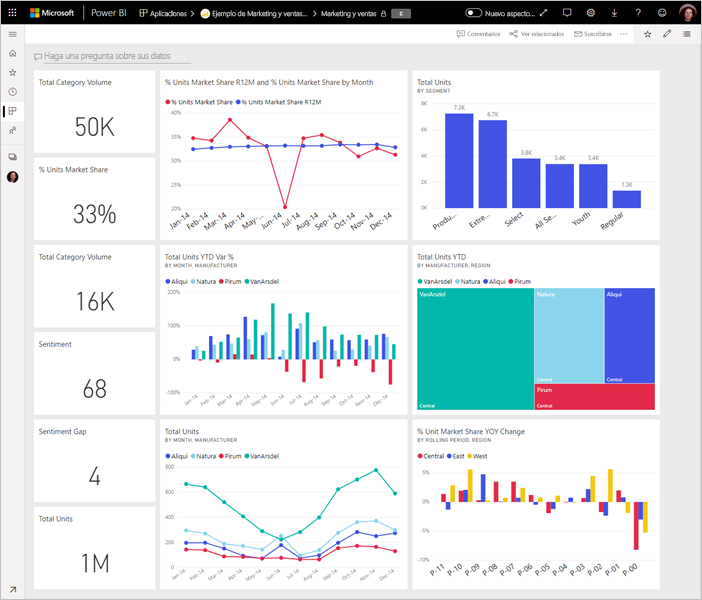
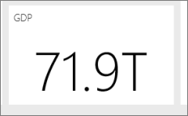

# Sugerencias para diseñar un panel de Power BI fantástico
Ahora que ya creó un panel y agregó algunos iconos, piense en cómo conseguir un panel atractivo, a la par que funcional. En general, significa destacar la información más importante y mantenerlo limpio y despejado.

> [!TIP]
> ¿Le gusta este panel? Puede descargarlo, junto a informes relacionados, desde AppSource. Vaya a **Obtener datos** > **Servicios**. Busque **Microsoft Sample - Sales & Marketing** > **Obtenerlo ahora**.

Muchos de los principios de diseño de los informes se aplican también a los paneles. Para más información, lea el documento técnico [Procedimientos recomendados de diseño para informes y visualizaciones](visuals/power-bi-visualization-best-practices.md).

Estas son algunas sugerencias para los paneles.

## Vídeo de procedimientos recomendados de diseño de paneles

Vea este vídeo sobre [procedimientos recomendados de diseño de paneles en Power BI](https://www.youtube.com/watch?v=-tdkUYrzrio) para obtener sugerencias de diseño de Marco Russo de SQLBI.com.

## Tenga en cuenta al público
¿Cuáles son las métricas claves que le ayudarán a tomar decisiones? ¿Cómo se usará el panel? ¿Qué suposiciones adquiridas o culturales pueden afectar a las opciones de diseño? ¿Qué información necesita su público para conseguir buenos resultados?

Tenga en cuenta que el panel es un recurso de información general, un lugar único para supervisar el estado actual de los datos. El panel se basa en informes y conjuntos de datos subyacentes, y esos elementos suelen contener numerosos detalles. Los lectores pueden profundizar en los informes desde el panel. Por tanto, no incluya detalles en el panel a menos que sea lo que los lectores tienen que supervisar.

¿Dónde se mostrará el panel? Si se muestra en un monitor grande, puede incluir más contenido. Pero si los lectores lo ven en sus tabletas, un panel con menos iconos es más legible.

## Contar una historia en una pantalla
Los paneles están diseñados para mostrar la información importante de un vistazo, por lo que se recomienda incluir todos los iconos en una pantalla. ¿Puede evitar las barras de desplazamiento en el panel?

¿Está el panel demasiado abarrotado?  Quítelo todo, excepto la información esencial que se lea e interprete fácilmente.

## Use el modo de pantalla completa
Al presentar un panel, muéstrelo en [modo de pantalla completa](consumer/end-user-focus.md), sin distracciones.

## Resaltar la información más importante
Si el texto y las visualizaciones son del mismo tamaño en el panel, a los lectores les costará centrarse en lo más importante. Por ejemplo, las visualizaciones de tarjeta son una buena forma de mostrar un número importante de forma destacada:  

Pero no olvide proporcionar un contexto.  

Más información sobre cómo [crear un icono con un solo número](visuals/power-bi-visualization-card.md).

## Colocar la información más importante
La mayoría de los usuarios leen de arriba abajo. Por tanto, coloque el nivel más alto de datos en la esquina superior izquierda y muestre más detalles a medida que avance en la dirección de lectura del público (de izquierda a derecha, de arriba a abajo).

## Use la visualización correcta para los datos
Evite utilizar distintos tipos de visualizaciones simplemente para aportar variedad.  Las visualizaciones deben transmitir una imagen, y ser fáciles de "leer" e interpretar.  En el caso de algunos datos y visualizaciones, basta con una sencilla visualización gráfica. Sin embargo, otros datos pueden requerir una visualización más compleja. Por ello, asegúrese de usar títulos, etiquetas y las personalizaciones necesarias para ayudar al lector.  

* Tenga cuidado con el uso de objetos visuales de aspecto atractivo pero difíciles de leer, como los gráficos 3D. 
* Puede resultar decepcionante comprobar que los gráficos circulares, de anillos, de medidores y otros tipos de gráficos circulares no son un procedimiento recomendado para la visualización de datos. Los gráficos circulares funcionan mejor si no superan las ocho categorías. Como los seres humanos no pueden comparar valores en paralelo, es más difícil hacerlo en un gráfico circular que en los gráficos de barras y columnas. Los gráficos circulares resultan útiles para ver las relaciones de una parte con respecto a un todo, no para comparar los elementos. Y los gráficos de medidor son ideales para mostrar el estado actual en el contexto de un objetivo.
* Sea coherente con las escalas del gráfico en los ejes, el orden de las dimensiones del gráfico y los colores que se usan para los valores de dimensiones de los gráficos.
* Asegúrese de codificar correctamente los datos cuantitativos. No use más de tres o cuatro dígitos al mostrar números. Muestre las medidas con uno o dos números a la izquierda de la coma decimal y reduzca los millares o millones, es decir, escriba "3,4 millones" en lugar de "3.400.000".
* No mezcle los niveles de precisión y tiempo. Asegúrese de que los intervalos de tiempo se comprenden perfectamente. No coloque un gráfico del mes pasado junto a gráficos filtrados de un mes concreto del año.
* No mezcle medidas grandes y pequeñas en la misma escala, por ejemplo en un gráfico de barras o líneas. Por ejemplo, una medida se puede expresar en millones y otra en millares. Con una escala tan grande, sería difícil ver las diferencias de la medida expresada en millares. Si tiene que combinarlas, elija una visualización que permita usar un segundo eje.
* No abarrote los gráficos con etiquetas de datos innecesarias. Normalmente, los valores de los gráficos de barras se entienden sin necesidad de mostrar el número real.
* Preste atención a la manera de [ordenar los gráficos](consumer/end-user-change-sort.md). Si desea llamar la atención sobre el número más alto o más bajo, ordene por medida. Si quiere que los usuarios puedan encontrar rápidamente una categoría determinada entre muchas otras categorías, ordene por el eje.  

Para más instrucciones específicas sobre la visualización, consulte [Tipos de visualización en Power BI](visuals/power-bi-visualization-types-for-reports-and-q-and-a.md).  

## Más información sobre el diseño de paneles
Si desea aprender a diseñar paneles fantásticos, considere la posibilidad de aprender los principios básicos de Gestalt sobre la percepción visual y la manera de comunicar claramente información accionable en contexto. Afortunadamente, existen numerosos recursos disponibles en nuestros blogs. Estos son algunos de nuestros libros favoritos:

* *Information dashboard design* , de Stephen Few  
* *Show me the numbers* , de Stephen Few  
* *Now you see it* , de Stephen Few  
* *Envisioning information* , de Edward Tufte  
* *Advanced presentations by design* , de Andrew Abela   

## Pasos siguientes
[Creación de un panel desde un informe](service-dashboard-create.md)  
[Conceptos básicos para los diseñadores en el servicio Power BI](service-basic-concepts.md)  
¿Tiene más preguntas? [Pruebe la comunidad de Power BI](http://community.powerbi.com/)
