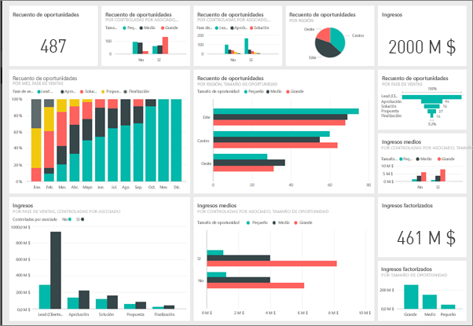
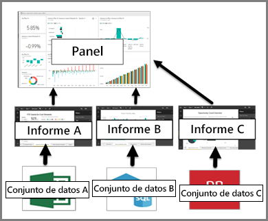

# Paneles del servicio Power BI

Un ***panel*** de Power BI tiene una sola página, a menudo denominada lienzo, que usa visualizaciones para contar una historia. Dado que se limita a una sola página, un panel bien diseñado contiene únicamente los elementos más importantes de esa historia.

Los paneles son una característica del servicio Power BI pero no están disponibles en Power BI Desktop. No se pueden crear paneles en dispositivos móviles, pero se pueden [ver y compartir](mobile-apps-view-dashboard.md).

## Creadores de paneles y consumidores de paneles
En función de su rol, es posible que sea alguien que crea paneles para su propio uso o para compartir con compañeros de trabajo. Puede encontrar información en **Paneles para creadores**. Si es alguien que recibe los paneles de otros usuarios. Desea información sobre cómo comprender e interactuar con el panel. Este artículo es para usted.

### Si va a recibir y consumir paneles

Las visualizaciones que se ven en el panel se denominan *iconos* y los *creadores* del panel los *anclan* al panel, desde los informes. Si no está familiarizado con Power BI, puede obtener una buena base leyendo [Conceptos básicos de Power BI](service-basic-concepts.md).

> [!IMPORTANT]
> Se necesita [Power BI Pro](service-free-vs-pro.md) para ver un panel compartido.

Las visualizaciones de un panel proceden de informes y cada informe se basa en un conjunto de datos. De hecho, una manera de pensar en un panel es como vía de entrada a los informes y conjuntos de datos subyacentes. La selección de una visualización lleva al informe (y al conjunto de datos) utilizado para crearla.

## Ventajas de los paneles
Los paneles son una magnífica manera de supervisar su empresa, buscar respuestas y ver las métricas más importantes de un vistazo. Las visualizaciones de un panel pueden proceder de un conjunto de datos subyacente o de varios y de un informe subyacente o de varios. Un panel combina datos locales y procedentes de la nube, lo que proporciona una vista consolidada, independientemente de donde residen los datos.

Un panel no es simplemente una imagen bonita; es algo muy interactivo y los iconos se actualizan según cambien los datos subyacentes.

## Paneles frente a informes
Los [informes](service-reports.md) suelen confundirse con paneles, ya que son igualmente lienzos con visualizaciones. Pero hay algunas diferencias importantes para los consumidores de Power BI.

| **Funcionalidad** | **Paneles** | **Informes** |
| --- | --- | --- |
| Páginas |Una página |Una o varias páginas |
| Orígenes de datos |Uno o varios informes y uno o varios conjuntos de datos por cada panel |Un único conjunto de datos por informe |
| Disponible en Power BI Desktop |No |Sí, los ***creadores*** pueden generar y ver informes en Desktop |
| Suscribirse |Es posible suscribirse a un panel |Es posible suscribirse a páginas de informes |
| Filtrado |No es posible filtrar ni segmentar |Numerosas formas de filtrar, resaltar y segmentar |
| Destacado |Se puede establecer un panel como panel "destacado" |No es posible crear un informe destacado |
| Favorito | Los paneles se pueden establecer como *favoritos* | Los informes se pueden establecer como *favoritos*
| Establecimiento de alertas |Disponible para iconos de panel en determinadas circunstancias |No disponible en los informes |
| Consultas en lenguaje natural |Disponible en el panel |No disponible en los informes |
| Se pueden ver campos y tablas del conjunto de datos subyacentes |No. Se pueden exportar datos pero no se pueden ver tablas ni campos en el panel |Sí. Se pueden ver tablas, campos y valores del conjunto de datos |
| Personalización |No |En la Vista de lectura, se puede publicar, insertar, filtrar, exportar, descargar como .pbix, ver contenido relacionado, generar códigos QR, analizar en Excel y mucho más.  |

## Pasos siguientes
* Familiarícese con los paneles viendo uno de nuestros [paneles de ejemplo](sample-tutorial-connect-to-the-samples.md).
* Obtenga información acerca de los [iconos de panel](service-dashboard-tiles.md) y lo que ocurre al seleccionar uno.
* ¿Desea realizar un seguimiento de un icono de panel individual y recibir un mensaje de correo electrónico al alcanzar un umbral determinado? [Cree alertas en iconos](service-set-data-alerts.md).
* Diviértase preguntando a su panel. Aprenda a utilizar [Preguntas y respuestas de Power BI](power-bi-tutorial-q-and-a.md) para formular una pregunta sobre los datos y recibir una respuesta en forma de visualización.
