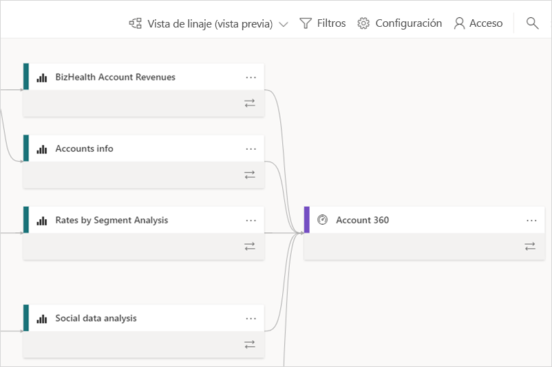
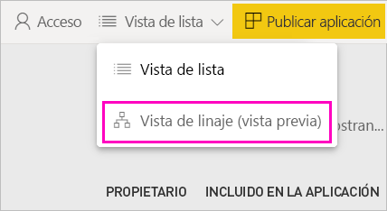
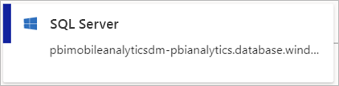
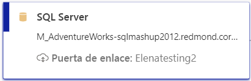
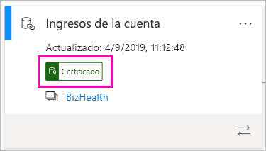
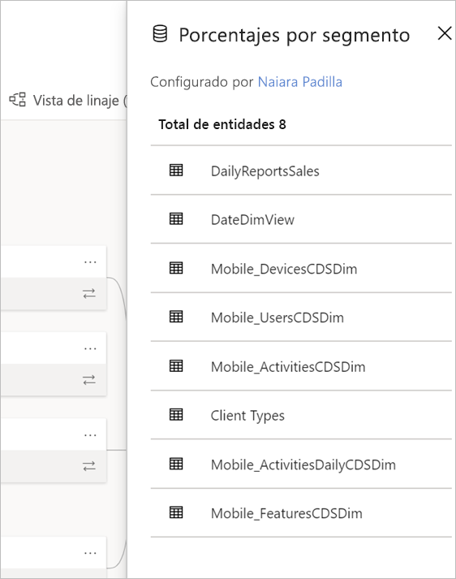
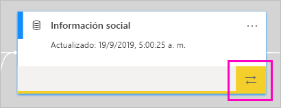
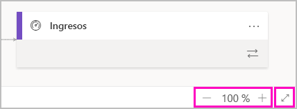

# Linaje de datos (versión preliminar)
En los proyectos de inteligencia empresarial (BI) modernos, comprender el flujo de datos desde el origen de datos hasta su destino puede ser un desafío. El desafío es incluso mayor si se han creado proyectos analíticos avanzados que abarcan varios orígenes de datos, artefactos y dependencias.  Preguntas como "¿Qué ocurre si cambio estos datos?" o "¿Por qué no se ha actualizado este informe?" pueden ser difíciles de responder. Es posible que para entenderlas se necesite un equipo de expertos o una investigación en profundidad. Para ayudarle a responder a estas preguntas se ha diseñado la vista de linaje.

 
Power BI tiene varios tipos de artefactos, como paneles, informes, conjuntos de datos y flujos de datos. Muchos conjuntos y flujos de datos se conectan a orígenes de datos externos, como SQL Server, y a conjuntos de datos externos en otras áreas de trabajo. Cuando un conjunto de datos es externo a un área de trabajo de su propiedad, puede estar en un área de trabajo que pertenezca a un miembro del departamento de TI o a otro analista. Los orígenes de datos y los conjuntos de datos externos hacen que sea más difícil saber de dónde proceden los datos, en última instancia. Para los proyectos complejos y los más sencillos, se presenta la vista de linaje. 

En la vista de linaje, puede ver las relaciones de linaje entre todos los artefactos de un área de trabajo y todas sus dependencias externas. Los flujos de datos ya tenían una vista de diagrama y la vista de linaje la expande. Muestra las conexiones entre todos los artefactos del área de trabajo, incluidas las conexiones a los flujos de datos de entrada, tanto ascendentes como descendentes. La vista de diagrama de flujos de entrada independiente desaparecerá a partir de noviembre.

## Exploración de la vista de linaje

Todas las áreas de trabajo, ya sean nuevas o clásicas, tienen una vista de linaje de forma automática, excepto Mi área de trabajo. Para verla, necesita al menos un rol de colaborador en el área de trabajo. Para más información, vea [Permisos](#permissions) en este artículo. 

- Para acceder a la vista de linaje, vaya a la vista de lista de áreas de trabajo. Pulse la flecha situada junto a **Vista de lista** y seleccione **Vista de linaje**.

    

    En esta vista, verá todos los artefactos del área de trabajo y cómo los datos fluyen de uno a otro.

**Orígenes de datos**

Verá los orígenes de datos de los que obtienen sus datos los conjuntos de datos y los flujos de datos. En las tarjetas de origen de datos, verá más información que puede ayudar a identificar el origen. Por ejemplo, para Azure SQL Server, también verá el nombre de la base de datos.

 
**Puertas de enlace**

Si un origen de datos se conecta a través de una puerta de enlace local, la información de la puerta de enlace se agrega a la tarjeta del origen de datos. Si tiene permisos como administrador de puerta de enlace o como usuario de origen de datos, verá más información, como el nombre de la puerta de enlace.

**Conjuntos de datos y flujos de datos**
 
En los conjuntos de datos, verá la hora de la actualización más reciente y si un conjunto de datos está certificado o promocionado.

 
Si un informe del área de trabajo se basa en un conjunto de datos de otra, verá el nombre del área de trabajo de origen en la tarjeta del conjunto de datos. Seleccione el nombre del área de trabajo de origen para ir hasta ella.
 
- Para cualquier artefacto, seleccione los puntos suspensivos (...) para ver el menú opciones. Incluye en una vista de lista todas las acciones disponibles.
  
Para ver más metadatos sobre los conjuntos de datos, seleccione la propia tarjeta del conjunto de datos. En un panel lateral se muestra información adicional sobre el conjunto de datos.

 
## Representación del linaje de cualquier artefacto 

Imagine que quiere ver el linaje de un artefacto específico.

- Seleccione las flechas dobles situadas debajo de un artefacto.

    

    Power BI resalta todos los artefactos relacionados con ese artefacto y atenúa el resto. 

## Navegación y pantalla completa 

La vista de linaje es un lienzo interactivo. Puede usar el mouse y el panel táctil para navegar por el lienzo, y acercar o alejar la vista.  

- Para acercar y alejar la vista, use el menú de la esquina inferior derecha, o bien el mouse o el panel táctil. 

- Para tener más espacio para el propio gráfico, use la opción de pantalla completa en la esquina inferior derecha. 

    

## Permisos

- Necesita una licencia de Power BI Pro para ver la vista de linaje.
- La vista de linaje solo está disponible para los usuarios con acceso al área de trabajo.
- Los usuarios deben tener un rol de Administrador, Miembro o Colaborador en el área de trabajo. Los usuarios con un rol de Visor no pueden cambiar a la vista de linaje.

## Consideraciones y limitaciones

La vista de linaje no está disponible en Internet Explorer. Vea [Exploradores compatibles con Power BI](power-bi-browsers.md) para más información.

## Pasos siguientes

- [Introducción a los conjuntos de datos de áreas de trabajo (versión preliminar)](service-datasets-across-workspaces.md)
