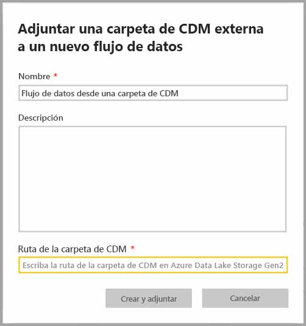
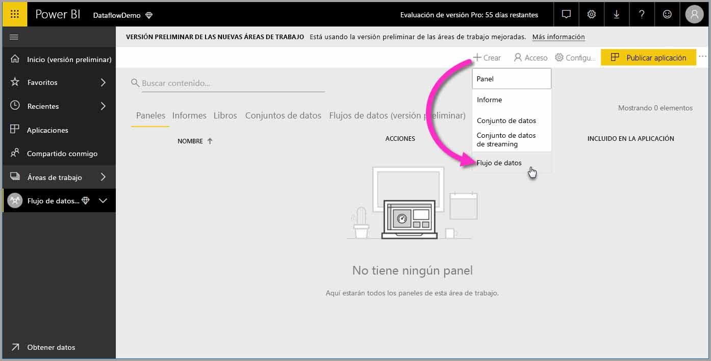
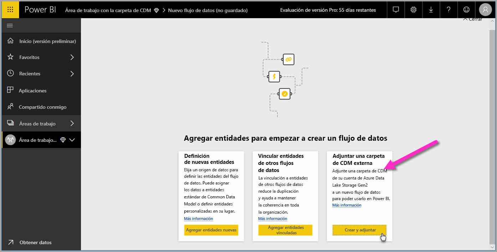
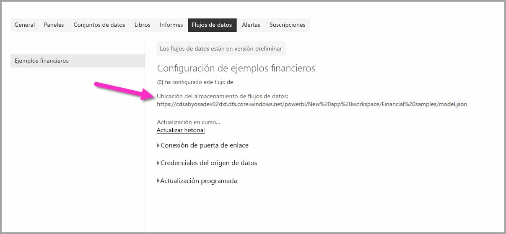

# Incorporación de una carpeta de CDS a Power BI como flujo de datos (versión preliminar)

En Power BI, puede agregar carpetas de Common Data Service (CDS) almacenadas en la cuenta de Azure Data Lake Store Gen2 de su organización como flujos de datos. Y, una vez que cree un flujo de datos desde una carpeta de CDS, puede usar **Power BI Desktop** y el **servicio Power BI** para crear conjuntos de datos, informes, paneles y aplicaciones que se basan en los datos que puso en las carpetas de CDS.

Hay algunos requisitos para la creación de flujos de datos desde las carpetas de CDS, como se describe en la lista siguiente:

* La creación de flujos de datos desde carpetas de CDS *solo* está disponible en la [nueva experiencia de área de trabajo](service-create-the-new-workspaces.md). 
* Para agregar una carpeta de CDS a Power BI, es necesario que el usuario que agrega la carpeta tenga [autorización para la carpeta de CDS y sus archivos](https://go.microsoft.com/fwlink/?linkid=2029121).
* Debe tener concedidos permisos de lectura y ejecución en todos los archivos y carpetas de la carpeta de CDS para agregarlos a Power BI.

En las secciones siguientes se describe cómo crear un flujo de datos desde una carpeta de CDS.

## Crear un flujo de datos desde una carpeta de CDS

Para empezar a crear un flujo de datos desde una carpeta de CDS, inicie el **servicio Power BI** y seleccione un **área de trabajo de la aplicación** en el panel de navegación izquierdo. También puede crear un área de trabajo en la que crear el flujo de datos.

En la pantalla que aparece, seleccione **Crear y adjuntar**, como se muestra en la siguiente imagen.

La pantalla que aparece a continuación le permite asignar un nombre al flujo de datos, proporcionar una descripción del flujo de datos y proporcionar la ruta de acceso a la carpeta de CDS de la cuenta de Azure Data Lake Gen2 de la organización. Lea la sección del artículo que describe [cómo obtener la ruta de acceso de la carpeta de CDS](service-dataflows-configure-workspace-storage-settings.md#get-the-uri-of-stored-dataflow-files). 

Una vez que haya proporcionado la información, seleccione **Crear y adjuntar** para crear el flujo de datos.

Los flujos de datos de las carpetas de CDS están marcados con el icono *externo* cuando se muestran en Power BI. En la siguiente sección, se describen las diferencias entre los flujos de datos estándar y los flujos de datos creados a partir de carpetas de CDS.

Una vez que los permisos se establecen correctamente, como se describió anteriormente en este artículo, puede conectarse a su flujo de datos en **Power BI Desktop**.

## Consideraciones y limitaciones

Al trabajar con permisos para un flujo de datos creado a partir de una carpeta de CDS, el proceso es parecido al de los orígenes de datos externos en Power BI. Los permisos se administran en el origen de datos y no desde Power BI. Los permisos deben establecerse correctamente en el origen de datos propiamente dicho, por ejemplo, un flujo de datos creado a partir de una carpeta de CDS, para funcionar adecuadamente con Power BI.

Las listas siguientes ayudan a aclarar cómo funcionan los flujos de datos de carpetas de CDS con Power BI.

Áreas de trabajo de Power BI Pro, Premium y Embedded:
* Los flujos de datos de carpetas de CDS no se pueden editar
* Los permisos para leer un flujo de datos creado a partir de una carpeta de CDS son administrados por el propietario de la carpeta de CDS y no por Power BI.

Power BI Desktop:
* Solo los usuarios que tengan autorización para el área de trabajo en la que se creó el flujo de datos, y para la carpeta de CDS, pueden acceder a sus datos desde el conector de flujos de datos de Power BI.

También hay algunos otros aspectos que se deben tener en cuenta y que se describen en la lista siguiente:

* La creación de flujos de datos desde carpetas de CDS *solo* está disponible en la [nueva experiencia de área de trabajo](service-create-the-new-workspaces.md).
* Las entidades vinculadas no están disponibles para flujos de datos creados a partir de carpetas de CDS

Los clientes de **Power BI Desktop** no pueden acceder a los flujos de datos almacenados en la cuenta de Azure Data Lake Storage Gen2, a menos que sean propietarios del flujo de datos o que tengan autorización explícita para la carpeta de CDS del flujo de datos. Considere la siguiente situación:

1.  Anna crea un área de trabajo de la aplicación y la configura para almacenar los flujos de datos de una carpeta de CDS.
2.  Ben, que también es miembro del área de trabajo que ha creado Anna, quiere usar Power BI Desktop y el conector de flujo de datos para obtener datos del flujo de datos que ha creado su compañera.
3.  Ben recibe un error porque no se le ha agregado como usuario autorizado a la carpeta de CDS del flujo de datos en la instancia de Data Lake.

    

Para resolver este problema, Ben debe tener permisos de lector para la carpeta de CDS y sus archivos. Puede aprender más sobre cómo acceder a la carpeta de CDS en [este artículo](https://go.microsoft.com/fwlink/?linkid=2029121).

## Pasos siguientes

En este artículo se proporcionan instrucciones sobre cómo configurar el almacenamiento de área de trabajo para flujos de datos. Para más información, eche un vistazo a los siguientes artículos:

Para más información sobre flujos de datos, CDS y Azure Data Lake Storage Gen2, eche un vistazo a los siguientes artículos:

* [Integración de flujos de datos y Azure Data Lake (versión preliminar)](service-dataflows-azure-data-lake-integration.md)
* [Configuración de opciones de flujo de datos del área de trabajo (versión preliminar)](service-dataflows-configure-workspace-storage-settings.md)
* [Conexión a Azure Data Lake Storage Gen2 para el almacenamiento del flujo de datos (versión preliminar)](service-dataflows-connect-azure-data-lake-storage-gen2.md)

Para información sobre los flujos de datos en general, consulte estos artículos:

* [Creación y uso de flujos de datos en Power BI](service-dataflows-create-use.md)
* [Uso de entidades calculadas en Power BI Premium](service-dataflows-computed-entities-premium.md)
* [Uso de flujos de datos con orígenes de datos locales](service-dataflows-on-premises-gateways.md)
* [Recursos para desarrolladores sobre flujos de datos de Power BI](service-dataflows-developer-resources.md)

Para más información sobre Azure Storage, puede leer estos artículos:
* [Guía de seguridad de Azure Storage](https://docs.microsoft.com/azure/storage/common/storage-security-guide)
* [Configuración de la actualización programada](refresh-scheduled-refresh.md)
* [Introducción a los ejemplos de GitHub desde Azure Data Services](https://aka.ms/cdmadstutorial)

Para más información sobre Common Data Service, puede leer su artículo de introducción:
* [Introducción a Common Data Service](https://docs.microsoft.com/powerapps/common-data-model/overview)
* [Carpetas de CDS](https://go.microsoft.com/fwlink/?linkid=2045304)
* [Definición del archivo de modelo de CDS](https://go.microsoft.com/fwlink/?linkid=2045521)

Y, siempre puede intentar [plantear preguntas a la comunidad de Power BI](http://community.powerbi.com/).

