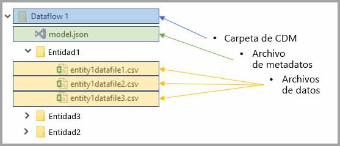
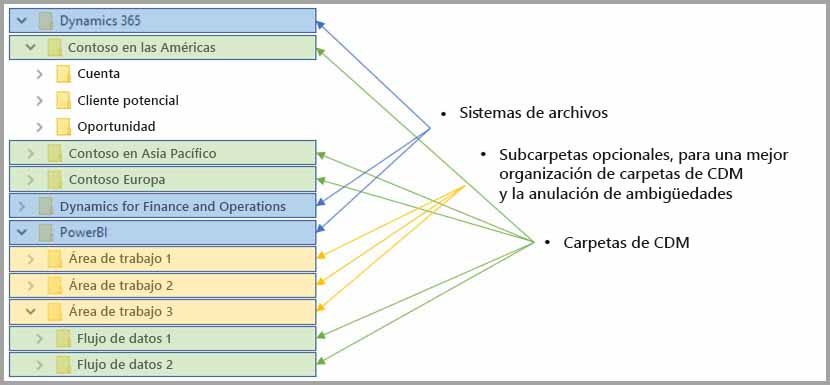

# Integración de flujos de datos y Azure Data Lake (versión preliminar)

De forma predeterminada, los datos usados con Power BI se almacenan en almacenamiento interno proporcionado por Power BI. Con la integración de flujos de datos y Azure Data Lake Storage Gen2 (ADLS Gen2), puede almacenar los flujos de datos en la cuenta de Azure Data Lake Storage Gen2 de su organización. 

> [!NOTE]
> La funcionalidad de flujos de datos se encuentra en versión preliminar y está sujeta a cambios y actualizaciones antes de la disponibilidad general.

## Cómo se relacionan las carpetas de CDS con los flujos de datos

Con los **flujos de datos**, los usuarios y las organizaciones pueden unificar los datos procedentes de fuentes dispares y prepararlos para el modelado. Con Common Data Service (CDS), las organizaciones pueden usar un formato de datos que proporciona coherencia semántica entre aplicaciones e implementaciones. Y con Azure Data Lake Storage Gen2 (ADLS Gen2), se puede aplicar un control de acceso y autorización pormenorizado a instancias de Data Lake en Azure. Cuando se combinan, estos elementos proporcionan datos centralizados, datos estructurados, control de acceso pormenorizado y coherencia semántica convincentes para las aplicaciones en toda la empresa.

Los datos almacenados en formato de CDS proporcionan coherencia semántica entre aplicaciones e implementaciones de una organización. Con la integración de CDS con ADLS Gen2, la misma coherencia estructural y significado semántico se pueden aplicar a los datos almacenados en (ADLS Gen2) mediante carpetas de CDS que contienen datos esquematizados en formato CDS estándar. Los metadatos estandarizados y datos de descripción automática de una instancia de Azure Data Lake facilitan la detección de metadatos y la interoperación entre productores y consumidores de datos, como Power BI, Azure Data Factory, Azure Data Lake, Databricks y Azure Machine Learning (ML). 

Los flujos de datos almacenan su definición y datos en carpetas de CDS, en los siguientes formatos:

**Model.json**
* El archivo de descripción de metadatos **Model.json** contiene información semántica sobre registros y atributos de entidad, así como vínculos a archivos de datos subyacentes. La existencia del archivo model.json indica compatibilidad con el formato de metadatos de CDS y puede incluir entidades estándar que tienen otros metadatos semánticos de fábrica enriquecidos que las aplicaciones pueden usar.
* Power BI también almacena información de cada origen de datos junto con la **consulta y las transformaciones** generadas por la experiencia del editor de flujo de datos en el servicio Power BI. Las contraseñas a orígenes de datos no se almacenan en el archivo de modelo.

**Archivos de datos**
* Los archivos de datos se incluyen en la carpeta de CDS en formato y estructura bien definidos (las subcarpetas son opcionales, como se ha descrito anteriormente en este artículo) y se hace referencia a ellos en el archivo model.json. Actualmente, los archivos de datos deben estar en formato .csv, pero se podrían admitir formatos adicionales en sucesivas actualizaciones. 

En el siguiente diagrama se muestra una carpeta de CDS de ejemplo creada por un flujo de datos de Power BI, que contiene tres entidades:

El archivo model.json o de metadatos de la imagen anterior proporcionaría punteros a los archivos de datos de entidad en toda la carpeta de CDS.

## Power BI organiza las carpetas de CDS en la instancia de Data Lake

Con los flujos de datos de Power BI y su integración con ADLS Gen2, Power BI puede generar datos en una instancia de Data Lake. Como productor de datos, Power BI debe crear una carpeta de CDS para cada flujo de datos que contiene el archivo model.json y sus archivos de datos asociados. Power BI almacena sus datos de forma aislada de otros productores de datos en la instancia de Data Lake mediante *sistemas de archivos*. Puede leer más sobre el sistema de archivos de Azure Data Lake Storage Gen2 y el espacio de nombres jerárquico en [el artículo donde se describen](https://docs.microsoft.com/azure/storage/data-lake-storage/namespace).

Power BI usa subcarpetas para eliminar ambigüedades y para proporcionar una mejor organización de los datos cuando se presentan en el **servicio Power BI**. La nomenclatura y la estructura de carpetas representan las áreas de trabajo (carpetas) y los flujos de datos (carpetas de CDS). En el diagrama siguiente se muestra cómo se puede estructurar una instancia de Data Lake compartida por Power BI y otros productores de datos. Cada servicio, en este caso Dynamics 365, Dynamics for Finance and Operation y Power BI, crea y mantiene su propio sistema de archivos. Según la experiencia en cada servicio, se crean subcarpetas para organizar mejor las carpetas de CDS en el sistema de archivos. 

## Power BI protege los datos en la instancia de Data Lake

Power BI usa tokens de *portador de OAuth de Active Directory* y la funcionalidad de *ACL de POSIX* proporcionada por Azure Data Lake Storage Gen2. Estas características permiten definir el ámbito del acceso de Power BI al sistema de archivos que administra en la instancia de Data Lake, así como el ámbito del acceso de las personas solo a los flujos de datos o las carpetas de CDS que crean. 

Para crear y administrar carpetas de CDS en el sistema de archivos de Power BI, se requieren permisos de lectura, escritura y ejecución para el sistema de archivos. Cada flujo de datos creado en Power BI se almacena en su propia carpeta de CDS, y al propietario del flujo de datos se le concede acceso de solo lectura a la carpeta de CDS y su contenido. Este enfoque protege la integridad de los datos que genera Power BI y proporciona a los administradores la posibilidad de supervisar qué usuarios han accedido a la carpeta de CDS mediante registros de auditoría. 

### Autorización a los usuarios o servicios para las carpetas de CDS

Compartir carpetas de CDS con consumidores de datos, como usuarios o servicios que necesitan leer los datos, se simplifica con los tokens de portador de OAuth de Active Directory y las ACL de POSIX. Al hacerlo, proporciona a los administradores la posibilidad de supervisar quién accedió a la carpeta de CDS. La única acción necesaria es conceder acceso a un objeto de Active Directory de su elección (como un grupo de usuario o un servicio) a la carpeta de CDS. Se recomienda que todo el acceso que se conceda a la carpeta de CDS, para cualquier identidad que no sea el productor de datos, sea de solo lectura. Al hacerlo, protege la integridad de los datos que genera el productor.

Para agregar carpetas de CDS a Power BI, el usuario que agrega una de estas carpetas debe tener listas ACL de acceso de *lectura* en la propia carpeta de CDS y los archivos o carpetas que contenga. También debe tener listas ACL de acceso de *ejecución* en la propia carpeta de CDS y las carpetas que contenga. Para más información, se recomienda revisar los artículos [Access control lists on files and directory](https://docs.microsoft.com/azure/storage/blobs/data-lake-storage-access-control#access-control-lists-on-files-and-directories) (Listas de control de acceso en archivos y directorios) y [Best practices for using Azure Data Lake Storage Gen2](https://docs.microsoft.com/azure/storage/blobs/data-lake-storage-best-practices) (Procedimientos recomendados para usar Azure Data Lake Storage Gen2).

### Formas alternativas de autorización

Las personas o servicios fuera de Power BI también pueden aprovechar formas alternativas de autorización que permitan a los portadores de una clave acceso a *todos* los recursos de la cuenta, acceso completo a todos los recursos de la instancia de Data Lake y no puedan tener como ámbito los sistemas de archivos o carpetas de CDS. Esas alternativas pueden ser formas sencillas de conceder acceso, pero limitan la posibilidad de compartir recursos específicos en la instancia de Data Lake, y no proporcionan a los usuarios auditoría de quién ha accedido al almacenamiento. Se proporcionan detalles completos de los esquemas de autorización disponibles en el artículo [Control de acceso en Azure Data Lake Storage Gen2](https://docs.microsoft.com/azure/storage/blobs/data-lake-storage-access-control
).

## Pasos siguientes

En este artículo se proporciona información general sobre la integración de flujos de datos de Power BI, carpetas de CDS y Azure Data Lake Storage Gen2. Para más información, eche un vistazo a los siguientes artículos:

Para más información sobre flujos de datos, CDS y Azure Data Lake Storage Gen2, eche un vistazo a los siguientes artículos:

* [Configuración de opciones de flujo de datos del área de trabajo (versión preliminar)](service-dataflows-configure-workspace-storage-settings.md)
* [Incorporación de una carpeta de CDS a Power BI como flujo de datos (versión preliminar)](service-dataflows-add-cdm-folder.md)
* [Conexión a Azure Data Lake Storage Gen2 para el almacenamiento del flujo de datos (versión preliminar)](service-dataflows-connect-azure-data-lake-storage-gen2.md)

Para información sobre los flujos de datos en general, consulte estos artículos:

* [Creación y uso de flujos de datos en Power BI](service-dataflows-create-use.md)
* [Uso de entidades calculadas en Power BI Premium (versión preliminar)](service-dataflows-computed-entities-premium.md)
* [Uso de flujos de datos con orígenes de datos locales (versión preliminar)](service-dataflows-on-premises-gateways.md)
* [Recursos de desarrollador para flujos de datos de Power BI](service-dataflows-developer-resources.md)

Para más información sobre Azure Storage, puede leer estos artículos:
* [Guía de seguridad de Azure Storage](https://docs.microsoft.com/azure/storage/common/storage-security-guide)
* [Introducción a los ejemplos de GitHub desde Azure Data Services](https://aka.ms/cdmadstutorial)

Para más información sobre Common Data Service, puede leer su artículo de introducción:
* [Introducción a Common Data Service](https://docs.microsoft.com/powerapps/common-data-model/overview)
* [Carpetas de CDS](https://go.microsoft.com/fwlink/?linkid=2045304)
* [Definición del archivo de modelo de CDS](https://go.microsoft.com/fwlink/?linkid=2045521)

Y, siempre puede intentar [plantear preguntas a la comunidad de Power BI](http://community.powerbi.com/).
