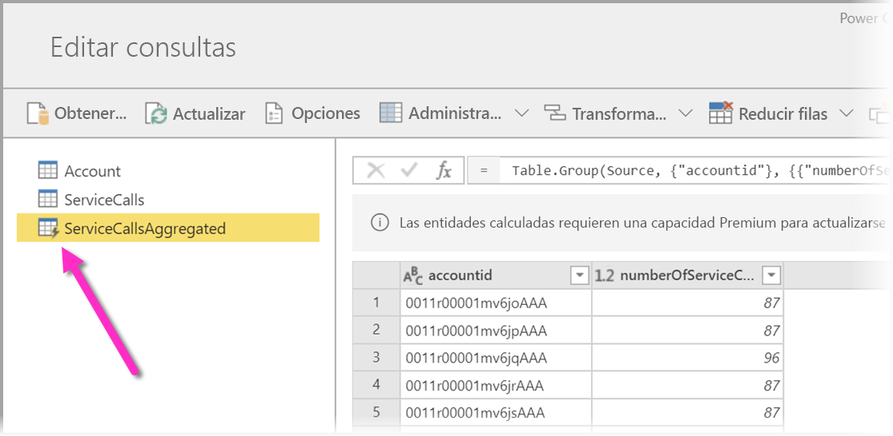
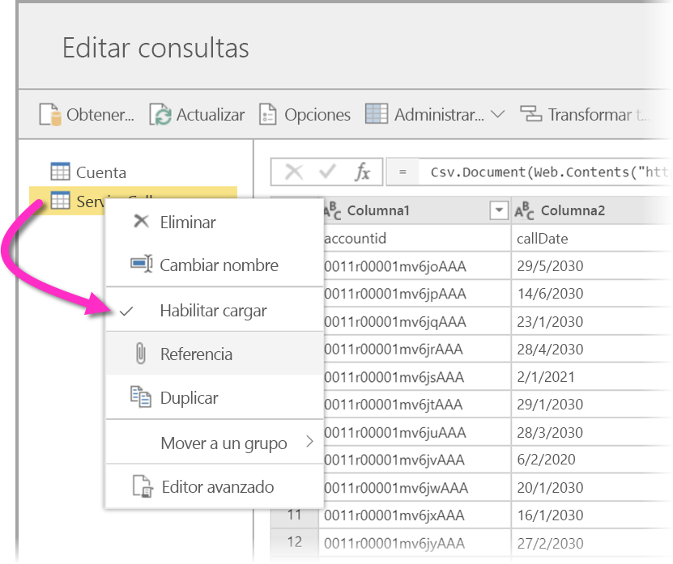
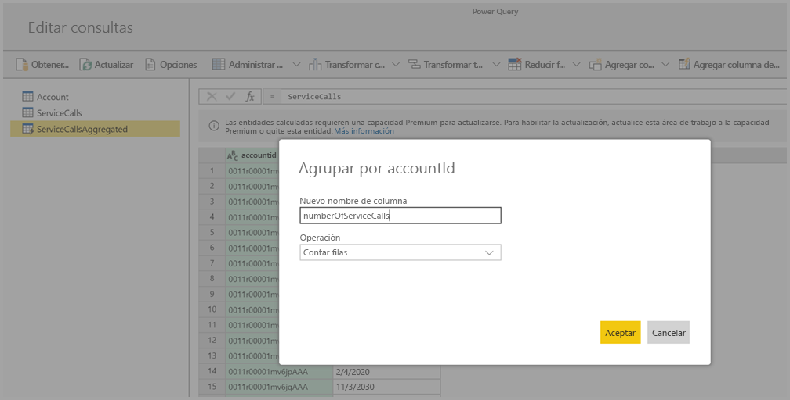
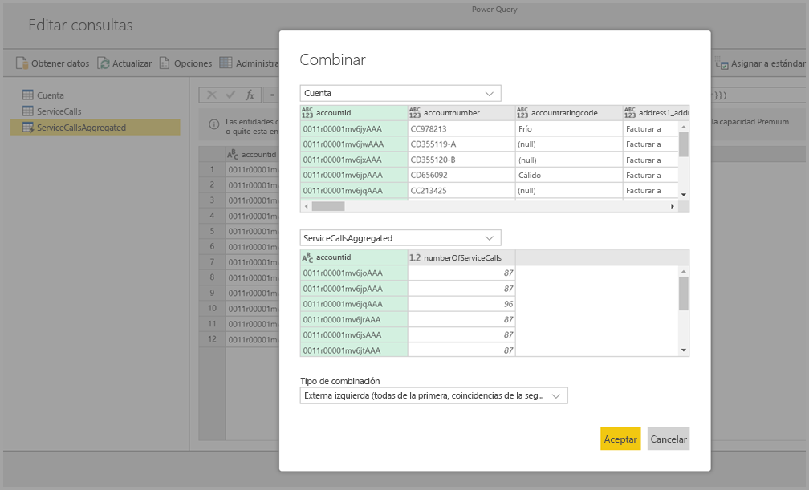
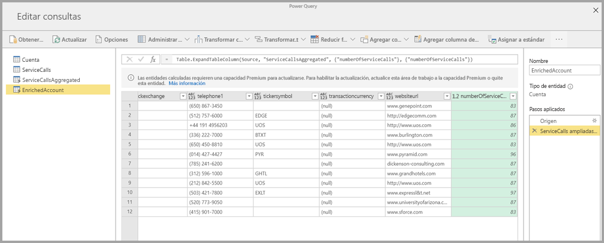

# Uso de entidades calculadas en Power BI Premium

Puede realizar **cálculos en almacenamiento** al usar **flujos de datos** con una suscripción de Power BI Premium. Esto le permite realizar cálculos en los flujos de datos existente y devolver resultados que le permiten centrarse en la creación y el análisis de informes. 

Para realizar **cálculos en almacenamiento**, primero debe crear el flujo de datos e incorporar datos en ese almacenamiento del flujo de datos de Power BI. Una vez que disponga de un flujo de datos que contiene los datos, puede crear **entidades calculadas**, que son entidades que realizan cálculos en almacenamiento. 

Hay dos formas de conectar los datos de flujos de datos a Power BI:

* [Uso de la creación de autoservicio de un flujo de datos](service-dataflows-create-use.md)
* Uso de un flujo de datos externo

En las secciones siguientes se describe cómo crear entidades calculadas de los datos de flujos de datos.

## Creación de entidades calculadas 

Una vez que disponga de un flujo de datos con una lista de entidades, puede realizar cálculos en esas entidades.

En la herramienta de creación de flujos de datos del servicio Power BI, seleccione **Editar entidades**, haga clic con el botón derecho en la entidad que desea usar como base para la entidad calculada y en la que desea realizar cálculos. En el menú contextual, elija **Referencia**.

Para que la entidad pueda actuar como una entidad calculada, la opción **Habilitar carga** debe estar marcada, como se muestra en la imagen siguiente. Haga clic con el botón derecho en la entidad para mostrar este menú contextual.

Al seleccionar **Habilitar carga**, se crea una entidad cuyo origen es la entidad a la que se hace referencia. El icono cambia y se muestra como **calculada**, según se muestra en la imagen siguiente.

Las transformaciones que se realizan en la entidad recién creada se ejecutarán en los datos que ya residen en el almacenamiento del flujo de datos de Power BI. Eso significa que la consulta no se ejecutará en el origen de datos externo desde el que se importaron los datos (por ejemplo, la base de datos SQL desde la que se extrajeron los datos), sino que, en su lugar, se realizará en los datos que residen en el almacenamiento del flujo de datos.

### Casos de uso de ejemplo
¿Qué tipo de transformaciones se pueden realizar con entidades calculadas? Todas las transformaciones que suelen especificarse con la interfaz de usuario de transformaciones en Power BI o en el editor de M se admiten para realizar cálculos en almacenamiento. 

Considere el siguiente ejemplo: tiene una entidad *Cuenta* que contiene los datos sin procesar de todos los clientes de la suscripción de Dynamics 365. También tiene datos sin procesar *ServiceCalls* del centro de servicio, con los datos de las llamadas de soporte técnico que se realizaron desde una cuenta diferente cada día del año.

Imagine que quiere enriquecer la entidad *Cuenta* con datos de *ServiceCalls*. 

En primer lugar, debe agregar los datos de ServiceCalls para calcular el número de llamadas de soporte técnico que se realizaron para cada cuenta en el último año. 

A continuación, es recomendable combinar la entidad *Cuenta* con la entidad *ServiceCallsAggregated* para calcular la tabla enriquecida **Cuenta**.

Y, después, puede ver los resultados, como se muestra en *EnrichedAccount* en la imagen siguiente.

Y eso es todo: la transformación se realiza en los datos del flujo de datos que reside en la suscripción de Power BI Premium, no en los datos del origen.

## Consideraciones y limitaciones

Es importante tener en cuenta que si quita el área de trabajo de la capacidad Premium de Power BI, el flujo de datos asociado ya no se actualizará. 

Al trabajar con flujos de datos creados específicamente en la cuenta de Azure Data Lake Storage Gen2 de una organización, las entidades vinculadas y las entidades calculadas solo funcionan correctamente cuando residen en la misma cuenta de almacenamiento. Para más información, consulte [Conexión de Azure Data Lake Storage Gen 2 para el almacenamiento de flujo de datos (versión preliminar)](service-dataflows-connect-azure-data-lake-storage-gen2.md).

Las entidades vinculadas no están disponibles para flujos de datos que se crean a partir de carpetas de Common Data Service (CDS). Para obtener más información, consulte [Incorporación de una carpeta de CDS a Power BI como flujo de datos (versión preliminar)](service-dataflows-add-cdm-folder.md).

A modo de procedimiento recomendado, para realizar cálculos sobre datos combinados de forma local y datos en la nube, cree una nueva entidad. Si lo hace, verá que es mejor que usar una entidad existente para los cálculos, por ejemplo, en el caso de una entidad que también consulte datos de ambos orígenes y realice transformaciones aisladas.

## Pasos siguientes

En este artículo se describen las entidades calculadas y los flujos de datos disponibles en el servicio Power BI. Estos son algunos artículos más que pueden resultar útiles.

* [Preparación de datos de autoservicio con flujos de datos](service-dataflows-overview.md)
* [Creación y uso de flujos de datos en Power BI](service-dataflows-create-use.md)
* [Uso de flujos de datos con orígenes de datos locales](service-dataflows-on-premises-gateways.md)
* [Recursos para desarrolladores sobre flujos de datos de Power BI](service-dataflows-developer-resources.md)
* [Configuración de opciones de flujo de datos del área de trabajo (versión preliminar)](service-dataflows-configure-workspace-storage-settings.md)
* [Incorporación de una carpeta de CDS a Power BI como flujo de datos (versión preliminar)](service-dataflows-add-cdm-folder.md)
* [Conexión a Azure Data Lake Storage Gen2 para el almacenamiento del flujo de datos (versión preliminar)](service-dataflows-connect-azure-data-lake-storage-gen2.md)

Para obtener más información sobre Power Query y la actualización programada, puede leer estos artículos:
* [Información general sobre consultas en Power BI Desktop](desktop-query-overview.md)
* [Configuración de la actualización programada](refresh-scheduled-refresh.md)

Para más información sobre Common Data Service, puede leer su artículo de introducción:
* [Introducción a Common Data Service](https://docs.microsoft.com/powerapps/common-data-model/overview)

