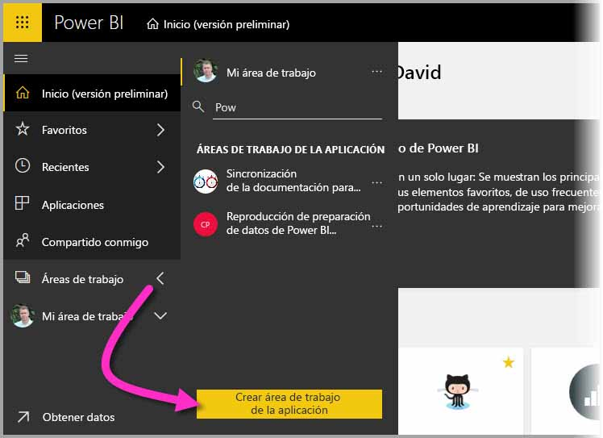
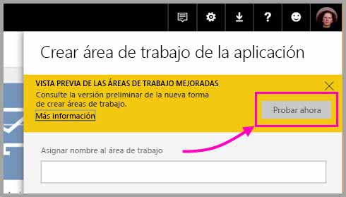
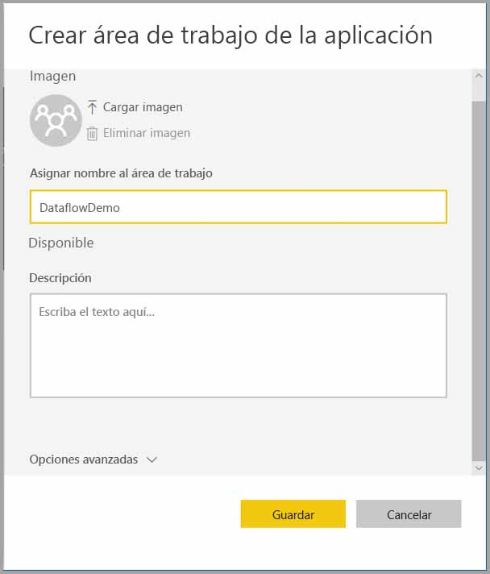
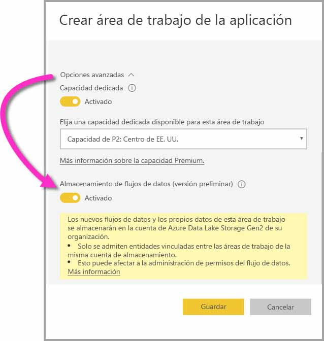
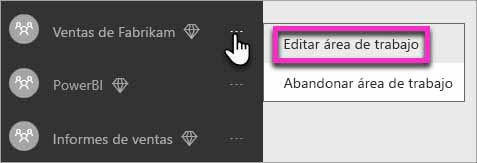
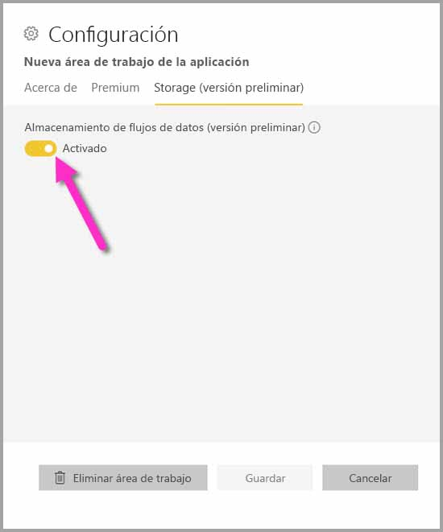
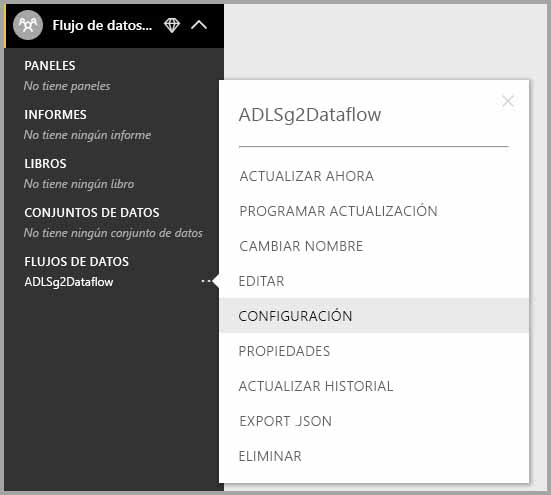

# Configuración de opciones de flujo de datos del área de trabajo (versión preliminar)

Con Power BI y los flujos de datos, puede almacenar un archivo de definición de flujo de datos y los archivos de datos de un área de trabajo en su cuenta de Azure Data Lake Storage Gen2. Los administradores de áreas de trabajo pueden configurar Power BI para hacer eso, y este artículo le lleva por los pasos necesarios para llegar hasta ahí. 

Antes de poder configurar la ubicación de almacenamiento del flujo de datos de un área de trabajo, el administrador global de su compañía debe conectar la cuenta de almacenamiento de la organización a Power BI y habilitar los permisos de asignación de almacenamiento para esa cuenta de almacenamiento. *[Conexión a Azure Data Lake Storage Gen2 para el almacenamiento del flujo de datos (versión preliminar)](service-dataflows-connect-azure-data-lake-storage-gen2.md)* 

Existen dos maneras de configurar las opciones de almacenamiento de flujo de datos del área de trabajo: 

* Durante la creación del área de trabajo
* Mediante la edición de un área de trabajo existente

Vamos a examinar cada una en las secciones siguientes. 

> [!IMPORTANT]
> Solo se puede cambiar la configuración de almacenamiento de flujo de datos del área de trabajo si el área de trabajo no contiene flujos de datos. Además, esta característica solo está disponible en la nueva experiencia de área de trabajo. Puede aprender más sobre la nueva área de trabajo en el artículo [Crear nuevas áreas de trabajo (versión preliminar) en Power BI](service-create-the-new-workspaces.md).

## Crear una área de trabajo y configurar su almacenamiento de flujo de datos

Para crear un área de trabajo en el servicio Power BI, seleccione **Áreas de trabajo > Crear área de trabajo**.

En el cuadro de diálogo Crear área de trabajo, puede aparecer un cuadro amarillo llamado **Vista previa de las áreas de trabajo mejoradas**. En esa área, seleccione **Probar ahora**.

En el cuadro de diálogo que aparece, puede asignar a su nueva área de trabajo un nombre único. No seleccione aún **Guardar**, dado que es necesario realizar configuración avanzada.

A continuación, expanda el área **Avanzadas** del cuadro de diálogo **Crear área de trabajo**, donde puede activar **Almacenamiento de flujo de datos (versión preliminar)** .

Seleccione **Guardar** para crear el área de trabajo. Cualquier flujo de datos creado en esta área de trabajo ahora almacena su archivo de definición (Model.json) y sus datos en la cuenta de Azure Data Lake Storage Gen2 de su organización. 

## Actualizar el almacenamiento de flujo de datos de un área de trabajo existente

Como alternativa a la creación de un área de trabajo, puede actualizar un área de trabajo existente para almacenar los archivos de definición y de datos en la cuenta de Azure Data Lake Storage Gen2 de su organización. Recuerde que la configuración de almacenamiento de flujo de datos solo se puede cambiar si el área de trabajo no contiene aún un flujo de datos.

Para editar un área de trabajo, seleccione los puntos suspensivos **(...)** y, luego, seleccione **Editar área de trabajo**. 

En la ventana **Editar área de trabajo** que aparece, expanda **Avanzadas** y luego establezca **Almacenamiento de flujo de datos (versión preliminar)** en **Activado**. 

A continuación, seleccione **Guardar** y los flujos de datos creados en esa área de trabajo almacenarán sus archivos de definición y de datos en la cuenta de Azure Data Lake Storage Gen2 de su organización.

## Obtener el URI de los archivos de flujo de datos almacenados

Una vez que crea un flujo de datos en un área de trabajo que está asignada a la cuenta de Azure Data Lake de su organización, puede acceder a sus archivos de definición y de datos directamente. Su ubicación está disponible en la página **Configuración de flujo de datos**. Para llegar hasta allí, siga estos pasos:

Seleccione los puntos suspensivos **(...)**  junto a un flujo de datos que aparezca en **Flujos de datos** en el área de trabajo. En el menú que aparece, seleccione **Configuración**.

En la información que se muestra, la ubicación de la carpeta de CDS del flujo de datos aparece en **Ubicación del almacenamiento de flujos de datos**, tal y como se muestra en la siguiente imagen.

> [!NOTE]
> Power BI configura el propietario del flujo de datos con permisos de lectura para la carpeta de CDS, donde se almacenan los archivos de flujo de datos. Para conceder a otras personas o servicios acceso a la ubicación de almacenamiento de flujo de datos, es necesario que el propietario de la cuenta de almacenamiento conceda acceso en Azure.

## Consideraciones y limitaciones

Algunas características de flujo de datos no se admiten cuando el almacenamiento de flujo de datos está en Azure Data Lake Storage Gen2: 

Áreas de trabajo de Power BI Pro, Premium y Embedded:
* La característica de **entidades vinculadas** solo se admite entre áreas de trabajo de la misma cuenta de almacenamiento.
* Los permisos del área de trabajo no se aplican a los flujos de datos almacenados en Azure Data Lake Storage Gen2; solo el propietario del flujo de datos puede acceder a él.
* Por lo demás, todas las características de preparación de datos son las mismas que para los flujos de datos almacenados en almacenamiento de Power BI.

También hay algunos otros aspectos que se deben tener en cuenta y que se describen en la lista siguiente:

* Una vez que se ha configurado una ubicación de almacenamiento de flujo de datos, no se puede cambiar.
* Solo el propietario de un flujo de datos almacenado en Azure Data Lake Storage Gen2 puede acceder a sus datos.
* Los orígenes de datos locales, en capacidades compartidas de Power BI, no se admiten en los flujos de datos almacenados en Azure Data Lake Storage Gen2 de su organización.

Los clientes de **Power BI Desktop** no pueden acceder a los flujos de datos almacenados en la cuenta de Azure Data Lake Storage Gen2, a menos que sean propietarios del flujo de datos. Considere la siguiente situación:

1.  Anna crea un área de trabajo y la configura para almacenar flujos de datos en la instancia de Data Lake de la organización.
2.  Ben, que también es miembro del área de trabajo que ha creado Anna, quiere usar Power BI Desktop y el conector de flujo de datos para obtener datos del flujo de datos que ha creado su compañera.
3.  Ben recibe un error porque no se le ha agregado como usuario autorizado a la carpeta de CDS del flujo de datos en la instancia de Data Lake.

    

## Pasos siguientes

En este artículo se proporcionan instrucciones sobre cómo configurar el almacenamiento de área de trabajo para flujos de datos. Para más información, eche un vistazo a los siguientes artículos:

Para más información sobre flujos de datos, CDS y Azure Data Lake Storage Gen2, eche un vistazo a los siguientes artículos:

* [Integración de flujos de datos y Azure Data Lake (versión preliminar)](service-dataflows-azure-data-lake-integration.md)
* [Incorporación de una carpeta de CDS a Power BI como flujo de datos (versión preliminar)](service-dataflows-add-cdm-folder.md)
* [Conexión a Azure Data Lake Storage Gen2 para el almacenamiento del flujo de datos (versión preliminar)](service-dataflows-connect-azure-data-lake-storage-gen2.md)

Para información sobre los flujos de datos en general, consulte estos artículos:

* [Creación y uso de flujos de datos en Power BI](service-dataflows-create-use.md)
* [Uso de entidades calculadas en Power BI Premium (versión preliminar)](service-dataflows-computed-entities-premium.md)
* [Uso de flujos de datos con orígenes de datos locales (versión preliminar)](service-dataflows-on-premises-gateways.md)
* [Recursos de desarrollador para flujos de datos de Power BI](service-dataflows-developer-resources.md)

Para más información sobre Azure Storage, puede leer estos artículos:

* [Guía de seguridad de Azure Storage](https://docs.microsoft.com/azure/storage/common/storage-security-guide)
* [Introducción a los ejemplos de GitHub desde Azure Data Services](https://aka.ms/cdmadstutorial)

Para más información sobre Common Data Service, puede leer su artículo de introducción:

* [Introducción a Common Data Service](https://docs.microsoft.com/powerapps/common-data-model/overview)
* [Carpetas de CDS](https://go.microsoft.com/fwlink/?linkid=2045304)
* [Definición del archivo de modelo de CDS](https://go.microsoft.com/fwlink/?linkid=2045521)

Y, siempre puede intentar [plantear preguntas a la comunidad de Power BI](https://community.powerbi.com/).
