# Conexión a Azure Data Lake Storage Gen2 para el almacenamiento del flujo de datos (versión preliminar)

Puede configurar las áreas de trabajo de Power BI para almacenar los flujos de datos de la cuenta de Azure Data Lake Storage Gen2 de su organización. En este artículo se describen los pasos generales necesarios para hacerlo y se proporcionan además instrucciones y procedimientos recomendados. Existen algunas ventajas en la configuración de áreas de trabajo para almacenar archivos de definición de flujo de datos y de datos en su instancia de Data Lake, como las siguientes:

* Azure Data Lake Storage Gen2 proporciona una funcionalidad de almacenamiento enormemente escalable para los datos.
* Los desarrolladores del departamento de TI pueden aprovechar los datos y los archivos de definición de flujo de datos para sacar provecho de los servicios de datos de Azure e inteligencia artificial (AI), como se muestra los [ejemplos de GitHub de Azure Data Services](https://aka.ms/cdmadstutorial).
* Permite a los desarrolladores de la organización integrar los datos del flujo de datos en aplicaciones internas y soluciones de línea de negocio, mediante recursos de desarrollador para flujos de datos y Azure.

Para usar Azure Data Lake Storage Gen2 para los flujos de datos, necesita lo siguiente:

* **Inquilino de Power BI:**: al menos una cuenta del inquilino de Azure Active Directory (AAD) debe haberse registrado en Power BI.
* **Una cuenta de administrador Global**: esta cuenta es necesaria para conectarse a Power BI y configurarlo para almacenar la definición de flujo de datos, y los datos, en su cuenta de Azure Data Lake Storage Gen2.
* **Una suscripción a Azure**: necesita una suscripción a Azure para usar Azure Data Lake Storage Gen2.
* **Grupo de recursos**: use un grupo de recursos existente o cree uno.
* **Una cuenta de almacenamiento que tenga habilitada la característica Data Lake Storage Gen2 (versión preliminar)**: para conectarse a Azure Data Lake Storage Gen2, debe registrarse en su versión preliminar pública.

> [!TIP]
> Si no tiene ninguna suscripción a Azure, cree una [cuenta gratuita](https://azure.microsoft.com/free/) antes de empezar.

## Preparar Azure Data Lake Storage Gen2 para Power BI

Antes de configurar Power BI con una cuenta de Azure Data Lake Storage Gen2, debe crear y configurar una cuenta de almacenamiento. Echemos un vistazo a los requisitos para Power BI:

1. La cuenta de almacenamiento debe crearse en el mismo inquilino de AAD que el inquilino de Power BI.
2. La cuenta de almacenamiento debe crearse en la misma región que el inquilino de Power BI. Para determinar dónde se encuentra el inquilino de Power BI, consulte [¿Dónde se encuentra mi inquilino de Power BI?](service-admin-where-is-my-tenant-located.md).
3. La cuenta de almacenamiento debe tener habilitada la característica *Espacio de nombres jerárquico*.
4. El servicio Power BI debe tener el rol de *Lector* en la cuenta de almacenamiento.
5. Se debe crear un sistema de archivos llamado **powerbi**.
6. Los servicios Power BI deben tener autorización para el sistema de archivos **powerbi** que cree.

En las siguientes secciones se describen de forma detallada los pasos necesarios para configurar la cuenta de Azure Data Lake Storage Gen2.

> [!NOTE]
> La funcionalidad de flujos de datos se encuentra en versión preliminar y está sujeta a cambios y actualizaciones antes de la disponibilidad general.

### Crear la cuenta de almacenamiento

Siga los pasos descritos en el artículo [Creación de una cuenta de almacenamiento de Azure Data Lake Storage Gen2](https://docs.microsoft.com/azure/storage/blobs/data-lake-storage-quickstart-create-account).

1. Asegúrese de seleccionar la misma ubicación que la del inquilino de Power BI y establezca su almacenamiento como **StorageV2 (v2 de uso general)**.
2. Asegúrese de habilitar la característica de espacio de nombres jerárquico.
3. Se recomienda establecer la configuración de replicación en **Almacenamiento con redundancia geográfica con acceso de lectura (RA-GRS)**.

### Conceder al servicio Power BI un rol de lector

A continuación, debe conceder al servicio Power BI un rol de lector en su cuenta de almacenamiento creada. Al ser un rol integrado, los pasos son sencillos. 

Siga los pasos en [Assign a built-in RBAC role](https://docs.microsoft.com/azure/storage/common/storage-auth-aad-rbac#assign-a-built-in-rbac-role) (Asignar un rol RBAC integrado).

En la ventana **Agregar asignación de roles**, seleccione el rol **Lector** para asignar al servicio Power BI. A continuación, use la búsqueda para encontrar el **servicio Power BI**. En la siguiente imagen se muestra el rol **Lector** asignado al servicio Power BI.

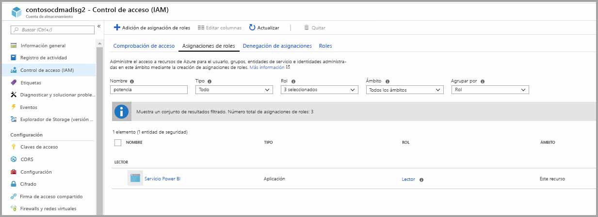

Nota: Permita un mínimo de 30 minutos para que el permiso se propague a Power BI desde Portal. Cada vez que cambie el permiso en Portal, debería dejar 30 minutos para que esto se refleje en Power BI antes de volver a intentarlo. 

### Crear un sistema de archivos para Power BI

Debe crear un sistema de archivos denominado *powerbi* para que la cuenta de almacenamiento se pueda agregar a Power BI. Hay muchas maneras de crear dicho sistema de archivos, como usar Azure Databricks, HDInsight, AZCopy o el Explorador de Azure Storage. En esta sección se muestra una manera sencilla de crear un sistema de archivos mediante el Explorador de Azure Storage.

Este paso requiere que instale la versión 1.6.2 o posterior del Explorador de Azure Storage. Para instalar el Explorador de Azure Storage para Windows, Macintosh o Linux, consulte [Explorador de Azure Storage](https://azure.microsoft.com/features/storage-explorer/).

1. Cuando haya instalado correctamente el Explorador de Azure Storage, al primer inicio, se muestra la ventana Explorador de Azure Storage - Conectar. Mientras que el Explorador de Storage proporciona varias maneras de conectarse a las cuentas de almacenamiento, actualmente solo se admite una para la configuración necesaria. 

2. En el panel izquierdo, busque y expanda la cuenta de almacenamiento que creó anteriormente.

3. Haga clic con el botón derecho en Contenedores de blobs y, en el menú contextual, seleccione Crear contenedor de blobs.

   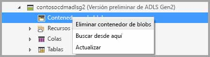

4. Aparecerá un cuadro de texto debajo de la carpeta Contenedores de blobs. Escriba el nombre *powerbi*. 

   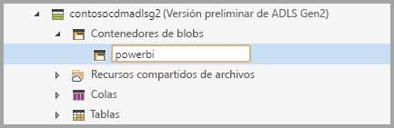

5. Cuando haya terminado de crear el contenedor de blobs, presione Entrar.

   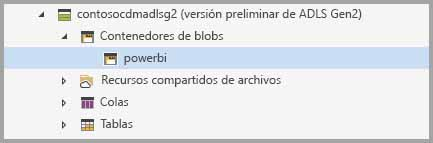

En la siguiente sección, concederá a la familia de servicios de Power BI acceso completo al sistema de archivos que ha creado. 

### Conceder permisos de Power BI para el sistema de archivos

Para conceder permisos para el sistema de archivos, aplicará la configuración de lista de control de acceso (ACL) que concede acceso al servicio Power BI. El primer paso para hacer esto es obtener la identidad de los servicios Power BI de su inquilino. Puede ver las aplicaciones de Azure Active Directory (AAD) en la sección **Aplicaciones empresariales** de Azure Portal.

Para buscar las aplicaciones de inquilino, siga estos pasos:

1. En [Azure Portal](https://portal.azure.com/), seleccione **Azure Active Directory** en el panel de navegación izquierdo.
2. En la hoja **Azure Active Directory**, seleccione **Aplicaciones empresariales**.
3. En el menú desplegable **Tipo de aplicación**, seleccione **Todas las aplicaciones** y, luego, seleccione **Aplicar**. Aparece un ejemplo de las aplicaciones de inquilino, similar a la siguiente imagen.

    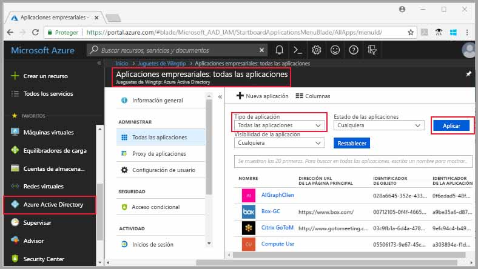

4. En la barra de búsqueda, escriba *Power*; aparecerá una colección de identificadores de objeto para aplicaciones de Power BI y Power Query. Necesitará los tres valores en los pasos siguientes.  

    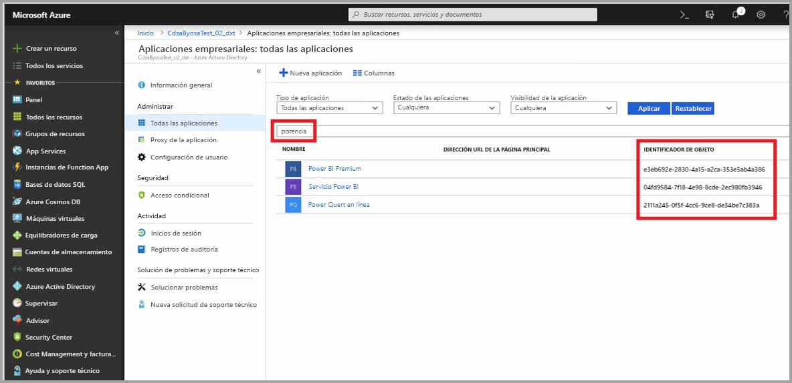

5. Seleccione y copie los identificadores de objeto del servicio Power BI y Power BI prémium de los resultados de la búsqueda. Prepárese para pegar esos valores en los pasos subsiguientes.

7. A continuación, use el **Explorador de Azure Storage** para desplazarse hasta el sistema de archivos *powerbi* que creó en la sección anterior. Siga las instrucciones de la sección [Managing access](https://docs.microsoft.com/azure/storage/blobs/data-lake-storage-how-to-set-permissions-storage-explorer#managing-access) (Administración del acceso) del artículo [Set file and directory level permissions using Azure Storage explorer](https://docs.microsoft.com/azure/storage/blobs/data-lake-storage-how-to-set-permissions-storage-explorer) (Establecimiento de permisos de nivel de archivo y directorio mediante el Explorador de Azure Storage).

8. Para cada uno de los identificadores de objeto de Power BI recopilados en el paso 5, asigne acceso de **lectura**, **escritura** y **ejecución** y listas de control de acceso predeterminadas al sistema de archivos *powerbi*.

   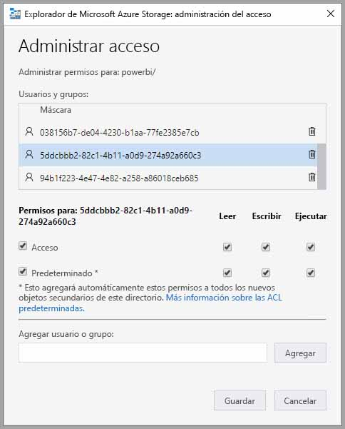

9. Para el identificador de objeto en línea de Power Query recopilado en el paso 4, asigne acceso de **escritura** y **ejecución** y listas de control de acceso predeterminadas al sistema de archivos *powerbi*.

   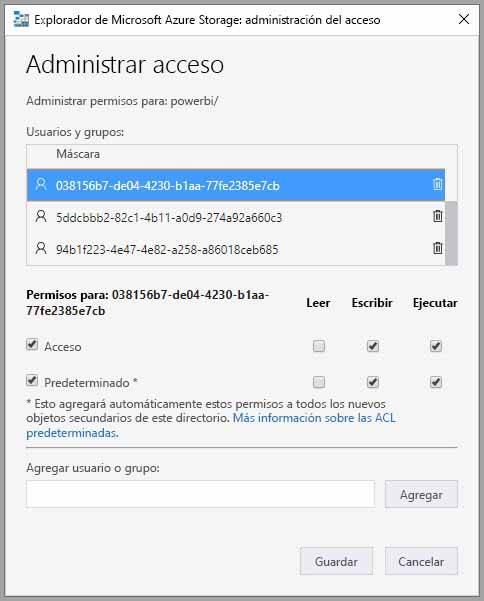

10. Además, para **Otros**, asigne también acceso de **ejecución** y listas ACL predeterminadas.

    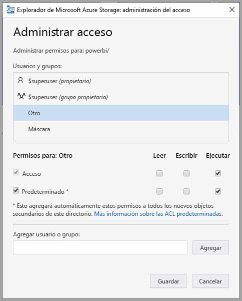

## Conectar la instancia de Azure Data Lake Storage Gen2 a Power BI

Una vez que ha configurado su cuenta de Azure Data Lake Storage Gen2 en Azure Portal, la conectará a Power BI en el **portal de administración de Power BI**. También administrará el almacenamiento de flujo de datos de Power BI en la sección de configuración de **almacenamiento de flujo de datos (versión preliminar)** del portal de administración de Power BI. Para instrucciones e información detallada sobre el inicio y el uso básico, consulte [Acceso al portal de administración](service-admin-portal.md).

Conectará la cuenta de **Azure Data Lake Storage Gen2** con los siguientes pasos:

1. Vaya a la pestaña **Configuración de flujo de datos (versión preliminar)** del **portal de administración de Power BI**

    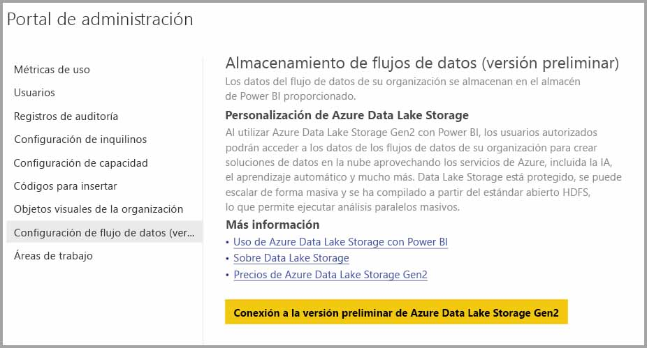 

2. Seleccione el botón **Connect your Azure Data Lake Storage Gen2 Preview** (Conexión a Azure Data Lake Storage Gen2 [versión preliminar]). Aparecerá la siguiente ventana.

    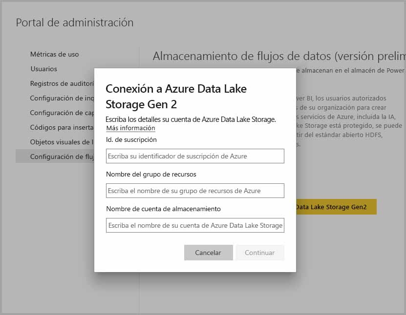 

3. Proporcione el **identificador de suscripción** de la cuenta de almacenamiento.
4. Proporcione el **nombre del grupo de recursos** en el que se creó la cuenta de almacenamiento.
5. Proporcione el **nombre de la cuenta de almacenamiento**.
6. Seleccione **Conectar**.

Una vez completados esos pasos correctamente, la cuenta de Azure Data Lake Storage Gen2 está conectada a Power BI. 

> [!NOTE]
> Para configurar una conexión a Azure Data Lake Storage Gen2 en el portal de administración de Power BI, debe tener permisos de administrador global. Sin embargo, los administradores globales no pueden conectar el almacenamiento externo en el portal de administración.  

A continuación, debe permitir que las personas de su organización configuren sus áreas de trabajo, de forma que puedan usar esta cuenta de almacenamiento para la definición del flujo de datos y el almacenamiento de datos. Lo haremos en la sección siguiente. 

## Permitir que los administradores asignen áreas de trabajo

De forma predeterminada, los archivos de definición de flujo de datos y de datos se almacenan en el almacenamiento proporcionado por Power BI. Para acceder a los archivos de flujo de datos en su propia cuenta de almacenamiento, los administradores del área de trabajo deben configurar primero el área de trabajo para permitir la asignación y el almacenamiento de flujos de datos en la nueva cuenta de almacenamiento. Para que un administrador del área de trabajo pueda configurar los parámetros de almacenamiento de flujo de datos, dicho administrador debe tener permisos de asignación de almacenamiento en el **portal de administración de Power BI**.

Para conceder permisos de asignación de almacenamiento, vaya a la pestaña **Configuración de flujo de datos (versión preliminar)** en el **portal de administración de Power BI**. Hay un botón de radio para *Permitir que los administradores de áreas de trabajo asignen áreas de trabajo a esta cuenta de almacenamiento* que debe establecerse en **permitir**. Una vez que habilite ese control deslizante, seleccione el botón **Aplicar** para que el cambio surta efecto. 

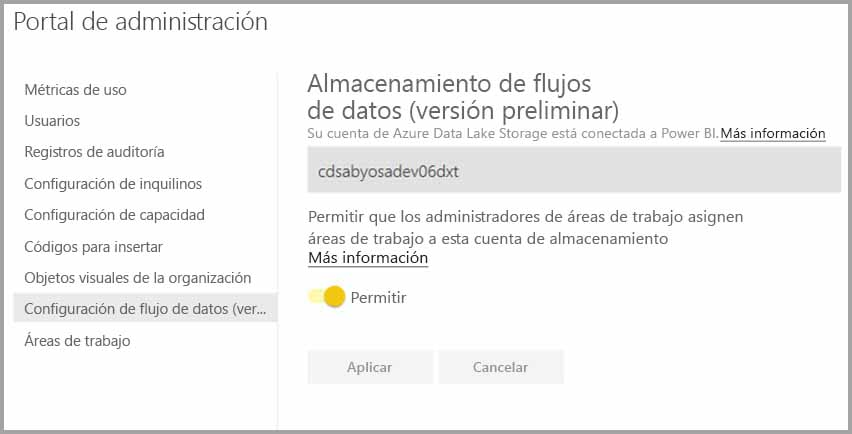 

Ya está. Los administradores del área de trabajo de Power BI ahora pueden asignar los flujos de trabajo al sistema de archivos que ha creado.

## Consideraciones y limitaciones

Esta es una característica en versión preliminar y su comportamiento puede cambiar a medida que se acerque el lanzamiento. Hay algunas consideraciones y limitaciones que se deben tener en cuenta al trabajar con el almacenamiento de flujo de datos:

* Una vez que se ha configurado una ubicación de almacenamiento de flujo de datos, no se puede cambiar.
* Solo los propietarios de un flujo de datos almacenado en Azure Data Lake Storage Gen2 pueden acceder a sus datos de forma predeterminada. Para autorizar los flujos de datos almacenados en Azure para otras personas, debe agregarlos a la carpeta de CDS del flujo de datos. 
* La creación de flujos de datos con entidades vinculadas solo es posible cuando se almacenan en la misma cuenta de almacenamiento.
* Los orígenes de datos locales, en capacidades compartidas de Power BI, no se admiten en los flujos de datos almacenados en la instancia de Data Lake de su organización.

También hay algunos problemas conocidos, como se describe en esta sección.

Los clientes de Power BI Desktop no pueden acceder a los flujos de datos almacenados en una **cuenta de Azure Data Lake Storage** a menos que sean propietarios del flujo de datos, o que tengan autorización explícita para la carpeta de CDS en la instancia de Data Lake. El escenario es el siguiente:

1. Anna ha creado un área de trabajo de la aplicación y la ha configurado para almacenar flujos de datos en la instancia de Data Lake de la organización. 
2. Ben, que también es miembro del área de trabajo que ha creado Anna, querría usar Power BI Desktop y el conector de flujo de datos para obtener datos del flujo de datos que ha creado su compañera.
3. Ben recibe un error similar al de la siguiente imagen, ya que no tiene autorización para la carpeta de CDS del flujo de datos en la instancia de Data Lake.

Algunas de las preguntas y respuestas más frecuentes son:

**Pregunta:** ¿Y si hubiera creado anteriormente flujos de datos en un área de trabajo y quisiera cambiar su ubicación de almacenamiento?

**Respuesta:** No puede cambiar la ubicación de almacenamiento de un flujo de datos después de que se ha creado. 

**Pregunta:** ¿Cuándo se puede cambiar la ubicación de almacenamiento del flujo de datos de un área de trabajo?

**Respuesta:** Solo se permite cambiar la ubicación de almacenamiento del flujo de datos de un área de trabajo si el área de trabajo no contiene flujos de datos.

## Pasos siguientes

En este artículo se proporcionan instrucciones sobre cómo conectar una instancia de Azure Data Lake Gen2 para el almacenamiento de flujo de datos. Para más información, eche un vistazo a los siguientes artículos:

Para más información sobre flujos de datos, CDS y Azure Data Lake Storage Gen2, eche un vistazo a los siguientes artículos:

* [Integración de flujos de datos y Azure Data Lake (versión preliminar)](service-dataflows-azure-data-lake-integration.md)
* [Configuración de opciones de flujo de datos del área de trabajo (versión preliminar)](service-dataflows-configure-workspace-storage-settings.md)
* [Incorporación de una carpeta de CDS a Power BI como flujo de datos (versión preliminar)](service-dataflows-add-cdm-folder.md)

Para información sobre los flujos de datos en general, consulte estos artículos:

* [Creación y uso de flujos de datos en Power BI](service-dataflows-create-use.md)
* [Uso de entidades calculadas en Power BI Premium (versión preliminar)](service-dataflows-computed-entities-premium.md)
* [Uso de flujos de datos con orígenes de datos locales (versión preliminar)](service-dataflows-on-premises-gateways.md)
* [Recursos de desarrollador para flujos de datos de Power BI](service-dataflows-developer-resources.md)

Para más información sobre Azure Storage, puede leer estos artículos:
* [Guía de seguridad de Azure Storage](https://docs.microsoft.com/azure/storage/common/storage-security-guide)

Para más información sobre Common Data Service, puede leer su artículo de introducción:
* [Introducción a Common Data Service](https://docs.microsoft.com/powerapps/common-data-model/overview)
* [Carpetas de CDS](https://go.microsoft.com/fwlink/?linkid=2045304)
* [Definición del archivo de modelo de CDS](https://go.microsoft.com/fwlink/?linkid=2045521)

Y, siempre puede intentar [plantear preguntas a la comunidad de Power BI](http://community.powerbi.com/).
