# Creación y uso de flujos de datos en Power BI

Con la preparación de datos avanzada disponible en **Power BI**, puede crear una colección de datos denominada flujo de datos, que puede usar después para conectarse a los datos empresariales de varios orígenes, limpiar los datos, transformarlos y cargarlos en el almacenamiento de Power BI.

Un **flujo de datos** es una colección de *entidades* (las entidades son similares a las tablas) que se crean y administran en las áreas de trabajo del servicio Power BI. Puede agregar y editar entidades en el flujo de datos, así como administrar las programaciones de actualización de datos, directamente desde el área de trabajo en la que se creó el flujo de datos.

Una vez que ha creado un flujo de datos, puede usar **Power BI Desktop** y el **servicio Power BI** para crear conjuntos de datos, informes, paneles y aplicaciones que se basan en los datos integrados en los flujos de datos de Power BI y obtener así información detallada en las actividades empresariales.

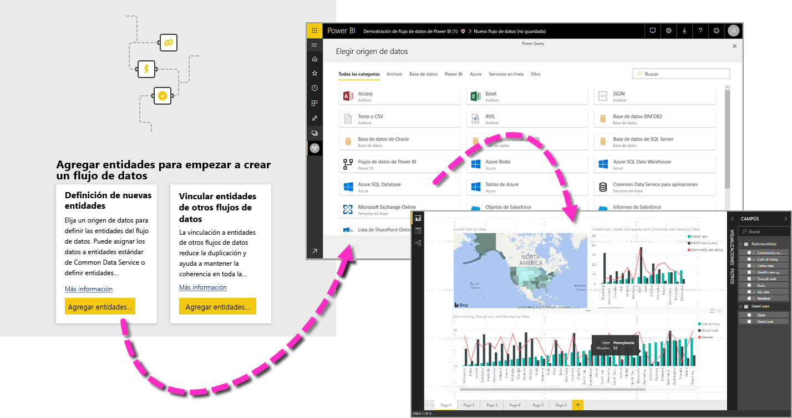

Hay tres pasos principales para usar un flujo de datos:

1. Crear el flujo de datos, mediante herramientas de Microsoft que están diseñadas para facilitar este trabajo
2. Programar la frecuencia de actualización de los datos que desea incorporar a su flujo de datos
3. Crear el conjunto de datos mediante el flujo de datos con Power BI Desktop 

En las secciones siguientes, observamos cada uno de estos pasos y nos familiarizamos con las herramientas proporcionadas para completar cada paso. Comencemos.

## Creación de un flujo de datos
Para crear un flujo de datos, inicie el servicio Power BI en un explorador y luego seleccione un **área de trabajo** (los flujos de datos no están disponibles en *Mi área de trabajo* en el servicio Power BI) en el panel de navegación de la izquierda, como se muestra en la siguiente pantalla. También puede crear un área de trabajo en el que crear el flujo de datos. 

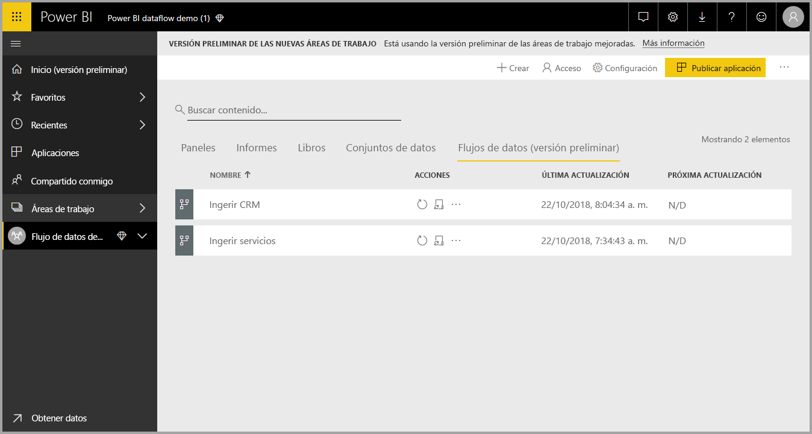

Cuando esté en un **área de trabajo** donde pueda crear un flujo de datos, el botón **+ Crear** aparecerá en la esquina superior derecha del lienzo. Seleccione el botón **+ Crear** y luego seleccione **Flujo de datos** en la lista desplegable. 

Es importante saber que hay solo *un propietario* de cualquier flujo de datos, que es la persona que lo crea. Solo el propietario puede modificar el flujo de datos. Todos los miembros del **área de trabajo** que tienen permisos de lectura o escritura en el área de trabajo donde se crea el flujo de datos pueden conectarse al flujo de datos desde **Power BI Desktop**, como se describe más adelante en este artículo.

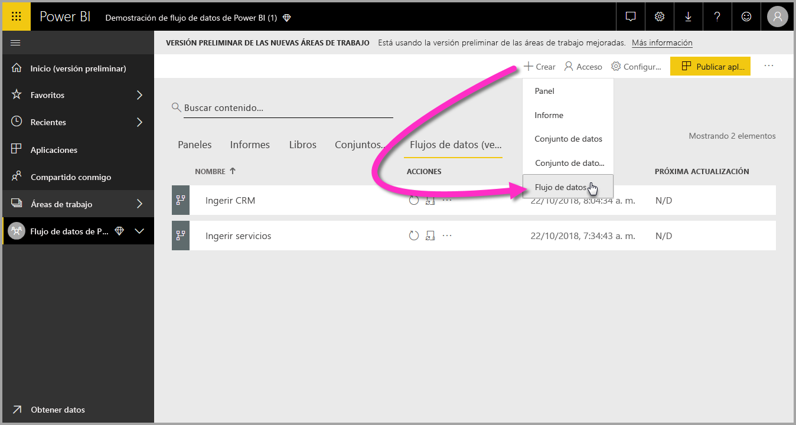

Desde ahí, agregue **entidades**, que se describen con más detalle en la siguiente sección.

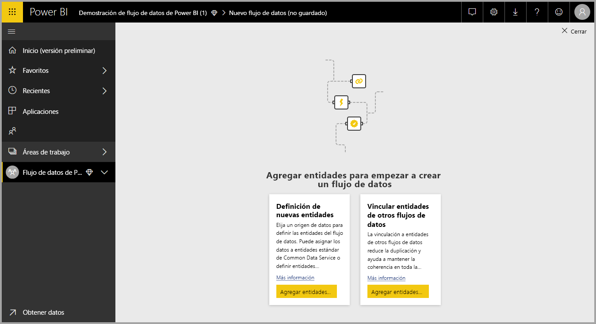

### Agregar entidades

Una **entidad** es un conjunto de campos que se usan para almacenar datos, muy similar a una tabla en una base de datos. En la siguiente imagen, verá la selección de orígenes de datos desde los que puede ingerir datos en Power BI.

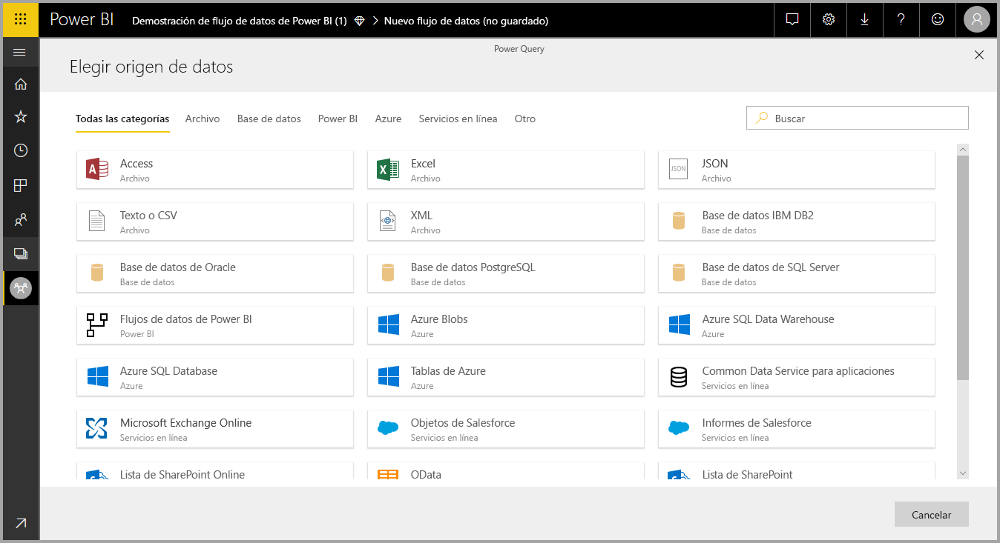

Al seleccionar un origen de datos, se le pedirá que proporcione la configuración de conexión, incluida la cuenta que se debe utilizar al conectarse al origen de datos, como se muestra en la siguiente imagen.

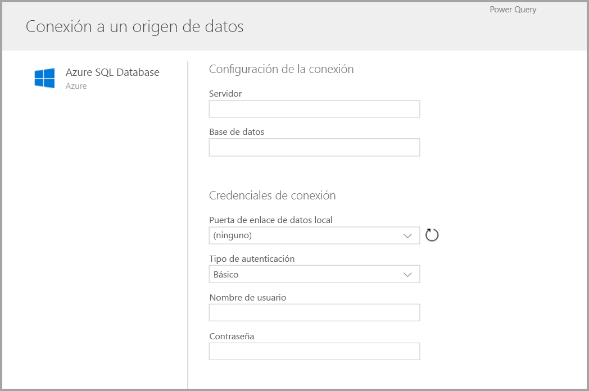

Una vez conectado, puede seleccionar qué datos desea utilizar para la entidad. Al elegir los datos y un origen, Power BI posteriormente se volverá a conectar al origen de datos con el fin de mantener actualizados los datos en el flujo de datos, con la frecuencia que seleccione más adelante en el proceso de instalación.

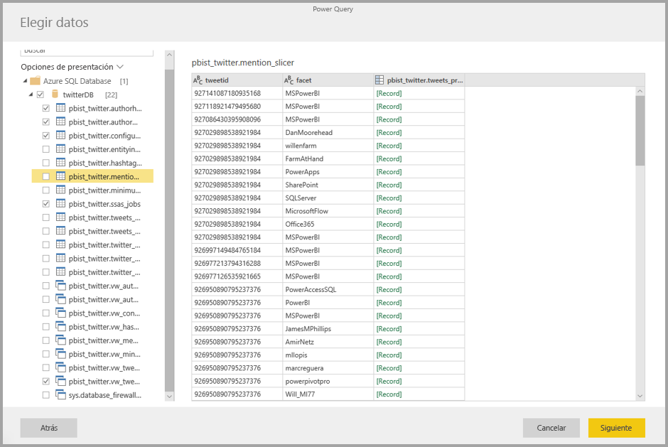

Una vez que seleccione los datos para usarlos en la entidad, puede usar el editor de flujo de datos para dar forma o transformar datos en el formato necesario para su uso en el flujo de datos.

### Uso del editor de flujo de datos

Una vez seleccionados los datos del origen que desea usar para la entidad, puede dar forma a la selección de los datos en el formato más adecuado para su entidad, con el uso de una experiencia de edición de Power Query, similar al **Editor de Power Query** en **Power BI Desktop**. Puede obtener más información sobre Power Query (Power Query se incorpora en Power BI Desktop como el Editor de Power Query) en el [artículo de información general sobre consultas](desktop-query-overview.md) para Power BI Desktop. 

Si desea ver el código que el Editor de consultas está creando con cada paso, o si desea crear su propio código de forma, puede usar el **Editor avanzado**. 

### Flujos de datos y Common Data Service (CDM)

Las entidades de flujos de datos incluyen nuevas herramientas para asignar con facilidad los datos empresariales a Common Data Service (esquema estandarizado de Microsoft), enriquecerlos con datos de Microsoft y de terceros y obtener acceso simplificado a aprendizaje automático. Estas nuevas funcionalidades se pueden usar para ofrecer información detallada inteligente y útil en los datos empresariales. Una vez completadas todas las transformaciones en el paso de edición de consultas, puede asignar columnas de las tablas de origen de datos a campos de entidad estándar, según se define en Common Data Service. Las entidades estándar tienen un esquema conocido definido por Common Data Service.

Obtenga información sobre este enfoque y sobre Common Data Service en el artículo [¿Qué es Common Data Service?](https://docs.microsoft.com/powerapps/common-data-model/overview)

Para usar Common Data Service con el flujo de datos, haga clic en la transformación **Asignar a estándar** en el cuadro de diálogo **Editar consultas**. En la pantalla **Asignar entidades** que aparece, puede seleccionar la entidad estándar a la que desea asignar.

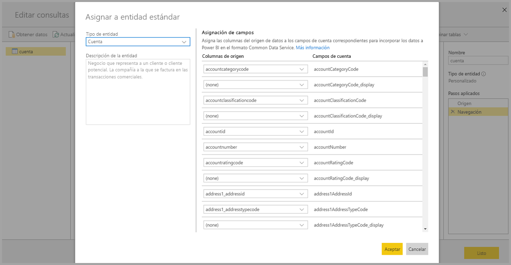

Al asignar una columna de origen a un campo estándar, ocurre lo siguiente:

1. La columna de origen adopta el nombre del campo estándar (el nombre de la columna se cambia si los nombres son distintos).
2. La columna de orígenes obtiene el tipo de datos de campos estándar.

Para mantener la entidad estándar de Common Data Service, todos los campos estándar no asignados obtienen valores *NULL*.

Todas las columnas de origen que no están asignadas permanecen tal cual, para garantizar que el resultado de la asignación sea una entidad estándar con campos personalizados.

Una vez completadas las selecciones y cuando la entidad y la configuración de sus datos estén listas para guardarse, puede seleccionar **Guardar** en el menú. Tenga en cuenta que puede crear varias entidades seleccionando el botón **Agregar entidades** y que se pueden editar entidades para restringir las consultas y las entidades que ha creado.

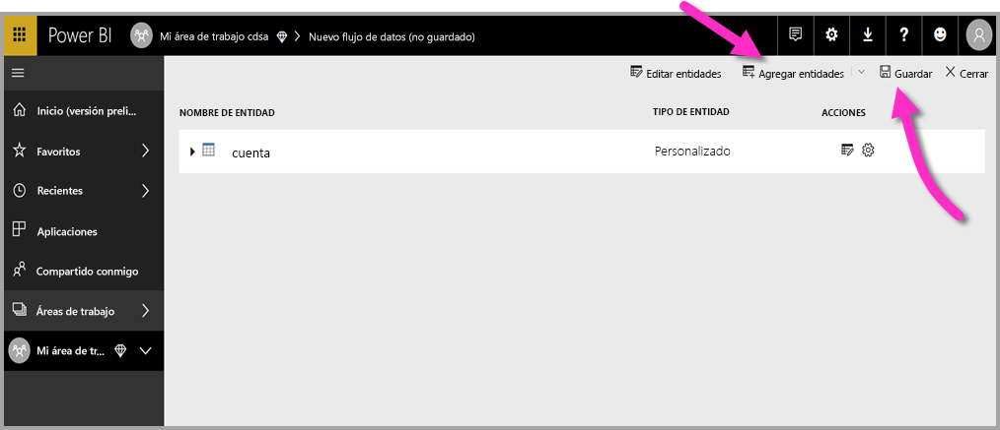

Al seleccionar **Guardar**, se le pedirá que asigne un nombre al flujo de datos y que proporcione una descripción.

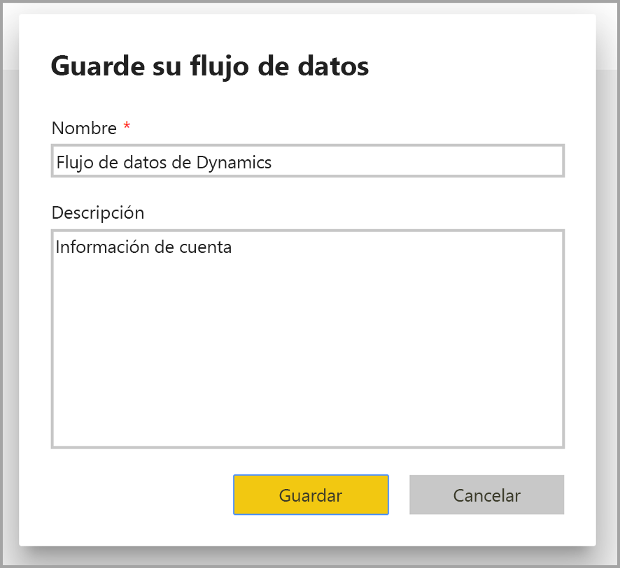

Cuando esté listo y seleccione el botón **Guardar**, se abre una ventana que le permite saber que el **flujo de datos** se ha creado. 

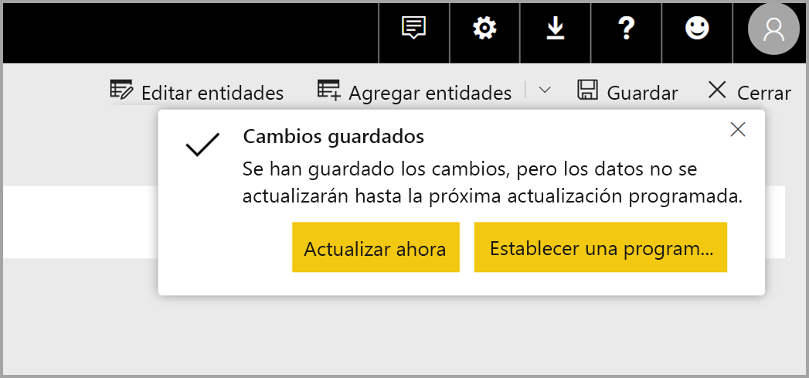

Muy bien, ahora está listo para el siguiente paso, que es programar la frecuencia de actualización de los orígenes de datos.

## Programación de la frecuencia de actualización

Una vez guardado el flujo de datos, desea programar la frecuencia de actualización de cada uno de los orígenes de datos conectados.

Los flujos de datos de Power BI usan el proceso de actualización de datos de Power BI para mantener los datos actualizados. En el **servicio Power BI**, en la sección **Área de trabajo**, hay una colección de áreas donde la información puede mostrarse, incluidos los flujos de datos, tal como se muestra en la siguiente imagen.

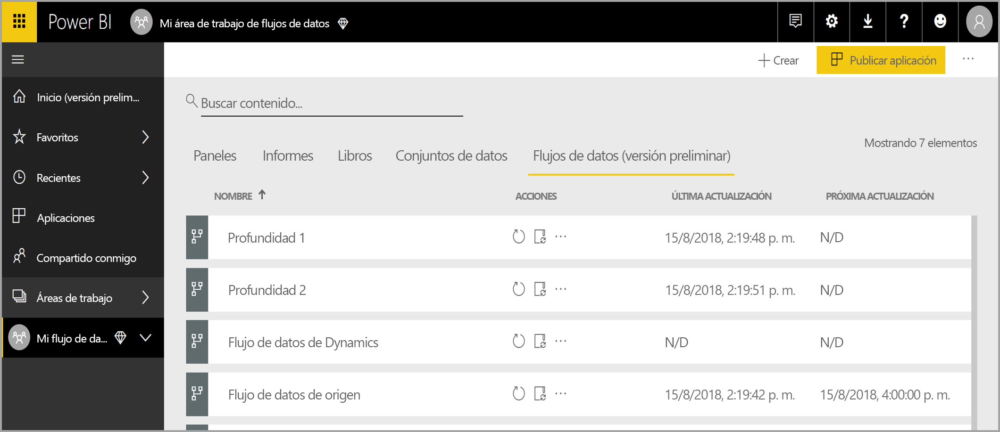

La entrada *Dynamics dataflow* de la imagen anterior es el flujo de datos creado en la sección anterior. Para programar la actualización, seleccione el icono **Programar actualización**, en la sección **Acciones**, como se muestra en la siguiente imagen. 

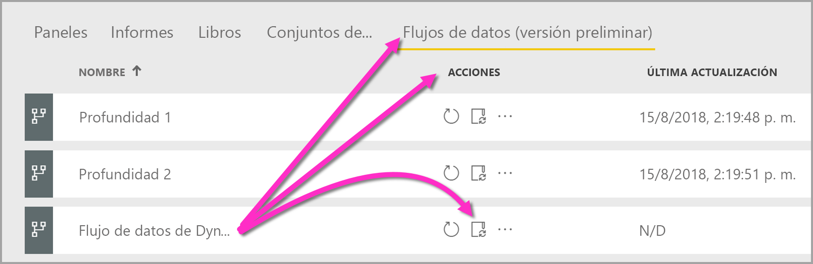

Cuando selecciona el icono **Programar actualización**, se le remite al panel **Programar actualización**, que le permite establecer la hora y la frecuencia de actualización del flujo de datos.

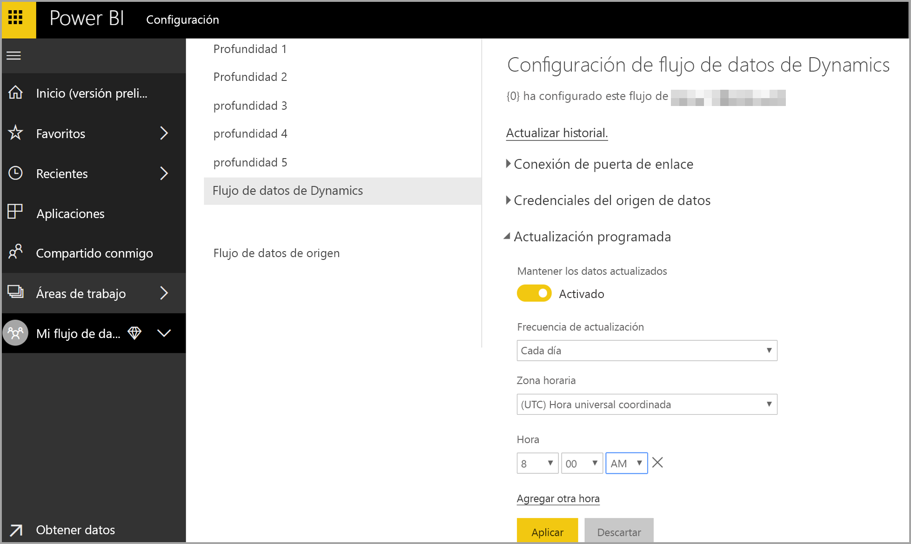

Para más información sobre la programación de actualizaciones, vea el artículo sobre la [configuración de la actualización programada](refresh-scheduled-refresh.md), donde se describe el comportamiento de actualización de los conjuntos de datos de Power BI. Los flujos de datos se comportan de la misma forma que los conjuntos de datos de Power BI en términos de configuración de la actualización. 

## Conexión a un flujo de datos en Power BI Desktop

Una vez creado su flujo de datos y programada la frecuencia de actualización de cada origen de datos que rellenará el modelo, está listo para el tercer y último paso, que se conecta a su flujo de datos desde **Power BI Desktop**. 

Para conectarse al flujo de datos, en Power BI Desktop, seleccione **Obtener datos > Power BI > Flujos de datos de Power BI (Beta)** , como se muestra en la siguiente imagen.

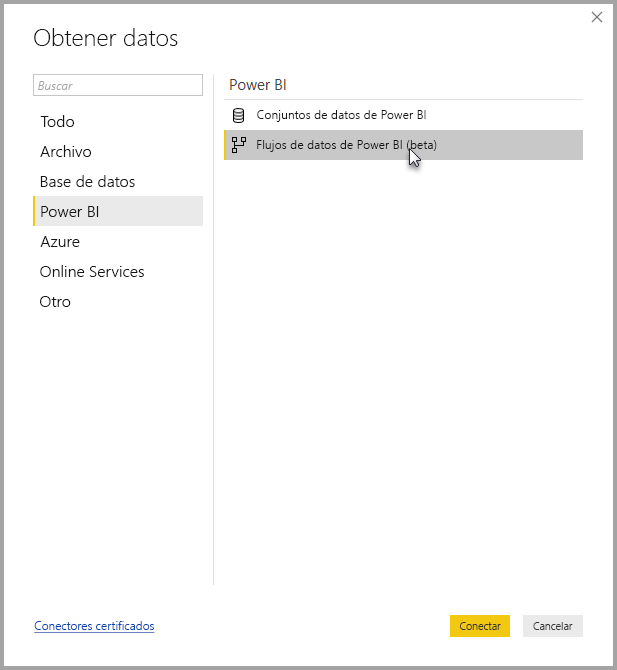

Desde ahí, vaya al **área de trabajo** donde ha guardado el flujo de datos, seleccione el flujo de datos y, a continuación, seleccione en la lista las entidades que creó.

También puede usar la **barra de búsqueda**, cerca de la parte superior de la ventana, para encontrar rápidamente el nombre de su flujo de datos o las entidades entre muchas entidades de flujo de datos.

Al seleccionar la entidad y luego el botón **Cargar**, las entidades aparecen en el panel **Campos** de **Power BI Desktop**, y aparecen y se comportan como las **tablas** de cualquier otro conjunto de datos.

## Uso de los flujos de datos almacenados en Azure Data Lake Storage Gen2

Puede que algunas organizaciones quieran usar su propio almacenamiento para crear y administrar flujos de datos. Puede integrar flujos de datos con Azure Data Lake Storage Gen2 si sigue los requisitos y administra los permisos correctamente. Se puede encontrar documentación de todos los requisitos de este enfoque empezando con el documento de información general [Integración de flujos de datos y Azure Data Lake (versión preliminar)](service-dataflows-azure-data-lake-integration.md).

## Solución de problemas de las conexiones de datos

Puede haber ocasiones en las que la conexión a los orígenes de datos de los flujos de datos generen problemas. En esta sección se proporcionan sugerencias para solucionar los problemas de este tipo que puedan surgir. 

* **Conector de Salesforce**: el uso de una cuenta de evaluación para Salesforce con flujos de datos genera un error de conexión sin proporcionar información. Para resolver este problema, use una cuenta de Salesforce de producción o una cuenta de desarrollador para las pruebas.

* **Conector de SharePoint**: asegúrese de proporcionar la dirección raíz del sitio de SharePoint, sin subcarpetas ni documentos. Por ejemplo, use un vínculo similar al siguiente: https://microsoft.sharepoint.com/teams/ObjectModel/ 

* **Conector de archivos JSON**: actualmente puede conectarse a un archivo JSON solo con autenticación básica.  La conexión a un archivo de JSON proporcionando las credenciales en la URL (por ejemplo, https://XXXXX.blob.core.windows.net/path/file.json?sv=2019-01-01&si=something&sr=c&sig=123456abcdefg.. ) **no** se admite actualmente.  

* **Azure SQL Data Warehouse**: actualmente los flujos de datos no admiten la autenticación de Azure Active Directory (AAD) para Azure SQL Data Warehouse. Use la autenticación básica en este caso.

## Pasos siguientes

En este artículo se describe cómo puede crear su propio **flujo de datos** y un conjunto de datos y un informe en **Power BI Desktop** para beneficiarse de ello. Los siguientes artículos resultan útiles para obtener más información y escenarios al utilizar flujos de datos:

* [Preparación de datos de autoservicio con flujos de datos](service-dataflows-overview.md)
* [Uso de entidades calculadas en Power BI Premium](service-dataflows-computed-entities-premium.md)
* [Uso de flujos de datos con orígenes de datos locales](service-dataflows-on-premises-gateways.md)
* [Recursos para desarrolladores sobre flujos de datos de Power BI](service-dataflows-developer-resources.md)
* [Integración de flujos de datos y Azure Data Lake (versión preliminar)](service-dataflows-azure-data-lake-integration.md)

Para más información sobre Common Data Service, puede leer su artículo de introducción:
* [Introducción a Common Data Service](https://docs.microsoft.com/powerapps/common-data-model/overview)
* [Más información sobre el esquema y las entidades de Common Data Service en GitHub](https://github.com/Microsoft/CDM)

Artículos relacionados de Power BI Desktop:

* [Conexión a conjuntos de datos del servicio Power BI desde Power BI Desktop](desktop-report-lifecycle-datasets.md)
* [Información general sobre consultas en Power BI Desktop](desktop-query-overview.md)

Artículos relacionados con el servicio Power BI:
* [Configuración de la actualización programada](refresh-scheduled-refresh.md)
