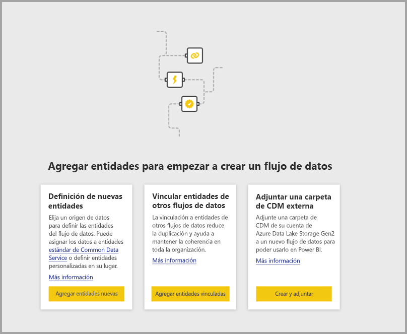
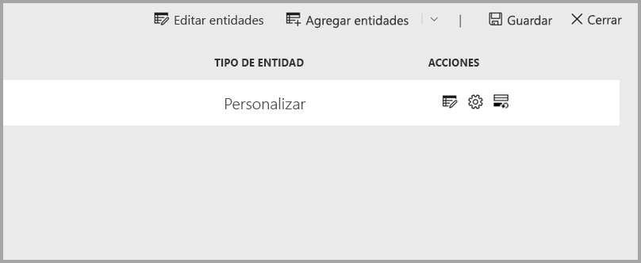
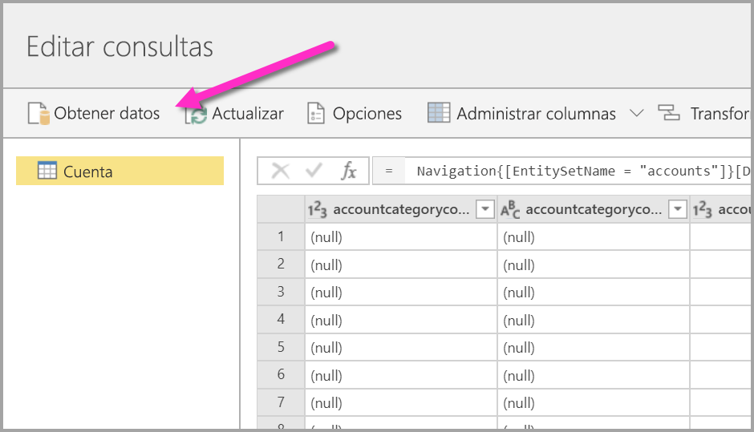
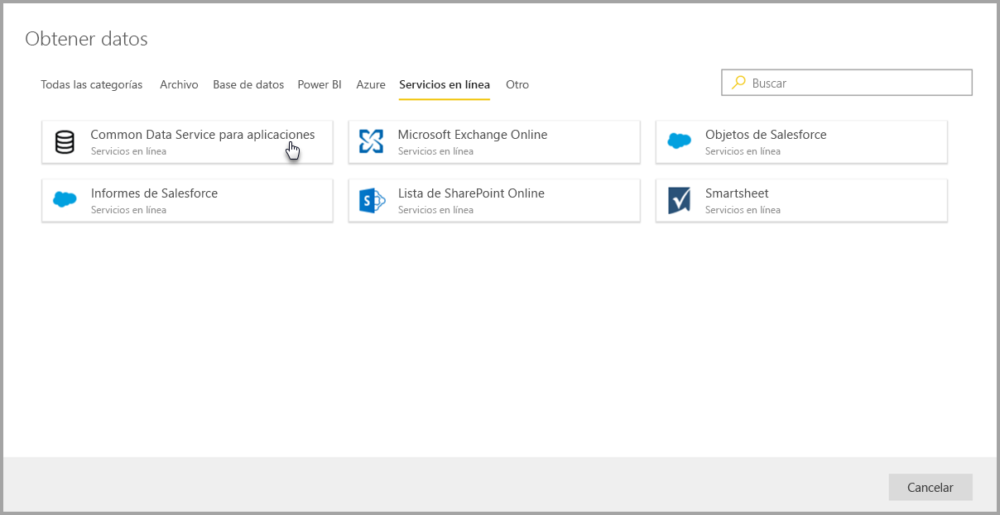
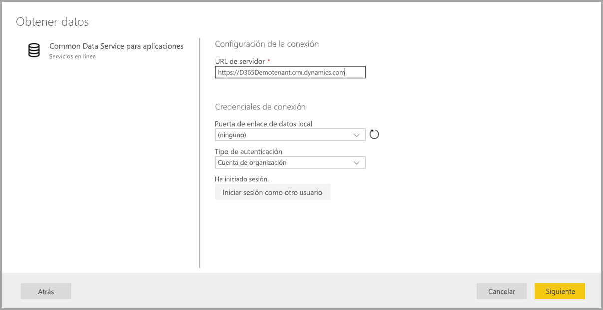
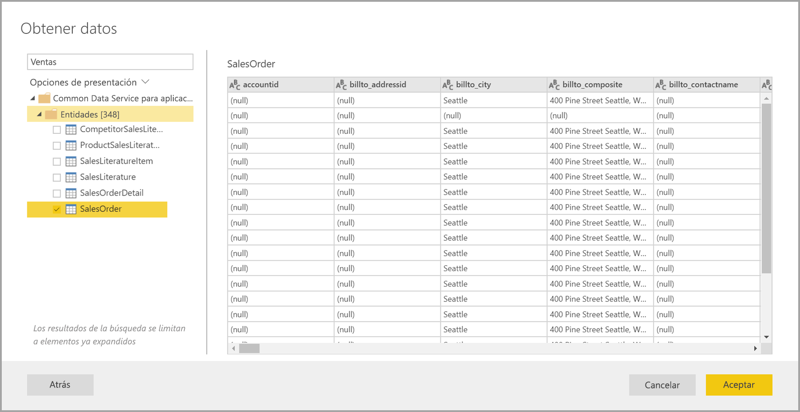
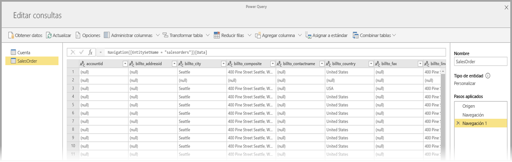
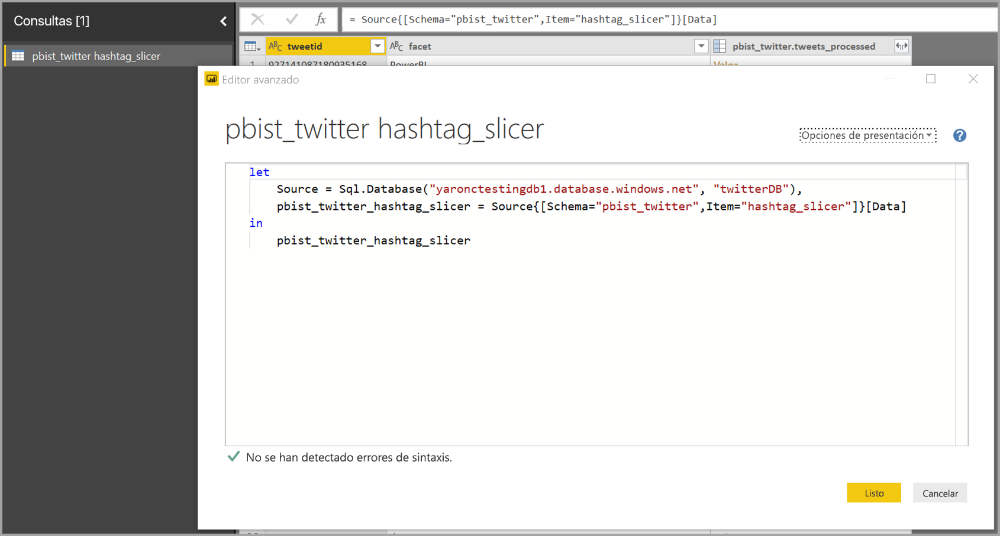
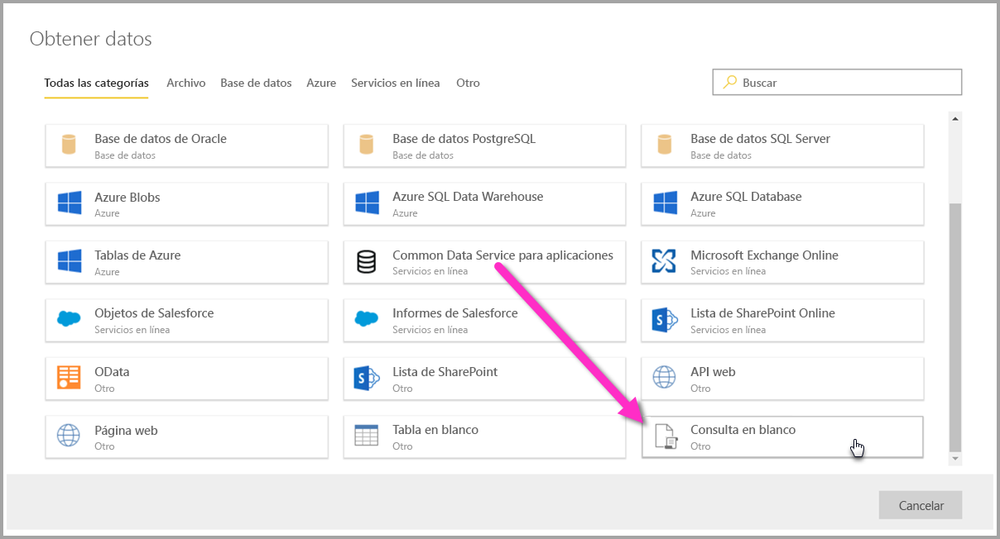
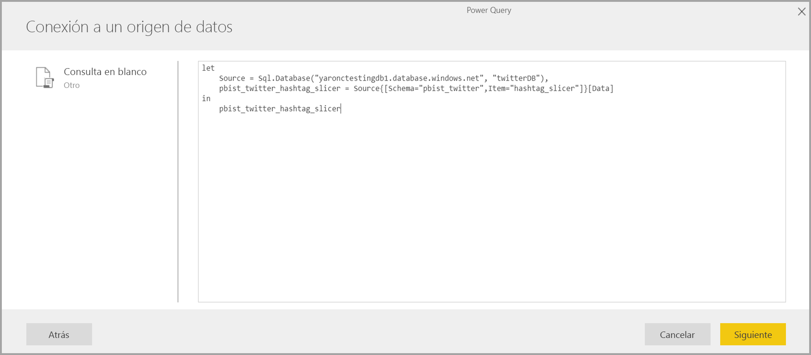

# Conectarse a orígenes de datos de flujos de datos de Power BI (versión preliminar)

Con los flujos de datos de Power BI, puede conectarse a numerosos orígenes de datos diferentes para crear flujos de datos o agregar nuevas entidades a un flujo de datos ya existente.

En este artículo se enumeran los muchos orígenes de datos que existen para crear flujos de datos o agregar elementos a estos y, asimismo, se describe cómo crear flujos de datos usando esos orígenes de datos.

Para obtener información general sobre cómo crear y utilizar flujos de datos, vea [Creación y uso de flujos de datos en Power BI (versión preliminar)](service-dataflows-create-use.md).

## Crear un flujo de datos a partir de un origen de datos

Para conectarse a los datos, en el **servicio Power BI** seleccione el elemento de menú **+ Crear** y, luego, seleccione **flujo de datos** en el menú que aparece. Cuando se selecciona esta opción, la siguiente imagen aparece en el lienzo del servicio Power BI. 

Si ya existe un flujo de datos, puede agregar nuevas entidades a este; para ello, seleccione **Agregar entidades**, como se muestra abajo, o bien seleccione **Obtener datos** en la herramienta de creación de flujos de datos.

En la siguiente imagen se muestra el botón **Obtener datos** en la herramienta de creación de flujos de datos. 

## Orígenes de datos de flujos de datos

Puede ver los orígenes de datos disponibles si selecciona **Obtener datos** en la herramienta de creación de flujos de datos. Esto hará que se abra un cuadro de diálogo para seleccionar las categorías y cada origen de datos, como se muestra en la siguiente imagen.

Los orígenes de datos de los flujos de datos se organizan en las siguientes categorías, que aparecen dispuestas a lo largo de la parte superior del cuadro de diálogo **Obtener datos**:

* Todas las categorías
* Archivo
* Base de datos
* Power BI
* Azure
* Online Services
* Otro

La categoría **Todas las categorías** incluye todos los tipos de orígenes de datos de todas las categorías. 

La categoría **Archivo** incluye las siguientes conexiones de datos disponibles para los flujos de datos:

* Acceso
* Excel
* JSON
* Texto o CSV
* XML

La categoría **Base de datos** incluye las siguientes conexiones de datos disponibles para los flujos de datos:

* Base de datos IBM DB2
* Base de datos de MySQL
* Base de datos de Oracle
* Base de datos de PostgreSQL
* Base de datos de SQL Server
* Base de datos de Sybase
* Base de datos de Teradata

La categoría **Power BI** incluye las siguientes conexiones de datos disponibles para los flujos de datos:

* Flujos de datos de Power BI

La categoría **Azure** incluye las siguientes conexiones de datos disponibles para los flujos de datos:

* Azure Blobs
* Azure Data Explorer
* Azure SQL Data Warehouse
* Azure SQL Database
* Tablas de Azure

La categoría **Online Services** incluye las siguientes conexiones de datos disponibles para los flujos de datos:

* Common Data Service para aplicaciones
* Microsoft Exchange Online
* Objetos de Salesforce
* Informes de Salesforce
* Lista de SharePoint Online
* Smartsheet

La categoría **Otro** incluye las siguientes conexiones de datos disponibles para los flujos de datos:

* Active Directory
* OData
* Lista de SharePoint
* API web
* Página web
* Tabla en blanco
* Consulta en blanco

## Conectarse a un origen de datos

Para conectarse a un origen de datos, seleccione el origen de datos. Vamos a usar un ejemplo para explicar cómo funciona el proceso, pero cada conexión de datos de los flujos de datos es similar en esencia. Cada conector puede requerir credenciales específicas u otra información, pero el flujo es similar. En nuestro ejemplo, vemos en la siguiente imagen que **Common Data Service for Apps** está seleccionado en la categoría de conexión de datos **Online Services**.

Se abre una ventana de conexión relativa a la conexión de datos seleccionada. Si se necesitan credenciales, se le pedirá que las proporcione. En la siguiente imagen se muestra una dirección URL de servidor que se está introduciendo para conectar a un servidor de Common Data Service for Apps.

Una vez que se ha suministrado la dirección URL del servidor o la información de conexión del recurso, seleccione **Iniciar sesión** para introducir las credenciales que se utilizarán para acceder a los datos. Después, seleccione **Siguiente**.

**Power Query en línea** se inicia, establece la conexión con el origen de datos y, después, muestra las tablas disponibles en ese origen de datos en la ventana **Navegador**, como la de la siguiente imagen.

Si quiere seleccionar tablas y datos para cargarlos, active la casilla junto a cada uno de ellos en el panel izquierdo. Para cargar los datos, seleccione **Aceptar** en la parte inferior del panel **Navegador**. Aparece un cuadro de diálogo de Power Query en línea, donde puede editar las consultas y realizar cualquier otra transformación que quiera llevar a cabo en los datos seleccionados.

Y eso es todo. Otros orígenes de datos tienen flujos similares y usan Power Query en línea para editar y transformar los datos que se incluyen en el flujo de datos.

## Conectarse a otros orígenes de datos

Existen más conectores de datos que no se muestran en la interfaz de usuario de flujos de datos de Power BI, pero que son compatibles con solo realizar algunos pasos extra. 

Puede realizar los siguientes pasos para crear una conexión a un conector que no aparezca en la interfaz de usuario:

1. Abra **Power BI Desktop** y seleccione **Obtener datos**.
2. Abra el **Editor de Power Query** en Power BI Desktop, haga clic con el botón derecho en la consulta correspondiente y abra el **Editor avanzado**, tal y como se muestra en la siguiente imagen. Ahí puede copiar el script M que aparece en el editor avanzado.

     

3. Abra el flujo de datos de Power BI y seleccione **Obtener datos** en relación con una consulta en blanco, tal y como se muestra en la siguiente imagen.

     

4. Pegue la consulta copiada en la consulta en blanco del flujo de datos.

     

Tras esto, el script se conecta al origen de datos especificado. 

En la siguiente lista figuran los conectores que se pueden usar actualmente copiando y pegando la consulta M en una consulta en blanco:

* Amazon Redshift
* SAP Business Warehouse 
* SAP HANA
* Analysis Services
* Azure Analysis Services
* Google Analytics
* Adobe Analytics
* ODBC
* OLE DB
* Carpeta
* Carpeta de SharePoint Online
* Carpeta de SharePoint
* Hadoop HDFS
* Azure HDInsight (HDFS)
* Archivo Hadoop (HDFS)
* Informix (beta)
* Vertica

Eso es todo lo que se necesita para conectarse a orígenes de datos en los flujos de datos de Power BI.

## Pasos siguientes

En este artículo se ha explicado a qué orígenes de datos podemos conectarnos en relación con los flujos de datos. En los siguientes artículos se ofrecen más detalles sobre escenarios de uso común de los flujos de datos. 

* [Preparación de datos de autoservicio en Power BI (versión preliminar)](service-dataflows-overview.md)
* [Creación y uso de flujos de datos en Power BI](service-dataflows-create-use.md)
* [Uso de entidades calculadas en Power BI Premium (versión preliminar)](service-dataflows-computed-entities-premium.md)
* [Uso de flujos de datos con orígenes de datos locales (versión preliminar)](service-dataflows-on-premises-gateways.md)
* [Recursos de desarrollador para flujos de datos de Power BI](service-dataflows-developer-resources.md)
* [Integración de flujos de datos y Azure Data Lake (versión preliminar)](service-dataflows-azure-data-lake-integration.md)

Para obtener más información sobre Power Query y la actualización programada, puede leer estos artículos:
* [Información general sobre consultas en Power BI Desktop](desktop-query-overview.md)
* [Configuración de la actualización programada](refresh-scheduled-refresh.md)

Para más información sobre Common Data Service, puede leer su artículo de introducción:
* [Introducción a Common Data Service](https://docs.microsoft.com/powerapps/common-data-model/overview)

