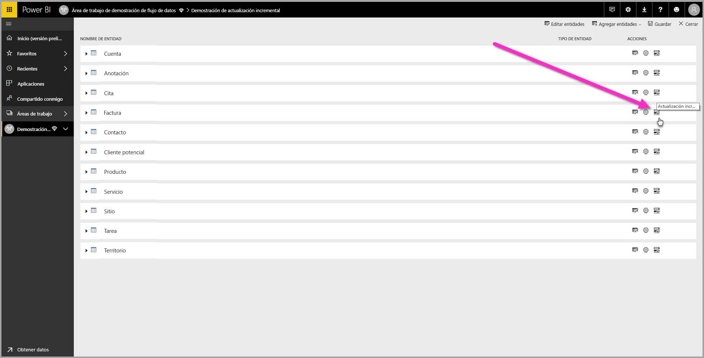
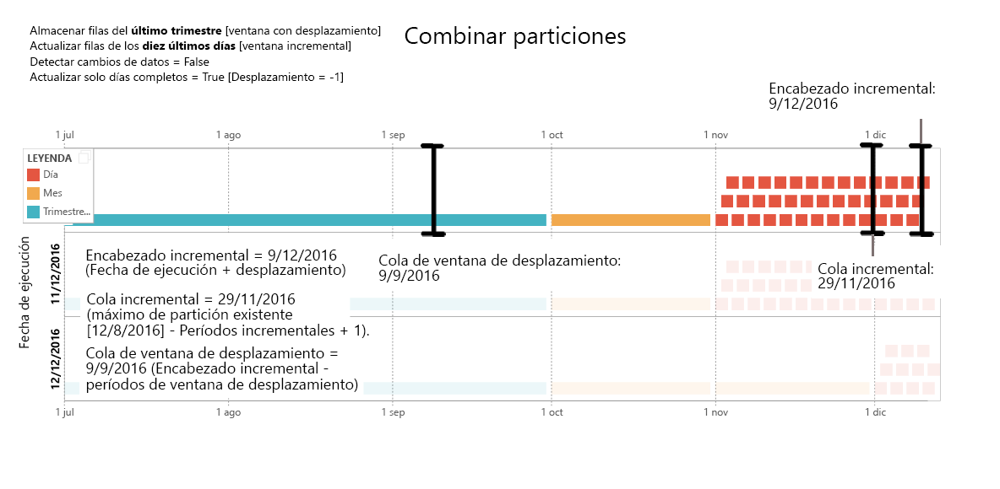
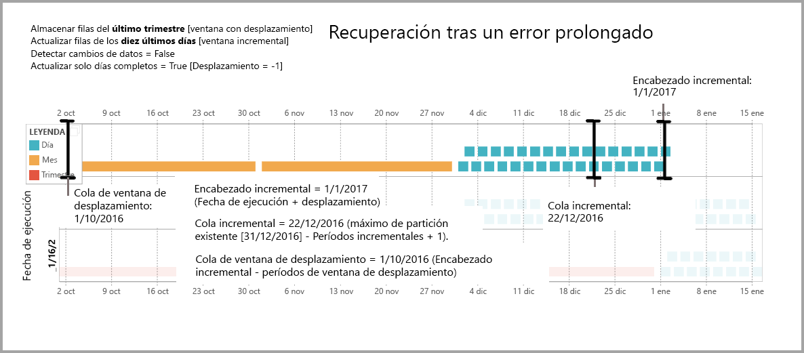

# Uso de la actualización incremental con flujos de datos de Power BI

Con los flujos de datos, puede incorporar grandes cantidades de datos en Power BI para crear atractivos informes y análisis. Sin embargo, en algunos casos, no es práctico actualizar una copia completa de los datos de origen en cada actualización. Una buena alternativa es la **actualización incremental**, que ofrece las siguientes ventajas para los flujos de datos:

* **La actualización se realiza más deprisa**: es necesario actualizar solo los datos que se han modificado. Sería el caso, por ejemplo, de actualizar solo los últimos cinco días de un flujo de datos de 10 años.
* **La actualización es más confiable**: por ejemplo, no es necesario mantener las conexiones de larga duración a sistemas de origen volátiles.
* **El consumo de recursos es bajo**: si hay menos datos que actualizar, se reduce el consumo total de memoria y de otros recursos.

El uso de la actualización incremental de los flujos de datos de Power BI requiere que el área de trabajo donde reside el flujo de datos tenga la [capacidad Premium](service-premium-what-is.md) para ejecución, y el origen de datos ingerido en el flujo de datos debe tener un campo *Fecha y hora* en el que poder filtrar la actualización incremental. 

## Configuración de la actualización incremental de los flujos de datos

Un flujo de datos puede contener varias entidades. La actualización incremental se configura en el nivel de entidad, lo que permite que un flujo de datos almacene entidades totalmente actualizadas y entidades actualizadas incrementalmente.

Para configurar una entidad actualizada incrementalmente, empiece por configurar la entidad como lo haría con cualquier otra entidad. Para más información sobre cómo configurar el flujo de datos, consulte [Preparación de datos de autoservicio en Power BI](service-dataflows-overview.md).

Una vez creado y guardado el flujo de datos, seleccione el icono de **actualización incremental** en la vista de la entidad, como se muestra en la siguiente imagen:

Al hacer clic en el icono, se abre la ventana **Configuración de actualización incremental**. Al cambiar la actualización incremental a la posición **Activado**, puede configurar la actualización incremental.

En la lista siguiente se explica la configuración de la ventana **Configuración de actualización incremental**. 

1. **Alternancia entre activación y desactivación de la actualización incremental**: este control deslizante activa o desactiva la directiva de la actualización incremental de la entidad.
2. **Menú desplegable del campo de filtro**: seleccione el campo de consulta en el que se deben filtrar los incrementos de la entidad. Este campo solo contiene campos *Fecha y hora*. No se puede usar la actualización incremental si la entidad no contiene un campo *Fecha y hora*.
3. **Almacenar filas anteriores**: el siguiente ejemplo ayuda a explicar algunas configuraciones que se realizan posteriormente.

    Para este ejemplo, se define una directiva de actualización por la que se almacenan cinco años de datos en total, y se actualizan incrementalmente diez días de datos. Si la entidad se actualiza a diario, se lleva a cabo lo siguiente en cada operación de actualización:

    * Se agrega un nuevo día de datos.
    * Se actualizan 10 días hasta la fecha actual.
    * Se quitan los años naturales con una antigüedad de más de cinco años con respecto a la fecha actual. Por ejemplo, si la fecha actual es 1 de enero de 2019, se quitará el año 2013.

    La primera actualización del flujo de datos puede tardar un rato en importar todos los cinco años, pero las actualizaciones siguientes puede que ya se completen en una pequeña fracción del tiempo de actualización inicial.

4. **Detectar cambios en los datos**: una actualización incremental de diez días es mucho más eficaz que una actualización completa de cinco años, pero incluso puede mejorarse. Si activa la casilla **Detectar cambios de datos**, puede seleccionar una columna de fecha y hora para identificar y actualizar solo los días donde los datos hayan cambiado. Aquí se da por hecho que esta columna existe en el sistema de origen, que se suele usar con fines de auditoría. El valor máximo de esta columna se evalúa para cada uno de los períodos en la frecuencia incremental. Si los datos no han cambiado desde la última actualización, no es necesario actualizar el período. En el ejemplo, esto podría reducir aún más los días actualizados incrementalmente de diez a, quizá, dos.

> [!TIP]
> El diseño actual requiere que la columna que detecta los cambios de datos sea persistente y esté almacenada en la memoria caché. Puede que quiera sopesar el uso de una de las siguientes técnicas para reducir la cardinalidad y el consumo de memoria:
>
>    * Durante la actualización solo debe persistir el valor máximo de esta columna, posiblemente usando una función de Power Query.
>    * Reduzca la precisión a un nivel que sea aceptable para sus requisitos de frecuencia de actualización.

5. **Actualizar solo períodos completos**: imagine que la actualización está programada para ejecutarse todas las mañanas a las 4:00 a. m. Si aparecen datos en el sistema de origen durante esas cuatro primeras horas de ese día, probablemente no quiera tenerlos en cuenta. Algunas métricas empresariales, como barriles por día en la industria del petróleo y gas, no son prácticas o razonables para tenerlas en cuenta en días parciales.

    Otro ejemplo donde solo resulta apropiado actualizar períodos completos consiste en actualizar los datos de un sistema financiero. Imaginemos un sistema financiero en el que los datos del mes anterior se aprueban el día 12 del mes en curso. Puede establecer la frecuencia incremental en 1 mes y programar la actualización para que se ejecute el día 12 del mes. Con esta opción activada, se podrían actualizar los datos de enero (el período mensual completo más reciente) el 12 de febrero.

> [!NOTE]
> La actualización incremental del flujo de datos determina las fechas según la lógica siguiente: si se ha programado una actualización, la actualización incremental de los flujos de datos usa la zona horaria definida en la directiva de actualización. Si no existe ninguna programación para la actualización, la actualización incremental utiliza la hora del equipo que ejecuta la actualización.

## La consulta de actualización incremental

Una vez configurada la actualización incremental, el flujo de datos modifica automáticamente la consulta para incluir el filtro por fecha. Puede editar la consulta generada automáticamente con el **Editor avanzado de Power Query** para ajustar o personalizar la actualización. Obtenga más información sobre la actualización incremental y cómo funciona en la siguiente sección.

## Actualización incremental y entidades vinculadas frente a calculadas

En el caso de las entidades *vinculadas*, la actualización incremental actualiza la entidad de origen. Puesto que las entidades vinculadas son simplemente un puntero a la entidad original, la actualización incremental no influye en la entidad vinculada. Cuando la entidad de origen se actualiza según su directiva de actualización definida, cualquier entidad vinculada debe suponer que los datos del origen están actualizados.

Las entidades *calculadas* se basan en consultas que se ejecutan en un almacén de datos, que puede ser otro flujo de datos. Por lo tanto, las entidades calculadas se comportan de la misma manera que las entidades vinculadas.

Puesto que las entidades calculadas y las entidades vinculadas se comportan de forma similar, los requisitos y pasos de configuración son los mismos para ambas. Una diferencia es que, en las entidades calculadas, en determinadas configuraciones, la actualización incremental no puede ejecutarse de forma optimizada debido a la forma en que se crean las particiones. 

## Cambios entre la actualización incremental y la completa

Los flujos de datos permiten cambiar la directiva de actualización entre la actualización incremental y la completa. Cuando se produce un cambio en cualquier dirección (de actualización completa a incremental o de incremental a completa), el cambio afecta al flujo de datos después de la actualización siguiente.

Al cambiar un flujo de datos de actualización completa a incremental, la nueva lógica de actualización actualiza el flujo de datos ajustándose a la ventana de actualización y realiza incrementos según se define en la configuración de la actualización incremental.

Al cambiar un flujo de datos de actualización incremental a completa, se sobrescriben todos los datos acumulados en la actualización incremental con la directiva definida en la actualización completa. Debe aprobar esta acción.

## Conjuntos de datos y actualización incremental de flujos de datos

La actualización incremental de los flujos de datos y de los conjuntos de datos está diseñada para funcionar en serie. Resulta aceptable y compatible disponer de una entidad de actualización incremental en un flujo de datos, totalmente cargada en un conjunto de datos, o de una entidad totalmente cargada en un flujo de datos cargado incrementalmente en un conjunto de datos. 

Ambos enfoques según las definiciones especificadas en la configuración de actualización.
Puede leer más sobre la actualización incremental en [Actualizaciones incrementales en Power BI Premium](service-premium-incremental-refresh.md).

## Compatibilidad de zona horaria en la actualización incremental

La actualización incremental de los flujos de datos depende de la hora en que se ejecuta. El filtrado de la consulta depende del día en que se ejecuta.

Para dar cabida a esas dependencias y garantizar la coherencia de datos, la actualización incremental de los flujos de datos implementa la heurística siguiente para escenarios de *actualizar ahora*:

* En el caso donde se define una actualización programada en el sistema: la actualización incremental usa la configuración de zona horaria de la programación de actualización. Esto garantiza que cualquier zona horaria en que se encuentra la persona que actualiza el flujo de datos siempre sea coherente con la definición del sistema.

* Si no se define ninguna actualización programada, los flujos de datos usan la zona horaria del equipo del usuario que realiza la actualización.

La actualización incremental también se puede invocar mediante las API. En este caso, la llamada API puede contener una configuración de zona horaria que se usa en la actualización. El uso de API puede resultar útil para fines de prueba y validación.

## Detalles de implementación de la actualización incremental

Los flujos de datos usan la creación de particiones para la actualización incremental. Una vez que los puntos de conexión XMLA para Power BI Premium están disponibles, las particiones se hacen visibles. La actualización incremental de los flujos de datos mantiene el número mínimo de particiones para cumplir los requisitos de la directiva de actualización. Se quitan las particiones antiguas que estén fuera del intervalo, pero se mantiene una ventana gradual. Las particiones se combinan según la ocasión, lo que reduce el número total de particiones necesarias. Esto mejora la compresión y, en algunos casos, puede mejorar el rendimiento de las consultas.

Los ejemplos de esta sección comparten la directiva de actualización siguiente:

* Almacenar filas del último trimestre
* Actualizar filas de los diez últimos días
* Detectar cambios de datos = False
* Actualizar solo días completos = True

### Combinar particiones

En este ejemplo, las particiones diarias se combinan automáticamente con el nivel mensual cuando se salen fuera del intervalo. Las particiones del intervalo incremental deben mantenerse con una granularidad diaria para permitir solo la actualización de esos días.
La operación de actualización con *Fecha de ejecución 11/12/2016* combina los días de noviembre, ya que se encuentran fuera del intervalo incremental.

### Eliminar particiones antiguas

Se quitan las particiones antiguas que se encuentran fuera del intervalo total. La operación de actualización con *Fecha de ejecución 2/1/2017* quita la partición del tercer trimestre de 2016 porque se sale del intervalo total.

### Recuperación tras un error prolongado

En este ejemplo se simula cómo el sistema se recupera correctamente de un error prolongado. Supongamos que la actualización no se ejecuta correctamente porque las credenciales del origen de datos han expirado y el problema tarda trece días en resolverse. El intervalo incremental es de solo diez días.

La siguiente operación de actualización correcta, con *fecha de ejecución 15/1/2017*, necesita rellenar los trece días que faltan y actualizarlos. También se deben actualizar los nueve días anteriores porque no se han actualizado en la programación normal. En otras palabras, el intervalo incremental ha aumentado de diez a veintidós días.

La siguiente operación de actualización, con *fecha de ejecución 16/1/2017*, aprovecha la oportunidad de combinar los días de diciembre los meses del cuarto trimestre de 2016.

## Pasos siguientes

En este artículo se describe la actualización incremental de los flujos de datos. Estos son algunos artículos más que pueden resultar útiles.

* [Preparación de datos de autoservicio con flujos de datos](service-dataflows-overview.md)
* [Creación y uso de flujos de datos en Power BI](service-dataflows-create-use.md)
* [Uso de flujos de datos con orígenes de datos locales](service-dataflows-on-premises-gateways.md)
* [Recursos para desarrolladores sobre flujos de datos de Power BI](service-dataflows-developer-resources.md)

Para obtener más información sobre Power Query y la actualización programada, puede leer estos artículos:
* [Información general sobre consultas en Power BI Desktop](desktop-query-overview.md)
* [Configuración de la actualización programada](refresh-scheduled-refresh.md)

Para más información sobre Common Data Service, puede leer su artículo de introducción:
* [Introducción a Common Data Service](https://docs.microsoft.com/powerapps/common-data-model/overview)

