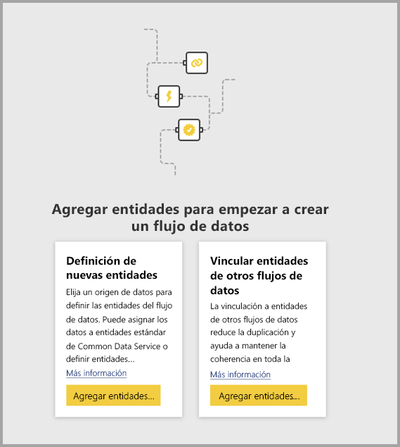
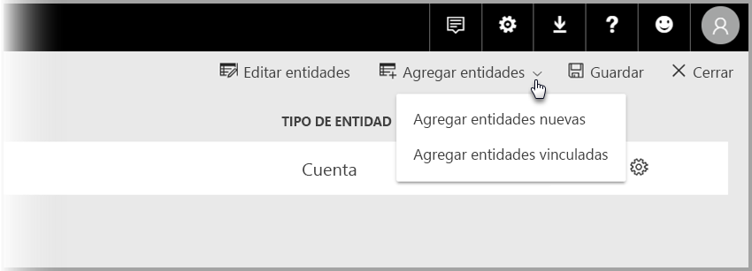

# Vinculación de entidades entre flujos de datos en Power BI (versión preliminar)

Con los flujos de datos de Power BI, puede tener un único origen de almacenamiento de datos de la organización donde los analistas de negocios pueden preparar y administrar sus datos una vez y luego usarlos entre distintas aplicaciones de análisis de la organización. 

Al vincular entidades entre flujos de datos, puede reutilizar entidades que ya se han ingerido, limpiado y transformado en otros flujos de datos que son propiedad de otros usuarios sin la necesidad de mantener dichos datos. Las entidades vinculadas simplemente apuntan a las entidades en otros flujos de datos y *no* copian ni duplican los datos.

Las entidades vinculadas son de **solo lectura**. Si desea crear transformaciones para una entidad vinculada, puede crear una entidad calculada con una referencia a la entidad vinculada.

## Disponibilidad de entidades vinculadas

Las entidades vinculadas requieren la actualización de una suscripción de [Power BI Premium](service-premium.md). Las entidades vinculadas están disponibles en cualquier flujo de datos de un área de trabajo hospedada en la capacidad Premium de Power BI. No hay limitaciones respecto al flujo de datos de origen.

Las entidades vinculadas solo funcionan correctamente en nuevas áreas de trabajo de Power BI. Puede obtener más información sobre las [nuevas áreas de trabajo de Power BI](service-create-the-new-workspaces.md). Todos los flujos de datos vinculados deben estar ubicados en nuevas áreas de trabajo para que funcionen correctamente.

> [!NOTE]
> Las entidades varían en función de si son entidades estándar o entidades calculadas. Las entidades estándar (con frecuencia conocidas simplemente como entidades) consultan un origen de datos externo, como una base de datos SQL. Las entidades calculadas necesitan capacidad Premium en Power BI y ejecutan sus transformaciones en datos que ya están en almacenamiento de Power BI. 
>
>Aunque el flujo de datos no esté en un área de trabajo de capacidad Premium, puede hacer referencia a una única consulta o combinar dos o más consultas siempre y cuando las transformaciones no se definan como transformaciones en almacenamiento. Estas referencias se consideran entidades estándar. Para ello, desactive la opción **Habilitar carga** para las consultas a las que se hace referencia para impedir que los datos se materialicen y se ingieran en el almacenamiento. Desde ahí, puede hacer referencia a esas consultas **Habilitar carga = false** y establecer **Habilitar carga** en **Activado** solo para las consultas derivadas que quiera materializar.

## Vinculación de entidades entre flujos de datos

Hay varias formas de vincular entidades entre flujos de datos en Power BI. Puede seleccionar **Agregar entidades vinculadas** desde la herramienta de creación de flujos de datos, como se muestra en la siguiente imagen. 

También puede seleccionar **Agregar entidades vinculadas** en el elemento de menú **Agregar entidades** del servicio Power BI.

Para vincular entidades, debe iniciar sesión con las credenciales de Power BI.

Se abre una ventana del **navegador**, donde puede elegir un conjunto de entidades al que se puede conectar. Las entidades mostradas son entidades para las que tiene permisos en todas las áreas de trabajo del inquilino de Power BI. 

Una vez seleccionadas las entidades vinculadas, aparecen en la lista de entidades del flujo de datos en la herramienta de creación, con un icono especial que las identifica como entidades vinculadas.

También puede ver el flujo de datos de origen en la configuración del flujo de datos de la entidad vinculada.

## Lógica de actualización de las entidades vinculadas
La lógica de actualización predeterminada de las entidades vinculadas cambia, en función de si el flujo de datos de origen reside en la misma área de trabajo que el flujo de datos de destino. En las siguientes secciones se describe el comportamiento de cada una.

### Vínculos entre las áreas de trabajo

La actualización de los vínculos de las entidades en distintas áreas de trabajo se comportan de la misma forma que un origen de datos externo. Cuando el flujo de datos se actualiza, toma los últimos datos de la entidad desde el flujo de datos de origen. Si se actualiza el flujo de datos de origen, no afecta automáticamente a los datos del flujo de datos de destino.

### Vínculos en la misma área de trabajo

Cuando se produce la actualización de los datos de un flujo de datos de origen, ese evento desencadena automáticamente un proceso de actualización de las entidades dependientes en todos los flujos de datos de destino en la misma área de trabajo, incluidas todas las entidades calculadas basadas en ellas. Todas las demás entidades del flujo de datos de destino se actualizan según la programación del flujo de datos. Las entidades que dependen de más de un origen actualizan los datos siempre que cualquiera de sus orígenes se actualiza correctamente.

Resulta útil tener en cuenta que el proceso de actualización completo se confirma de una vez. Por este motivo, si se produce un error en la actualización del flujo de datos de destino, también se producirá un error con la actualización del flujo de datos de origen.

## Permisos para ver informes de flujos de datos

Al crear un informe de Power BI que incluye datos basados en un flujo de datos, los usuarios pueden ver todas las entidades vinculadas solo cuando el usuario accede al flujo de datos de origen.

## Limitaciones y consideraciones

Hay algunas limitaciones que se deben tener en cuenta al trabajar con entidades vinculadas:

* Hay un máximo de cinco saltos de referencia.
* No se permiten dependencias cíclicas de entidades vinculadas.
* El flujo de datos debe residir en una [nueva área de trabajo de Power BI](service-create-the-new-workspaces.md).
* Una entidad vinculada no se puede combinar con una entidad estándar que obtenga sus datos de un origen de datos local.

## Pasos siguientes

Los artículos siguientes pueden resultar útiles para crear flujos de datos o trabajar con ellos. 

* [Preparación de datos de autoservicio en Power BI (versión preliminar)](service-dataflows-overview.md)
* [Creación y uso de flujos de datos en Power BI](service-dataflows-create-use.md)
* [Uso de entidades calculadas en Power BI Premium (versión preliminar)](service-dataflows-computed-entities-premium.md)
* [Uso de flujos de datos con orígenes de datos locales (versión preliminar)](service-dataflows-on-premises-gateways.md)
* [Recursos de desarrollador para flujos de datos de Power BI](service-dataflows-developer-resources.md)

Para obtener más información sobre Power Query y la actualización programada, puede leer estos artículos:
* [Información general sobre consultas en Power BI Desktop](desktop-query-overview.md)
* [Configuración de la actualización programada](refresh-scheduled-refresh.md)

Para más información sobre Common Data Service, puede leer su artículo de introducción:
* [Introducción a Common Data Service](https://docs.microsoft.com/powerapps/common-data-model/overview)

