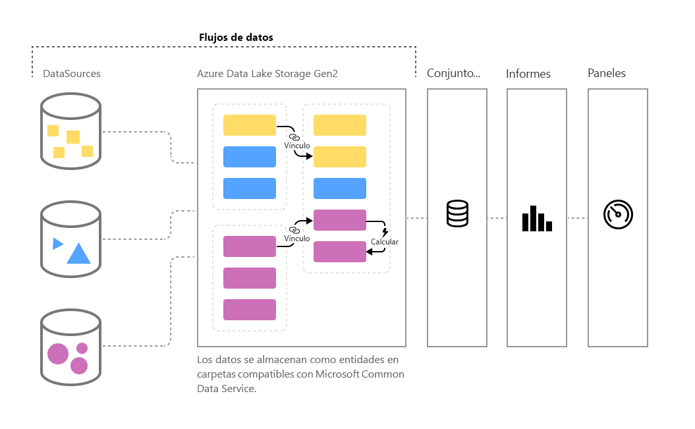

# Preparación de datos de autoservicio en Power BI (versión preliminar)

A medida que aumenta el volumen de datos, también se complica el desafío de limpiar y transformar dichos datos en información accionable y con un formato correcto. Queremos datos que estén listos para análisis, para rellenar objetos viduales, informes y paneles, a fin de que podamos convertir los volúmenes de datos rápidamente en información procesable. Con la **preparación de datos de autoservicio** para macrodatos en Power BI, puede convertir los datos en información de Power BI con tan solo unos clics.

Power BI presenta los **flujos de datos** para ayudar a las organizaciones a unificar datos desde fuentes diversas y a prepararlos para el modelado. Los analistas pueden crear flujos de datos con facilidad, con el uso de herramientas familiares de autoservicio. Los flujos de datos se usan para ingerir, transformar, integrar y enriquecer macrodatos con la definición de conexiones de orígenes de datos, lógica de ETL, programas de actualizaciones y mucho más. Además, el nuevo motor de cálculo basado en modelos que forma parte de los flujos de datos facilita la administración del proceso de preparación de datos, porque resulta más determinista y menos engorroso para los analistas de datos y los creadores de informes. De forma similar a como las hojas de cálculo administran los recálculos de todas las fórmulas afectadas, los flujos de datos administran los cambios de una entidad o de un elemento de datos en nombre del usuario, automatizando las actualizaciones y aliviando lo que solían ser comprobaciones lógicas tediosas que consumían mucho tiempo incluso para una actualización de datos básica. Con los flujos de datos, las tareas que requerían el control de los científicos de datos y también muchas horas y días para completarse, ahora los analistas y los creadores de informes pueden administrarlas con tan solo unos clics. 

Los datos se almacenan como entidades en [**Common Data Service**](https://docs.microsoft.com/powerapps/common-data-model/overview) en Azure Data Lake Storage Gen2. Los flujos de datos se crean y administran en las áreas de trabajo de la aplicación mediante el servicio Power BI.  

> [!NOTE]
> La funcionalidad de flujos de datos se encuentra en versión preliminar y está sujeta a cambios y actualizaciones antes de la disponibilidad general.

 
Los **flujos de datos**se han diseñado para usar**Common Data Service**, una colección estandarizada, modular y extensible de esquemas de datos publicados por Microsoft que están diseñados para facilitarle la compilación, el uso y el análisis de datos. Con este modelo, puede pasar de los orígenes de datos a los paneles de Power BI prácticamente sin hacer nada.

Puede usar los flujos de datos para ingerir datos desde un conjunto grande y creciente de orígenes de datos basados en la nube y locales compatibles, incluidos Dynamics 365, Salesforce, Azure SQL Database, Excel, SharePoint y muchos más.

Después puede asignar datos a entidades estándar en Common Data Service, modificar y extender las entidades existentes y crear entidades personalizadas. Los usuarios avanzados pueden crear flujos de datos completamente personalizados, mediante una experiencia de creación de Power Query integrada, con poco código o ninguno y de autoservicio, similar a la experiencia de Power Query que millones de usuarios de Power BI Desktop y Excel ya conocen.  

Una vez que ha creado un flujo de datos, puede usar Power BI Desktop y el servicio Power BI para crear conjuntos de datos, informes, paneles y aplicaciones que aprovechan la eficacia de Common Data Service para integrar información detallada en las actividades empresariales. 

La programación de actualizaciones de los flujos de datos se administra directamente desde el área de trabajo en la que se creó el flujo de datos, al igual que los conjuntos de datos. 

## Funcionamiento de los flujos de datos

Estos son algunos ejemplos de para qué pueden servir los flujos de datos:

* Las organizaciones pueden asignar sus datos a entidades estándar en Common Data Service o crear sus propias entidades personalizadas. Estas entidades se pueden usar después como bloques de creación para compilar informes, paneles y aplicaciones listos para usar, y también se pueden distribuir a los usuarios de la organización. 

* Con el uso de la amplia colección de conectores de datos de Microsoft, las organizaciones pueden conectar sus propios orígenes de datos a los flujos de datos, mediante Power Query para asignar los datos desde su origen e integrarlos en Power BI. Una vez que un flujo de datos importa dichos datos y tras su actualización con una frecuencia determinada, las entidades del flujo de datos se pueden usar en la aplicación de Power BI Desktop para crear atractivos informes y paneles. 

## Uso de los flujos de datos

En la sección anterior se describe una serie de formas en que se pueden usar los flujos de datos para crear rápidamente análisis eficaces en Power BI. En esta sección se ofrece orientación sobre cómo crear rápidamente información detallada con el uso de flujos de datos de una organización, cómo obtener una vista rápida de la forma en que los profesionales de inteligencia empresarial pueden crear sus propios flujos de datos y cómo personalizar la información detallada según las necesidades de cada organización.

### Ampliación del modelo de datos común para satisfacer las necesidades empresariales
Para las organizaciones que desean ampliar Common Data Service (CDM), los flujos de datos permiten a los profesionales de inteligencia empresarial personalizar las entidades estándar o crear nuevas. Este enfoque de autoservicio para personalizar el modelo de datos puede utilizarse con flujos de datos para crear aplicaciones y paneles de Power BI que se adaptan a una organización.

### Definición de flujos de datos mediante programación
También puede desarrollar sus propias soluciones mediante programación para crear flujos de datos. Con las API públicas y la funcionalidad de crear archivos de definición de flujos de datos personalizados (model.json), puede crear una solución personalizada que se adapte a las necesidades de análisis y datos exclusivas de su organización. 

Las API públicas permiten a los desarrolladores interactuar de forma sencilla con Power BI y los flujos de datos.

### Ampliación de las funcionalidades con Azure
Azure Data Lake Storage Gen2 se incluye con cada suscripción de Power BI de pago (10 GB por usuario y 100 TB por nodo de P1). De esta forma, puede comenzar fácilmente con la preparación de datos de autoservicio en Azure Data Lake. 

Power BI puede configurarse para almacenar datos de flujo de datos en la cuenta de Azure Data Lake Storage Gen2 de su organización. Cuando Power BI se conecta a su suscripción de Azure, los desarrolladores de datos y los científicos de datos pueden beneficiarse de los eficaces productos de Azure, como Azure Machine Learning, Azure Databricks, Azure Data Factory y muchos más.

Power BI también puede conectarse a carpetas con datos esquematizados con el formato Common Data Service, que se almacenan en la cuenta de Azure Data Lake Storage de la organización. Estas carpetas pueden crearse como servicios, como los servicios de datos de Azure. Al conectarse a estas carpetas, los analistas pueden trabajar sin problema con estos datos en Power BI. 

Para más información sobre la integración con Azure Data Lake Storage Gen2 y flujos de datos, lo que incluye cómo crear flujos de datos que residen en la instancia de Azure Data Lake de su organización, consulte [Integración de flujos de datos y Azure Data Lake (versión preliminar)](service-dataflows-azure-data-lake-integration.md).

## Funcionalidades de flujo de datos en Power BI Premium

Para que las características y las cargas de trabajo de flujos de datos funcionen en una suscripción de Power BI Premium, la carga de trabajo del flujo de datos de dicha capacidad Premium debe estar activada. Puede obtener más información sobre Power BI Premium en el artículo [¿Qué es Microsoft Power BI Premium?](service-premium.md) 

En la tabla siguiente se describen las características de los flujos de datos y sus funcionalidades cuando se usa una cuenta de Power BI Pro y se establece una comparación con el uso de Power BI Premium.

|Funcionalidad de flujo de datos | Power BI Pro |   Power BI Premium |
|---------|---------|---------|
|Actualización programada| 8 al día|  48|
|Almacenamiento total| 10 GB/usuario  |100 TB/nodo|
|Creación de flujos de datos con Power Query Online|    +   |+|
|Administración de flujo de datos en Power BI|   +|  +|
|Conector de datos de flujos de datos en Power BI Desktop|  +|  +|
|Integración con Azure|    +|  +|
|Entidades calculadas (transformaciones en almacenamiento mediante M) | |   +|
|Nuevos conectores|    +|  +|
|Actualización incremental de flujos de datos|  |   +|
|Ejecución en capacidad Premium de Power BI/ejecución paralela de transformaciones|   |   +|
|Entidades vinculadas a flujos de datos| |        +|
|Esquema estandarizado/soporte integrado para Common Data Service|  +|  +|

Para obtener más información sobre cómo habilitar las cargas de trabajo de flujo de datos en una capacidad Premium, consulte el artículo de [configuración de cargas de trabajo](service-admin-premium-manage.md#configure-workloads) de Power BI Premium. Las cargas de trabajo del flujo de datos no están actualmente disponibles en las capacidades de varias ubicaciones geográficas.

## Resumen de la preparación de datos de autoservicio para macrodatos en Power BI
Como se mencionó anteriormente en este artículo, existen varios escenarios y ejemplos donde los **flujos de datos** pueden permitirle obtener un mejor control e información más rápida de sus datos empresariales. Mediante un modelo de datos estándar (esquema) definido por Common Data Service, los flujos de datos pueden importar sus datos profesionales importantes y tener los datos listos para el modelado y la creación de información detallada de inteligencia empresarial en muy poco tiempo... cuya creación solía llevar meses, o incluso más. 

Al almacenar datos empresariales en formato estandarizado de **Common Data Service**, los desarrolladores o profesionales de inteligencia empresarial pueden crear aplicaciones que generan objetos visuales e informes automáticos de forma rápida y sencilla. Entre las ventajas se incluyen:

* Asignación de los datos a entidades estándar en Common Data Service para unificar datos y utilizar el esquema conocido para integrar información detallada lista para usar
* Creación de entidades personalizadas propias para unificar los datos de toda la organización 
* Usar y actualizar **datos externos** como parte de un flujo de datos y habilitar la importación de esos datos para proporcionar la información
* Introducción a flujos de datos para desarrolladores

## Pasos siguientes

En este artículo se proporciona información general sobre la preparación de datos de autoservicio para macrodatos en Power BI y las numerosas formas en que pueden usarse. En los siguientes artículos se ofrecen más detalles sobre escenarios de uso común de los flujos de datos. 

* [Creación y uso de flujos de datos en Power BI](service-dataflows-create-use.md)
* [Uso de entidades calculadas en Power BI Premium (versión preliminar)](service-dataflows-computed-entities-premium.md)
* [Uso de flujos de datos con orígenes de datos locales (versión preliminar)](service-dataflows-on-premises-gateways.md)
* [Recursos de desarrollador para flujos de datos de Power BI](service-dataflows-developer-resources.md)
* [Integración de flujos de datos y Azure Data Lake (versión preliminar)](service-dataflows-azure-data-lake-integration.md)

Para obtener más información sobre Power Query y la actualización programada, puede leer estos artículos:
* [Información general sobre consultas en Power BI Desktop](desktop-query-overview.md)
* [Configuración de la actualización programada](refresh-scheduled-refresh.md)

Para más información sobre Common Data Service, puede leer su artículo de introducción:
* [Introducción a Common Data Service](https://docs.microsoft.com/powerapps/common-data-model/overview)

