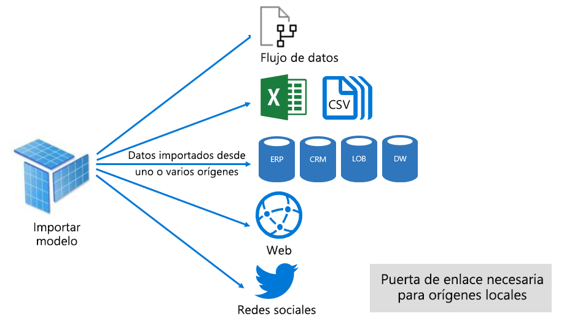
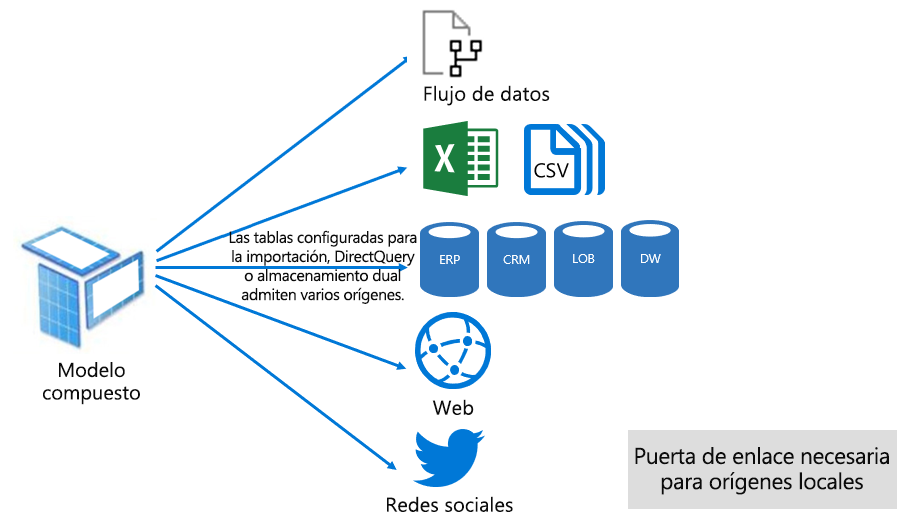

# Modos de conjuntos de datos en el servicio Power BI

En este artículo se proporciona una explicación técnica de los modos de conjuntos de datos de Power BI. Se aplica a los conjuntos de datos que representan una conexión dinámica a un modelo de Analysis Services externamente hospedado y también a los modelos desarrollados en Power BI Desktop. En el artículo se resaltan las razones de cada modo y los impactos posibles en los recursos de capacidad de Power BI.

Los tres modos de conjuntos de datos son:

- [Importación](#import-mode)
- [DirectQuery](#directquery-mode)
- [Composición](#composite-mode)

## Modo de importación

El modo de _importación_ es el modo más común que se usa para desarrollar modelos. Este modo ofrece un rendimiento extremadamente rápido gracias a las consultas en memoria. También ofrece flexibilidad de diseño a los modeladores y admite características específicas del servicio Power BI (Preguntas y respuestas, Conclusiones rápidas, etc.). Debido a estos puntos fuertes, es el modo predeterminado en el momento de crear una nueva solución de Power BI Desktop.

Es importante comprender que los datos importados siempre se almacenan en el disco. Cuando se consultan o se actualizan, los datos se deben cargar por completo en la memoria de la capacidad de Power BI. Una vez en la memoria, los modelos de importación pueden obtener resultados de consulta muy rápidos. También es importante entender que no hay ningún concepto de un modelo de importación que se cargue parcialmente en la memoria.

Cuando se actualizan, los datos se comprimen y optimizan y luego se almacenan en el disco mediante el motor de almacenamiento de VertiPaq. Cuando se cargan desde el disco en la memoria, es posible ver una compresión 10 veces superior. Por lo tanto, es razonable esperar que 10 GB de datos de origen se puedan comprimir a aproximadamente 1 GB de tamaño. El tamaño de almacenamiento en disco puede lograr una reducción del 20 % del tamaño comprimido. (La diferencia de tamaño se puede determinar al comparar el tamaño de archivo de Power BI Desktop con el uso de memoria del administrador de tareas del archivo).

La flexibilidad de diseño se puede lograr de tres maneras. Los modeladores de datos pueden:

- Integrar los datos mediante el almacenamiento en caché de los datos de flujos de datos y orígenes de datos externos, sea cual sea el formato o el tipo del origen de datos.
- Aproveche todo el conjunto de funciones del [lenguaje de fórmulas de Power Query](/powerquery-m/) (conocido informalmente como M) al crear consultas de preparación de datos.
- Aproveche todo el conjunto de funciones de [expresiones de análisis de datos (DAX)](/dax/) al mejorar el modelo con la lógica de negocios. Hay compatibilidad con las columnas calculadas, las tablas calculadas y las medidas.

Como se muestra en la imagen siguiente, un modelo de importación puede integrar datos de diversos tipos de orígenes de datos compatibles.

Sin embargo, aunque hay ventajas interesantes asociadas con los modelos de importación, también hay desventajas:

- Es necesario cargar todo el modelo en la memoria antes de que Power BI pueda consultar el modelo, lo que puede poner presión en los recursos de capacidad disponibles, especialmente a medida que aumentan el número y el tamaño de los modelos de importación.
- Los datos del modelo solo son tan actuales como la actualización más reciente, por lo que es necesario actualizar los modelos de importación, normalmente de manera programada.
- Una actualización completa quitará todos los datos de todas las tablas y los volverá a cargar desde el origen de datos. Esta operación puede ser costosa en cuanto a tiempo y recursos para el servicio Power BI y los orígenes de datos.

    > [!NOTE]
    > Power BI puede lograr una actualización incremental para evitar tener que truncar y recargar tablas enteras. Sin embargo, esta característica solo se admite cuando el conjunto de datos se hospeda en áreas de trabajo con capacidades Premium. Para más información, consulte el artículo [Actualizaciones incrementales en Power BI Premium](service-premium-incremental-refresh.md).

Desde una perspectiva de recursos del servicio Power BI, los modelos de importación requieren:

- Memoria suficiente para cargar el modelo cuando se consulta o actualiza.
- Recursos de procesamiento y recursos de memoria adicionales para actualizar los datos.

## Modo DirectQuery

El modo _DirectQuery_ es una alternativa al modo de importación. Los modelos desarrollados en el modo DirectQuery no importan datos. En su lugar, constan solo de metadatos que definen la estructura del modelo. Cuando se consulta el modelo, se usan consultas nativas para recuperar datos del origen de datos subyacente.

Hay dos razones principales para considerar el desarrollo de un modelo de DirectQuery:

- Cuando los volúmenes de datos son demasiado grandes (incluso cuando se aplican [métodos de reducción de datos](guidance/import-modeling-data-reduction.md)) para aplicarlos en un modelo o, prácticamente, para actualizarlos.
- Cuando los informes y paneles deben entregar datos "casi en tiempo real", más allá de lo que se puede lograr dentro de límites de actualizaciones programadas. (Los límites de actualizaciones programadas son ocho veces al día para la capacidad compartida y 48 veces al día para una capacidad Premium).

Hay varias ventajas asociadas con los modelos de DirectQuery:

- No se aplican los límites de tamaño de los modelos de importación.
- No es necesario actualizar los modelos.
- Los usuarios de informes verán los datos más recientes al interactuar con los filtros y las segmentaciones de los informes. Además, los usuarios de informes pueden actualizar todo el informe para recuperar los datos actuales.
- Los informes en tiempo real se pueden desarrollar mediante la característica [Actualización automática de páginas](desktop-automatic-page-refresh.md).
- Los iconos del panel, cuando se basan en los modelos de DirectQuery, se pueden actualizar automáticamente con una frecuencia de cada 15 minutos.

Sin embargo, hay muchas desventajas y limitaciones asociadas a los modelos de DirectQuery:

- El modelo se debe basar en un origen de datos compatible único. Es por esto que cualquier integración de datos ya se debe lograr en el origen de datos. Los orígenes de datos admitidos son sistemas relacionales y de análisis, con compatibilidad para muchos almacenes de datos populares.

    > [!TIP]
    > Se admiten muchos orígenes de datos de Microsoft. Los orígenes de datos de Microsoft incluyen SQL Server, Azure Databricks, Azure HDInsight Spark (versión beta), Azure SQL Database y Azure SQL Data Warehouse. Para más información, consulte el artículo [Orígenes de datos admitidos por DirectQuery en Power BI](desktop-directquery-data-sources.md).

- El rendimiento puede ser lento, lo que podría afectar negativamente el servicio Power BI. Este problema puede deberse a que algunas consultas consumen mucha CPU para el servicio Power BI. También podría deberse a que el origen de datos no está optimizado para las consultas que Power BI envía.
- Las consultas de Power Query se deben poder plegar. Este requisito significa que la lógica de Power Query no puede ser demasiado compleja. Además, la lógica se debe limitar a usar las expresiones de M y las funciones que se pueden transponer en consultas nativas que comprende el origen de datos.
- Las fórmulas de DAX se limitan a usar solo las funciones que se pueden transponer en consultas nativas que comprende el origen de datos. Además, no hay compatibilidad con las tablas calculadas ni las funciones de inteligencia de tiempo de DAX.
- Se producirá un error en las consultas de modelo que requieren recuperar más de un millón de filas.
- Los informes y paneles con varios objetos visuales pueden mostrar resultados incoherentes, especialmente cuando el origen de datos es volátil.
- No se admiten las características Preguntas y respuestas y Conclusiones rápidas.

Desde una perspectiva de recursos del servicio Power BI, los modelos de DirectQuery requieren:

- Memoria mínima para cargar el modelo (solo metadatos) cuando se consulta.
- En algunas ocasiones, el servicio Power BI debe usar recursos de procesador significativos para generar y procesar las consultas enviadas al origen de datos. Cuando se produce esta situación, puede afectar al rendimiento, especialmente cuando los usuarios consultan el modelo de manera simultánea.

Para más información, consulte [Uso de DirectQuery en Power BI Desktop](desktop-use-directquery.md).

## Modo de Composición

El modo de _Composición_ puede combinar los modos de importación y de DirectQuery o integrar varios orígenes de datos de DirectQuery. Los modelos desarrollados en modo de Composición admiten la configuración del modo de almacenamiento para cada tabla del modelo. Este modo también admite tablas calculadas (definidas con DAX).

El modo de almacenamiento de tabla se puede configurar como Importación, DirectQuery o Dual. Una tabla configurada como modo de almacenamiento Dual es tanto Importación como DirectQuery. Esta configuración permite que el servicio Power BI determine el modo más eficaz para usar en cada consulta.

Los modelos compuestos se esfuerzan por ofrecer lo mejor de los modos de Importación y DirectQuery. Cuando se configuran correctamente, pueden combinar el alto rendimiento de consultas de los modelos en memoria con la capacidad de recuperar datos casi en tiempo real de los orígenes de datos.

Es probable que los modeladores de datos que desarrollan modelos de Composición configuren tablas de tipo de dimensiones en el modo de almacenamiento de Importación o Dual y tablas de tipo de hechos en el modo de DirectQuery. Para más información sobre los roles de tabla de modelo, consulte [Descripción de un esquema de estrella e importancia para Power BI](guidance/star-schema.md).

Por ejemplo, considere un modelo con una tabla de tipo de dimensiones **Producto** en modo Dual y una tabla de tipo de hechos **Ventas** en el modo de DirectQuery. La tabla **Producto** se puede consultar de manera eficaz y rápida desde memoria para representar una segmentación de informe. La tabla **Ventas** también se podría consultar en el modo de DirectQuery con la tabla **Producto**. Esta última consulta podría permitir generar una consulta SQL nativa eficaz que combine las tablas **Producto** y **Ventas** y que filtre según los valores de segmentación.

En general, para los modelos de Composición, las ventajas y desventajas asociadas con el modo de Importación y DirectQuery, en función de cómo está configurada cada tabla.

Para más información, consulte [Usar modelos compuestos en Power BI Desktop](desktop-composite-models.md).

## Pasos siguientes

- [Conjuntos de datos en el servicio Power BI](service-dataset-modes-understand.md)
- [Modo de almacenamiento en Power BI Desktop](desktop-storage-mode.md)
- [Uso de DirectQuery en Power BI](desktop-directquery-about.md)
- [Usar modelos compuestos en Power BI Desktop](desktop-composite-models.md)
- ¿Tiene más preguntas? [Pruebe a preguntar a la comunidad de Power BI](https://community.powerbi.com/)
