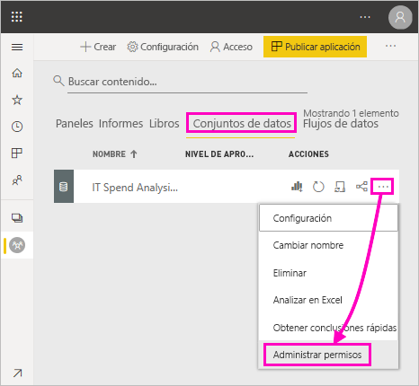
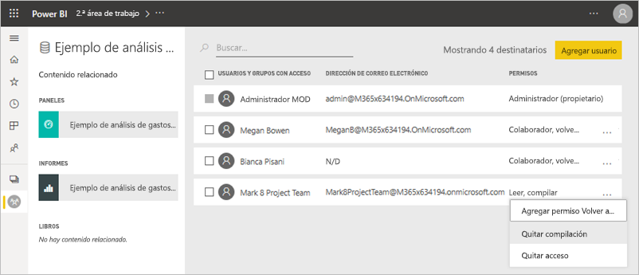
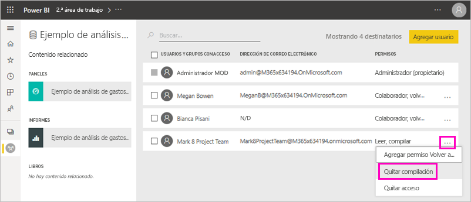
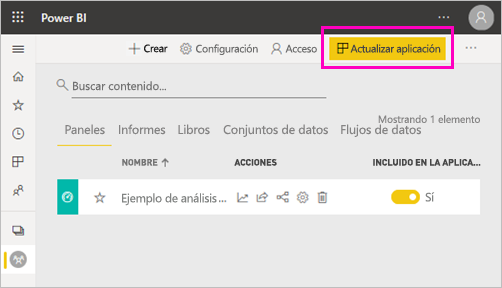
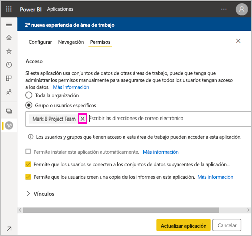
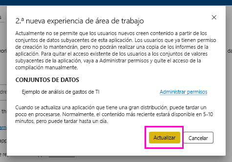

# Permiso de compilación para conjuntos de datos compartidos (versión preliminar)

Como creador de *modelos de datos* en Power BI Desktop, puede compartirlos como *conjuntos de datos* en el servicio Power BI. Después, los creadores de informes pueden detectar fácilmente y volver a usar los conjuntos de datos que ha compartido. Obtenga información acerca de cómo puede controlar quién tiene acceso a los datos mediante el permiso de compilación.

El permiso de compilación solo es pertinente para los conjuntos de datos. Al conceder permiso de compilación a los usuarios, estos pueden crear contenido en un conjunto de datos, como informes, paneles, iconos anclados de Preguntas y respuestas y detección de información. También pueden crear contenido en el conjunto de datos fuera de Power BI, como hojas de Excel a través de Analizar en Excel, XMLA y la exportación de datos subyacentes.

## Formas de conceder el permiso de compilación

Puede conceder el permiso de compilación para un conjunto de datos de varias maneras diferentes:

- Los miembros de un área de trabajo con, al menos, un rol Colaborador tienen automáticamente permiso de compilación para conjuntos de datos en esa área de trabajo, así como permiso para copiar un informe.
 
- Los miembros del área de trabajo en la que reside el conjunto de datos puede asignar el permiso a usuarios o grupos de seguridad específicos en el Centro de permisos. Si es miembro del área de trabajo, seleccione **Más opciones** (...) junto al conjunto de datos > **Administrar permisos**.

    

    Se abre el Centro de permisos para ese conjunto de datos, donde puede establecer y cambiar los permisos.

    

- Un administrador o miembro del área de trabajo donde reside el conjunto de datos puede decidir durante la publicación de la aplicación que los usuarios con permiso para la aplicación también obtienen el permiso de compilación para los conjuntos de datos subyacentes. Consulte [Compartir un conjunto de datos](service-datasets-share.md) para obtener más información.

- Imagine que dispone de los permisos Volver a compartir y Compilar en un conjunto de datos. Al compartir un informe o panel creado sobre ese conjunto de datos, puede especificar que los destinatarios también obtienen el permiso de compilación para el conjunto de datos subyacente.

    

Puede quitar el permiso de compilación de un usuario para un conjunto de datos. Si lo hace, podrán seguir viendo el informe creado en el conjunto de datos compartido, pero ya no podrán editarlo. Vea la sección siguiente para obtener más información.

## Eliminación del permiso de compilación para un conjunto de datos

En algún momento, es posible que tenga que quitar el permiso de compilación para algunos usuarios de un conjunto de datos compartido. 

1. En un área de trabajo, vaya a la página de la lista **Conjuntos de datos**. 
1. Seleccione **Más opciones** (...) junto al conjunto de datos > **Administrar permisos**.

    

1. Seleccione **Más opciones** (...) junto a un nombre > **Quitar compilación**.

    

    Podrán seguir viendo el informe creado en el conjunto de datos compartido, pero ya no podrán editarlo.

### Eliminación del permiso de compilación para un conjunto de datos en una aplicación

Supongamos que ha distribuido una aplicación desde un área de trabajo a un grupo de personas. Más adelante, decide quitar el acceso a la aplicación para algunas personas. Al quitar el acceso a la aplicación, no se quitan automáticamente los permisos para compilar y volver a compartir. Es necesario realizar otra acción. 

1. En la página de la lista de áreas de trabajo, seleccione **Actualizar aplicación**. 

    

1. En la pestaña **Permisos**, seleccione la **X** para eliminar a esa persona o grupo. 

    
1. Haga clic en **Actualizar aplicación**.

    Verá un mensaje que explica que debe ir a **Administrar permisos** para quitar el permiso de compilación para los usuarios que tienen acceso. 

    

1. Seleccione **Actualizar**.

1. En el área de trabajo, vaya a la página de la lista **Conjuntos de datos**. 
1. Seleccione **Más opciones** (...) junto al conjunto de datos > **Administrar permisos**.

    

1. Seleccione **Más opciones** (...) junto al nombre > **Quitar compilación**.

    

    Podrán seguir viendo el informe creado en el conjunto de datos compartido, pero ya no podrán editarlo.

## Permisos más pormenorizados

En Power BI se ha introducido el permiso de compilación en junio de 2019 como un complemento para los permisos existentes, Leer y Volver a compartir. Todos los usuarios que ya tenían permiso de lectura para los conjuntos de datos a través de permisos de la aplicación, uso compartido o acceso al área de trabajo en ese momento también han obtenido el permiso de compilación para esos mismos conjuntos de datos. Han obtenido el permiso de compilación de forma automática porque el permiso de lectura ya les concedía el derecho a crear contenido sobre el conjunto de datos, mediante Analizar en Excel o Exportar.

Con este permiso de compilación más pormenorizado, puede elegir quién puede ver solo el contenido del panel o informe existente, y quién puede crear contenido conectado a los conjuntos de datos subyacentes.

Si el conjunto de datos se usa en un informe fuera del área de trabajo del conjunto de datos, no se podrá eliminar. En su lugar, verá un mensaje de error.

Puede quitar los permisos de compilación. Si lo hace, los usuarios cuyos permisos se hayan revocado aún podrán ver el informe, pero ya no podrán editarlo ni exportar datos subyacentes. Los usuarios con permiso de solo lectura podrán seguir exportando los datos resumidos. 

## Pasos siguientes

- [Uso de conjuntos de datos entre áreas de trabajo (versión preliminar)](service-datasets-across-workspaces.md)
- ¿Tiene alguna pregunta? [Pruebe a preguntar a la comunidad de Power BI](https://community.powerbi.com/)
