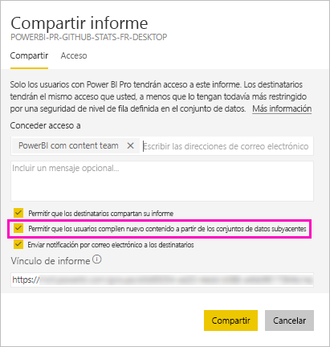

# Uso compartido de un conjunto de datos (versión preliminar)

Como creador de *modelos de datos* en Power BI Desktop, puede compartirlos como *conjuntos de datos* en el servicio Power BI. Después, los creadores de informes pueden detectar fácilmente y volver a usar los conjuntos de datos que ha compartido. Obtenga información sobre cómo compartirlos, y cómo controlar quién tiene acceso a los datos mediante el permiso de compilación.

## Pasos para compartir el conjunto de datos

1. Primero debe crear un archivo .pbix con un modelo de datos en Power BI Desktop. Si piensa ofrecer este conjunto de datos para que otros usuarios generen informes, ni siquiera tendrá que diseñar un informe en el archivo .pbix.

    Un procedimiento recomendado consiste en guardar el archivo .pbix en un grupo de Office 365.

1. Publique el archivo .pbix en una [nueva experiencia de área de trabajo](service-create-the-new-workspaces.md) en el servicio Power BI.
    
    Otros miembros de esta área de trabajo ya pueden crear informes en otras áreas de trabajo en función de este conjunto de datos.

1. También puede [publicar una aplicación](service-create-distribute-apps.md) desde esta área de trabajo. Al hacerlo, especifique quién tiene permisos y qué puede hacer en la página **Permisos**.

    > [!NOTE]
    > Si selecciona **Toda la organización**, nadie de la organización tendrá permisos de compilación. Este problema ya se conoce. En su lugar, especifique direcciones de correo electrónico en **Grupos o usuarios específicos**.  Si quiere que toda la organización tenga permisos de compilación, especifique un alias de correo electrónico para toda la organización.

    

1. Seleccione **Publicar aplicación**, o bien **Actualizar aplicación** si ya está publicada.

## Permisos de compilación para conjuntos de datos compartidos

El tipo de permiso de compilación solo es relevante para los conjuntos de datos. Con él, los usuarios pueden crear contenido en un conjunto de datos, como informes, paneles, iconos anclados de Preguntas y respuestas, y detección de información. También pueden crear contenido en el conjunto de datos fuera de Power BI, como hojas de Excel a través de Analizar en Excel, XMLA y exportar.

Los usuarios obtienen permisos de compilación de diferentes maneras:

- Si es miembro de un área de trabajo con, al menos, un rol Colaborador, tiene automáticamente permiso de compilación para un conjunto de datos y permiso para copiar un informe.
 
- Un miembro del área de trabajo en la que reside el conjunto de datos puede asignar el permiso a usuarios o grupos de seguridad específicos en el Centro de permisos. Seleccione los puntos suspensivos (…) junto al conjunto de datos > **Administrar permisos**.

    

    Se abre el Centro de permisos para ese conjunto de datos, donde puede establecer y cambiar los permisos.

    

- Un administrador o miembro del área de trabajo donde reside el conjunto de datos puede decidir durante la publicación de la aplicación que los usuarios con permiso para la aplicación también obtienen el permiso de compilación para los conjuntos de datos subyacentes. Vea [Pasos para compartir el conjunto de datos](#steps-to-sharing-your-dataset) en este artículo para obtener detalles.

- Imagine que dispone de los permisos Volver a compartir y Compilar en un conjunto de datos. Al compartir un informe o panel creado sobre ese conjunto de datos, puede especificar que los destinatarios también obtienen el permiso de compilación para el conjunto de datos subyacente.

    

Puede quitar los permisos de compilación de un usuario para un conjunto de datos. Si lo hace, podrán seguir viendo el informe creado en el conjunto de datos compartido, pero ya no podrán editarlo.

## Permisos más pormenorizados

En Power BI se ha introducido el permiso de compilación en junio de 2019 como un complemento para los permisos existentes, Leer y Volver a compartir. Todos los usuarios que ya tenían permiso de lectura para los conjuntos de datos a través de permisos de la aplicación, uso compartido o acceso al área de trabajo en ese momento también han obtenido permisos de compilación para esos mismos conjuntos de datos. Han obtenido el permiso de compilación de forma automática porque el permiso de lectura ya les concedía el derecho a crear contenido sobre el conjunto de datos, mediante Analizar en Excel o Exportar.

Con este permiso de compilación más pormenorizado, puede elegir quién puede ver solo el contenido del panel o informe existente, y quién puede crear contenido conectado a los conjuntos de datos subyacentes.

Si el conjunto de datos se usa en un informe fuera del área de trabajo del conjunto de datos, no se podrá eliminar. En su lugar, verá un mensaje de error.

Puede quitar los permisos de compilación. Si lo hace, los usuarios cuyos permisos se han revocado aún pueden ver el informe, pero ya no podrán editarlo.

## Seguimiento del uso del conjunto de datos

Cuando tiene un conjunto de datos compartido en el área de trabajo, es posible que necesite saber qué informes de otras áreas de trabajo se basan en él.

1. En la vista de lista Conjuntos de datos, seleccione **Ver relacionados**.

    

1. En el cuadro de diálogo **Contenido relacionado** se muestran todos los elementos relacionados. En esta lista, verá los elementos relacionados en esta área de trabajo y en **Otras áreas de trabajo**.
 
    

## Pasos siguientes

- [Uso de conjuntos de datos entre áreas de trabajo (versión preliminar)](service-datasets-across-workspaces.md)
- ¿Tiene alguna pregunta? [Pruebe a preguntar a la comunidad de Power BI](http://community.powerbi.com/)
