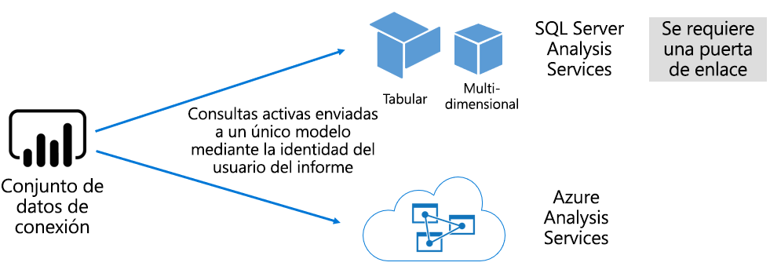

# Conjuntos de datos en el servicio Power BI

En este artículo se proporciona una explicación técnica de los conjuntos de datos de Power BI.

## Tipos de conjuntos de datos

Los conjuntos de datos de Power BI representan un origen de datos listo para informes y visualización. Hay cinco tipos de conjuntos de datos distintos, creados al:

- Conectarse a un modelo de datos existente que no está hospedado en una capacidad de Power BI.
- Cargar un archivo de Power BI Desktop que contiene un modelo.
- Cargar un libro de Excel (con una o varias tablas de Excel o un modelo de datos de libro) o cargar un archivo CSV (valores separados por coma).
- Usar el servicio Power BI para crear un [conjunto de datos de inserción](developer/walkthrough-push-data.md).
- Usar el servicio Power BI para crear un [conjunto de datos de streaming o de streaming híbrido](service-real-time-streaming.md).

Excepto en lo que respecta a los conjuntos de datos de streaming, el conjunto de datos representa un modelo de datos que aprovecha las tecnologías de modelado maduras de [Analysis Services](/analysis-services/analysis-services-overview).

> [!NOTE]
> En algunas ocasiones, en la documentación se usan indistintamente los términos _conjuntos de datos_ y _modelos_. Por lo general, desde una perspectiva del servicio Power BI, se conoce como **conjunto de datos** y, desde una perspectiva de desarrollo, como **modelo**. En el contexto de esta documentación, significan prácticamente lo mismo.

### Modelos hospedados externamente

Hay dos tipos de modelos hospedados externamente: SQL Server Analysis Services y [Azure Analysis Services](/azure/analysis-services/analysis-services-overview).

Conectarse a un modelo de SQL Server Analysis Services implica instalar la [puerta de enlace de datos local](service-gateway-onprem.md), ya sea en el entorno local o como infraestructura como servicio (IaaS) hospedada en una máquina virtual. Azure Analysis Services no requiere una puerta de enlace.

La conexión a Analysis Services a menudo tiene sentido cuando existen inversiones de modelos existentes, que normalmente forman parte de un almacenamiento de datos empresarial (EDW). Power BI puede establecer una _conexión dinámica_ con Analysis Services, aplicando permisos de datos con la identidad del usuario del informe de Power BI. En el caso de SQL Server Analysis Services, se admiten tanto los modelos multidimensionales (cubos) como los modelos tabulares. Tal como se muestra en la imagen siguiente, un conjunto de datos de conexión dinámica pasa consultas a los modelos hospedados externamente.

### Modelos desarrollados por Power BI Desktop

Power BI Desktop, una aplicación cliente diseñada para el desarrollo de Power BI, se puede usar para desarrollar un modelo. El modelo es efectivamente un modelo tabular de Analysis Services. Los modelos se pueden desarrollar mediante la importación de datos desde flujos de datos, que luego se pueden integrar con orígenes de datos externos. Aunque los detalles sobre cómo se puede lograr el modelado se encuentran fuera del ámbito de este artículo, es importante comprender que hay tres tipos diferentes, o _modos_, de los modelos que se pueden desarrollar con Power BI Desktop. Estos modos determinan si los datos se importan al modelo o si permanecen en el origen de datos. Los tres modos son: Importación, DirectQuery y Composición. Para más información sobre cada modo, consulte el artículo [Modos de conjuntos de datos en el servicio Power BI](service-dataset-modes-understand.md).

Los modelos hospedados externamente y los modelos de Power BI Desktop pueden aplicar seguridad de nivel de fila (RLS) para limitar los datos que se recuperan para un usuario determinado. Por ejemplo, los usuarios asignados al grupo de seguridad **Vendedores** solo pueden ver los datos del informe para las regiones de ventas a las que están asignados. Los roles de RLS son _dinámicos_ o _estáticos_. Los roles dinámicos los filtra el usuario del informe, mientras que los roles estáticos aplican los mismos filtros a todos los usuarios asignados al rol. Para más información, consulte [Seguridad de nivel de fila (RLS) con Power BI](service-admin-rls.md).

### Modelos de libros de Excel

La creación de conjuntos de datos basados en [libros de Excel](service-excel-workbook-files.md) o [archivos CSV](service-comma-separated-value-files.md) genera la creación automática de un modelo. Las tablas de Excel y los datos CSV se importan para crear tablas del modelo, mientras que un modelo de datos del libro de Excel se transpone para crear un modelo de Power BI. En todos los casos, los datos de archivo se importan a un modelo.

## Resumen

Entonces, es posible establecer distinciones sobre los conjuntos de datos de Power BI que representan modelos:

- Se hospedan en el servicio Power BI o se hospedan externamente en Analysis Services.
- Pueden almacenar datos importados o pueden emitir solicitudes de consulta de paso a través a los orígenes de datos subyacentes, o bien pueden usar una combinación de ambas opciones.

Este es un resumen de los hechos importantes sobre los conjuntos de datos de Power BI que representan modelos:

- Los modelos hospedados de SQL°Server Analysis Services requieren una puerta de enlace para hacer consultas de conexión dinámica.
- Modelos hospedados en Power BI que importan datos:
  - Se deben cargar por completo en la memoria para que se puedan consultar.
  - Requieren actualización para mantener actualizados los datos y deben incluir puertas de enlace cuando los datos de origen no son accesibles directamente a través de Internet.
- Los modelos hospedados en Power BI que usa el modo de almacenamiento de [DirectQuery](desktop-directquery-about.md) requieren conectividad con los datos de origen. Cuando se consulta el modelo, Power BI emite consultas a los datos de origen para recuperar los datos actuales. Este modo debe implicar puertas de enlace cuando no se puede acceder a los datos de origen directamente a través de Internet.
- Los modelos pueden aplicar reglas de RLS y aplicar filtros para limitar el acceso a los datos a determinados usuarios.

## Consideraciones

Para implementar y administrar correctamente Power BI, es importante comprender dónde se hospedan los modelos, el modo de almacenamiento, las dependencias de las puertas de enlace, el tamaño de los datos importados y el tipo y la frecuencia de actualización. Estas configuraciones pueden tener un impacto significativo en los recursos de la capacidad de Power BI. Además, el diseño mismo del modelo, incluidas sus consultas de preparación de datos, relaciones y cálculos, se agregan a la combinación de consideraciones.

También es importante comprender que los modelos de importación hospedados en Power BI se pueden actualizar según una programación o desencadenados a petición por un usuario en el servicio Power BI.

## Pasos siguientes

- [Modos de conjuntos de datos en el servicio Power BI](service-dataset-modes-understand.md)
- ¿Tiene más preguntas? [Pruebe a preguntar a la comunidad de Power BI](https://community.powerbi.com/)
