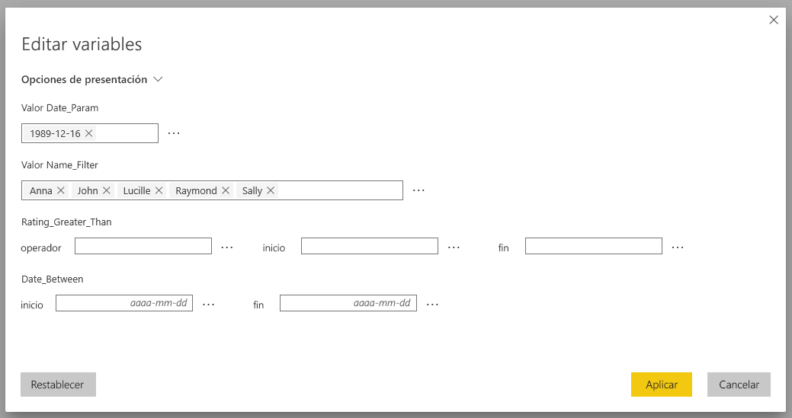
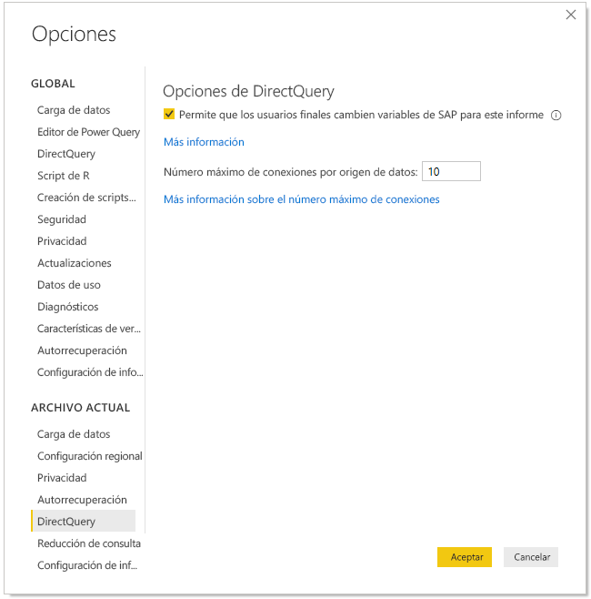
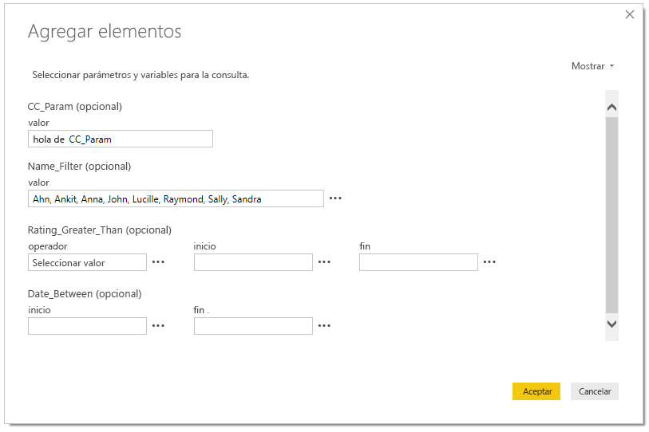
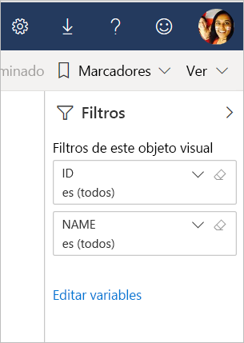

# Edición de variables de SAP en el servicio Power BI (versión preliminar)

Al usar SAP Business Warehouse o SAP HANA con DirectQuery, los autores de informes ya pueden permitir que los usuarios finales editen variables de SAP en el **servicio Power BI** para áreas de trabajo Premium.

En este documento se explican los requisitos para editar variables en Power BI, cómo habilitar esta característica en vista previa y dónde editar variables en el servicio Power BI.

## Requisitos para editar variables de SAP

Hay algunos requisitos para usar la característica Editar variables de SAP. En la tabla siguiente se describen estos requisitos.

**Nueva experiencia de filtro necesaria**: debe tener habilitada la [nueva experiencia de filtro](power-bi-report-filter.md) para el informe. Así es como puede habilitarla para el informe en Power BI Desktop:
- En Power BI Desktop, seleccione **Archivo** > **Opciones y configuración** > **Opciones**.
- En la barra de navegación izquierda, en **Archivo actual**, seleccione **Configuración del informe**.
- En **Experiencia de filtrado**, seleccione **Habilitar el panel de filtros actualizado**.

**Conexiones de DirectQuery necesarias**: debe conectarse al origen de datos de SAP mediante DirectQuery. No se admiten conexiones de importación.

**Suscripción de Power BI Premium requerida**: en este momento, la característica Editar variables de SAP solo funciona en suscripciones de Power BI Premium.

**Configuración de SSO necesaria**: para que esta característica funcione, debe configurarse el inicio de sesión único (SSO). Vea [Introducción al inicio de sesión único (SSO)](service-gateway-sso-overview.md) para obtener más información.

**Nuevos componentes de puerta de enlace requeridos**: descargue la puerta de enlace más reciente y actualice la existente. Vea [Puerta de enlace de servicio](service-gateway-onprem.md) para obtener más información.

**Multidimensional solo para SAP HANA**: en SAP HANA, la característica Editar variables de SAP solo funciona con modelos multidimensionales y no con orígenes relacionales.

**No se admite en nubes soberanas**: de momento, Power Query Online no está disponible en nubes soberanas; por lo tanto, esta característica tampoco se admite en nubes soberanas.

## Cómo habilitar la característica

Para habilitar la característica **Editar variables de SAP**, en Power BI Desktop conéctese a un origen de datos de SAP HANA o SAP BW. Luego vaya a **Archivo > Opciones y configuración > Opciones** y, en la sección Archivo actual del panel izquierdo, seleccione **DirectQuery**. Al seleccionarlo, en el panel derecho se ven las opciones de DirectQuery y una casilla donde puede **Permitir a los usuarios finales cambiar variables de SAP para este informe (versión preliminar)**, como se muestra en la siguiente imagen.

## Usar la edición de variables de SAP en Power BI Desktop

Al usar Editar variables de SAP en Power BI Desktop, puede editar las variables si selecciona el vínculo Editar variables del menú **Editar consultas** de la cinta. Desde ahí, aparece el siguiente cuadro de diálogo. Esta característica ya lleva un tiempo disponible en Power BI Desktop. Los creadores de informes pueden seleccionar variables del informe mediante el siguiente cuadro de diálogo.

## Usar la edición de variables de SAP en el servicio

Una vez publicado el informe en el servicio Power BI, los usuarios pueden ver el vínculo **Editar variables** en el nuevo panel de filtros. Si va a publicar el informe por primera vez, pueden pasar hasta 5 minutos antes de que el vínculo Editar variables aparezca. Si el vínculo no ha aparecido, tiene que actualizar manualmente el conjunto de datos.
Puede hacerlo de la siguiente manera:

1. En el servicio Power BI, seleccione la pestaña **Conjuntos de datos** de la lista de contenido de un área de trabajo.

2. Busque el conjunto de datos que necesita actualizar y seleccione el icono **Actualizar**.

    

3. Al seleccionar el vínculo Editar variables, se muestra el cuadro de diálogo **Editar variables**, donde los usuarios pueden invalidar variables. Al seleccionar el botón **Restablecer**, se restablecen las variables a los valores originales que aparecían al abrir este cuadro de diálogo.

    

4. Los cambios en el cuadro de diálogo **Editar variables** solo se conservan para este usuario (lo mismo que otros comportamientos de persistencia de Power BI). Al seleccionar **Restablecer valores predeterminados**, que se muestra en la siguiente imagen, se restablece el informe al estado original del creador del informe, incluidas las variables.

    

Al trabajar en un informe publicado en el servicio Power BI que usa SAP HANA o SAP BW con la característica **Editar variables** habilitada, el propietario del informe puede cambiar esos valores predeterminados. El propietario del informe puede cambiar las variables en el modo de edición y guardar el informe para habilitar esa configuración como *nueva configuración predeterminada* de ese informe. Cualquier otro usuario que acceda al informe después de los cambios realizados por el propietario del informe ve esos nuevos valores como los predeterminados.

## Problemas y consideraciones

En este momento, la característica Editar variables de SAP no se admite en las aplicaciones.

## Pasos siguientes

Para obtener más información sobre SAP HANA, SAP BW y DirectQuery, lea los siguientes artículos:

- [Usar SAP HANA en Power BI Desktop](desktop-sap-hana.md)
- [DirectQuery y SAP Business Warehouse (BW)](desktop-directquery-sap-bw.md)
- [DirectQuery y SAP HANA](desktop-directquery-sap-hana.md)
- [Uso de DirectQuery en Power BI](desktop-directquery-about.md)