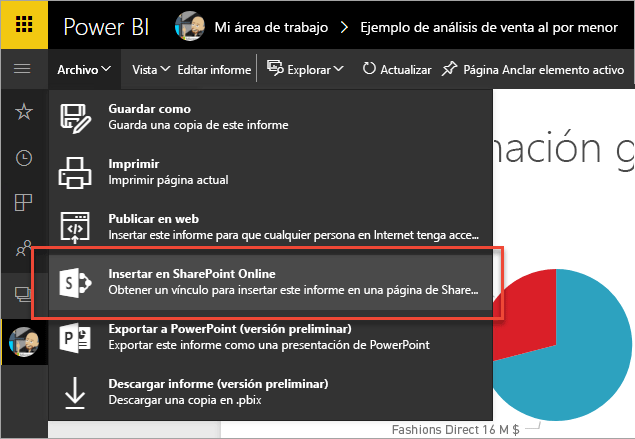
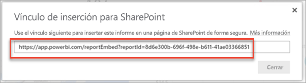
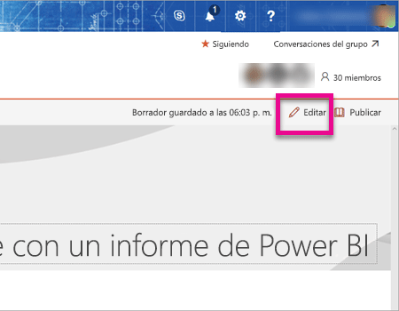
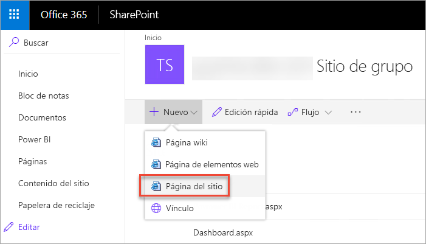
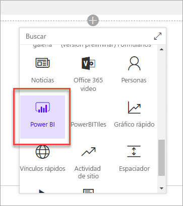
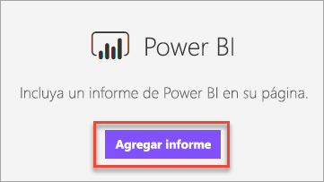
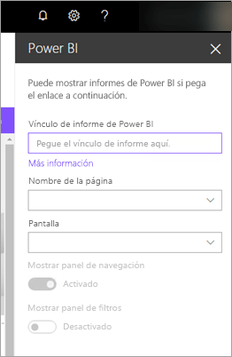
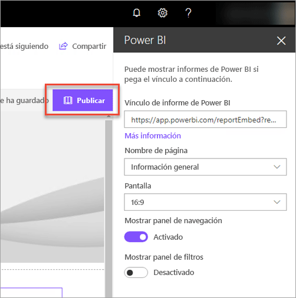
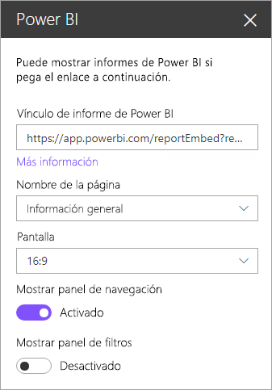
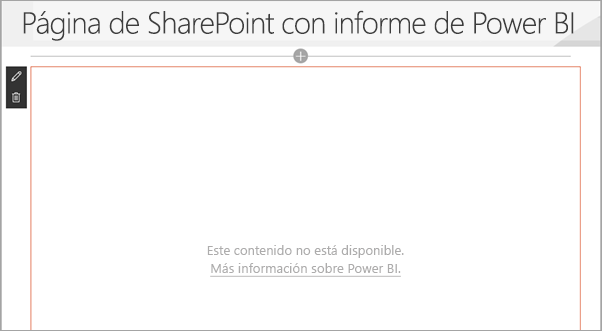

# Insertar el elemento web de informes en SharePoint Online

Con el nuevo elemento web de informes de Power BI para SharePoint Online, puede insertar fácilmente informes de Power BI interactivos en páginas de SharePoint Online.

Con la nueva opción **Insertar en SharePoint Online**, los informes insertados están completamente seguros para que pueda crear fácilmente portales internos seguros.

## Requisitos

Hay algunos requisitos para que la opción **Insertar en SharePoint Online** funcione.

* Necesita una licencia de Power BI Pro o una [capacidad Power BI Premium (EM o P SKU)](service-premium.md#premium-capacity-nodes) con una licencia de Power BI.
* El elemento web de Power BI para SharePoint Online requiere [páginas modernas](https://support.office.com/article/Allow-or-prevent-creation-of-modern-site-pages-by-end-users-c41d9cc8-c5c0-46b4-8b87-ea66abc6e63b).

## Insertar un informe

Para insertar el informe en SharePoint Online, primero debe obtener la dirección URL del informe y luego usarla con el nuevo elemento web de Power BI en SharePoint Online.

### Obtener la dirección URL del informe

1. Vea el informe en el servicio Power BI.

2. Seleccione el elemento de menú **Archivo**.

3. Seleccione **Insertar en SharePoint Online**.

    

4. Copie la dirección URL del cuadro de diálogo.

    

### Agregar el informe de Power BI a una página de SharePoint Online

1. Abra la página que desee en SharePoint Online y seleccione **Editar**.

    

    O bien, seleccione **+ Nuevo** en SharePoint Online para crear una nueva página de sitio moderna.

    

2. Seleccione **+** y seleccione el elemento web **Power BI**.

    

3. Seleccione **Agregar informe**.

    

4. Pegue la dirección URL del informe en el panel de propiedades. Esta dirección URL de informe es la dirección URL que copió en los pasos anteriores. El informe se carga automáticamente.

    

5. Seleccione **Publicar** para que los cambios sean visibles para los usuarios de SharePoint Online.

    

## Concesión de acceso a los informes

Insertar un informe en SharePoint Online no da a los usuarios permiso para ver el informe de forma automática. Los permisos para ver el informe se establecen en el servicio Power BI.

> [!IMPORTANT]
> Asegúrese de revisar quién puede ver el informe en el servicio Power BI y de conceder acceso a los usuarios que no están en la lista.

Hay dos formas de proporcionar acceso al informe dentro del servicio Power BI. Si usa un grupo de Office 365 para compilar el sitio de grupo de SharePoint Online, los usuarios aparecen como miembros del **área de trabajo de la aplicación en el servicio Power BI** y la **página de SharePoint**. Para obtener más información, vea [Administración de un área de trabajo de la aplicación](service-manage-app-workspace-in-power-bi-and-office-365.md).

Además, puede compartir un informe directamente con los usuarios insertando el informe en una aplicación. Hay que seguir algunos pasos para insertar un informe en una aplicación.  

1. El autor de la aplicación es un usuario Pro.

2. El autor crea un informe en un área de trabajo de la aplicación. *Para compartirla con **usuarios gratuitos de Power BI**, el área de trabajo de la aplicación debe establecerse como un **área de trabajo Premium**.*

3. El autor publica la aplicación y luego la instala. *El autor debe asegurarse de instalar la aplicación para tener acceso a la dirección URL del informe que se usa para insertarlo en SharePoint Online.*

4. Ahora todos los usuarios finales también necesitan instalar la aplicación. Sin embargo, puede configurar la aplicación para que se preinstale para los usuarios finales con la característica **Instala la aplicación automáticamente**, que se puede habilitar en el [portal de administración de Power BI](service-admin-portal.md).

   

5. El autor abre la aplicación y accede al informe.

6. El autor copia la dirección URL del informe insertado desde el informe instalado por la aplicación. *No use la dirección URL del informe original desde el área de trabajo de la aplicación.*

7. Cree un sitio del equipo en SharePoint Online.

8. Agregue la dirección URL del informe copiada en el paso 6 en el elemento web de Power BI.

9. Agregue todos los usuarios finales o grupos que van a consumir los datos en la página de SharePoint Online y en la aplicación de Power BI que creó.

    > [!NOTE]
    > **Los usuarios o grupos necesitan acceso a la página de SharePoint Online y al informe de la aplicación de Power BI para ver el informe en la página de SharePoint.**

10. Ahora el usuario final puede ir al sitio del equipo en SharePoint Online y ver los informes en la página.

## Autenticación multifactor

Si el entorno de Power BI exige que inicie sesión con la autenticación multifactor, es posible que se le pida que inicie sesión con un dispositivo de seguridad para verificar su identidad. Esto ocurre si no ha iniciado sesión en SharePoint Online mediante la autenticación multifactor, pero el entorno de Power BI requiere una cuenta validada por un dispositivo de seguridad.

> [!NOTE]
> La autenticación multifactor no es compatible todavía con Azure Active Directory 2.0. Los usuarios reciben un mensaje que indica *error*. Si el usuario inicia sesión de nuevo en SharePoint Online con su dispositivo de seguridad, podría ver el informe.

## Configurar el elemento web

A continuación, se muestra una descripción de las opciones que se pueden ajustar para el elemento web de Power BI para SharePoint Online.

| Propiedad | Descripción |
| --- | --- |
| Nombre de la página |Establece la página predeterminada que se muestra en el elemento web. Seleccione un valor en la lista desplegable. Si no se muestra ninguna página, el informe contiene una página o la dirección URL que pegó contiene un nombre de página. Quite la sección del informe de la dirección URL para seleccionar una página específica. |
| Mostrar |Opción para ajustar el informe en la página de SharePoint Online. |
| Mostrar el panel de navegación |Muestra u oculta el panel de navegación de páginas. |
| Mostrar el panel de filtro |Muestra u oculta el panel de filtro. |

## Informes que no se cargan

Puede que el informe no se cargue en el elemento web de Power BI y aparezca el mensaje siguiente.

*Este contenido no está disponible.*

Normalmente, hay dos razones para este mensaje.

1. No tiene acceso al informe.
2. El informe se eliminó.

Póngase en contacto con el propietario de la página de SharePoint Online para ayudarle a resolver el problema.

## Licencias

Los usuarios que ven un informe en SharePoint necesitan una **licencia de Power BI Pro** o el contenido debe estar en un área de trabajo que tenga una **[capacidad de Power BI Premium (SKU EM o P)](service-admin-premium-purchase.md)**.

## Limitaciones y problemas conocidos

* Error: "An error occurred, please try logging out and back in and then revisiting this page. (Se ha producido un error, intente cerrar la sesión y abrirla de nuevo, y vuelva a esta página). Id. de correlación: indefinido, estado de respuesta de http: 400, código de error: 10001,mensaje: Falta el token de actualización"
  
  Si recibe este error, intente uno de los pasos de solución de problemas que se indican a continuación.
  
  1. Cierre sesión en SharePoint e iníciela de nuevo. Asegúrese de cerrar todas las ventanas del explorador antes de iniciar sesión.

  2. Si la cuenta de usuario requiere autenticación multifactor (MFA), asegúrese de iniciar sesión en SharePoint con el dispositivo de autenticación multifactor (aplicación de teléfono, tarjeta inteligente, etc.)
  
  3. No se admiten las cuentas de invitado de Azure B2B. Los usuarios ven el logotipo de Power BI que muestra que el componente se está cargando, pero el informe no aparece.

* Power BI no admite los mismos idiomas localizados que SharePoint Online. En consecuencia, es posible que no vea una localización correcta en el informe insertado.

* Si utiliza Internet Explorer 10, pueden surgir problemas. Puede consultar el artículo [Exploradores compatibles con Power BI](consumer/end-user-browsers.md) y los [requisitos del sistema de Office 365](https://products.office.com/office-system-requirements#Browsers-section).

* El elemento web de Power BI no está disponible para [nubes nacionales](https://powerbi.microsoft.com/clouds/).

* El clásico SharePoint Server no es compatible con este elemento web.

* Los [filtros de URL](service-url-filters.md) no son compatibles con el elemento web de SPO.

## Pasos siguientes

* [Permitir o impedir la creación de páginas de sitio modernas por los usuarios finales](https://support.office.com/article/Allow-or-prevent-creation-of-modern-site-pages-by-end-users-c41d9cc8-c5c0-46b4-8b87-ea66abc6e63b)  
* [Creación y distribución de una aplicación en Power BI](service-create-distribute-apps.md)  
* [Compartir un panel con compañeros y otros usuarios](service-share-dashboards.md)  
* [¿Qué es Power BI Premium?](service-premium.md)
* [Inserción de informes en un sitio web o portal seguro](service-embed-secure.md)

¿Tiene más preguntas? [Pruebe a preguntar a la comunidad de Power BI](http://community.powerbi.com/)