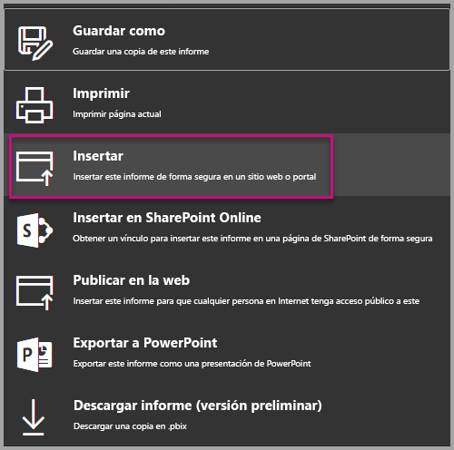
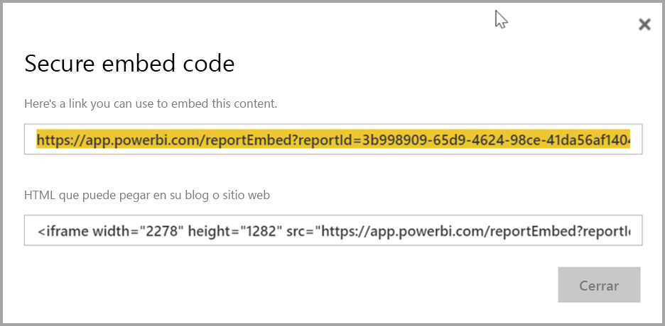
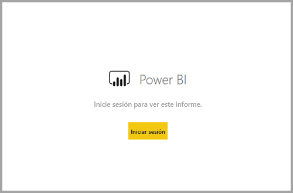
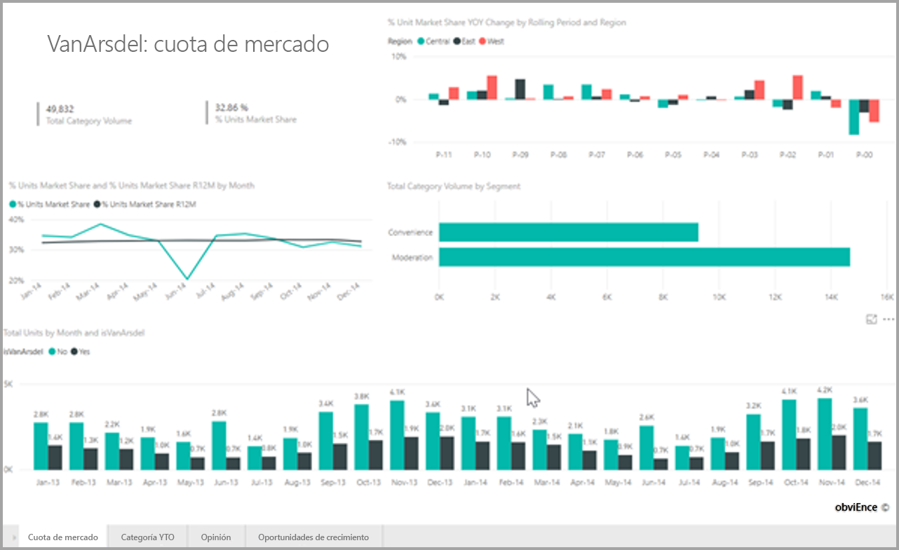

# <a name="embed-a-report-in-a-secure-portal-or-website"></a>Inserción de informes en un sitio web o portal seguro

Con la nueva opción **Insertar** para los informes de Power BI, puede insertar de forma fácil y segura informes en portales web internos. Estos portales pueden estar **basados en la nube** u **hospedados en un entorno local**, como una instancia de SharePoint 2019. Los informes insertados de esta manera respetan todos los permisos del elemento y la seguridad de los datos mediante la [seguridad de nivel de fila (RLS)](service-admin-rls.md). Permiten realizar inserciones sin código en cualquier portal que acepte una dirección URL o un iFrame. 

La opción **Insertar** también admite la configuración de direcciones URL y [filtros de direcciones URL](service-url-filters.md). Esto le permite realizar la integración con portales mediante un método en el que se usa código de forma limitada y para el que solo se necesitan conocimientos básicos de HTML y JavaScript.

## <a name="how-to-embed-power-bi-reports-into-portals"></a>Cómo **insertar** informes de Power BI en portales

1. La nueva opción **Insertar** se encuentra disponible en el menú **Archivo** de informes del servicio Power BI.

    

2. Seleccione la opción **Insertar** para abrir un cuadro de diálogo que proporciona un vínculo y un iFrame que puede usar para insertar el informe de forma segura.

    

3. Si un usuario abre directamente la URL de un informe, o bien una URL insertada en un portal web, tendrá que autenticarse para acceder al informe. Se mostrará la pantalla siguiente si un usuario no ha iniciado sesión en Power BI en la sesión del explorador. Al seleccionar **Iniciar sesión**, puede que se abra una nueva pestaña o ventana del explorador. Si los usuarios no ven un mensaje de inicio de sesión, pídales que comprueben si hay bloqueadores de elementos emergentes activos.

    

4. Cuando el usuario inicie la sesión, se abrirá el informe con los datos y se permitirá la navegación de páginas y la configuración de filtros. Solo los usuarios que tengan permiso de vista podrán ver el informe en Power BI. También se aplican todas las reglas de [seguridad de nivel de fila (RLS)](service-admin-rls.md). Por último, el usuario debe tener la licencia correcta: necesita una licencia de Power BI Pro o el informe debe estar en un área de trabajo que tenga una capacidad de Power BI Premium. El usuario tendrá que iniciar sesión cada vez que abra una nueva ventana del explorador. Pero, después de iniciar la sesión, otros informes se cargarán automáticamente.

    

5. Al usar un iFrame, puede que tenga que editar el **alto** y el **ancho** para que se adapte al tamaño de la página web del portal.

    

## <a name="granting-report-access"></a>Concesión de acceso a informes

La opción **Insertar** no permite a los usuarios ver el informe automáticamente. Los permisos de vista se establecen en el servicio Power BI.

En el servicio Power BI, puede compartir informes insertados y solicitar que los usuarios inicien la sesión. Si usa un grupo de Office 365, puede mostrar una lista al usuario como un miembro del área de trabajo. Para más información, consulte cómo [administrar el área de trabajo en Power BI y en Office 365](service-manage-app-workspace-in-power-bi-and-office-365.md).

## <a name="licensing"></a>Licencias

Para ver el informe insertado, los usuarios necesitan tener una licencia de Power BI Pro, o bien el contenido tiene que estar en un área de trabajo con [capacidad de Power BI Premium (SKU EM o P).](service-admin-premium-purchase.md)

## <a name="customize-your-embed-experience-using-url-settings"></a>Personalización de la experiencia de inserción con la configuración de direcciones URL

Puede personalizar la experiencia del usuario mediante la configuración de entrada de la URL de inserción. En el iFrame especificado, puede actualizar la configuración de **src** de la URL.

| Propiedad  | Descripción  |  |  |  |
|--------------|-----------------------------------------------------------------------------------------------------------------------------------------------------------------------------------------------------------------------|---|---|---|
| pageName  | Puede usar el parámetro de cadena de consulta **pageName** para establecer la página en la que se abrirá el informe. Este valor aparece al final de la dirección URL de un informe al visualizarlo en el servicio Power BI, como se muestra a continuación. |  |  |  |
| Filtros de direcciones URL  | Puede usar [filtros de direcciones URL](service-url-filters.md) en la dirección URL de inserción que ha recibido de la interfaz de usuario de Power BI para filtrar el contenido de la inserción. De este modo, puede compilar integraciones de código reducido con una experiencia básica de HTML y JavaScript.  |  |  |  |

## <a name="set-which-page-opens-for-an-embedded-report"></a>Configuración de la página en que se abrirá un informe insertado 

El valor de **pageName** aparece al final de la dirección URL de un informe al visualizarlo en el servicio Power BI.

1. Abra el informe del servicio Power BI en el explorador web y copie la dirección URL de la barra de direcciones.

    

2. Anexe el valor de **pageName** a la dirección URL.

    

## <a name="filter-report-content-using-url-filters"></a>Filtrado del contenido de informes con filtros de direcciones URL 

Puede usar [filtros de direcciones URL](service-url-filters.md) para proporcionar distintas vistas de informes. Por ejemplo, la dirección URL siguiente filtra el informe para mostrar los datos del sector energético.

El uso de **pageName** con [filtros de direcciones URL](service-url-filters.md) puede ser eficaz. Puede crear experiencias con HTML y JavaScript básicos.

Por ejemplo, puede agregar el siguiente botón a una página HTML:

```html
<button class="textLarge" onclick='show("ReportSection", "Energy");' style="display: inline-block;">Show Energy</button>
```

Al seleccionar el botón, se llama a una función para actualizar el iFrame con una dirección URL actualizada, que incluye el filtro “Sector energético”.

```javascript
function show(pageName, filterValue)

{

var newUrl = baseUrl + "&pageName=" + pageName;

if(null != filterValue && "" != filterValue)

{

newUrl += "&$filter=Industries/Industry eq '" + filterValue + "'";

}

//Assumes there’s an iFrame on the page with id=”iFrame”

var report = document.getElementById("iFrame")

report.src = newUrl;

}
```


Puede agregar tantos botones como quiera para crear una experiencia personalizada de código reducido. 

## <a name="considerations-and-limitations"></a>Consideraciones y limitaciones

* No admite usuarios invitados externos con Azure B2B (negocio a negocio).

* La inserción segura funciona en informes publicados en el servicio Power BI.

* El usuario tendrá que iniciar sesión para ver el informe cada vez que abra una nueva ventana del explorador.

* Algunos exploradores requieren que se actualice la página después de iniciar sesión, especialmente cuando se usan los modos InPrivate o Incognito.

* Para lograr una experiencia de inicio de sesión único, use la opción “Insertar en SharePoint Online”, o bien cree una integración personalizada con el método de inserción [el usuario es el propietario de los datos](developer/embed-sample-for-your-organization.md). 

* La funcionalidad de autenticación automática que se incluye con la opción **Insertar** no funciona con la API de JavaScript para Power BI. Con la API de JavaScript para Power BI, use el método de inserción [el usuario es el propietario de los datos](developer/embed-sample-for-your-organization.md). 

* La vigencia del token de autenticación depende de la configuración de AAD. Cuando expire el token de autenticación, el usuario tendrá que actualizar el explorador para obtener un token de autenticación actualizado. La vigencia predeterminada es de una hora, pero puede que en su organización sea más larga o corta.

## <a name="next-steps"></a>Pasos siguientes

* [Formas de compartir el trabajo en Power BI](service-how-to-collaborate-distribute-dashboards-reports.md)

* [Filtro de un informe con parámetros de cadena de consulta en la URL](service-url-filters.md)

* [Insertar el elemento web de informes en SharePoint Online](service-embed-report-spo.md)

* [Publicar en la web de Power BI](service-publish-to-web.md)
