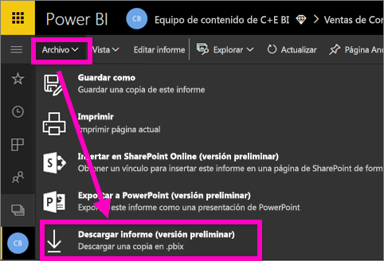
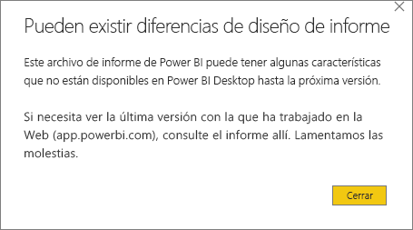

# Descarga de un informe desde el servicio Power BI a Power BI Desktop (versión preliminar)
En Power BI Desktop, puede publicar un informe (un archivo *.pbix*) desde el equipo local en el servicio Power BI. Los informes de Power BI también pueden ir en la dirección contraria: puede descargar un informe desde el servicio Power BI a Power BI Desktop. En cualquier caso, la extensión de un informe de Power BI es .pbix.

Más adelante en este artículo se describen algunas limitaciones y consideraciones que deben tenerse en cuenta.

## Descarga del informe como un archivo .pbix

Solo puede descargar informes [creados con Power BI Desktop](/learn/modules/publish-share-power-bi/2-publish-reports) después del 23 de noviembre de 2016 y actualizados desde entonces. Si se ha creado antes, la opción de menú **Descargar informe** del servicio Power BI está atenuada.

Para descargar el archivo .pbix, haga lo siguiente:

1. En el servicio Power BI, abra el informe que quiere descargar en [Vista de edición](https://docs.microsoft.com/power-bi/service-interact-with-a-report-in-editing-view).

2. En la barra de navegación superior, seleccione **Archivo > Descargar informe**.
   
3. Mientras se descarga el informe, el progreso se muestra en un banner de estado. Cuando el archivo esté listo, se le preguntará dónde guardar el archivo .pbix. El nombre predeterminado del archivo coincide con el título del informe.
   
4. Si todavía no lo ha hecho, [instale Power BI Desktop](desktop-get-the-desktop.md) y, después, abra el archivo. pbix en Power BI Desktop.
   
    Cuando abra el informe en Power BI Desktop, es posible que vea un mensaje de advertencia en el que se indica que algunas características disponibles en el informe del servicio Power BI no están disponibles en Power BI Desktop.
   
    

5. El editor de informes de Power BI Desktop es similar al del servicio Power BI.  
   
    

## Consideraciones y solución de problemas
Hay algunas consideraciones y limitaciones importantes asociadas con la descarga de un archivo .pbix desde el servicio Power BI.

* Para descargar el archivo, es necesario tener acceso de edición al informe.
* El informe se debe haber creado con Power BI Desktop y *publicado* en el servicio Power BI, o bien el archivo .pbix se debe haber *cargado* en el servicio Power BI.
* Los informes deben haberse publicado o actualizado a fecha de 23 de noviembre de 2016 o posteriormente. Los informes publicados anteriormente no se pueden descargar.
* Esta característica no funcionará con los informes y paquetes de contenido creados originalmente en el servicio Power BI.
* Use siempre la versión más reciente de Power BI Desktop para abrir los archivos descargados. Es posible que los archivos .pbix descargados no se abran en versiones no actuales de Power BI Desktop.
* Si el administrador ha desactivado la capacidad de descargar datos, esta característica no será visible en el servicio Power BI.
* Los conjuntos de datos con actualización incremental no se pueden descargar en un archivo .pbix.

## Pasos siguientes
Vea el vídeo de un minuto que **Guy in a Cube** dedicó a esta característica:

<iframe width="560" height="315" src="https://www.youtube.com/embed/ymWqU5jiUl0" frameborder="0" allowfullscreen></iframe>

Estos son algunos artículos adicionales que pueden ayudarle a aprender a usar el servicio Power BI:

* [Informes en Power BI](consumer/end-user-reports.md)
* [Conceptos básicos para los diseñadores en el servicio Power BI](service-basic-concepts.md)

Una vez que haya instalado Power BI Desktop, vea el artículo siguiente con el fin de obtener ayuda para ponerse en marcha rápidamente:

* [Introducción a Power BI Desktop](desktop-getting-started.md)

¿Tiene más preguntas? [Pruebe la comunidad de Power BI](http://community.powerbi.com/).

