# Del libro de Excel a un informe sorprendente en el servicio Power BI
Su jefa quiere ver al final del día un informe sobre las cifras de ventas más recientes, combinado con sus impresiones de la última campaña. Pero los datos más recientes se encuentran en varios sistemas de terceros y en archivos del portátil. En el pasado, tardaba horas en crear objetos visuales y dar formato a un informe, y empieza a ponerse nervioso.

No se preocupe. Con Power BI, puede crear un informe espectacular en cuestión de segundos.

En este ejemplo, se cargará un archivo de Excel desde un sistema local, se creará un informe y se compartirá con los compañeros de trabajo, todo desde Power BI.

## Preparar los datos
Tomemos como ejemplo un simple archivo de Excel. 

1. Antes de poder cargar el archivo de Excel en Power BI, debe organizar los datos en una tabla plana. En una tabla plana, cada columna contiene el mismo tipo de datos; por ejemplo, texto, fecha, número o moneda. La tabla debe tener una fila de encabezado, pero no columnas o filas que muestren totales.

   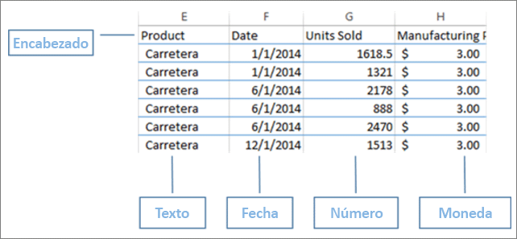

2. A continuación, organice sus datos para que tengan formato de tabla. En Excel, en la pestaña **Inicio**, en el grupo **Estilos**, seleccione **Dar formato como tabla**. 

3. Seleccione un estilo de tabla para aplicarlo a la hoja de cálculo. 

   La hoja de cálculo de Excel ya está lista para cargarse en Power BI.

   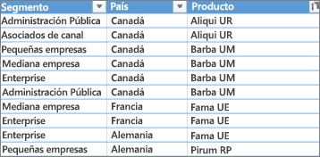

## Carga del archivo de Excel al servicio Power BI
El servicio Power BI se conecta a muchos orígenes de datos, incluidos los archivos de Excel que se encuentran en el equipo. 

 > [!NOTE] 
 > Para seguir con el resto de este tutorial, use el [libro de ejemplos financieros](sample-financial-download.md).

1. Para comenzar, inicie sesión en el servicio Power BI. Si no ha iniciado sesión, [puede hacerlo de forma gratuita](https://powerbi.com).

2. Ahora quiere crear un nuevo panel. Abra **Mi área de trabajo** y seleccione el icono **Crear**.

   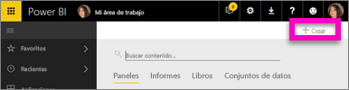

3. Seleccione **Panel**, escriba un nombre y, después, seleccione **Crear**. 

   Se muestra el panel nuevo, sin datos.

   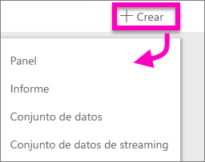

4. En la parte inferior del panel de navegación de la izquierda, seleccione **Obtener datos**. 

5. En la página **Obtener datos**, en el cuadro **Archivos** bajo **Crear contenido**, seleccione **Obtener**.

   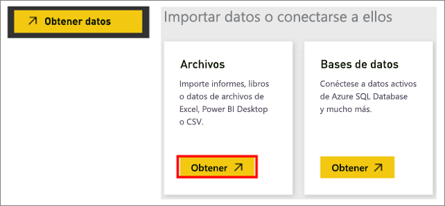

6. En la página **Archivos**, seleccione **Archivo local**. Desplácese hasta el archivo del libro de Excel en el equipo y seleccione **Abrir** para cargarlo en el servicio Power BI. 

   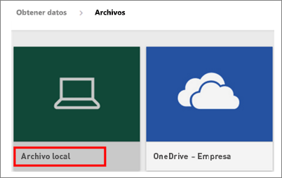

7. En la página **Archivo local**, seleccione **Importar**.

## Crear el informe
Después de que el servicio Power BI importe el archivo de Excel, comience a crear el informe. 

1. Cuando aparece el mensaje **Su conjunto de datos está listo**, seleccione **Ver conjunto de datos**.  

   Power BI se abre en la vista de edición y muestra el lienzo del informe. En el lado derecho se muestran los paneles **Visualizaciones**, **Filtros** y **Campos**. Observe que los datos de tabla del libro de Excel aparecen en el panel **Campos**. Debajo del nombre de la tabla, Power BI enumera los encabezados de columna como campos individuales.

   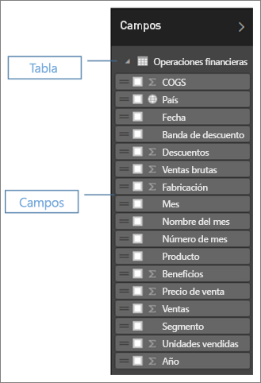

2. Ahora puede empezar a crear visualizaciones. Imagine que su jefe quiere ver los beneficios obtenidos a lo largo del tiempo. En el panel **Campos**, arrastre **Beneficios** al lienzo del informe. 

   De manera predeterminada Power BI muestra un gráfico de barras. 

3. Arrastre **Fecha** al lienzo del informe. 

   Power BI actualiza el gráfico de barras para mostrar los beneficios obtenidos por fecha.

   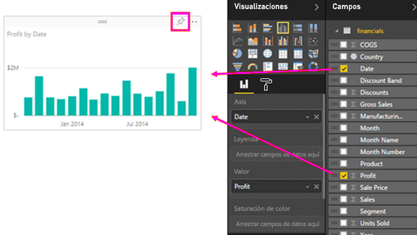

   > [!TIP]
   > Si el aspecto del gráfico no es el que esperaba, compruebe las agregaciones. Por ejemplo, en el área **Valor**, haga clic con el botón derecho en el campo que acaba de agregar y asegúrese de que los datos se agregan como le gustaría. En este ejemplo, usamos **Suma**.
   > 

Su jefa desea saber qué países son los más rentables. Impresiónela con una visualización de mapa. 

1. Seleccione un área en blanco en el lienzo del informe. 

2. Desde el panel **Campos**, arrastre los campos **País** y **Beneficios** al lienzo del informe.

   Power BI crea un objeto visual de mapa con burbujas que representan el beneficio relativo de cada ubicación.

   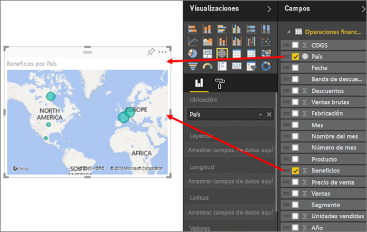

¿Quiere crear un objeto visual que muestre las ventas por segmento de producto y mercado? Fácil. 

1. En el panel **Campos**, seleccione los campos **Ventas**, **Producto** y **Segmento**. 
   
   Power BI crea un gráfico de barras al instante. 

2. Para cambiar el tipo de gráfico, elija uno de los iconos en el menú **Visualizaciones**. Por ejemplo, cámbielo por un **Gráfico de barras apiladas**. 

3. Para ordenar el gráfico, seleccione los puntos suspensivos (...) > **Ordenar por**.

   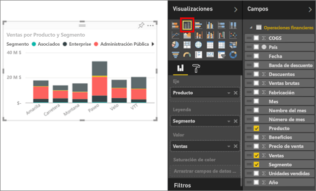

Ancle todos los objetos visuales al panel. Ahora ya puede compartirlo con sus compañeros.

   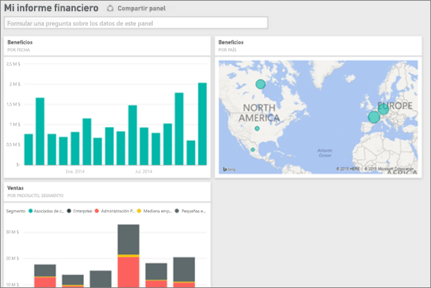

## Compartir el panel
Imagine que quiere compartir el panel con su jefe. Puede compartir su panel y el informe subyacente con compañeros que tengan una cuenta de Power BI. Ellos pueden interactuar con el informe, pero no guardar los cambios.

1. Para compartir el informe, en la parte superior del panel, seleccione **Compartir**.

   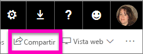

   Power BI muestra la página **Compartir panel**. 

2. Escriba las direcciones de correo electrónico de los destinatarios en el cuadro **Escriba las direcciones de correo electrónico** y agregue un mensaje en el cuadro situado debajo. 

3. Para que los destinatarios puedan compartir el panel con otras personas, seleccione **Permitir que los destinatarios compartan su panel**. Seleccione **Compartir**.

   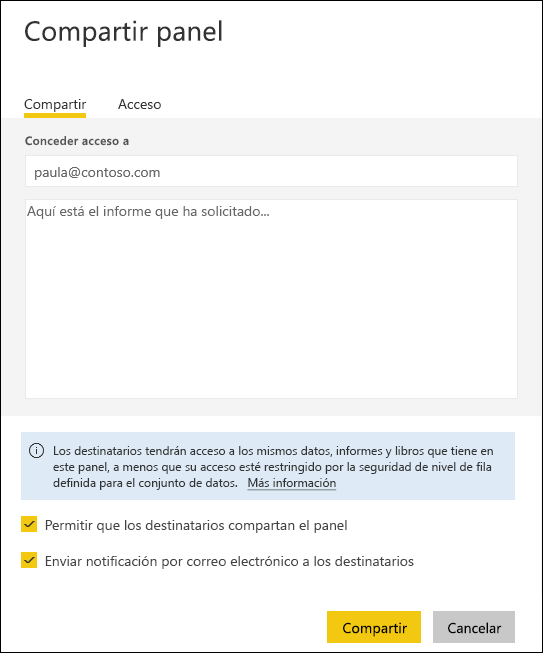

## Pasos siguientes

* [Introducción al servicio Power BI](service-get-started.md)
* [Introducción a Power BI Desktop](desktop-getting-started.md)
* [Conceptos básicos para los diseñadores en el servicio Power BI](service-basic-concepts.md)

¿Tiene más preguntas? [Pruebe la comunidad de Power BI](http://community.powerbi.com/).

